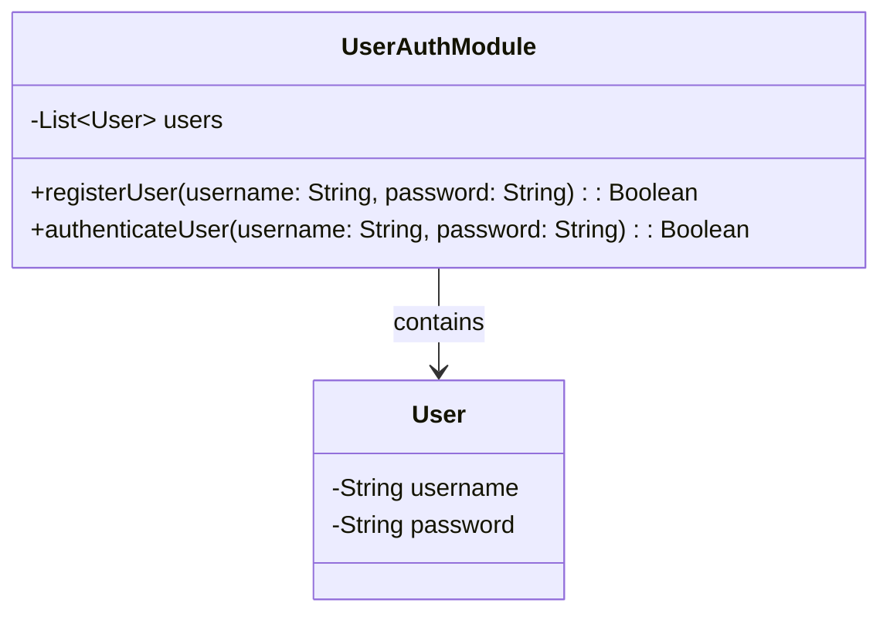

## 5.10 Module Pattern

The Module Pattern is a structural design pattern that focuses on organizing code into self-contained units, known as modules. This pattern is particularly useful in Kotlin, where encapsulation and modularity are key to building maintainable and scalable applications. In this section, we will explore the Module Pattern in depth, covering its intent, key participants, applicability, and design considerations. We will also provide practical examples and visualizations to enhance your understanding.

### Intent

The primary intent of the Module Pattern is to encapsulate related functionality within a single unit, thereby promoting code organization, reusability, and maintainability. By grouping related functions, classes, and data together, the Module Pattern helps in managing complexity and reducing dependencies between different parts of the codebase.

### Key Participants

1. **Module**: The core component that encapsulates related functionality. It can contain classes, functions, and data that are logically related.
2. **Public Interface**: The set of functions and classes exposed by the module for external use. This interface defines how other parts of the application can interact with the module.
3. **Private Implementation**: The internal details of the module that are hidden from external access. This includes helper functions, classes, and data that are not intended to be accessed directly by other parts of the application.

### Applicability

The Module Pattern is applicable in scenarios where:

- You need to organize code into logical units for better maintainability.
- You want to encapsulate related functionality and hide implementation details.
- You aim to reduce dependencies and promote reusability of code.
- You are working on a large codebase where modularity is essential for managing complexity.

### Sample Code Snippet

Let's start with a simple example of the Module Pattern in Kotlin. We will create a module that handles user authentication.

```kotlin
// UserAuthModule.kt

package com.example.auth

// Public interface
object UserAuthModule {
    private val users = mutableListOf<User>()

    fun registerUser(username: String, password: String): Boolean {
        if (users.any { it.username == username }) {
            return false // User already exists
        }
        users.add(User(username, password))
        return true
    }

    fun authenticateUser(username: String, password: String): Boolean {
        return users.any { it.username == username && it.password == password }
    }

    // Private implementation
    private data class User(val username: String, val password: String)
}
```

In this example, the `UserAuthModule` object encapsulates all the functionality related to user authentication. The `registerUser` and `authenticateUser` functions form the public interface, while the `User` data class is part of the private implementation.

### Organizing Code into Modules and Packages

In Kotlin, modules are typically organized using packages. A package is a namespace that groups related classes and functions together. By organizing code into packages, you can create a clear structure that reflects the logical organization of your application.

#### Example: Organizing a Library System

Consider a library system where you need to manage books, authors, and patrons. You can organize the code into packages as follows:

```
com.example.library
├── books
│   ├── Book.kt
│   ├── BookRepository.kt
│   └── BookService.kt
├── authors
│   ├── Author.kt
│   ├── AuthorRepository.kt
│   └── AuthorService.kt
└── patrons
    ├── Patron.kt
    ├── PatronRepository.kt
    └── PatronService.kt
```

In this structure, each package encapsulates functionality related to a specific domain entity (books, authors, patrons). This organization makes it easier to manage and navigate the codebase.

### Visibility Modifiers and Encapsulation

Kotlin provides several visibility modifiers to control access to classes, functions, and properties. These modifiers play a crucial role in implementing the Module Pattern by defining what is exposed to the outside world and what remains hidden.

#### Visibility Modifiers

1. **public**: The default visibility. Public members are accessible from anywhere in the project.
2. **internal**: Members are accessible within the same module. This is useful for encapsulating functionality within a module while still allowing access from other parts of the module.
3. **protected**: Members are accessible within the class and its subclasses.
4. **private**: Members are accessible only within the class or file where they are declared.

#### Example: Using Visibility Modifiers

Let's revisit the `UserAuthModule` example and see how visibility modifiers can be applied:

```kotlin
// UserAuthModule.kt

package com.example.auth

object UserAuthModule {
    private val users = mutableListOf<User>()

    fun registerUser(username: String, password: String): Boolean {
        if (users.any { it.username == username }) {
            return false // User already exists
        }
        users.add(User(username, password))
        return true
    }

    fun authenticateUser(username: String, password: String): Boolean {
        return users.any { it.username == username && it.password == password }
    }

    // Private implementation
    private data class User(val username: String, val password: String)
}
```

In this example, the `users` list and the `User` data class are marked as `private`, ensuring that they are not accessible from outside the `UserAuthModule` object. This encapsulation protects the internal state and implementation details from external modification.

### Design Considerations

When implementing the Module Pattern, consider the following:

- **Cohesion**: Ensure that the functionality within a module is closely related. High cohesion within modules improves maintainability and readability.
- **Coupling**: Minimize dependencies between modules to reduce coupling. This makes it easier to modify or replace modules without affecting other parts of the application.
- **Encapsulation**: Use visibility modifiers to hide implementation details and expose only what is necessary. This protects the internal state and reduces the risk of unintended interactions.
- **Reusability**: Design modules with reusability in mind. A well-designed module can be reused in different parts of the application or even in different projects.

### Differences and Similarities

The Module Pattern is often compared to other structural patterns, such as the Facade Pattern and the Adapter Pattern. While all these patterns aim to improve code organization and encapsulation, they differ in their specific goals and implementations.

- **Module vs. Facade**: The Facade Pattern provides a simplified interface to a complex subsystem, whereas the Module Pattern focuses on encapsulating related functionality within a single unit.
- **Module vs. Adapter**: The Adapter Pattern is used to bridge incompatible interfaces, while the Module Pattern organizes related code into cohesive units.

### Visualizing the Module Pattern

To better understand the Module Pattern, let's visualize its structure using a class diagram.



**Diagram Description**: This class diagram illustrates the `UserAuthModule` object and its relationship with the `User` data class. The `UserAuthModule` contains a list of `User` objects and provides public methods for registering and authenticating users. The `User` class is part of the private implementation and is not accessible from outside the module.

### Try It Yourself

To deepen your understanding of the Module Pattern, try modifying the `UserAuthModule` example:

1. **Add a new method** to update a user's password. Ensure that the method is part of the public interface.
2. **Implement a logging mechanism** within the module to track user registration and authentication attempts. Use a private helper function for logging.
3. **Experiment with visibility modifiers** by changing the visibility of the `users` list and observing the impact on the module's encapsulation.

### Knowledge Check

- How does the Module Pattern help in organizing code?
- What are the key participants in the Module Pattern?
- How can visibility modifiers be used to implement encapsulation in Kotlin?
- What are the differences between the Module Pattern and the Facade Pattern?

### Embrace the Journey

Remember, the Module Pattern is just one of many tools in your software design toolkit. As you continue to explore and apply design patterns in Kotlin, you'll gain a deeper understanding of how to build robust, maintainable, and scalable applications. Keep experimenting, stay curious, and enjoy the journey!

## Quiz Time!



### What is the primary intent of the Module Pattern?

- [x] To encapsulate related functionality within a single unit
- [ ] To provide a simplified interface to a complex subsystem
- [ ] To bridge incompatible interfaces
- [ ] To manage dependencies between objects

> **Explanation:** The primary intent of the Module Pattern is to encapsulate related functionality within a single unit, promoting code organization and maintainability.

### Which visibility modifier allows access only within the same module?

- [ ] public
- [x] internal
- [ ] protected
- [ ] private

> **Explanation:** The `internal` visibility modifier allows access to members within the same module, making it useful for encapsulating functionality within a module.

### In the Module Pattern, what is the role of the public interface?

- [x] To define how other parts of the application can interact with the module
- [ ] To hide implementation details from external access
- [ ] To manage dependencies between modules
- [ ] To provide a simplified interface to a complex subsystem

> **Explanation:** The public interface defines how other parts of the application can interact with the module, exposing the necessary functions and classes.

### How does the Module Pattern differ from the Adapter Pattern?

- [x] The Module Pattern organizes related code into cohesive units, while the Adapter Pattern bridges incompatible interfaces.
- [ ] The Module Pattern provides a simplified interface to a complex subsystem, while the Adapter Pattern encapsulates related functionality.
- [ ] The Module Pattern manages dependencies between objects, while the Adapter Pattern provides a simplified interface.
- [ ] The Module Pattern encapsulates related functionality, while the Adapter Pattern organizes code into cohesive units.

> **Explanation:** The Module Pattern organizes related code into cohesive units, whereas the Adapter Pattern is used to bridge incompatible interfaces.

### What is a key benefit of using the Module Pattern?

- [x] Improved code organization and maintainability
- [ ] Simplified interface to a complex subsystem
- [ ] Bridging incompatible interfaces
- [ ] Managing dependencies between objects

> **Explanation:** A key benefit of the Module Pattern is improved code organization and maintainability by encapsulating related functionality.

### Which of the following is NOT a key participant in the Module Pattern?

- [ ] Module
- [x] Adapter
- [ ] Public Interface
- [ ] Private Implementation

> **Explanation:** The Adapter is not a key participant in the Module Pattern. The key participants are the Module, Public Interface, and Private Implementation.

### What is the purpose of using visibility modifiers in the Module Pattern?

- [x] To control access to classes, functions, and properties
- [ ] To provide a simplified interface to a complex subsystem
- [ ] To bridge incompatible interfaces
- [ ] To manage dependencies between objects

> **Explanation:** Visibility modifiers are used to control access to classes, functions, and properties, helping to implement encapsulation in the Module Pattern.

### How can you ensure high cohesion within a module?

- [x] By ensuring that the functionality within a module is closely related
- [ ] By minimizing dependencies between modules
- [ ] By using visibility modifiers to hide implementation details
- [ ] By designing modules with reusability in mind

> **Explanation:** High cohesion within a module is ensured by making sure that the functionality within the module is closely related.

### What is the default visibility modifier in Kotlin?

- [x] public
- [ ] internal
- [ ] protected
- [ ] private

> **Explanation:** The default visibility modifier in Kotlin is `public`, which allows access from anywhere in the project.

### True or False: The Module Pattern is often compared to the Facade Pattern.

- [x] True
- [ ] False

> **Explanation:** True. The Module Pattern is often compared to the Facade Pattern, although they have different goals and implementations.




