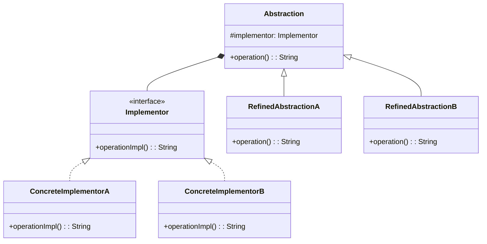

## 5.2 Bridge Pattern

The Bridge Pattern is a structural design pattern that plays a crucial role in software design by decoupling abstraction from its implementation. This separation allows both the abstraction and the implementation to evolve independently, providing flexibility and scalability. In this section, we will delve into the Bridge Pattern, understand its intent, explore its key participants, and learn how to implement it in Kotlin using interfaces and abstract classes.

### Intent

The primary intent of the Bridge Pattern is to separate an abstraction from its implementation so that the two can vary independently. This pattern is particularly useful when both the abstraction and the implementation are expected to change frequently, as it allows for more flexibility in extending the system.

### Key Participants

1. **Abstraction**: Defines the abstraction's interface and maintains a reference to an object of type Implementor.
2. **Refined Abstraction**: Extends the interface defined by Abstraction.
3. **Implementor**: Defines the interface for implementation classes. This interface doesn't have to correspond exactly to Abstraction's interface; in fact, the two interfaces can be quite different.
4. **Concrete Implementor**: Implements the Implementor interface and defines its concrete implementation.

### Applicability

Use the Bridge Pattern when:

- You want to avoid a permanent binding between an abstraction and its implementation.
- Both the abstraction and its implementation should be extensible by subclassing.
- Changes in the implementation of an abstraction should have no impact on clients.
- You want to hide the implementation of an abstraction completely from clients.

### Implementing the Bridge Pattern in Kotlin

Kotlin, with its powerful features like interfaces and abstract classes, provides an excellent platform to implement the Bridge Pattern. Let's explore how to implement this pattern step by step.

#### Step 1: Define the Implementor Interface

The Implementor interface defines the interface for implementation classes. It is the bridge between the abstraction and the concrete implementation.

```kotlin
interface Implementor {
    fun operationImpl(): String
}
```

#### Step 2: Create Concrete Implementors

Concrete Implementors implement the Implementor interface and provide concrete implementations of the operations.

```kotlin
class ConcreteImplementorA : Implementor {
    override fun operationImpl(): String {
        return "ConcreteImplementorA: Operation Implementation"
    }
}

class ConcreteImplementorB : Implementor {
    override fun operationImpl(): String {
        return "ConcreteImplementorB: Operation Implementation"
    }
}
```

#### Step 3: Define the Abstraction

The Abstraction defines the abstraction's interface and maintains a reference to an object of type Implementor.

```kotlin
abstract class Abstraction(protected val implementor: Implementor) {
    abstract fun operation(): String
}
```

#### Step 4: Create Refined Abstractions

Refined Abstractions extend the interface defined by Abstraction and implement the operation method.

```kotlin
class RefinedAbstractionA(implementor: Implementor) : Abstraction(implementor) {
    override fun operation(): String {
        return "RefinedAbstractionA: ${implementor.operationImpl()}"
    }
}

class RefinedAbstractionB(implementor: Implementor) : Abstraction(implementor) {
    override fun operation(): String {
        return "RefinedAbstractionB: ${implementor.operationImpl()}"
    }
}
```

#### Step 5: Client Code

The client code interacts with the Abstraction and doesn't need to know about the Concrete Implementors.

```kotlin
fun main() {
    val implementorA = ConcreteImplementorA()
    val implementorB = ConcreteImplementorB()

    val abstractionA = RefinedAbstractionA(implementorA)
    val abstractionB = RefinedAbstractionB(implementorB)

    println(abstractionA.operation())
    println(abstractionB.operation())
}
```

### Visualizing the Bridge Pattern

To better understand the Bridge Pattern, let's visualize it using a class diagram.



### Design Considerations

When implementing the Bridge Pattern, consider the following:

- **Decoupling**: Ensure that the abstraction and implementation are truly decoupled. This allows for independent changes and extensions.
- **Complexity**: The Bridge Pattern can introduce additional complexity. Use it when the benefits of decoupling outweigh the added complexity.
- **Performance**: Consider the performance implications of using interfaces and abstract classes. While Kotlin is efficient, there may be a slight overhead compared to direct implementation.

### Differences and Similarities

The Bridge Pattern is often confused with the Adapter Pattern. While both involve abstraction and implementation, the key difference is their intent. The Adapter Pattern is used to make two incompatible interfaces work together, while the Bridge Pattern is used to separate abstraction from implementation.

### Try It Yourself

To deepen your understanding of the Bridge Pattern, try modifying the code examples:

- Add a new Concrete Implementor and see how it affects the existing abstractions.
- Create a new Refined Abstraction and test it with different Implementors.
- Experiment with different ways to extend the functionality of the pattern.

### References and Links

For further reading on the Bridge Pattern and design patterns in general, consider the following resources:

- [Design Patterns: Elements of Reusable Object-Oriented Software](https://en.wikipedia.org/wiki/Design_Patterns) - The classic book on design patterns.
- [Kotlin Documentation](https://kotlinlang.org/docs/reference/) - Official Kotlin language reference.

### Knowledge Check

To reinforce your understanding of the Bridge Pattern, consider the following questions:

- What is the primary intent of the Bridge Pattern?
- How does the Bridge Pattern differ from the Adapter Pattern?
- What are the key participants in the Bridge Pattern?

### Embrace the Journey

Remember, mastering design patterns is a journey. The Bridge Pattern is just one of many patterns that can enhance your software design skills. Keep experimenting, stay curious, and enjoy the journey!

## Quiz Time!



### What is the primary intent of the Bridge Pattern?

- [x] To separate abstraction from implementation so they can vary independently.
- [ ] To adapt one interface to another.
- [ ] To provide a simplified interface to a complex subsystem.
- [ ] To compose objects into tree structures.

> **Explanation:** The Bridge Pattern's primary intent is to separate abstraction from implementation, allowing them to vary independently.

### Which of the following is NOT a key participant in the Bridge Pattern?

- [ ] Abstraction
- [ ] Implementor
- [ ] Refined Abstraction
- [x] Adapter

> **Explanation:** The Adapter is not a participant in the Bridge Pattern; it is part of the Adapter Pattern.

### How does the Bridge Pattern differ from the Adapter Pattern?

- [x] The Bridge Pattern separates abstraction from implementation, while the Adapter Pattern makes two interfaces compatible.
- [ ] The Bridge Pattern is used for creating objects, while the Adapter Pattern is used for structuring code.
- [ ] The Bridge Pattern is used for behavior, while the Adapter Pattern is used for state.
- [ ] The Bridge Pattern is used for performance optimization, while the Adapter Pattern is used for code clarity.

> **Explanation:** The Bridge Pattern focuses on separating abstraction from implementation, whereas the Adapter Pattern focuses on making two interfaces compatible.

### In Kotlin, which feature is commonly used to implement the Bridge Pattern?

- [x] Interfaces and abstract classes
- [ ] Data classes and sealed classes
- [ ] Extension functions and properties
- [ ] Coroutines and flows

> **Explanation:** Interfaces and abstract classes are commonly used in Kotlin to implement the Bridge Pattern.

### What is a potential downside of using the Bridge Pattern?

- [x] It can introduce additional complexity.
- [ ] It makes code less flexible.
- [ ] It tightly couples abstraction and implementation.
- [ ] It reduces performance significantly.

> **Explanation:** The Bridge Pattern can introduce additional complexity, which should be considered when deciding to use it.

### Which of the following best describes the role of a Refined Abstraction in the Bridge Pattern?

- [x] It extends the interface defined by Abstraction and implements the operation method.
- [ ] It provides a concrete implementation of the Implementor interface.
- [ ] It adapts one interface to another.
- [ ] It composes objects into tree structures.

> **Explanation:** A Refined Abstraction extends the interface defined by Abstraction and implements the operation method.

### What is the role of the Implementor in the Bridge Pattern?

- [x] It defines the interface for implementation classes.
- [ ] It provides a simplified interface to a complex subsystem.
- [ ] It composes objects into tree structures.
- [ ] It adapts one interface to another.

> **Explanation:** The Implementor defines the interface for implementation classes in the Bridge Pattern.

### How does the Bridge Pattern enhance flexibility in software design?

- [x] By allowing abstraction and implementation to evolve independently.
- [ ] By providing a simplified interface to a complex subsystem.
- [ ] By adapting one interface to another.
- [ ] By composing objects into tree structures.

> **Explanation:** The Bridge Pattern enhances flexibility by allowing abstraction and implementation to evolve independently.

### Which of the following is a common use case for the Bridge Pattern?

- [x] When both the abstraction and its implementation should be extensible by subclassing.
- [ ] When you need to adapt one interface to another.
- [ ] When you need to provide a simplified interface to a complex subsystem.
- [ ] When you need to compose objects into tree structures.

> **Explanation:** The Bridge Pattern is commonly used when both the abstraction and its implementation should be extensible by subclassing.

### True or False: The Bridge Pattern is used to make two incompatible interfaces work together.

- [ ] True
- [x] False

> **Explanation:** False. The Bridge Pattern is used to separate abstraction from implementation, not to make two incompatible interfaces work together.


