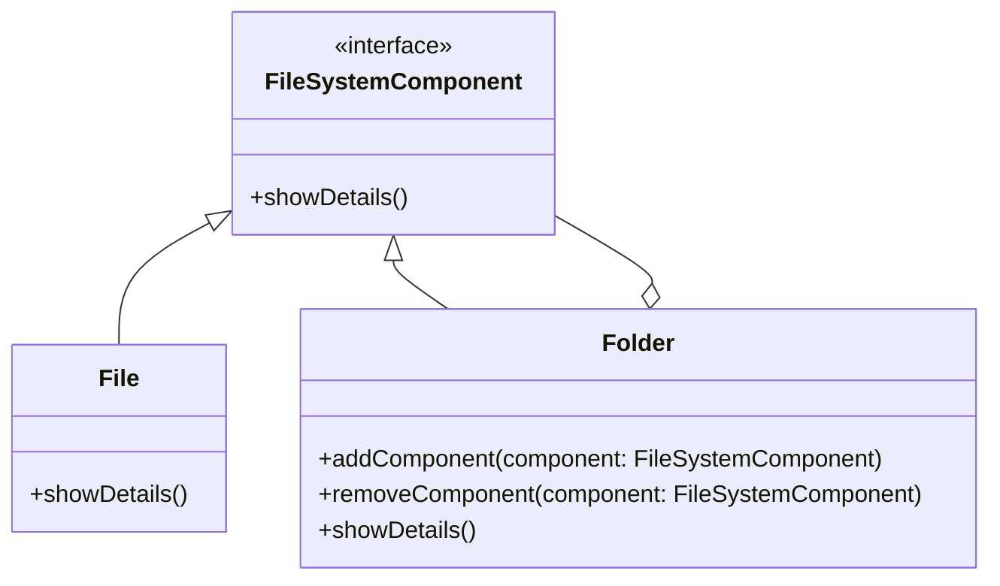

## 5.3 Composite Pattern

The Composite Pattern is a structural design pattern that allows you to compose objects into tree-like structures to represent part-whole hierarchies. This pattern enables clients to treat individual objects and compositions of objects uniformly. In this section, we will delve deep into the Composite Pattern, its implementation in Kotlin using recursive data structures, and how sealed classes can be leveraged to create robust composite structures.

### Intent

The primary intent of the Composite Pattern is to allow clients to treat individual objects and compositions of objects uniformly. This pattern is particularly useful when you want to represent a hierarchy of objects, where each object can be a composite of other objects or a leaf node.

### Key Participants

1. **Component**: An interface or abstract class that defines the common operations for both composite and leaf nodes.
2. **Leaf**: Represents the end objects of a composition. A leaf has no children.
3. **Composite**: A class that represents a group of leaf objects. It implements the component interface and contains child components.
4. **Client**: The class that interacts with the components through the component interface.

### Applicability

Use the Composite Pattern when:

- You want to represent part-whole hierarchies of objects.
- You want clients to be able to ignore the difference between compositions of objects and individual objects.
- You need to simplify client code that deals with complex tree structures.

### Implementing Composites with Recursive Data Structures

In Kotlin, recursive data structures can be effectively used to implement the Composite Pattern. Let's explore how to create a simple file system structure using this pattern.

#### Example: File System Structure

Consider a file system where each file or folder can be treated uniformly. A folder can contain multiple files or other folders, and a file is a leaf node with no children.

```kotlin
// Component
interface FileSystemComponent {
    fun showDetails()
}

// Leaf
class File(private val name: String) : FileSystemComponent {
    override fun showDetails() {
        println("File: $name")
    }
}

// Composite
class Folder(private val name: String) : FileSystemComponent {
    private val components = mutableListOf<FileSystemComponent>()

    fun addComponent(component: FileSystemComponent) {
        components.add(component)
    }

    fun removeComponent(component: FileSystemComponent) {
        components.remove(component)
    }

    override fun showDetails() {
        println("Folder: $name")
        components.forEach { it.showDetails() }
    }
}

// Client
fun main() {
    val file1 = File("File1.txt")
    val file2 = File("File2.txt")
    val folder = Folder("Documents")
    folder.addComponent(file1)
    folder.addComponent(file2)

    val rootFolder = Folder("Root")
    rootFolder.addComponent(folder)

    rootFolder.showDetails()
}
```

In this example, `File` is a leaf node, and `Folder` is a composite node that can contain both files and other folders. The `showDetails` method is implemented in both the leaf and composite classes, allowing the client to treat them uniformly.

### Using Sealed Classes for Composite Structures

Kotlin's sealed classes provide a powerful way to implement composite structures. Sealed classes restrict the class hierarchy, ensuring that all subclasses are known at compile time. This feature is particularly useful for implementing the Composite Pattern, as it allows for exhaustive `when` expressions and type safety.

#### Example: Expression Tree

Let's implement an expression tree using sealed classes to demonstrate how they can be used to create composite structures.

```kotlin
// Sealed class representing an expression
sealed class Expression {
    data class Number(val value: Int) : Expression()
    data class Sum(val left: Expression, val right: Expression) : Expression()
    data class Product(val left: Expression, val right: Expression) : Expression()
}

// Function to evaluate an expression
fun evaluate(expression: Expression): Int = when (expression) {
    is Expression.Number -> expression.value
    is Expression.Sum -> evaluate(expression.left) + evaluate(expression.right)
    is Expression.Product -> evaluate(expression.left) * evaluate(expression.right)
}

// Client
fun main() {
    val expression = Expression.Sum(
        Expression.Number(5),
        Expression.Product(
            Expression.Number(2),
            Expression.Number(3)
        )
    )

    println("Result: ${evaluate(expression)}")
}
```

In this example, we define a sealed class `Expression` with three subclasses: `Number`, `Sum`, and `Product`. The `evaluate` function uses a `when` expression to evaluate the expression tree, demonstrating how sealed classes can be used to create type-safe composite structures.

### Design Considerations

When implementing the Composite Pattern in Kotlin, consider the following:

- **Type Safety**: Kotlin's type system and sealed classes provide strong type safety, reducing runtime errors.
- **Immutability**: Consider using immutable data structures for composite objects to prevent unintended modifications.
- **Performance**: Be mindful of the performance implications of recursive structures, especially with large hierarchies.

### Differences and Similarities

The Composite Pattern is often confused with the Decorator Pattern, as both involve tree structures. However, the Composite Pattern focuses on part-whole hierarchies, while the Decorator Pattern focuses on adding behavior to objects dynamically.

### Try It Yourself

Experiment with the provided examples by adding new operations or components. For instance, try adding a `Difference` operation to the expression tree or a `Shortcut` component to the file system structure.

### Visualizing Composite Structures

To better understand the Composite Pattern, let's visualize the file system structure using a Mermaid.js diagram:



This diagram illustrates the relationship between the `FileSystemComponent`, `File`, and `Folder` classes, highlighting the composite structure.

### References and Links

- [Kotlin Sealed Classes](https://kotlinlang.org/docs/sealed-classes.html)
- [Design Patterns: Elements of Reusable Object-Oriented Software](https://en.wikipedia.org/wiki/Design_Patterns)

### Knowledge Check

- What is the primary intent of the Composite Pattern?
- How do sealed classes enhance the implementation of composite structures in Kotlin?
- What are the key differences between the Composite Pattern and the Decorator Pattern?

### Embrace the Journey

Remember, mastering design patterns is an ongoing journey. As you continue to explore and implement these patterns, you'll gain deeper insights into creating flexible and maintainable software architectures. Keep experimenting, stay curious, and enjoy the journey!

## Quiz Time!



### What is the primary intent of the Composite Pattern?

- [x] To allow clients to treat individual objects and compositions of objects uniformly.
- [ ] To add behavior to objects dynamically.
- [ ] To ensure a class has only one instance.
- [ ] To encapsulate object creation logic.

> **Explanation:** The Composite Pattern allows clients to treat individual objects and compositions of objects uniformly, making it ideal for part-whole hierarchies.

### Which Kotlin feature is particularly useful for implementing composite structures?

- [x] Sealed classes
- [ ] Data classes
- [ ] Extension functions
- [ ] Companion objects

> **Explanation:** Sealed classes in Kotlin provide a restricted class hierarchy, which is useful for implementing composite structures with type safety.

### In the provided file system example, what role does the `Folder` class play?

- [x] Composite
- [ ] Leaf
- [ ] Component
- [ ] Client

> **Explanation:** The `Folder` class acts as a composite, containing other components such as files and folders.

### How does the Composite Pattern differ from the Decorator Pattern?

- [x] The Composite Pattern focuses on part-whole hierarchies, while the Decorator Pattern focuses on adding behavior to objects dynamically.
- [ ] Both patterns focus on adding behavior to objects dynamically.
- [ ] The Composite Pattern ensures a class has only one instance.
- [ ] The Decorator Pattern is used for encapsulating object creation logic.

> **Explanation:** The Composite Pattern is about part-whole hierarchies, whereas the Decorator Pattern is about adding behavior to objects dynamically.

### What is a key benefit of using sealed classes in the Composite Pattern?

- [x] Type safety
- [ ] Performance optimization
- [ ] Simplified syntax
- [ ] Reduced memory usage

> **Explanation:** Sealed classes provide type safety by ensuring that all subclasses are known at compile time, which is beneficial for implementing composite structures.

### Which method is used to add a component to a folder in the file system example?

- [x] `addComponent`
- [ ] `addFile`
- [ ] `addFolder`
- [ ] `addChild`

> **Explanation:** The `addComponent` method is used to add a component, such as a file or folder, to a folder in the file system example.

### What is the result of evaluating the expression `Expression.Sum(Expression.Number(5), Expression.Product(Expression.Number(2), Expression.Number(3)))`?

- [x] 11
- [ ] 10
- [ ] 15
- [ ] 13

> **Explanation:** The expression evaluates to 11 because it sums 5 and the product of 2 and 3, which is 6.

### Which design pattern is often confused with the Composite Pattern?

- [x] Decorator Pattern
- [ ] Singleton Pattern
- [ ] Factory Pattern
- [ ] Observer Pattern

> **Explanation:** The Decorator Pattern is often confused with the Composite Pattern because both involve tree structures, but they serve different purposes.

### What is a common use case for the Composite Pattern?

- [x] Representing part-whole hierarchies
- [ ] Adding behavior to objects dynamically
- [ ] Ensuring a class has only one instance
- [ ] Encapsulating object creation logic

> **Explanation:** The Composite Pattern is commonly used to represent part-whole hierarchies, allowing clients to treat individual objects and compositions uniformly.

### True or False: The Composite Pattern can only be used with immutable data structures.

- [ ] True
- [x] False

> **Explanation:** While using immutable data structures can be beneficial, the Composite Pattern can be implemented with both mutable and immutable structures.


