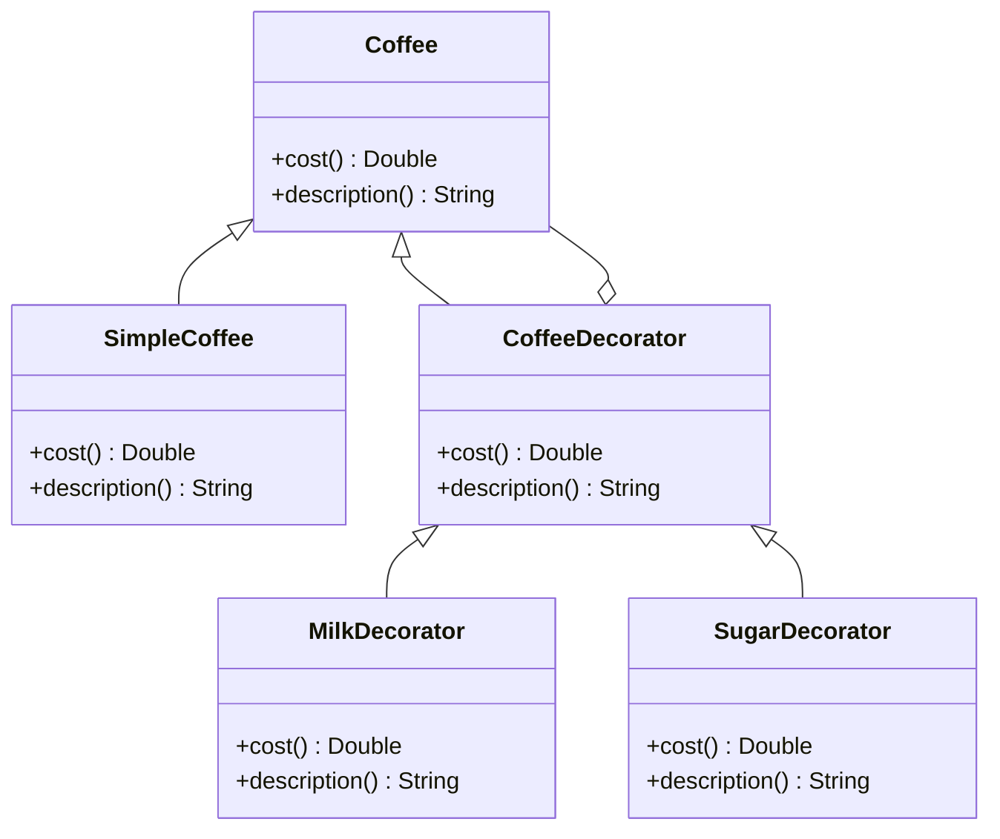

## 5.4 Decorator Pattern

In the realm of software design patterns, the Decorator Pattern stands out as a powerful structural pattern that allows us to add behavior to individual objects dynamically. This pattern is particularly useful when you want to extend the functionalities of a class without altering its structure or creating subclasses. In this section, we will delve into the intricacies of the Decorator Pattern, exploring its implementation in Kotlin using interfaces, delegation, and extension functions.

### Intent

The primary intent of the Decorator Pattern is to provide a flexible alternative to subclassing for extending functionality. By wrapping an object with a decorator, we can add new behaviors or responsibilities without modifying the original object.

### Key Participants

1. **Component**: The interface or abstract class defining the methods that will be implemented by concrete components and decorators.
2. **ConcreteComponent**: The class that implements the `Component` interface. This is the object to which additional responsibilities can be attached.
3. **Decorator**: An abstract class that implements the `Component` interface and contains a reference to a `Component` object. It delegates operations to the component and can add its own behavior.
4. **ConcreteDecorator**: A class that extends the `Decorator` class and adds new behavior.

### Applicability

Use the Decorator Pattern when:
- You want to add responsibilities to individual objects dynamically and transparently, without affecting other objects.
- You need to add responsibilities that can be withdrawn.
- Extending functionality through subclassing is impractical due to a large number of independent extensions.

### Implementing Decorators with Interfaces and Delegation

In Kotlin, interfaces and delegation provide a seamless way to implement the Decorator Pattern. Let's explore how this can be achieved with a practical example.

#### Example: Coffee Shop

Imagine a coffee shop where you can order different types of coffee with various add-ons like milk, sugar, and whipped cream. Each add-on enhances the coffee's flavor and cost. We'll use the Decorator Pattern to model this scenario.

```kotlin
// Component Interface
interface Coffee {
    fun cost(): Double
    fun description(): String
}

// ConcreteComponent
class SimpleCoffee : Coffee {
    override fun cost() = 5.0
    override fun description() = "Simple Coffee"
}

// Decorator
abstract class CoffeeDecorator(private val decoratedCoffee: Coffee) : Coffee {
    override fun cost(): Double = decoratedCoffee.cost()
    override fun description(): String = decoratedCoffee.description()
}

// ConcreteDecorator
class MilkDecorator(coffee: Coffee) : CoffeeDecorator(coffee) {
    override fun cost() = super.cost() + 1.5
    override fun description() = super.description() + ", Milk"
}

class SugarDecorator(coffee: Coffee) : CoffeeDecorator(coffee) {
    override fun cost() = super.cost() + 0.5
    override fun description() = super.description() + ", Sugar"
}

fun main() {
    val coffee: Coffee = SimpleCoffee()
    println("${coffee.description()} costs ${coffee.cost()}")

    val milkCoffee: Coffee = MilkDecorator(coffee)
    println("${milkCoffee.description()} costs ${milkCoffee.cost()}")

    val milkSugarCoffee: Coffee = SugarDecorator(milkCoffee)
    println("${milkSugarCoffee.description()} costs ${milkSugarCoffee.cost()}")
}
```

In this example, `SimpleCoffee` is the `ConcreteComponent`, and `MilkDecorator` and `SugarDecorator` are `ConcreteDecorators` that add additional behavior (cost and description) to the coffee object.

### Using the `by` Keyword for Class Delegation

Kotlin's `by` keyword simplifies the implementation of the Decorator Pattern by automatically delegating method calls to a specified object. This feature reduces boilerplate code and enhances readability.

#### Example: Enhanced Coffee Shop with Delegation

Let's refactor the previous example using the `by` keyword for delegation.

```kotlin
// Decorator with Delegation
class MilkDecoratorV2(coffee: Coffee) : Coffee by coffee {
    override fun cost() = coffee.cost() + 1.5
    override fun description() = coffee.description() + ", Milk"
}

class SugarDecoratorV2(coffee: Coffee) : Coffee by coffee {
    override fun cost() = coffee.cost() + 0.5
    override fun description() = coffee.description() + ", Sugar"
}

fun main() {
    val coffee: Coffee = SimpleCoffee()
    println("${coffee.description()} costs ${coffee.cost()}")

    val milkCoffee: Coffee = MilkDecoratorV2(coffee)
    println("${milkCoffee.description()} costs ${milkCoffee.cost()}")

    val milkSugarCoffee: Coffee = SugarDecoratorV2(milkCoffee)
    println("${milkSugarCoffee.description()} costs ${milkSugarCoffee.cost()}")
}
```

Here, the `by` keyword allows us to delegate the `Coffee` interface methods to the `coffee` object, simplifying the decorator implementation.

### Decorators with Extension Functions

Kotlin's extension functions offer another way to implement the Decorator Pattern. While not a traditional decorator, extension functions can add behavior to existing classes without modifying their source code.

#### Example: Coffee Shop with Extension Functions

Let's see how we can use extension functions to enhance the coffee example.

```kotlin
// Extension Function for Adding Milk
fun Coffee.withMilk(): Coffee = object : Coffee {
    override fun cost() = this@withMilk.cost() + 1.5
    override fun description() = this@withMilk.description() + ", Milk"
}

// Extension Function for Adding Sugar
fun Coffee.withSugar(): Coffee = object : Coffee {
    override fun cost() = this@withSugar.cost() + 0.5
    override fun description() = this@withSugar.description() + ", Sugar"
}

fun main() {
    val coffee: Coffee = SimpleCoffee()
    println("${coffee.description()} costs ${coffee.cost()}")

    val milkCoffee: Coffee = coffee.withMilk()
    println("${milkCoffee.description()} costs ${milkCoffee.cost()}")

    val milkSugarCoffee: Coffee = milkCoffee.withSugar()
    println("${milkSugarCoffee.description()} costs ${milkSugarCoffee.cost()}")
}
```

In this approach, we define extension functions `withMilk` and `withSugar` that return a new `Coffee` object with added behavior, effectively decorating the original object.

### Design Considerations

When implementing the Decorator Pattern, consider the following:

- **Performance**: Each decorator adds a layer of abstraction, which can impact performance if not managed carefully.
- **Complexity**: While decorators provide flexibility, they can also increase complexity, especially if multiple decorators are combined.
- **Kotlin Features**: Leverage Kotlin's delegation and extension functions to simplify decorator implementations and reduce boilerplate code.

### Differences and Similarities

The Decorator Pattern is often confused with the Proxy and Adapter patterns. Here's how they differ:

- **Decorator vs. Proxy**: While both patterns involve wrapping objects, the Proxy Pattern controls access to the object, whereas the Decorator Pattern adds behavior.
- **Decorator vs. Adapter**: The Adapter Pattern changes the interface of an object, while the Decorator Pattern enhances its behavior without altering the interface.

### Visualizing the Decorator Pattern

To better understand the Decorator Pattern, let's visualize its structure using a class diagram.



In this diagram, `Coffee` is the component interface, `SimpleCoffee` is the concrete component, and `MilkDecorator` and `SugarDecorator` are concrete decorators that extend `CoffeeDecorator`.

### Try It Yourself

Experiment with the Decorator Pattern by modifying the code examples:

- Add a new decorator, such as `WhippedCreamDecorator`, that adds whipped cream to the coffee.
- Implement a `SoyMilkDecorator` using the `by` keyword for delegation.
- Create an extension function `withVanilla` that adds vanilla flavor to the coffee.

### Knowledge Check

To reinforce your understanding of the Decorator Pattern, consider the following questions:

- How does the Decorator Pattern differ from subclassing?
- What are the benefits of using Kotlin's `by` keyword for delegation in decorators?
- How can extension functions be used to implement decorators in Kotlin?

### Embrace the Journey

As you explore the Decorator Pattern in Kotlin, remember that this is just one of many design patterns that can enhance your software architecture. Keep experimenting, stay curious, and enjoy the journey of mastering design patterns in Kotlin!

## Quiz Time!



### What is the primary intent of the Decorator Pattern?

- [x] To add behavior to individual objects dynamically without altering their structure.
- [ ] To change the interface of an object.
- [ ] To control access to an object.
- [ ] To encapsulate a group of individual objects.

> **Explanation:** The Decorator Pattern's primary intent is to add behavior to individual objects dynamically without altering their structure, providing a flexible alternative to subclassing.

### Which Kotlin feature simplifies the implementation of the Decorator Pattern by reducing boilerplate code?

- [x] The `by` keyword for delegation.
- [ ] Data classes.
- [ ] Sealed classes.
- [ ] Companion objects.

> **Explanation:** The `by` keyword in Kotlin simplifies the implementation of the Decorator Pattern by automatically delegating method calls to a specified object, reducing boilerplate code.

### How do extension functions differ from traditional decorators?

- [x] Extension functions add behavior without modifying the source code.
- [ ] Extension functions change the interface of an object.
- [ ] Extension functions control access to an object.
- [ ] Extension functions encapsulate a group of individual objects.

> **Explanation:** Extension functions in Kotlin add behavior to existing classes without modifying their source code, offering a flexible way to implement decorators.

### What is a key difference between the Decorator and Proxy patterns?

- [x] Decorators add behavior, while Proxies control access.
- [ ] Decorators change interfaces, while Proxies add behavior.
- [ ] Decorators encapsulate objects, while Proxies change interfaces.
- [ ] Decorators control access, while Proxies add behavior.

> **Explanation:** The key difference is that Decorators add behavior to objects, while Proxies control access to objects.

### Which of the following is a benefit of using the Decorator Pattern?

- [x] It allows adding responsibilities to objects dynamically.
- [ ] It simplifies the interface of an object.
- [ ] It reduces the number of classes in a system.
- [ ] It provides a single point of control for an object.

> **Explanation:** The Decorator Pattern allows adding responsibilities to objects dynamically, providing flexibility in extending functionality.

### In the Coffee Shop example, what role does `SimpleCoffee` play?

- [x] ConcreteComponent
- [ ] Component
- [ ] Decorator
- [ ] ConcreteDecorator

> **Explanation:** `SimpleCoffee` is the `ConcreteComponent` in the Coffee Shop example, representing the object to which additional responsibilities can be attached.

### What is the purpose of the `CoffeeDecorator` class in the example?

- [x] To serve as a base class for decorators, implementing the `Coffee` interface.
- [ ] To provide a concrete implementation of the `Coffee` interface.
- [ ] To change the interface of the `Coffee` object.
- [ ] To control access to the `Coffee` object.

> **Explanation:** The `CoffeeDecorator` class serves as a base class for decorators, implementing the `Coffee` interface and delegating operations to the component.

### How can you implement a new decorator using Kotlin's `by` keyword?

- [x] By delegating the `Coffee` interface methods to the `coffee` object.
- [ ] By creating a new subclass of `Coffee`.
- [ ] By modifying the `Coffee` interface.
- [ ] By using a companion object.

> **Explanation:** You can implement a new decorator using Kotlin's `by` keyword by delegating the `Coffee` interface methods to the `coffee` object, simplifying the decorator implementation.

### True or False: The Decorator Pattern can increase complexity if multiple decorators are combined.

- [x] True
- [ ] False

> **Explanation:** True. While the Decorator Pattern provides flexibility, it can also increase complexity, especially if multiple decorators are combined.

### Which of the following is NOT a key participant in the Decorator Pattern?

- [ ] Component
- [ ] ConcreteComponent
- [ ] Decorator
- [x] Adapter

> **Explanation:** Adapter is not a key participant in the Decorator Pattern. The key participants are Component, ConcreteComponent, Decorator, and ConcreteDecorator.


