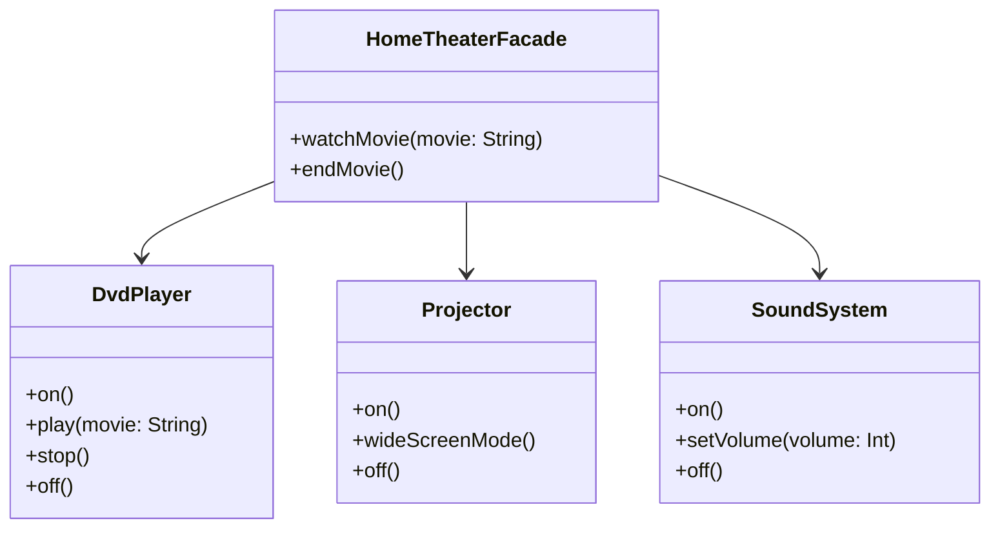

## 5.5 Facade Pattern

In the world of software engineering, complexity is often an unavoidable aspect of building robust systems. As systems grow, they can become cumbersome and difficult to manage. This is where the **Facade Pattern** comes into play. The Facade Pattern provides a simplified interface to a complex subsystem, making it easier for clients to interact with the system without needing to understand its intricacies. In this section, we will delve into the Facade Pattern, explore its implementation in Kotlin using objects and modules, and demonstrate how it simplifies API usage.

### Intent

The primary intent of the Facade Pattern is to offer a unified interface to a set of interfaces in a subsystem. This pattern defines a higher-level interface that makes the subsystem easier to use. By doing so, it reduces the complexity for the client and decouples the client from the subsystem.

### Key Participants

1. **Facade**: The main interface that clients interact with. It provides simplified methods that internally call the complex subsystem methods.
2. **Subsystem Classes**: These are the classes that perform the actual work. They are complex and have intricate interactions with each other.
3. **Client**: The entity that uses the Facade to interact with the subsystem.

### Applicability

Use the Facade Pattern when:
- You want to provide a simple interface to a complex subsystem.
- There are many dependencies between clients and the implementation classes of an abstraction.
- You need to layer your subsystems. The Facade Pattern defines an entry point to each subsystem level.

### Implementing Facades with Objects and Modules

In Kotlin, we can leverage objects and modules to implement the Facade Pattern effectively. Let's explore how to do this with a practical example.

#### Example Scenario: Home Theater System

Imagine you have a complex home theater system with various components like a DVD player, a projector, and a sound system. Each component has its own interface and methods. The goal is to create a Facade that simplifies the operation of the entire system.

#### Subsystem Classes

First, let's define the subsystem classes:

```kotlin
class DvdPlayer {
    fun on() = println("DVD Player is on")
    fun play(movie: String) = println("Playing movie: $movie")
    fun stop() = println("Stopping the DVD player")
    fun off() = println("DVD Player is off")
}

class Projector {
    fun on() = println("Projector is on")
    fun wideScreenMode() = println("Projector is in widescreen mode")
    fun off() = println("Projector is off")
}

class SoundSystem {
    fun on() = println("Sound System is on")
    fun setVolume(volume: Int) = println("Setting volume to $volume")
    fun off() = println("Sound System is off")
}
```

#### Facade Class

Now, let's create a Facade class that simplifies the interaction with these components:

```kotlin
class HomeTheaterFacade(
    private val dvdPlayer: DvdPlayer,
    private val projector: Projector,
    private val soundSystem: SoundSystem
) {
    fun watchMovie(movie: String) {
        println("Get ready to watch a movie...")
        projector.on()
        projector.wideScreenMode()
        soundSystem.on()
        soundSystem.setVolume(5)
        dvdPlayer.on()
        dvdPlayer.play(movie)
    }

    fun endMovie() {
        println("Shutting down the home theater...")
        dvdPlayer.stop()
        dvdPlayer.off()
        soundSystem.off()
        projector.off()
    }
}
```

#### Client Code

Finally, let's see how the client interacts with the Facade:

```kotlin
fun main() {
    val dvdPlayer = DvdPlayer()
    val projector = Projector()
    val soundSystem = SoundSystem()

    val homeTheater = HomeTheaterFacade(dvdPlayer, projector, soundSystem)

    homeTheater.watchMovie("Inception")
    homeTheater.endMovie()
}
```

### Simplifying API Usage

The Facade Pattern is incredibly useful for simplifying API usage. By providing a single point of interaction, it hides the complexities of the subsystem and presents a clean, easy-to-use interface to the client. This not only makes the code more readable but also reduces the learning curve for new developers.

### Design Considerations

- **When to Use**: The Facade Pattern is ideal when you have a complex subsystem that clients need to interact with. It helps in reducing the complexity and dependencies between the client and the subsystem.
- **Kotlin Specific Features**: Kotlin's `object` keyword can be used to create singletons, which can be useful for implementing facades that do not require instantiation.
- **Pitfalls**: While the Facade Pattern simplifies interactions, it can also become a bottleneck if not designed properly. Ensure that the Facade does not become too complex itself.

### Differences and Similarities

The Facade Pattern is often confused with the Adapter Pattern. While both patterns are used to simplify interactions, they serve different purposes:
- **Facade Pattern**: Provides a simplified interface to a complex subsystem.
- **Adapter Pattern**: Converts the interface of a class into another interface that clients expect.

### Visualizing the Facade Pattern

Let's visualize the Facade Pattern using a class diagram:



### Try It Yourself

Encourage experimentation by modifying the code examples:
- Add a new component, such as a `Lights` class, and integrate it into the `HomeTheaterFacade`.
- Extend the `HomeTheaterFacade` to include a method for pausing and resuming the movie.
- Experiment with making the `HomeTheaterFacade` a singleton using Kotlin's `object` keyword.

### Knowledge Check

- What is the primary intent of the Facade Pattern?
- How does the Facade Pattern differ from the Adapter Pattern?
- What are the key participants in the Facade Pattern?
- When should you consider using the Facade Pattern?

### Embrace the Journey

Remember, mastering design patterns is a journey. As you continue to explore and apply these patterns, you'll gain a deeper understanding of how to build scalable and maintainable systems. Keep experimenting, stay curious, and enjoy the process!

## Quiz Time!



### What is the primary intent of the Facade Pattern?

- [x] To provide a simplified interface to a complex subsystem.
- [ ] To convert the interface of a class into another interface.
- [ ] To define a family of algorithms.
- [ ] To separate the construction of a complex object from its representation.

> **Explanation:** The Facade Pattern provides a simplified interface to a complex subsystem, making it easier for clients to interact with the system.

### Which of the following is a key participant in the Facade Pattern?

- [x] Facade
- [x] Subsystem Classes
- [ ] Singleton
- [ ] Factory

> **Explanation:** The key participants in the Facade Pattern are the Facade, which provides the simplified interface, and the Subsystem Classes, which perform the actual work.

### When should you consider using the Facade Pattern?

- [x] When you want to provide a simple interface to a complex subsystem.
- [x] When there are many dependencies between clients and the implementation classes of an abstraction.
- [ ] When you need to convert one interface into another.
- [ ] When you want to define a family of interchangeable algorithms.

> **Explanation:** The Facade Pattern is useful when you want to simplify the interaction with a complex subsystem and reduce dependencies.

### How does the Facade Pattern differ from the Adapter Pattern?

- [x] The Facade Pattern provides a simplified interface, while the Adapter Pattern converts an interface into another.
- [ ] The Facade Pattern is used for creating objects, while the Adapter Pattern is used for simplifying interfaces.
- [ ] The Facade Pattern is used for defining algorithms, while the Adapter Pattern is used for converting interfaces.
- [ ] The Facade Pattern is used for separating construction from representation, while the Adapter Pattern is used for simplifying interfaces.

> **Explanation:** The Facade Pattern provides a simplified interface to a complex subsystem, while the Adapter Pattern converts the interface of a class into another interface that clients expect.

### Which Kotlin feature can be used to create singletons for implementing facades?

- [x] Object keyword
- [ ] Data classes
- [ ] Sealed classes
- [ ] Extension functions

> **Explanation:** Kotlin's `object` keyword can be used to create singletons, which can be useful for implementing facades that do not require instantiation.

### What is a potential pitfall of the Facade Pattern?

- [x] The Facade itself can become too complex.
- [ ] It increases the number of classes in the system.
- [ ] It makes the subsystem harder to understand.
- [ ] It tightly couples the client to the subsystem.

> **Explanation:** While the Facade Pattern simplifies interactions, the Facade itself can become a bottleneck if not designed properly.

### What is the role of the Client in the Facade Pattern?

- [x] To interact with the Facade to use the subsystem.
- [ ] To perform the actual work in the subsystem.
- [ ] To convert interfaces for the subsystem.
- [ ] To define a family of algorithms.

> **Explanation:** The Client uses the Facade to interact with the subsystem, benefiting from the simplified interface.

### How can the Facade Pattern help in API usage?

- [x] By providing a single point of interaction that hides subsystem complexities.
- [ ] By converting API interfaces into simpler ones.
- [ ] By defining multiple entry points for the API.
- [ ] By increasing the number of API methods available.

> **Explanation:** The Facade Pattern simplifies API usage by providing a single point of interaction, hiding the complexities of the subsystem.

### What is the benefit of using modules in Kotlin for implementing the Facade Pattern?

- [x] It helps in organizing code and managing dependencies.
- [ ] It allows for the creation of multiple facades.
- [ ] It simplifies the creation of interfaces.
- [ ] It increases the complexity of the subsystem.

> **Explanation:** Using modules in Kotlin helps in organizing code and managing dependencies, making it easier to implement the Facade Pattern.

### True or False: The Facade Pattern is used to define a family of interchangeable algorithms.

- [ ] True
- [x] False

> **Explanation:** False. The Facade Pattern is used to provide a simplified interface to a complex subsystem, not to define a family of interchangeable algorithms.


