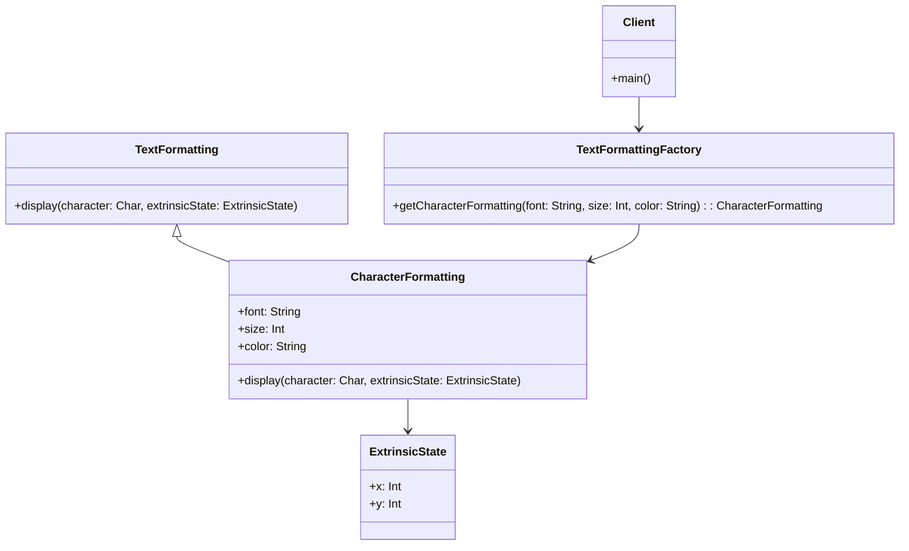

## 5.6 Flyweight Pattern

The Flyweight Pattern is a structural design pattern that focuses on minimizing memory usage by sharing as much data as possible with similar objects. This pattern is particularly useful in applications where a large number of objects are instantiated, and many of them share common data. In this section, we will explore the Flyweight Pattern in the context of Kotlin, leveraging its features to efficiently manage memory and improve application performance.

### Intent

The primary intent of the Flyweight Pattern is to reduce the memory footprint of an application by sharing common data among multiple objects. This is achieved by separating the intrinsic state (shared data) from the extrinsic state (unique data) of objects. By doing so, the Flyweight Pattern allows for the reuse of objects with similar intrinsic states, thereby reducing the overall number of objects created.

### Key Participants

- **Flyweight**: The interface that declares methods for sharing intrinsic state.
- **ConcreteFlyweight**: Implements the Flyweight interface and stores intrinsic state.
- **UnsharedConcreteFlyweight**: Objects that do not share state.
- **FlyweightFactory**: Manages the creation and sharing of Flyweight objects.
- **Client**: Maintains references to Flyweight objects and computes extrinsic state.

### Applicability

The Flyweight Pattern is applicable in scenarios where:

- A large number of objects are required, and they share common data.
- Memory usage is a critical concern, and optimization is necessary.
- The intrinsic and extrinsic states of objects can be clearly separated.

### Implementing Flyweights with Data Classes

Kotlin's data classes provide an excellent way to implement Flyweights due to their concise syntax and automatic generation of useful methods like `equals()`, `hashCode()`, and `copy()`. Let's delve into a practical example to illustrate how the Flyweight Pattern can be implemented using Kotlin data classes.

#### Example: Text Formatting Application

Consider a text formatting application where each character has a font, size, and color. Instead of creating a new object for each character, we can use the Flyweight Pattern to share common formatting attributes.

```kotlin
// Flyweight interface
interface TextFormatting {
    fun display(character: Char, extrinsicState: ExtrinsicState)
}

// ConcreteFlyweight
data class CharacterFormatting(
    val font: String,
    val size: Int,
    val color: String
) : TextFormatting {
    override fun display(character: Char, extrinsicState: ExtrinsicState) {
        println("Character: $character, Font: $font, Size: $size, Color: $color, Position: (${extrinsicState.x}, ${extrinsicState.y})")
    }
}

// Extrinsic state
data class ExtrinsicState(val x: Int, val y: Int)

// FlyweightFactory
class TextFormattingFactory {
    private val cache = mutableMapOf<String, CharacterFormatting>()

    fun getCharacterFormatting(font: String, size: Int, color: String): CharacterFormatting {
        val key = "$font-$size-$color"
        return cache.computeIfAbsent(key) {
            CharacterFormatting(font, size, color)
        }
    }
}

// Client
fun main() {
    val factory = TextFormattingFactory()

    val formatting1 = factory.getCharacterFormatting("Arial", 12, "Black")
    val formatting2 = factory.getCharacterFormatting("Arial", 12, "Black")
    val formatting3 = factory.getCharacterFormatting("Times New Roman", 14, "Red")

    val extrinsicState1 = ExtrinsicState(10, 20)
    val extrinsicState2 = ExtrinsicState(30, 40)

    formatting1.display('A', extrinsicState1)
    formatting2.display('B', extrinsicState2)
    formatting3.display('C', extrinsicState1)

    println("Are formatting1 and formatting2 the same instance? ${formatting1 === formatting2}")
}
```

In this example, we define a `CharacterFormatting` data class to represent the intrinsic state (font, size, color) and an `ExtrinsicState` data class for the extrinsic state (position). The `TextFormattingFactory` manages the creation and caching of `CharacterFormatting` objects, ensuring that identical formatting attributes are shared among characters.

### Intrinsic and Extrinsic States Management

Understanding the distinction between intrinsic and extrinsic states is crucial for effectively implementing the Flyweight Pattern.

- **Intrinsic State**: This is the shared state that is common across multiple objects. In our example, the intrinsic state includes the font, size, and color of the text.
- **Extrinsic State**: This is the unique state that varies between objects. It is computed or passed by the client. In our example, the extrinsic state includes the position of the character on the screen.

By separating these states, we can minimize memory usage by sharing intrinsic states while allowing for unique extrinsic states.

### Design Considerations

When implementing the Flyweight Pattern, consider the following:

- **Granularity of Flyweights**: Determine the level of granularity for the shared state. Too coarse-grained Flyweights may lead to inefficiencies, while too fine-grained Flyweights may increase complexity.
- **Thread Safety**: If Flyweights are shared across threads, ensure that they are immutable or properly synchronized.
- **Caching Strategy**: Implement an efficient caching strategy in the FlyweightFactory to manage the lifecycle of Flyweight objects.

### Differences and Similarities

The Flyweight Pattern is often confused with other structural patterns like the Singleton Pattern. However, the key distinction is that Flyweight focuses on sharing common data among multiple instances, while Singleton ensures a single instance of a class.

### Try It Yourself

Experiment with the code example by modifying the font, size, and color attributes. Observe how the FlyweightFactory manages the creation and sharing of `CharacterFormatting` objects. Try adding new attributes to the intrinsic state and see how it affects memory usage.

### Visualizing the Flyweight Pattern

To better understand the Flyweight Pattern, let's visualize the relationship between the Flyweight, FlyweightFactory, and Client using a class diagram.



This diagram illustrates the interaction between the classes involved in the Flyweight Pattern. The `CharacterFormatting` class implements the `TextFormatting` interface and interacts with the `ExtrinsicState` class to display characters. The `TextFormattingFactory` manages the creation and sharing of `CharacterFormatting` objects, while the `Client` uses the factory to obtain and utilize these objects.

### References and Links

For further reading on the Flyweight Pattern and its applications, consider exploring the following resources:

- [Design Patterns: Elements of Reusable Object-Oriented Software](https://en.wikipedia.org/wiki/Design_Patterns) - A foundational book on design patterns.
- [Kotlin Documentation](https://kotlinlang.org/docs/home.html) - Official Kotlin documentation for language features and best practices.
- [Refactoring Guru: Flyweight Pattern](https://refactoring.guru/design-patterns/flyweight) - A detailed explanation of the Flyweight Pattern with examples.

### Knowledge Check

To reinforce your understanding of the Flyweight Pattern, consider the following questions:

- What is the primary goal of the Flyweight Pattern?
- How does the Flyweight Pattern manage memory usage?
- What are the key differences between intrinsic and extrinsic states?
- How can Kotlin's data classes be leveraged to implement the Flyweight Pattern?

### Embrace the Journey

Remember, mastering design patterns like the Flyweight Pattern is a journey. As you progress, you'll gain a deeper understanding of how to optimize memory usage and improve application performance. Keep experimenting, stay curious, and enjoy the journey!

## Quiz Time!



### What is the primary intent of the Flyweight Pattern?

- [x] To reduce memory usage by sharing common data among multiple objects.
- [ ] To ensure a single instance of a class.
- [ ] To provide a simplified interface to a complex subsystem.
- [ ] To encapsulate actions as objects.

> **Explanation:** The Flyweight Pattern aims to minimize memory usage by sharing common data among similar objects.

### Which of the following is an example of intrinsic state in the Flyweight Pattern?

- [x] Font and color of text characters.
- [ ] Position of text characters on the screen.
- [ ] User input data.
- [ ] Network configuration settings.

> **Explanation:** Intrinsic state refers to shared data, such as font and color, that is common across multiple objects.

### What role does the FlyweightFactory play in the Flyweight Pattern?

- [x] It manages the creation and sharing of Flyweight objects.
- [ ] It provides a simplified interface to a complex subsystem.
- [ ] It encapsulates actions as objects.
- [ ] It ensures a single instance of a class.

> **Explanation:** The FlyweightFactory is responsible for creating and managing Flyweight objects, ensuring that shared data is reused.

### How can Kotlin's data classes be utilized in the Flyweight Pattern?

- [x] By representing intrinsic state with concise syntax and automatic method generation.
- [ ] By ensuring a single instance of a class.
- [ ] By providing a simplified interface to a complex subsystem.
- [ ] By encapsulating actions as objects.

> **Explanation:** Kotlin's data classes are ideal for representing intrinsic state due to their concise syntax and useful methods like `equals()` and `hashCode()`.

### What is the difference between intrinsic and extrinsic states?

- [x] Intrinsic state is shared among objects, while extrinsic state is unique to each object.
- [ ] Intrinsic state is unique to each object, while extrinsic state is shared among objects.
- [ ] Both intrinsic and extrinsic states are shared among objects.
- [ ] Both intrinsic and extrinsic states are unique to each object.

> **Explanation:** Intrinsic state is the shared data among objects, whereas extrinsic state is unique to each object and is computed or passed by the client.

### What is a potential design consideration when implementing the Flyweight Pattern?

- [x] Determining the granularity of Flyweights.
- [ ] Ensuring a single instance of a class.
- [ ] Providing a simplified interface to a complex subsystem.
- [ ] Encapsulating actions as objects.

> **Explanation:** Determining the appropriate granularity of Flyweights is crucial to balance efficiency and complexity.

### How does the Flyweight Pattern differ from the Singleton Pattern?

- [x] Flyweight shares common data among multiple instances, while Singleton ensures a single instance.
- [ ] Flyweight ensures a single instance, while Singleton shares common data.
- [ ] Both Flyweight and Singleton ensure a single instance.
- [ ] Both Flyweight and Singleton share common data among multiple instances.

> **Explanation:** The Flyweight Pattern focuses on sharing data among multiple instances, whereas the Singleton Pattern ensures a single instance of a class.

### What is an example of extrinsic state in the Flyweight Pattern?

- [x] Position of text characters on the screen.
- [ ] Font and color of text characters.
- [ ] Network configuration settings.
- [ ] User input data.

> **Explanation:** Extrinsic state refers to unique data, such as the position of text characters, that varies between objects.

### How can you experiment with the Flyweight Pattern code example?

- [x] By modifying font, size, and color attributes to observe FlyweightFactory behavior.
- [ ] By ensuring a single instance of a class.
- [ ] By providing a simplified interface to a complex subsystem.
- [ ] By encapsulating actions as objects.

> **Explanation:** Experimenting with different attributes in the code example can help observe how the FlyweightFactory manages object creation and sharing.

### True or False: The Flyweight Pattern is useful in applications where a large number of objects are instantiated and share common data.

- [x] True
- [ ] False

> **Explanation:** The Flyweight Pattern is designed to optimize memory usage in scenarios where many objects share common data.


