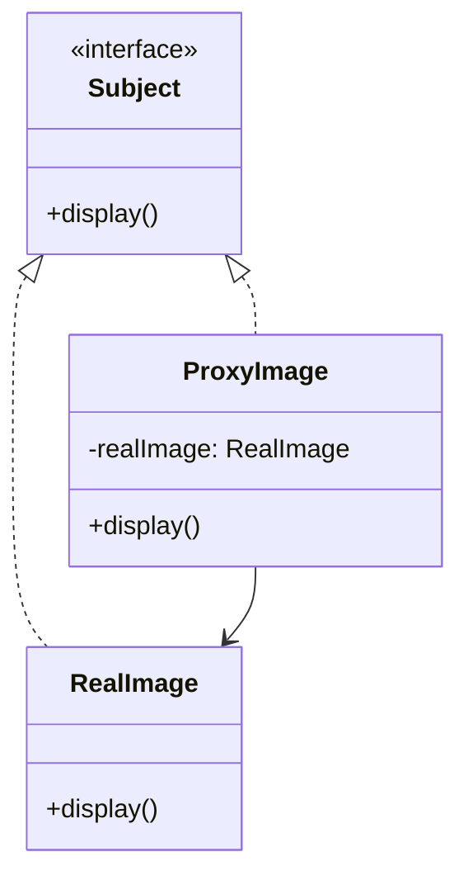

## 5.7 Proxy Pattern

The Proxy Pattern is a structural design pattern that provides a surrogate or placeholder for another object to control access to it. This pattern is particularly useful in scenarios where direct access to an object is either costly, unnecessary, or needs to be controlled for security reasons. In Kotlin, the Proxy Pattern can be elegantly implemented using interfaces, delegation, and the `by` keyword.

### Intent

The primary intent of the Proxy Pattern is to provide a substitute or placeholder for another object to control access to it. This can be useful for various purposes, such as:

- **Lazy Initialization**: Deferring the creation and initialization of an expensive object until it is actually needed.
- **Access Control**: Restricting access to certain methods or data of an object.
- **Logging and Auditing**: Keeping track of operations performed on an object.
- **Remote Proxy**: Representing an object that exists in a different address space.

### Key Participants

1. **Proxy**: The proxy object that controls access to the real subject. It maintains a reference to the real subject and forwards requests to it.
2. **RealSubject**: The actual object that the proxy represents.
3. **Subject**: An interface that both the RealSubject and Proxy implement, ensuring that the proxy can be used in place of the real subject.

### Applicability

Use the Proxy Pattern when:

- You need to control access to an object.
- You want to add additional functionality (e.g., logging, caching) to an object without modifying its code.
- You need to represent a remote object locally.
- You want to defer the creation of a resource-intensive object until it is needed.

### Implementing Proxies with Interfaces and Delegation

In Kotlin, you can implement proxies using interfaces and delegation. Let's explore how this can be done with a simple example.

#### Example: Virtual Proxy for Image Loading

Imagine a scenario where we have an `Image` interface representing an image that can be displayed. The actual image loading is resource-intensive, so we use a proxy to defer the loading until the image is actually needed.

```kotlin
// Subject interface
interface Image {
    fun display()
}

// RealSubject class
class RealImage(private val filename: String) : Image {
    init {
        loadFromDisk()
    }

    private fun loadFromDisk() {
        println("Loading $filename from disk...")
    }

    override fun display() {
        println("Displaying $filename")
    }
}

// Proxy class
class ProxyImage(private val filename: String) : Image {
    private var realImage: RealImage? = null

    override fun display() {
        if (realImage == null) {
            realImage = RealImage(filename)
        }
        realImage?.display()
    }
}

// Client code
fun main() {
    val image: Image = ProxyImage("test_image.jpg")
    // Image will be loaded from disk only when display is called
    image.display()
}
```

In this example, the `ProxyImage` class acts as a proxy for the `RealImage` class. The `RealImage` is only loaded from disk when the `display` method is called for the first time, demonstrating lazy initialization.

### Virtual, Protection, and Remote Proxies

The Proxy Pattern can be categorized into several types based on its purpose:

#### Virtual Proxy

A virtual proxy is used to defer the creation and initialization of an expensive object until it is needed. The example above demonstrates a virtual proxy.

#### Protection Proxy

A protection proxy controls access to an object by checking permissions before forwarding a request. This is useful for implementing access control mechanisms.

```kotlin
// Protection Proxy Example

// Subject interface
interface Document {
    fun displayContent()
}

// RealSubject class
class SecureDocument(private val content: String) : Document {
    override fun displayContent() {
        println("Content: $content")
    }
}

// Proxy class
class DocumentProxy(private val content: String, private val userRole: String) : Document {
    private var document: SecureDocument? = null

    override fun displayContent() {
        if (userRole == "ADMIN") {
            if (document == null) {
                document = SecureDocument(content)
            }
            document?.displayContent()
        } else {
            println("Access Denied: Insufficient Permissions")
        }
    }
}

// Client code
fun main() {
    val adminDocument: Document = DocumentProxy("Sensitive Data", "ADMIN")
    adminDocument.displayContent()  // Access granted

    val userDocument: Document = DocumentProxy("Sensitive Data", "USER")
    userDocument.displayContent()  // Access denied
}
```

In this example, the `DocumentProxy` checks the user's role before allowing access to the document's content.

#### Remote Proxy

A remote proxy represents an object that exists in a different address space. It is commonly used in distributed systems to provide a local representation of a remote object.

```kotlin
// Remote Proxy Example

// Subject interface
interface RemoteService {
    fun fetchData(): String
}

// RealSubject class
class RealRemoteService : RemoteService {
    override fun fetchData(): String {
        // Simulate network call
        println("Fetching data from remote service...")
        return "Remote Data"
    }
}

// Proxy class
class RemoteServiceProxy : RemoteService {
    private var realService: RealRemoteService? = null

    override fun fetchData(): String {
        if (realService == null) {
            realService = RealRemoteService()
        }
        return realService!!.fetchData()
    }
}

// Client code
fun main() {
    val service: RemoteService = RemoteServiceProxy()
    println(service.fetchData())
}
```

In this example, the `RemoteServiceProxy` acts as a local representative for the `RealRemoteService`, simulating a network call.

### Using `by` Keyword for Delegation

Kotlin's `by` keyword can be used to simplify the implementation of proxies by delegating method calls to another object.

```kotlin
// Using `by` keyword for delegation

interface Printer {
    fun printDocument()
}

class RealPrinter : Printer {
    override fun printDocument() {
        println("Printing document...")
    }
}

class PrinterProxy(private val printer: Printer) : Printer by printer

fun main() {
    val realPrinter = RealPrinter()
    val proxyPrinter = PrinterProxy(realPrinter)
    proxyPrinter.printDocument()  // Delegates to realPrinter
}
```

In this example, the `PrinterProxy` class uses the `by` keyword to delegate the `printDocument` method call to the `RealPrinter` instance.

### Design Considerations

When implementing the Proxy Pattern, consider the following:

- **Performance**: Proxies can introduce additional overhead, so use them judiciously.
- **Complexity**: Adding proxies can increase the complexity of the codebase. Ensure that the benefits outweigh the added complexity.
- **Thread Safety**: If the real subject is accessed concurrently, ensure that the proxy handles synchronization appropriately.

### Differences and Similarities

The Proxy Pattern is often confused with other structural patterns like Decorator and Adapter. Here are some distinctions:

- **Proxy vs. Decorator**: While both patterns involve wrapping an object, the Proxy Pattern focuses on controlling access, whereas the Decorator Pattern adds new behavior.
- **Proxy vs. Adapter**: The Adapter Pattern is used to make two incompatible interfaces compatible, while the Proxy Pattern controls access to an object.

### Visualizing the Proxy Pattern

Below is a class diagram representing the Proxy Pattern:



This diagram illustrates the relationship between the `Subject`, `RealImage`, and `ProxyImage` classes.

### Try It Yourself

Experiment with the code examples provided by:

- Modifying the `ProxyImage` to cache the loaded image and reuse it for subsequent calls.
- Implementing a logging proxy that logs each method call to the real subject.
- Creating a remote proxy that simulates a delay to represent network latency.

### Knowledge Check

- What are the key differences between a Proxy and a Decorator?
- How does the `by` keyword simplify proxy implementation in Kotlin?
- When would you use a protection proxy?

### Embrace the Journey

Remember, mastering design patterns like the Proxy Pattern is an ongoing journey. As you continue to explore and experiment, you'll gain a deeper understanding of how to apply these patterns effectively in your projects. Keep experimenting, stay curious, and enjoy the journey!

## Quiz Time!



### What is the primary intent of the Proxy Pattern?

- [x] To provide a substitute or placeholder for another object to control access to it.
- [ ] To add new behavior to an object without modifying its code.
- [ ] To make two incompatible interfaces compatible.
- [ ] To encapsulate a family of algorithms.

> **Explanation:** The Proxy Pattern provides a substitute or placeholder for another object to control access to it, which is its primary intent.

### Which keyword in Kotlin can be used to simplify the implementation of proxies?

- [x] `by`
- [ ] `as`
- [ ] `is`
- [ ] `in`

> **Explanation:** The `by` keyword in Kotlin can be used for delegation, simplifying the implementation of proxies by delegating method calls to another object.

### What type of proxy would you use to defer the creation of an expensive object until it is needed?

- [x] Virtual Proxy
- [ ] Protection Proxy
- [ ] Remote Proxy
- [ ] Logging Proxy

> **Explanation:** A Virtual Proxy is used to defer the creation and initialization of an expensive object until it is needed.

### In the Proxy Pattern, what is the role of the RealSubject?

- [x] It is the actual object that the proxy represents.
- [ ] It is the interface that both the proxy and real subject implement.
- [ ] It is the object that controls access to the real subject.
- [ ] It is the client that uses the proxy.

> **Explanation:** The RealSubject is the actual object that the proxy represents and to which it forwards requests.

### How does a protection proxy control access to an object?

- [x] By checking permissions before forwarding a request.
- [ ] By deferring the creation of the object until needed.
- [ ] By representing an object in a different address space.
- [ ] By adding new behavior to the object.

> **Explanation:** A protection proxy controls access to an object by checking permissions before forwarding a request, ensuring that only authorized users can access the object.

### What is a common use case for a remote proxy?

- [x] Representing an object that exists in a different address space.
- [ ] Adding logging functionality to an object.
- [ ] Deferring the creation of an expensive object.
- [ ] Controlling access based on user roles.

> **Explanation:** A remote proxy is commonly used to represent an object that exists in a different address space, such as in distributed systems.

### What is the main difference between a Proxy and a Decorator?

- [x] A Proxy controls access to an object, while a Decorator adds new behavior.
- [ ] A Proxy adds new behavior to an object, while a Decorator controls access.
- [ ] A Proxy and a Decorator are the same.
- [ ] A Proxy is used for logging, while a Decorator is used for caching.

> **Explanation:** The main difference is that a Proxy controls access to an object, while a Decorator adds new behavior to an object.

### Which of the following is NOT a type of proxy?

- [x] Adapter Proxy
- [ ] Virtual Proxy
- [ ] Protection Proxy
- [ ] Remote Proxy

> **Explanation:** An Adapter Proxy is not a recognized type of proxy. The Adapter Pattern is a separate design pattern used to make two incompatible interfaces compatible.

### True or False: The Proxy Pattern can introduce additional overhead.

- [x] True
- [ ] False

> **Explanation:** True. The Proxy Pattern can introduce additional overhead due to the added layer of abstraction and potential performance costs associated with proxy operations.

### What should be considered when using the Proxy Pattern in a multithreaded environment?

- [x] Thread safety and synchronization
- [ ] Code readability
- [ ] Interface compatibility
- [ ] Logging capabilities

> **Explanation:** In a multithreaded environment, it is important to consider thread safety and synchronization when using the Proxy Pattern to ensure that concurrent access to the real subject is handled appropriately.


