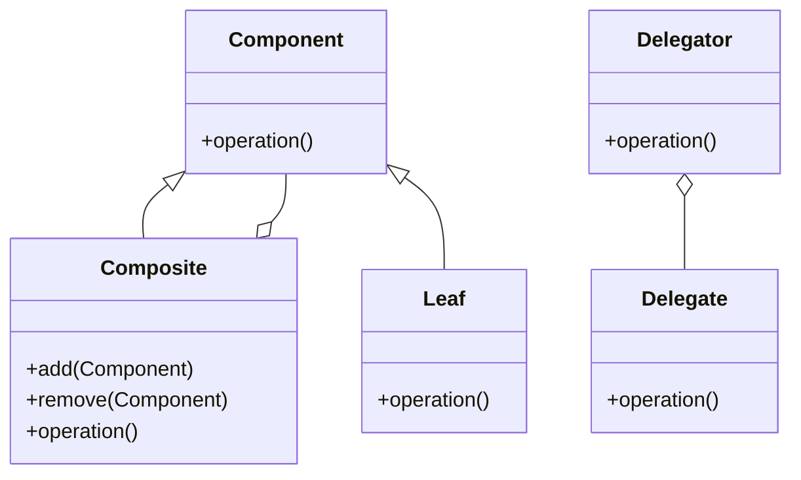

## 5.8 Composite Reuse & Delegation Pattern

In the world of software engineering, the principles of design patterns are vital for creating robust, scalable, and maintainable code. Among these principles, the Composite Reuse & Delegation Pattern stands out as a powerful approach to achieving flexibility and reusability. This pattern emphasizes favoring composition over inheritance, a concept that has gained traction as software systems have grown in complexity. By leveraging delegation, developers can reuse behavior efficiently, making it a cornerstone of modern Kotlin development.

### Intent

The primary intent of the Composite Reuse & Delegation Pattern is to promote the use of composition over inheritance. This approach allows developers to build complex systems by combining simple objects or behaviors, rather than relying on a rigid class hierarchy. By using delegation, we can achieve behavior reuse without the pitfalls of deep inheritance chains, such as tight coupling and reduced flexibility.

### Key Participants

1. **Component**: The interface or abstract class defining the behavior that can be composed.
2. **Composite**: The class that contains a collection of components and implements the component interface.
3. **Leaf**: The basic element that implements the component interface.
4. **Delegator**: The object that delegates tasks to other objects (delegates) to achieve behavior reuse.
5. **Delegate**: The object to which the delegator delegates tasks.

### Applicability

- **When to Use**: 
  - When you need to build systems with flexible and reusable components.
  - When inheritance leads to complex and unmanageable class hierarchies.
  - When you want to decouple behavior from the object structure.

- **Benefits**:
  - **Flexibility**: Easily change or extend behavior by composing different objects.
  - **Reusability**: Reuse existing components without modifying their source code.
  - **Maintainability**: Simplify code maintenance by avoiding deep inheritance hierarchies.

### Using Delegation for Behavior Reuse

Delegation is a powerful feature in Kotlin that allows an object to delegate responsibility for a task to another object. This is achieved using the `by` keyword, which simplifies the delegation process.

#### Example: Delegation in Kotlin

Let's explore a simple example of delegation in Kotlin:

```kotlin
interface Printer {
    fun print()
}

class ConsolePrinter : Printer {
    override fun print() {
        println("Printing to console")
    }
}

class FilePrinter : Printer {
    override fun print() {
        println("Printing to file")
    }
}

class DocumentPrinter(printer: Printer) : Printer by printer

fun main() {
    val consolePrinter = ConsolePrinter()
    val filePrinter = FilePrinter()

    val documentPrinter1 = DocumentPrinter(consolePrinter)
    documentPrinter1.print() // Output: Printing to console

    val documentPrinter2 = DocumentPrinter(filePrinter)
    documentPrinter2.print() // Output: Printing to file
}
```

In this example, `DocumentPrinter` delegates the `print` function to the `Printer` interface. This allows `DocumentPrinter` to dynamically change its behavior by using different implementations of the `Printer` interface.

### Implementing the Decorator Pattern

The Decorator Pattern is a structural pattern that allows behavior to be added to individual objects, either statically or dynamically, without affecting the behavior of other objects from the same class. It is often used in conjunction with delegation to enhance or modify the behavior of an object.

#### Example: Decorator Pattern in Kotlin

Let's implement a simple decorator pattern in Kotlin:

```kotlin
interface Coffee {
    fun cost(): Double
    fun description(): String
}

class SimpleCoffee : Coffee {
    override fun cost() = 2.0
    override fun description() = "Simple coffee"
}

abstract class CoffeeDecorator(private val coffee: Coffee) : Coffee {
    override fun cost() = coffee.cost()
    override fun description() = coffee.description()
}

class MilkDecorator(coffee: Coffee) : CoffeeDecorator(coffee) {
    override fun cost() = super.cost() + 0.5
    override fun description() = super.description() + ", milk"
}

class SugarDecorator(coffee: Coffee) : CoffeeDecorator(coffee) {
    override fun cost() = super.cost() + 0.2
    override fun description() = super.description() + ", sugar"
}

fun main() {
    val coffee = SimpleCoffee()
    println("${coffee.description()} costs ${coffee.cost()}")

    val milkCoffee = MilkDecorator(coffee)
    println("${milkCoffee.description()} costs ${milkCoffee.cost()}")

    val milkSugarCoffee = SugarDecorator(milkCoffee)
    println("${milkSugarCoffee.description()} costs ${milkSugarCoffee.cost()}")
}
```

In this example, `CoffeeDecorator` is an abstract class that implements the `Coffee` interface and delegates the `cost` and `description` methods to the `coffee` object. The `MilkDecorator` and `SugarDecorator` classes extend `CoffeeDecorator` to add additional behavior.

### Implementing the Strategy Pattern

The Strategy Pattern is a behavioral pattern that enables selecting an algorithm's behavior at runtime. It defines a family of algorithms, encapsulates each one, and makes them interchangeable. This pattern is particularly useful for implementing different strategies for a task without modifying the client code.

#### Example: Strategy Pattern in Kotlin

Let's implement a simple strategy pattern in Kotlin:

```kotlin
interface PaymentStrategy {
    fun pay(amount: Double)
}

class CreditCardStrategy(private val cardNumber: String) : PaymentStrategy {
    override fun pay(amount: Double) {
        println("Paid $amount using credit card: $cardNumber")
    }
}

class PayPalStrategy(private val email: String) : PaymentStrategy {
    override fun pay(amount: Double) {
        println("Paid $amount using PayPal: $email")
    }
}

class ShoppingCart {
    private val items = mutableListOf<Double>()

    fun addItem(price: Double) {
        items.add(price)
    }

    fun calculateTotal(): Double {
        return items.sum()
    }

    fun pay(strategy: PaymentStrategy) {
        val amount = calculateTotal()
        strategy.pay(amount)
    }
}

fun main() {
    val cart = ShoppingCart()
    cart.addItem(10.0)
    cart.addItem(20.0)

    val creditCardStrategy = CreditCardStrategy("1234-5678-9012-3456")
    cart.pay(creditCardStrategy)

    val payPalStrategy = PayPalStrategy("user@example.com")
    cart.pay(payPalStrategy)
}
```

In this example, `PaymentStrategy` is an interface that defines the `pay` method. `CreditCardStrategy` and `PayPalStrategy` are concrete implementations of the `PaymentStrategy` interface. The `ShoppingCart` class uses a `PaymentStrategy` to process payments, allowing different payment methods to be used interchangeably.

### Design Considerations

When implementing the Composite Reuse & Delegation Pattern, consider the following:

- **Flexibility vs. Complexity**: While composition offers flexibility, it can also introduce complexity if not managed properly. Ensure that the composition of objects is intuitive and maintainable.
- **Performance**: Delegation can introduce a slight performance overhead due to the additional layer of indirection. However, this is often negligible compared to the benefits of flexibility and reusability.
- **Kotlin-Specific Features**: Leverage Kotlin's features such as extension functions and properties to enhance the flexibility and readability of your code.

### Differences and Similarities

The Composite Reuse & Delegation Pattern is often compared to other patterns such as the Decorator and Strategy patterns. While they share similarities in promoting flexibility and reusability, they differ in their specific applications:

- **Decorator Pattern**: Focuses on adding behavior to individual objects without affecting others.
- **Strategy Pattern**: Focuses on selecting algorithms at runtime.
- **Composite Reuse & Delegation Pattern**: Focuses on favoring composition over inheritance and using delegation for behavior reuse.

### Visualizing the Composite Reuse & Delegation Pattern

To better understand the Composite Reuse & Delegation Pattern, let's visualize it using a class diagram:



In this diagram, `Component` is the interface for both `Composite` and `Leaf`. The `Composite` class can contain multiple `Component` objects, allowing for flexible composition. The `Delegator` class delegates operations to the `Delegate` class, illustrating the delegation aspect of the pattern.

### Try It Yourself

To deepen your understanding of the Composite Reuse & Delegation Pattern, try modifying the code examples provided:

- **Experiment with Delegation**: Create additional `Printer` implementations and delegate them to `DocumentPrinter`. Observe how the behavior changes without modifying the `DocumentPrinter` class.
- **Extend the Decorator Pattern**: Add more decorators to the `Coffee` example, such as `VanillaDecorator` or `CaramelDecorator`, and see how they affect the final cost and description.
- **Implement a New Strategy**: Create a new payment strategy, such as `BitcoinStrategy`, and integrate it into the `ShoppingCart` example.

### Knowledge Check

Before moving on, consider the following questions to test your understanding:

- What are the key benefits of using composition over inheritance?
- How does delegation enhance behavior reuse in Kotlin?
- What are the primary differences between the Decorator and Strategy patterns?

Remember, mastering design patterns is a journey. As you continue to explore and apply these patterns in your projects, you'll gain a deeper understanding of their power and versatility. Keep experimenting, stay curious, and enjoy the process of becoming a more proficient Kotlin developer!

## Quiz Time!



### What is the primary intent of the Composite Reuse & Delegation Pattern?

- [x] To favor composition over inheritance for flexibility and reusability.
- [ ] To enforce strict class hierarchies.
- [ ] To eliminate the need for interfaces.
- [ ] To simplify code by reducing the number of classes.

> **Explanation:** The Composite Reuse & Delegation Pattern aims to favor composition over inheritance, promoting flexibility and reusability.

### How does Kotlin's `by` keyword facilitate delegation?

- [x] It allows an object to delegate responsibility for a task to another object.
- [ ] It automatically generates getters and setters.
- [ ] It is used for defining data classes.
- [ ] It is a keyword for creating singletons.

> **Explanation:** The `by` keyword in Kotlin is used to delegate tasks to another object, enabling behavior reuse.

### Which pattern focuses on adding behavior to individual objects without affecting others?

- [x] Decorator Pattern
- [ ] Strategy Pattern
- [ ] Composite Pattern
- [ ] Singleton Pattern

> **Explanation:** The Decorator Pattern allows behavior to be added to individual objects without affecting others.

### What is the main advantage of using the Strategy Pattern?

- [x] It allows selecting an algorithm's behavior at runtime.
- [ ] It simplifies class hierarchies.
- [ ] It enforces a single method of behavior.
- [ ] It eliminates the need for interfaces.

> **Explanation:** The Strategy Pattern enables selecting an algorithm's behavior at runtime, providing flexibility.

### In the provided example, what does the `DocumentPrinter` class do?

- [x] It delegates the `print` function to the `Printer` interface.
- [ ] It implements the `Printer` interface directly.
- [ ] It extends the `ConsolePrinter` class.
- [ ] It overrides the `print` function with its own implementation.

> **Explanation:** The `DocumentPrinter` class delegates the `print` function to the `Printer` interface, allowing dynamic behavior changes.

### What is a potential downside of using delegation?

- [x] It can introduce a slight performance overhead.
- [ ] It reduces code readability.
- [ ] It enforces strict class hierarchies.
- [ ] It eliminates the need for interfaces.

> **Explanation:** Delegation can introduce a slight performance overhead due to the additional layer of indirection.

### Which Kotlin feature can enhance the flexibility and readability of code?

- [x] Extension functions and properties
- [ ] Deep inheritance hierarchies
- [ ] Global variables
- [ ] Hardcoded values

> **Explanation:** Kotlin's extension functions and properties enhance code flexibility and readability.

### What is a key difference between the Decorator and Strategy patterns?

- [x] Decorator focuses on adding behavior to objects, while Strategy focuses on selecting algorithms.
- [ ] Decorator eliminates the need for interfaces, while Strategy enforces them.
- [ ] Decorator is used for creating singletons, while Strategy is for creating factories.
- [ ] Decorator is only applicable to UI components, while Strategy is not.

> **Explanation:** The Decorator Pattern focuses on adding behavior to objects, while the Strategy Pattern focuses on selecting algorithms.

### What is a benefit of using composition over inheritance?

- [x] Increased flexibility and reusability
- [ ] Simplified class hierarchies
- [ ] Reduced number of classes
- [ ] Automatic code generation

> **Explanation:** Composition offers increased flexibility and reusability compared to inheritance.

### True or False: The Composite Reuse & Delegation Pattern is only applicable to UI components.

- [ ] True
- [x] False

> **Explanation:** The Composite Reuse & Delegation Pattern is applicable to a wide range of software components, not just UI components.


