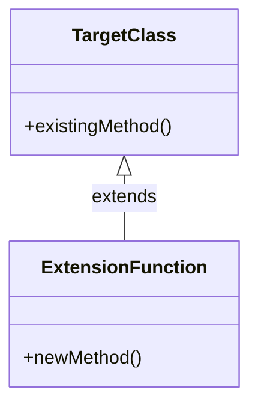

## 5.9 Extension Pattern

In the world of software development, one of the key principles is to write clean, maintainable, and scalable code. The Extension Pattern in Kotlin is a powerful tool that allows developers to enhance the functionality of existing classes without modifying their original code. This pattern is particularly useful when working with third-party libraries or when you want to add utility functions to classes in a clean and modular way.

### Intent

The primary intent of the Extension Pattern is to provide a mechanism to extend the capabilities of existing classes. This is achieved through **Extension Functions** and **Extension Properties**, which allow developers to add new functions and properties to existing classes without altering their source code. This pattern promotes code reuse and helps maintain a clear separation of concerns.

### Key Participants

- **Target Class**: The existing class that you want to extend.
- **Extension Function/Property**: The new functionality added to the target class.
- **Client Code**: The code that utilizes the extended functionality.

### Applicability

The Extension Pattern is applicable in scenarios where:

- You need to add functionality to classes from third-party libraries.
- You want to keep your codebase clean by separating utility functions from core class definitions.
- You aim to enhance the readability and maintainability of your code by using a more declarative style.

### Implementing Extension Functions

Extension functions in Kotlin allow you to add new functions to existing classes. These functions are defined outside the class but can be called as if they were part of the class. This provides a seamless way to enhance class functionality.

#### Example: Adding a Function to the String Class

Let's start by adding a simple extension function to the `String` class that checks if a string is a palindrome.

```kotlin
// Extension function to check if a string is a palindrome
fun String.isPalindrome(): Boolean {
    return this == this.reversed()
}

fun main() {
    val word = "radar"
    println("Is '$word' a palindrome? ${word.isPalindrome()}")
}
```

In this example, we define an extension function `isPalindrome()` for the `String` class. This function checks if the string is the same when reversed. Notice how we call `isPalindrome()` on a `String` instance as if it were a member function.

#### Try It Yourself

Experiment with the above code by modifying the `isPalindrome()` function to ignore case sensitivity or whitespace. This will help you understand how extension functions can be customized to meet specific requirements.

### Implementing Extension Properties

Extension properties allow you to add new properties to existing classes. While they don't actually add a field to the class, they provide a way to define a property that behaves like a member of the class.

#### Example: Adding a Property to the List Class

Let's add an extension property to the `List` class that returns the middle element of the list.

```kotlin
// Extension property to get the middle element of a list
val <T> List<T>.middleElement: T?
    get() = if (this.isNotEmpty()) this[this.size / 2] else null

fun main() {
    val numbers = listOf(1, 2, 3, 4, 5)
    println("Middle element: ${numbers.middleElement}")
}
```

In this example, we define an extension property `middleElement` for the `List` class. This property calculates the middle element of the list if it's not empty.

#### Try It Yourself

Modify the `middleElement` property to handle lists with an even number of elements by returning the average of the two middle elements.

### Enhancing Existing Classes

The Extension Pattern is particularly useful for enhancing existing classes without altering their original implementation. This is beneficial when working with third-party libraries or when you want to extend the functionality of classes in a modular way.

#### Example: Enhancing a Third-Party Library Class

Consider a scenario where you are using a third-party library that provides a `User` class. You want to add a function to format the user's full name without modifying the library's source code.

```kotlin
// Assume this is a class from a third-party library
class User(val firstName: String, val lastName: String)

// Extension function to format the user's full name
fun User.getFullName(): String {
    return "$firstName $lastName"
}

fun main() {
    val user = User("John", "Doe")
    println("Full Name: ${user.getFullName()}")
}
```

In this example, we add an extension function `getFullName()` to the `User` class. This function formats the user's full name by combining the first and last names.

### Design Considerations

When using the Extension Pattern, consider the following:

- **Scope and Visibility**: Extension functions and properties are scoped to the package they are defined in. Ensure that they are accessible where needed.
- **Name Conflicts**: Be cautious of name conflicts with existing member functions or properties. Kotlin resolves these conflicts by giving preference to member functions.
- **Performance**: Extension functions and properties are static in nature. They do not have access to private members of the class they extend.

### Differences and Similarities with Other Patterns

The Extension Pattern is often compared to the Decorator Pattern. While both patterns enhance class functionality, the Extension Pattern does so without creating additional objects or modifying the original class structure. The Decorator Pattern, on the other hand, involves wrapping objects to add behavior.

### Visualizing Extension Pattern

To better understand the Extension Pattern, let's visualize how it interacts with existing classes using a class diagram.



In this diagram, `TargetClass` represents the existing class, and `ExtensionFunction` represents the new functionality added through an extension. The arrow indicates that the extension function extends the capabilities of the target class.

### Knowledge Check

To reinforce your understanding of the Extension Pattern, consider the following questions:

- How do extension functions differ from member functions?
- What are the limitations of extension properties?
- How can you resolve name conflicts between extension functions and member functions?

### Conclusion

The Extension Pattern in Kotlin is a versatile tool that allows developers to enhance the functionality of existing classes without modifying their original code. By using extension functions and properties, you can keep your codebase clean, modular, and maintainable. Remember, this is just the beginning. As you progress, you'll discover more ways to leverage the power of Kotlin's extension capabilities. Keep experimenting, stay curious, and enjoy the journey!

## Quiz Time!



### What is the primary intent of the Extension Pattern in Kotlin?

- [x] To add functionality to existing classes without modifying their original code.
- [ ] To create new classes with enhanced functionality.
- [ ] To modify the source code of existing classes.
- [ ] To replace existing classes with new implementations.

> **Explanation:** The primary intent of the Extension Pattern is to enhance existing classes by adding new functions or properties without altering their original code.

### How are extension functions defined in Kotlin?

- [x] Outside the class they extend.
- [ ] Inside the class they extend.
- [ ] As member functions of the class.
- [ ] As static methods.

> **Explanation:** Extension functions are defined outside the class they extend, allowing them to be called as if they were part of the class.

### What is a limitation of extension properties in Kotlin?

- [x] They cannot add fields to the class.
- [ ] They can access private members of the class.
- [ ] They are slower than member properties.
- [ ] They require modifying the class source code.

> **Explanation:** Extension properties cannot add fields to the class; they only provide a way to define a property that behaves like a member of the class.

### How does Kotlin resolve name conflicts between extension functions and member functions?

- [x] Member functions take precedence over extension functions.
- [ ] Extension functions take precedence over member functions.
- [ ] The compiler throws an error.
- [ ] The developer must manually resolve the conflict.

> **Explanation:** In Kotlin, member functions take precedence over extension functions when there is a name conflict.

### What is a key difference between the Extension Pattern and the Decorator Pattern?

- [x] The Extension Pattern does not create additional objects.
- [ ] The Decorator Pattern does not modify class functionality.
- [ ] The Extension Pattern requires modifying the class.
- [ ] The Decorator Pattern is used for adding properties only.

> **Explanation:** The Extension Pattern enhances class functionality without creating additional objects, whereas the Decorator Pattern involves wrapping objects to add behavior.

### What is the scope of extension functions and properties in Kotlin?

- [x] They are scoped to the package they are defined in.
- [ ] They are globally accessible.
- [ ] They are scoped to the class they extend.
- [ ] They are only accessible within the same file.

> **Explanation:** Extension functions and properties are scoped to the package they are defined in, ensuring they are accessible where needed.

### Can extension functions access private members of the class they extend?

- [ ] Yes, they can access private members.
- [x] No, they cannot access private members.
- [ ] Only if they are defined in the same file.
- [ ] Only if the class is marked as open.

> **Explanation:** Extension functions cannot access private members of the class they extend, as they are static in nature.

### What is an example of a use case for the Extension Pattern?

- [x] Adding utility functions to third-party library classes.
- [ ] Creating new classes with additional functionality.
- [ ] Modifying existing class source code.
- [ ] Replacing existing classes with new implementations.

> **Explanation:** The Extension Pattern is useful for adding utility functions to classes from third-party libraries without modifying their source code.

### How can you enhance the `middleElement` extension property to handle even-sized lists?

- [x] Return the average of the two middle elements.
- [ ] Return the first element.
- [ ] Return the last element.
- [ ] Return null for even-sized lists.

> **Explanation:** To handle even-sized lists, you can modify the `middleElement` property to return the average of the two middle elements.

### True or False: Extension functions are a feature unique to Kotlin.

- [x] True
- [ ] False

> **Explanation:** Extension functions are a feature unique to Kotlin, allowing developers to add functionality to existing classes without altering their original code.


