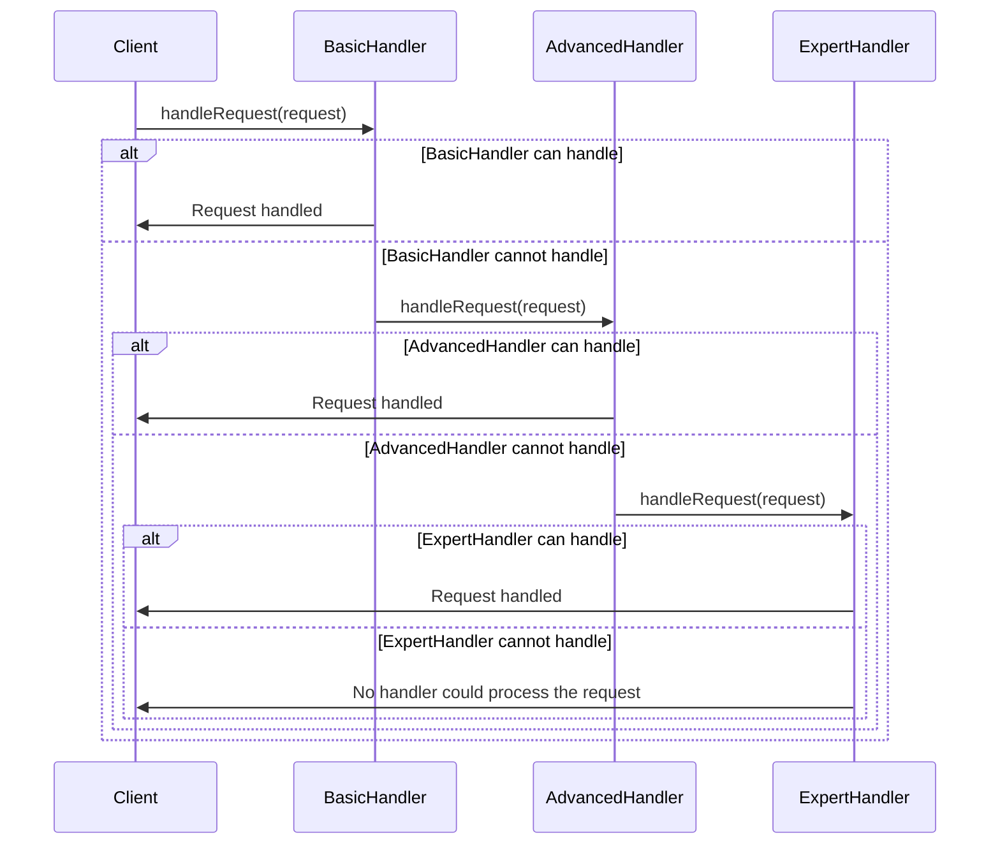

## 6.1 Chain of Responsibility Pattern

The Chain of Responsibility pattern is a behavioral design pattern that allows requests to be passed along a chain of handlers. Each handler in the chain can either process the request or pass it to the next handler. This pattern promotes loose coupling in your code by allowing a request to be handled by any handler in the chain without the sender needing to know which handler will process it.

### Intent

The primary intent of the Chain of Responsibility pattern is to decouple the sender of a request from its receiver by giving multiple objects a chance to handle the request. This pattern is particularly useful when you want to avoid coupling the sender of a request to its receiver, allowing more than one object to handle the request.

### Key Participants

1. **Handler**: Defines an interface for handling requests and optionally implements the successor link.
2. **ConcreteHandler**: Handles requests it is responsible for. It can access its successor and pass the request along the chain if it cannot handle it.
3. **Client**: Initiates the request to a handler in the chain.

### Applicability

Use the Chain of Responsibility pattern when:
- More than one object may handle a request, and the handler is not known a priori.
- You want to issue a request to one of several objects without specifying the receiver explicitly.
- The set of objects that can handle a request should be specified dynamically.

### Implementing Chains with Classes and Interfaces

In Kotlin, we can implement the Chain of Responsibility pattern using classes and interfaces. Let's start by defining a simple example where we have a chain of handlers that process requests for different levels of support.

#### Step 1: Define the Handler Interface

We begin by defining an interface for our handlers. This interface will declare a method for handling requests and a method for setting the next handler in the chain.

```kotlin
interface SupportHandler {
    fun handleRequest(request: SupportRequest)
    fun setNextHandler(nextHandler: SupportHandler)
}
```

#### Step 2: Create Concrete Handlers

Next, we create concrete handlers that implement the `SupportHandler` interface. Each handler will process requests it is responsible for and pass unhandled requests to the next handler in the chain.

```kotlin
class BasicSupportHandler : SupportHandler {
    private var nextHandler: SupportHandler? = null

    override fun handleRequest(request: SupportRequest) {
        if (request.level == SupportLevel.BASIC) {
            println("BasicSupportHandler: Handling basic support request.")
        } else {
            nextHandler?.handleRequest(request)
        }
    }

    override fun setNextHandler(nextHandler: SupportHandler) {
        this.nextHandler = nextHandler
    }
}

class AdvancedSupportHandler : SupportHandler {
    private var nextHandler: SupportHandler? = null

    override fun handleRequest(request: SupportRequest) {
        if (request.level == SupportLevel.ADVANCED) {
            println("AdvancedSupportHandler: Handling advanced support request.")
        } else {
            nextHandler?.handleRequest(request)
        }
    }

    override fun setNextHandler(nextHandler: SupportHandler) {
        this.nextHandler = nextHandler
    }
}

class ExpertSupportHandler : SupportHandler {
    private var nextHandler: SupportHandler? = null

    override fun handleRequest(request: SupportRequest) {
        if (request.level == SupportLevel.EXPERT) {
            println("ExpertSupportHandler: Handling expert support request.")
        } else {
            println("ExpertSupportHandler: Cannot handle request, no next handler.")
        }
    }

    override fun setNextHandler(nextHandler: SupportHandler) {
        this.nextHandler = nextHandler
    }
}
```

#### Step 3: Define the SupportRequest Class

We need a class to represent the requests that will be passed along the chain. This class will include a property to indicate the level of support required.

```kotlin
data class SupportRequest(val level: SupportLevel)

enum class SupportLevel {
    BASIC, ADVANCED, EXPERT
}
```

#### Step 4: Assemble the Chain

Finally, we assemble the chain of handlers in the client code. The client will initiate a request, and the chain will process it.

```kotlin
fun main() {
    val basicHandler = BasicSupportHandler()
    val advancedHandler = AdvancedSupportHandler()
    val expertHandler = ExpertSupportHandler()

    basicHandler.setNextHandler(advancedHandler)
    advancedHandler.setNextHandler(expertHandler)

    val request = SupportRequest(SupportLevel.ADVANCED)
    basicHandler.handleRequest(request)
}
```

### Using Higher-Order Functions

Kotlin's support for higher-order functions allows us to implement the Chain of Responsibility pattern in a more functional style. This approach can lead to more concise and flexible code.

#### Step 1: Define a Function Type for Handlers

We start by defining a function type that represents a handler. This function type takes a `SupportRequest` and returns a boolean indicating whether the request was handled.

```kotlin
typealias SupportHandlerFunction = (SupportRequest) -> Boolean
```

#### Step 2: Create Handler Functions

Next, we create handler functions that match the `SupportHandlerFunction` type. Each function will process requests it is responsible for and return `true` if it handled the request.

```kotlin
val basicSupportHandler: SupportHandlerFunction = { request ->
    if (request.level == SupportLevel.BASIC) {
        println("BasicSupportHandler: Handling basic support request.")
        true
    } else {
        false
    }
}

val advancedSupportHandler: SupportHandlerFunction = { request ->
    if (request.level == SupportLevel.ADVANCED) {
        println("AdvancedSupportHandler: Handling advanced support request.")
        true
    } else {
        false
    }
}

val expertSupportHandler: SupportHandlerFunction = { request ->
    if (request.level == SupportLevel.EXPERT) {
        println("ExpertSupportHandler: Handling expert support request.")
        true
    } else {
        false
    }
}
```

#### Step 3: Create a Chain Function

We create a function that takes a list of handlers and a request, and processes the request by passing it to each handler in the list until one of them handles it.

```kotlin
fun processRequest(handlers: List<SupportHandlerFunction>, request: SupportRequest) {
    for (handler in handlers) {
        if (handler(request)) {
            return
        }
    }
    println("No handler could process the request.")
}
```

#### Step 4: Use the Chain Function

Finally, we use the `processRequest` function to process a request with a chain of handlers.

```kotlin
fun main() {
    val handlers = listOf(basicSupportHandler, advancedSupportHandler, expertSupportHandler)
    val request = SupportRequest(SupportLevel.ADVANCED)
    processRequest(handlers, request)
}
```

### Visualizing the Chain of Responsibility Pattern

To better understand the flow of requests through the chain, let's visualize the Chain of Responsibility pattern using a sequence diagram.



**Diagram Explanation**: The sequence diagram illustrates the flow of a request through the chain of handlers. The request is passed from the client to the first handler, and then along the chain until it is handled or no handler can process it.

### Design Considerations

When implementing the Chain of Responsibility pattern, consider the following:

- **Flexibility**: The pattern allows you to add or remove handlers dynamically, providing flexibility in handling requests.
- **Responsibility**: Ensure that each handler has a clear responsibility and that the chain is ordered correctly.
- **Termination**: Consider what happens if no handler can process the request. You may need a default handler or a way to notify the client.

### Differences and Similarities

The Chain of Responsibility pattern is often compared to the **Command** pattern. While both involve processing requests, the Command pattern encapsulates a request as an object, whereas the Chain of Responsibility pattern passes the request along a chain of handlers. Additionally, the Chain of Responsibility pattern is similar to the **Decorator** pattern in that both involve a chain of objects, but the Decorator pattern focuses on adding behavior to objects, while the Chain of Responsibility pattern focuses on handling requests.

### Try It Yourself

Experiment with the Chain of Responsibility pattern by modifying the code examples. Here are some ideas:

- **Add a new handler**: Create a new handler for a different level of support and add it to the chain.
- **Change the order of handlers**: Rearrange the handlers in the chain and observe how it affects request processing.
- **Use a different request type**: Modify the `SupportRequest` class to include additional information and update the handlers accordingly.

### Knowledge Check

- **What is the primary intent of the Chain of Responsibility pattern?**
- **How does the Chain of Responsibility pattern promote loose coupling?**
- **What are some design considerations when implementing this pattern?**

### Embrace the Journey

Remember, mastering design patterns is a journey. As you continue to explore and implement patterns like the Chain of Responsibility, you'll gain valuable insights into building flexible and maintainable software. Keep experimenting, stay curious, and enjoy the process!

## Quiz Time!



### What is the primary intent of the Chain of Responsibility pattern?

- [x] To decouple the sender of a request from its receiver by allowing multiple objects to handle the request.
- [ ] To encapsulate a request as an object.
- [ ] To add behavior to objects dynamically.
- [ ] To provide a simplified interface to a complex subsystem.

> **Explanation:** The Chain of Responsibility pattern aims to decouple the sender of a request from its receiver by allowing multiple objects to handle the request.

### How does the Chain of Responsibility pattern promote loose coupling?

- [x] By allowing requests to be handled by any handler in the chain without the sender needing to know which handler will process it.
- [ ] By encapsulating requests as objects.
- [ ] By adding behavior to objects dynamically.
- [ ] By providing a simplified interface to a complex subsystem.

> **Explanation:** The pattern promotes loose coupling by allowing requests to be handled by any handler in the chain without the sender needing to know which handler will process it.

### What is a key participant in the Chain of Responsibility pattern?

- [x] Handler
- [ ] Command
- [ ] Decorator
- [ ] Facade

> **Explanation:** The Handler is a key participant in the Chain of Responsibility pattern, defining an interface for handling requests.

### What should a handler do if it cannot process a request?

- [x] Pass the request to the next handler in the chain.
- [ ] Throw an exception.
- [ ] Return a default value.
- [ ] Log an error and terminate.

> **Explanation:** If a handler cannot process a request, it should pass the request to the next handler in the chain.

### Which Kotlin feature can be used to implement the Chain of Responsibility pattern in a more functional style?

- [x] Higher-order functions
- [ ] Extension functions
- [ ] Data classes
- [ ] Sealed classes

> **Explanation:** Higher-order functions can be used to implement the Chain of Responsibility pattern in a more functional style.

### What is a potential drawback of the Chain of Responsibility pattern?

- [x] The request may go unhandled if no handler can process it.
- [ ] It tightly couples the sender and receiver.
- [ ] It requires encapsulating requests as objects.
- [ ] It adds behavior to objects dynamically.

> **Explanation:** A potential drawback is that the request may go unhandled if no handler in the chain can process it.

### How can you ensure that a request is always handled in the Chain of Responsibility pattern?

- [x] Include a default handler at the end of the chain.
- [ ] Use a try-catch block around the request.
- [ ] Log the request and terminate.
- [ ] Use a singleton handler.

> **Explanation:** Including a default handler at the end of the chain ensures that a request is always handled.

### What is a similarity between the Chain of Responsibility and Decorator patterns?

- [x] Both involve a chain of objects.
- [ ] Both encapsulate requests as objects.
- [ ] Both provide a simplified interface to a complex subsystem.
- [ ] Both add behavior to objects dynamically.

> **Explanation:** Both patterns involve a chain of objects, but they serve different purposes.

### In the provided Kotlin example, what does the `processRequest` function do?

- [x] It processes a request by passing it to each handler in the list until one of them handles it.
- [ ] It encapsulates a request as an object.
- [ ] It adds behavior to objects dynamically.
- [ ] It provides a simplified interface to a complex subsystem.

> **Explanation:** The `processRequest` function processes a request by passing it to each handler in the list until one of them handles it.

### True or False: The Chain of Responsibility pattern can be implemented using Kotlin's higher-order functions.

- [x] True
- [ ] False

> **Explanation:** True. Kotlin's higher-order functions can be used to implement the Chain of Responsibility pattern in a functional style.


