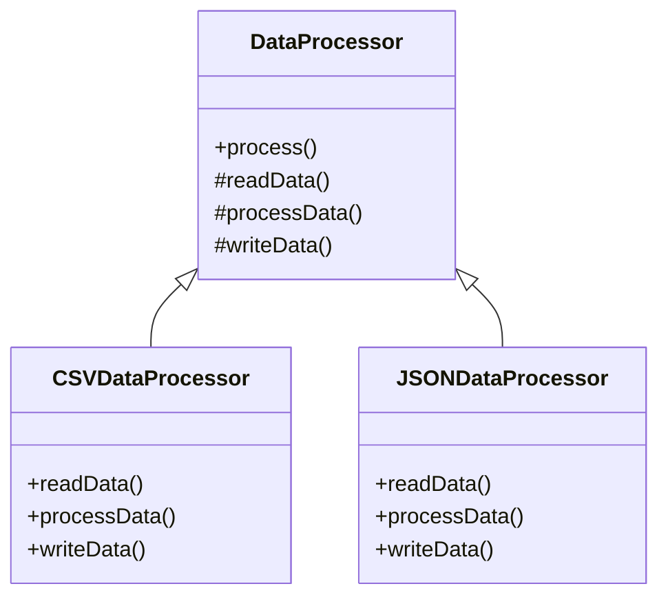

## 6.10 Template Method Pattern

The Template Method Pattern is a behavioral design pattern that defines the skeleton of an algorithm in a method, deferring some steps to subclasses. It allows subclasses to redefine certain steps of an algorithm without changing its structure. This pattern is particularly useful when you have multiple classes that share a similar algorithm but differ in some specific steps.

### Intent

The primary intent of the Template Method Pattern is to define the overall structure of an algorithm while allowing subclasses to override specific steps. This pattern promotes code reuse and enforces a standard structure for algorithms, ensuring consistency across different implementations.

### Key Participants

1. **Abstract Class**: This class defines the template method and declares abstract methods for steps that need to be implemented by subclasses.
2. **Concrete Subclasses**: These classes implement the abstract methods defined in the abstract class, providing specific behavior for each step.

### Applicability

Use the Template Method Pattern when:

- You have multiple classes that implement variations of the same algorithm.
- You want to enforce a standard structure for an algorithm while allowing flexibility in specific steps.
- You want to avoid code duplication by sharing common algorithm steps across multiple classes.

### Sample Code Snippet

Let's explore how to implement the Template Method Pattern in Kotlin using abstract classes and open functions. We'll create a simple example of a data processing algorithm that reads data, processes it, and writes the results.

```kotlin
// Abstract class defining the template method
abstract class DataProcessor {

    // Template method defining the skeleton of the algorithm
    fun process() {
        readData()
        processData()
        writeData()
    }

    // Abstract methods to be implemented by subclasses
    abstract fun readData()
    abstract fun processData()
    abstract fun writeData()
}

// Concrete subclass implementing the abstract methods
class CSVDataProcessor : DataProcessor() {

    override fun readData() {
        println("Reading data from CSV file")
    }

    override fun processData() {
        println("Processing CSV data")
    }

    override fun writeData() {
        println("Writing processed data to CSV file")
    }
}

// Another concrete subclass for JSON data processing
class JSONDataProcessor : DataProcessor() {

    override fun readData() {
        println("Reading data from JSON file")
    }

    override fun processData() {
        println("Processing JSON data")
    }

    override fun writeData() {
        println("Writing processed data to JSON file")
    }
}

fun main() {
    val csvProcessor = CSVDataProcessor()
    csvProcessor.process()

    val jsonProcessor = JSONDataProcessor()
    jsonProcessor.process()
}
```

In this example, the `DataProcessor` abstract class defines the `process` method, which serves as the template method. The `CSVDataProcessor` and `JSONDataProcessor` subclasses implement the abstract methods to provide specific behavior for reading, processing, and writing data.

### Design Considerations

- **When to Use**: The Template Method Pattern is ideal when you have a common algorithm structure but need flexibility in specific steps. It promotes code reuse and consistency across different implementations.
- **Kotlin-Specific Features**: Kotlin's support for abstract classes and open functions makes it easy to implement the Template Method Pattern. Use `abstract` to define methods that must be implemented by subclasses and `open` for methods that can be optionally overridden.
- **Pitfalls**: Be cautious of overusing this pattern, as it can lead to a rigid class hierarchy. Ensure that the algorithm's structure is stable and unlikely to change frequently.

### Differences and Similarities

The Template Method Pattern is often confused with the Strategy Pattern. While both patterns allow for variations in behavior, the Template Method Pattern defines the algorithm's structure in a superclass, whereas the Strategy Pattern delegates the behavior to separate strategy classes.

### Implementing Hooks and Callbacks

Hooks and callbacks are optional methods that subclasses can override to extend or modify the behavior of the template method. They provide additional flexibility in the Template Method Pattern.

#### Hooks

Hooks are methods with default implementations in the abstract class. Subclasses can override these methods to provide additional behavior.

```kotlin
abstract class DataProcessorWithHooks {

    fun process() {
        readData()
        processData()
        writeData()
        afterProcessing() // Hook method
    }

    abstract fun readData()
    abstract fun processData()
    abstract fun writeData()

    // Hook method with a default implementation
    open fun afterProcessing() {
        // Default behavior
    }
}

class XMLDataProcessor : DataProcessorWithHooks() {

    override fun readData() {
        println("Reading data from XML file")
    }

    override fun processData() {
        println("Processing XML data")
    }

    override fun writeData() {
        println("Writing processed data to XML file")
    }

    override fun afterProcessing() {
        println("Performing additional tasks after processing XML data")
    }
}
```

In this example, the `afterProcessing` method is a hook that can be overridden by subclasses to perform additional tasks after the main processing steps.

#### Callbacks

Callbacks are methods that subclasses can define to be called at specific points in the template method. They allow subclasses to inject custom behavior without altering the template method's structure.

```kotlin
abstract class DataProcessorWithCallbacks {

    fun process() {
        readData()
        processData()
        writeData()
        onProcessingComplete() // Callback method
    }

    abstract fun readData()
    abstract fun processData()
    abstract fun writeData()

    // Callback method to be implemented by subclasses
    abstract fun onProcessingComplete()
}

class HTMLDataProcessor : DataProcessorWithCallbacks() {

    override fun readData() {
        println("Reading data from HTML file")
    }

    override fun processData() {
        println("Processing HTML data")
    }

    override fun writeData() {
        println("Writing processed data to HTML file")
    }

    override fun onProcessingComplete() {
        println("HTML data processing complete")
    }
}
```

In this example, the `onProcessingComplete` method is a callback that subclasses must implement to handle the completion of the processing steps.

### Visualizing the Template Method Pattern

To better understand the Template Method Pattern, let's visualize the relationship between the abstract class and its subclasses using a class diagram.



In this diagram, the `DataProcessor` class defines the template method `process`, which calls the abstract methods `readData`, `processData`, and `writeData`. The `CSVDataProcessor` and `JSONDataProcessor` classes implement these abstract methods, providing specific behavior for each step.

### Knowledge Check

Before we move on, let's review some key points about the Template Method Pattern:

- The pattern defines the skeleton of an algorithm in a method, deferring some steps to subclasses.
- Abstract classes and open functions are used to implement the pattern in Kotlin.
- Hooks and callbacks provide additional flexibility by allowing subclasses to extend or modify the template method's behavior.

### Try It Yourself

Now that we've covered the basics of the Template Method Pattern, try modifying the code examples to experiment with different behaviors. For instance, you could:

- Add a new subclass for processing XML data.
- Implement additional hooks or callbacks to extend the algorithm's functionality.
- Modify the template method to include error handling or logging.

### Embrace the Journey

Remember, mastering design patterns is an ongoing journey. As you continue to explore the Template Method Pattern, you'll discover new ways to apply it in your projects. Keep experimenting, stay curious, and enjoy the process!

### References and Links

For further reading on the Template Method Pattern and other design patterns, consider the following resources:

- [Design Patterns: Elements of Reusable Object-Oriented Software](https://en.wikipedia.org/wiki/Design_Patterns) by Erich Gamma, Richard Helm, Ralph Johnson, and John Vlissides
- [Kotlin Documentation](https://kotlinlang.org/docs/home.html) for more on abstract classes and open functions
- [Refactoring Guru: Template Method Pattern](https://refactoring.guru/design-patterns/template-method)

## Quiz Time!



### What is the primary intent of the Template Method Pattern?

- [x] To define the skeleton of an algorithm while allowing subclasses to override specific steps
- [ ] To encapsulate a family of algorithms
- [ ] To provide a simplified interface to a complex subsystem
- [ ] To separate abstraction from implementation

> **Explanation:** The Template Method Pattern defines the skeleton of an algorithm, allowing subclasses to override specific steps without changing the algorithm's structure.

### Which Kotlin feature is commonly used to implement the Template Method Pattern?

- [x] Abstract classes and open functions
- [ ] Data classes and sealed classes
- [ ] Extension functions and properties
- [ ] Companion objects and object declarations

> **Explanation:** Abstract classes and open functions are used to define the template method and allow subclasses to implement specific steps.

### What is a hook in the context of the Template Method Pattern?

- [x] A method with a default implementation that can be overridden by subclasses
- [ ] A method that must be implemented by subclasses
- [ ] A method that provides a simplified interface to a complex subsystem
- [ ] A method that separates abstraction from implementation

> **Explanation:** A hook is a method with a default implementation that subclasses can override to provide additional behavior.

### What is a callback in the context of the Template Method Pattern?

- [x] A method that subclasses can define to be called at specific points in the template method
- [ ] A method that must be implemented by subclasses
- [ ] A method that provides a simplified interface to a complex subsystem
- [ ] A method that separates abstraction from implementation

> **Explanation:** A callback is a method that subclasses can define to inject custom behavior at specific points in the template method.

### How does the Template Method Pattern promote code reuse?

- [x] By defining common algorithm steps in a superclass and allowing subclasses to implement specific steps
- [ ] By encapsulating a family of algorithms
- [ ] By providing a simplified interface to a complex subsystem
- [ ] By separating abstraction from implementation

> **Explanation:** The Template Method Pattern promotes code reuse by defining common algorithm steps in a superclass and allowing subclasses to implement specific steps.

### Which of the following is NOT a key participant in the Template Method Pattern?

- [ ] Abstract Class
- [ ] Concrete Subclass
- [x] Strategy Interface
- [ ] Template Method

> **Explanation:** The Strategy Interface is not a participant in the Template Method Pattern; it is part of the Strategy Pattern.

### What is the difference between a hook and a callback in the Template Method Pattern?

- [x] Hooks have default implementations, while callbacks are methods subclasses must implement
- [ ] Hooks are methods subclasses must implement, while callbacks have default implementations
- [ ] Hooks provide a simplified interface, while callbacks encapsulate algorithms
- [ ] Hooks separate abstraction, while callbacks provide a simplified interface

> **Explanation:** Hooks have default implementations that can be overridden, whereas callbacks are methods that subclasses must implement.

### When should you use the Template Method Pattern?

- [x] When you have a common algorithm structure but need flexibility in specific steps
- [ ] When you need to encapsulate a family of algorithms
- [ ] When you need to provide a simplified interface to a complex subsystem
- [ ] When you need to separate abstraction from implementation

> **Explanation:** The Template Method Pattern is used when you have a common algorithm structure but need flexibility in specific steps.

### True or False: The Template Method Pattern and Strategy Pattern are the same.

- [x] False
- [ ] True

> **Explanation:** The Template Method Pattern and Strategy Pattern are different. The Template Method Pattern defines an algorithm's structure in a superclass, while the Strategy Pattern delegates behavior to separate strategy classes.

### What is the role of the template method in the Template Method Pattern?

- [x] To define the overall structure of an algorithm and call abstract methods for specific steps
- [ ] To encapsulate a family of algorithms
- [ ] To provide a simplified interface to a complex subsystem
- [ ] To separate abstraction from implementation

> **Explanation:** The template method defines the overall structure of an algorithm and calls abstract methods for specific steps that subclasses implement.



---
