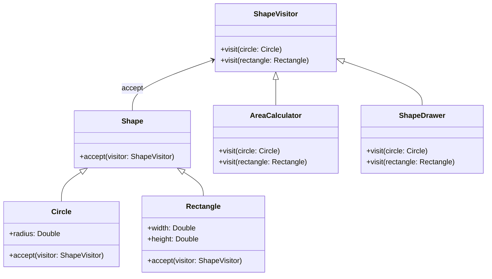

## 6.11 Visitor Pattern

In the realm of software design patterns, the Visitor Pattern stands out as a powerful tool for separating algorithms from the objects on which they operate. This separation allows you to add new operations to existing object structures without modifying the structures themselves. In this section, we will delve into the intricacies of the Visitor Pattern, explore its implementation in Kotlin, and examine its advantages and potential pitfalls.

### Intent

The primary intent of the Visitor Pattern is to define a new operation without changing the classes of the elements on which it operates. This is particularly useful when dealing with complex object structures that require multiple operations, as it allows you to add new operations without altering the existing class hierarchy.

### Key Participants

1. **Visitor**: Declares a visit operation for each class of ConcreteElement in the object structure.
2. **ConcreteVisitor**: Implements each operation declared by the Visitor.
3. **Element**: Defines an accept operation that takes a visitor as an argument.
4. **ConcreteElement**: Implements the accept operation.
5. **ObjectStructure**: Can enumerate its elements and provide a high-level interface to allow the visitor to visit its elements.

### Applicability

The Visitor Pattern is applicable when:

- You need to perform operations across a set of objects with different interfaces.
- The object structure is stable, but you need to define new operations.
- You want to avoid polluting the object classes with unrelated operations.

### Implementing Visitors with Double Dispatch

Double dispatch is a technique that allows a function to be dynamically dispatched based on the runtime types of two objects. In the Visitor Pattern, double dispatch ensures that the correct visit operation is called for each element type.

#### Example Implementation

Let's consider a simple example where we have a hierarchy of shapes, and we want to perform different operations on them, such as calculating the area and drawing them.

```kotlin
// Define the Visitor interface
interface ShapeVisitor {
    fun visit(circle: Circle)
    fun visit(rectangle: Rectangle)
}

// Define the Element interface
interface Shape {
    fun accept(visitor: ShapeVisitor)
}

// ConcreteElement: Circle
class Circle(val radius: Double) : Shape {
    override fun accept(visitor: ShapeVisitor) {
        visitor.visit(this)
    }
}

// ConcreteElement: Rectangle
class Rectangle(val width: Double, val height: Double) : Shape {
    override fun accept(visitor: ShapeVisitor) {
        visitor.visit(this)
    }
}

// ConcreteVisitor: AreaCalculator
class AreaCalculator : ShapeVisitor {
    override fun visit(circle: Circle) {
        val area = Math.PI * circle.radius * circle.radius
        println("Area of Circle: $area")
    }

    override fun visit(rectangle: Rectangle) {
        val area = rectangle.width * rectangle.height
        println("Area of Rectangle: $area")
    }
}

// ConcreteVisitor: ShapeDrawer
class ShapeDrawer : ShapeVisitor {
    override fun visit(circle: Circle) {
        println("Drawing Circle with radius ${circle.radius}")
    }

    override fun visit(rectangle: Rectangle) {
        println("Drawing Rectangle with width ${rectangle.width} and height ${rectangle.height}")
    }
}

// Usage
fun main() {
    val shapes: List<Shape> = listOf(Circle(5.0), Rectangle(4.0, 6.0))
    val areaCalculator = AreaCalculator()
    val shapeDrawer = ShapeDrawer()

    shapes.forEach { shape ->
        shape.accept(areaCalculator)
        shape.accept(shapeDrawer)
    }
}
```

### Using Sealed Classes for Better Type Safety

Kotlin's sealed classes provide a way to restrict the class hierarchy, ensuring that all subclasses are known at compile time. This feature can be leveraged to enhance type safety in the Visitor Pattern.

#### Example with Sealed Classes

```kotlin
// Define a sealed class hierarchy for shapes
sealed class Shape {
    abstract fun accept(visitor: ShapeVisitor)
}

class Circle(val radius: Double) : Shape() {
    override fun accept(visitor: ShapeVisitor) {
        visitor.visit(this)
    }
}

class Rectangle(val width: Double, val height: Double) : Shape() {
    override fun accept(visitor: ShapeVisitor) {
        visitor.visit(this)
    }
}

// The rest of the implementation remains the same
```

By using sealed classes, we gain the advantage of exhaustive `when` expressions, which can be particularly useful when implementing visitors.

### Functional Alternatives with Pattern Matching

Kotlin's pattern matching capabilities, particularly with `when` expressions, offer a functional alternative to the traditional Visitor Pattern. This approach can be more concise and easier to understand in some cases.

#### Example with Pattern Matching

```kotlin
fun calculateArea(shape: Shape): Double = when (shape) {
    is Circle -> Math.PI * shape.radius * shape.radius
    is Rectangle -> shape.width * shape.height
}

fun drawShape(shape: Shape) = when (shape) {
    is Circle -> println("Drawing Circle with radius ${shape.radius}")
    is Rectangle -> println("Drawing Rectangle with width ${shape.width} and height ${shape.height}")
}

// Usage
fun main() {
    val shapes: List<Shape> = listOf(Circle(5.0), Rectangle(4.0, 6.0))

    shapes.forEach { shape ->
        println("Area: ${calculateArea(shape)}")
        drawShape(shape)
    }
}
```

### Design Considerations

When using the Visitor Pattern, consider the following:

- **Complexity**: The Visitor Pattern can introduce additional complexity, especially when dealing with large object structures.
- **Maintainability**: While it allows for easy addition of new operations, adding new element types requires changes to all existing visitors.
- **Kotlin Features**: Leverage Kotlin's sealed classes and pattern matching to enhance type safety and readability.

### Differences and Similarities

The Visitor Pattern is often compared to other behavioral patterns, such as the Strategy Pattern. While both patterns allow for changing behavior, the Visitor Pattern is specifically designed for operations across a set of objects with different interfaces.

### Try It Yourself

Experiment with the code examples provided. Try adding a new shape, such as a `Triangle`, and implement the necessary visitor methods to calculate its area and draw it. This exercise will help reinforce your understanding of the Visitor Pattern and its implementation in Kotlin.

### Visualizing the Visitor Pattern

Below is a class diagram illustrating the relationships between the components of the Visitor Pattern.



### Knowledge Check

- What is the primary intent of the Visitor Pattern?
- How does double dispatch work in the context of the Visitor Pattern?
- What are the advantages of using sealed classes with the Visitor Pattern?
- How can pattern matching be used as a functional alternative to the Visitor Pattern?

### Embrace the Journey

Remember, mastering design patterns is a journey. The Visitor Pattern is just one of many tools in your software design toolkit. As you continue to explore and apply these patterns, you'll gain a deeper understanding of how to build robust, maintainable software. Keep experimenting, stay curious, and enjoy the journey!

## Quiz Time!



### What is the primary intent of the Visitor Pattern?

- [x] To define a new operation without changing the classes of the elements on which it operates.
- [ ] To encapsulate a request as an object.
- [ ] To provide a way to access the elements of an aggregate object sequentially.
- [ ] To define a family of algorithms, encapsulate each one, and make them interchangeable.

> **Explanation:** The Visitor Pattern allows you to define new operations without altering the classes of the elements it operates on.

### How does double dispatch work in the context of the Visitor Pattern?

- [x] It allows a function to be dynamically dispatched based on the runtime types of two objects.
- [ ] It allows a function to be dispatched based on the compile-time types of two objects.
- [ ] It allows a function to be dispatched based on the runtime type of a single object.
- [ ] It allows a function to be dispatched based on the compile-time type of a single object.

> **Explanation:** Double dispatch ensures that the correct visit operation is called for each element type by considering the runtime types of both the visitor and the element.

### What are the advantages of using sealed classes with the Visitor Pattern?

- [x] They provide better type safety and allow for exhaustive `when` expressions.
- [ ] They allow for dynamic type checking at runtime.
- [ ] They enable the use of reflection for dynamic method invocation.
- [ ] They simplify the implementation of the Visitor Pattern by removing the need for interfaces.

> **Explanation:** Sealed classes restrict the class hierarchy, allowing for better type safety and exhaustive `when` expressions.

### How can pattern matching be used as a functional alternative to the Visitor Pattern?

- [x] By using `when` expressions to perform operations based on the type of the object.
- [ ] By using reflection to dynamically invoke methods on objects.
- [ ] By using interfaces to define operations for each type of object.
- [ ] By using inheritance to override methods in subclasses.

> **Explanation:** Pattern matching with `when` expressions allows you to perform operations based on the type of the object, providing a functional alternative to the Visitor Pattern.

### Which of the following is a key participant in the Visitor Pattern?

- [x] Visitor
- [ ] Adapter
- [ ] Facade
- [ ] Proxy

> **Explanation:** The Visitor is a key participant in the Visitor Pattern, responsible for defining visit operations for each class of ConcreteElement.

### What is a potential drawback of the Visitor Pattern?

- [x] Adding new element types requires changes to all existing visitors.
- [ ] It tightly couples the visitor to the elements it operates on.
- [ ] It makes it difficult to add new operations.
- [ ] It increases the complexity of the object structure.

> **Explanation:** While the Visitor Pattern allows for easy addition of new operations, adding new element types requires changes to all existing visitors.

### In the Visitor Pattern, what role does the ObjectStructure play?

- [x] It can enumerate its elements and provide a high-level interface to allow the visitor to visit its elements.
- [ ] It defines the operations that can be performed on each element.
- [ ] It implements the visit operations for each element type.
- [ ] It provides a simplified interface to a complex subsystem.

> **Explanation:** The ObjectStructure can enumerate its elements and provide a high-level interface to allow the visitor to visit its elements.

### Which Kotlin feature can enhance the implementation of the Visitor Pattern?

- [x] Sealed Classes
- [ ] Companion Objects
- [ ] Extension Functions
- [ ] Data Classes

> **Explanation:** Sealed classes enhance the implementation of the Visitor Pattern by providing better type safety and allowing for exhaustive `when` expressions.

### What is the purpose of the accept operation in the Visitor Pattern?

- [x] To allow a visitor to perform an operation on an element.
- [ ] To encapsulate a request as an object.
- [ ] To provide a way to access the elements of an aggregate object sequentially.
- [ ] To define a family of algorithms, encapsulate each one, and make them interchangeable.

> **Explanation:** The accept operation allows a visitor to perform an operation on an element.

### True or False: The Visitor Pattern is best suited for scenarios where the object structure is frequently changing.

- [ ] True
- [x] False

> **Explanation:** The Visitor Pattern is best suited for scenarios where the object structure is stable, but new operations need to be defined.


