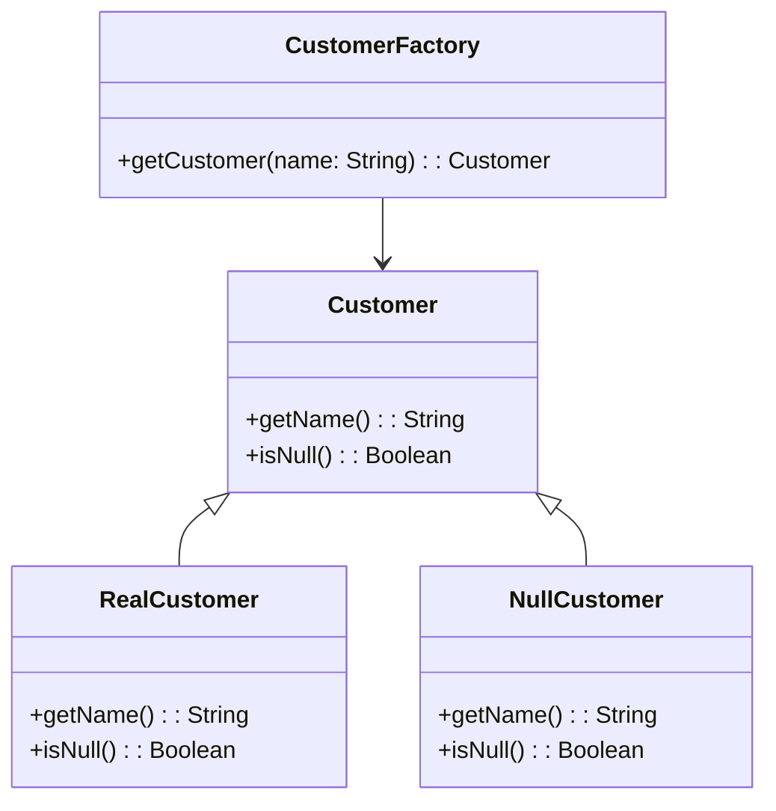

## 6.12 Null Object Pattern

In the realm of software design, handling null references has always been a challenge. The Null Object Pattern offers a robust solution by providing default objects that encapsulate the absence of a value, thereby avoiding null references altogether. This pattern is particularly powerful in Kotlin, thanks to its null safety features and the `object` keyword. In this section, we'll explore the Null Object Pattern in depth, demonstrating how it can be effectively implemented in Kotlin to enhance code reliability and maintainability.

### Intent

The Null Object Pattern aims to eliminate the need for null checks by providing a default behavior when a "null" value is expected. Instead of returning `null`, a null object is returned, which implements the same interface as the expected object but with default, often do-nothing, behavior. This pattern simplifies client code by removing the need for null checks and handling null values explicitly.

### Key Participants

1. **Abstract Object**: Defines the interface or abstract class that the real and null objects will implement.
2. **Real Object**: Implements the interface with actual behavior.
3. **Null Object**: Implements the interface with default or no-op behavior, representing the absence of a real object.

### Applicability

Use the Null Object Pattern when:

- You want to avoid null checks and simplify client code.
- A default behavior can be defined for the absence of an object.
- You aim to adhere to the Open/Closed Principle by extending behavior without modifying existing code.

### Sample Code Snippet

Let's consider a scenario where we have a `Customer` interface with two implementations: `RealCustomer` and `NullCustomer`. The `NullCustomer` provides default behavior when a customer is not found.

```kotlin
interface Customer {
    fun getName(): String
    fun isNull(): Boolean
}

class RealCustomer(private val name: String) : Customer {
    override fun getName(): String = name
    override fun isNull(): Boolean = false
}

object NullCustomer : Customer {
    override fun getName(): String = "Not Available"
    override fun isNull(): Boolean = true
}

class CustomerFactory {
    private val customers = listOf("Alice", "Bob", "Charlie")

    fun getCustomer(name: String): Customer {
        return if (customers.contains(name)) {
            RealCustomer(name)
        } else {
            NullCustomer
        }
    }
}

fun main() {
    val factory = CustomerFactory()

    val customer1 = factory.getCustomer("Alice")
    val customer2 = factory.getCustomer("Dave")

    println("Customer1: ${customer1.getName()}")
    println("Customer2: ${customer2.getName()}")
}
```

In this example, `NullCustomer` acts as a placeholder for non-existent customers, providing a default name and indicating its null status with `isNull()`.

### Design Considerations

- **Kotlin's Null Safety**: Kotlin's type system distinguishes between nullable and non-nullable types, reducing the likelihood of null pointer exceptions. The Null Object Pattern complements this by providing a non-nullable alternative to null values.
- **Use of `object`**: The `object` keyword in Kotlin is ideal for implementing the Null Object Pattern, as it creates a singleton instance, ensuring only one instance of the null object exists.
- **Performance**: Using null objects can improve performance by reducing the need for null checks and exception handling.

### Differences and Similarities

The Null Object Pattern is often compared to the Singleton Pattern due to the use of the `object` keyword in Kotlin. However, while the Singleton Pattern ensures a single instance of a class, the Null Object Pattern focuses on providing a default behavior for absent objects.

### Using Kotlin's `object` and Null Safety Features

Kotlin's `object` keyword is a powerful tool for implementing the Null Object Pattern. It allows us to define a single instance of a class that can be accessed globally. This is particularly useful for null objects, which typically do not need multiple instances.

#### Example: Implementing a Null Logger

Consider a logging system where we want to avoid null checks for loggers. We can define a `Logger` interface and provide a `NullLogger` implementation using the `object` keyword.

```kotlin
interface Logger {
    fun log(message: String)
}

class ConsoleLogger : Logger {
    override fun log(message: String) {
        println("Log: $message")
    }
}

object NullLogger : Logger {
    override fun log(message: String) {
        // Do nothing
    }
}

fun getLogger(isLoggingEnabled: Boolean): Logger {
    return if (isLoggingEnabled) {
        ConsoleLogger()
    } else {
        NullLogger
    }
}

fun main() {
    val logger = getLogger(false)
    logger.log("This message will not be logged.")
}
```

In this example, `NullLogger` provides a no-op implementation of the `Logger` interface, allowing us to avoid null checks and simplify the logging logic.

### Implementing Default Behaviors

The Null Object Pattern is not just about avoiding null references; it's also about providing meaningful default behaviors. This can be particularly useful in scenarios where a default action is preferable to doing nothing.

#### Example: Default Payment Processor

Imagine an e-commerce application where we need to process payments. We can define a `PaymentProcessor` interface and provide a `NullPaymentProcessor` that logs a message instead of processing a payment.

```kotlin
interface PaymentProcessor {
    fun process(amount: Double)
}

class RealPaymentProcessor : PaymentProcessor {
    override fun process(amount: Double) {
        println("Processing payment of $$amount")
    }
}

object NullPaymentProcessor : PaymentProcessor {
    override fun process(amount: Double) {
        println("No payment processor available. Cannot process $$amount")
    }
}

fun getPaymentProcessor(isPaymentEnabled: Boolean): PaymentProcessor {
    return if (isPaymentEnabled) {
        RealPaymentProcessor()
    } else {
        NullPaymentProcessor
    }
}

fun main() {
    val paymentProcessor = getPaymentProcessor(false)
    paymentProcessor.process(100.0)
}
```

Here, `NullPaymentProcessor` provides a default behavior by logging a message, ensuring that the absence of a real payment processor does not lead to a null reference or unhandled exception.

### Visualizing the Null Object Pattern

To better understand the Null Object Pattern, let's visualize the relationships between the components using a class diagram.



**Diagram Description**: This class diagram illustrates the relationship between the `Customer` interface, its implementations (`RealCustomer` and `NullCustomer`), and the `CustomerFactory` that provides instances of these classes.

### Try It Yourself

To deepen your understanding of the Null Object Pattern, try modifying the examples provided:

1. **Extend the Logger Example**: Add a `FileLogger` implementation and modify the `getLogger` function to return a `FileLogger` based on a configuration setting.
2. **Enhance the Payment Processor**: Implement a `MockPaymentProcessor` for testing purposes and update the `getPaymentProcessor` function to use it when in a test environment.

### Knowledge Check

- What are the key benefits of using the Null Object Pattern?
- How does Kotlin's `object` keyword facilitate the implementation of the Null Object Pattern?
- In what scenarios would you prefer a Null Object over a null reference?

### Embrace the Journey

Remember, mastering design patterns is a journey. The Null Object Pattern is just one tool in your toolkit, but it can significantly improve the robustness and readability of your code. Keep experimenting, stay curious, and enjoy the journey!

## Quiz Time!



### What is the primary intent of the Null Object Pattern?

- [x] To avoid null references by providing default objects
- [ ] To create a single instance of a class
- [ ] To encapsulate object creation logic
- [ ] To separate abstraction from implementation

> **Explanation:** The Null Object Pattern aims to avoid null references by providing default objects that implement the same interface as the expected object.

### Which Kotlin feature is particularly useful for implementing the Null Object Pattern?

- [x] The `object` keyword
- [ ] The `class` keyword
- [ ] The `interface` keyword
- [ ] The `data` keyword

> **Explanation:** The `object` keyword in Kotlin is useful for implementing the Null Object Pattern as it creates a singleton instance, ideal for null objects.

### What is a key benefit of using the Null Object Pattern?

- [x] Simplifies client code by removing null checks
- [ ] Increases the complexity of the code
- [ ] Requires more memory for null objects
- [ ] Reduces code readability

> **Explanation:** The Null Object Pattern simplifies client code by removing the need for null checks and handling null values explicitly.

### In the provided Logger example, what does the NullLogger do?

- [x] Provides a no-op implementation of the Logger interface
- [ ] Logs messages to the console
- [ ] Writes logs to a file
- [ ] Sends logs to a remote server

> **Explanation:** The NullLogger provides a no-op implementation of the Logger interface, doing nothing when the log method is called.

### How does the Null Object Pattern adhere to the Open/Closed Principle?

- [x] By allowing behavior extension without modifying existing code
- [ ] By requiring changes to existing classes
- [ ] By enforcing strict type checks
- [ ] By using inheritance extensively

> **Explanation:** The Null Object Pattern adheres to the Open/Closed Principle by allowing behavior to be extended through null objects without modifying existing code.

### What is a potential pitfall of not using the Null Object Pattern?

- [x] Increased risk of null pointer exceptions
- [ ] Improved code performance
- [ ] Reduced code complexity
- [ ] Enhanced code readability

> **Explanation:** Not using the Null Object Pattern can lead to an increased risk of null pointer exceptions due to the presence of null references.

### In the Payment Processor example, what does the NullPaymentProcessor do?

- [x] Logs a message indicating no payment processor is available
- [ ] Processes the payment as usual
- [ ] Throws an exception
- [ ] Sends a notification to the user

> **Explanation:** The NullPaymentProcessor logs a message indicating that no payment processor is available, providing a default behavior.

### What is a common use case for the Null Object Pattern?

- [x] Providing default behavior for absent objects
- [ ] Creating complex object hierarchies
- [ ] Implementing state transitions
- [ ] Managing concurrent operations

> **Explanation:** A common use case for the Null Object Pattern is providing default behavior for absent objects, avoiding null references.

### True or False: The Null Object Pattern can improve performance by reducing the need for null checks.

- [x] True
- [ ] False

> **Explanation:** True. The Null Object Pattern can improve performance by reducing the need for null checks and exception handling.

### How can you experiment with the Null Object Pattern in Kotlin?

- [x] By modifying existing examples to include new implementations
- [ ] By avoiding the use of interfaces
- [ ] By using only nullable types
- [ ] By creating multiple instances of null objects

> **Explanation:** You can experiment with the Null Object Pattern by modifying existing examples to include new implementations and exploring different scenarios.


