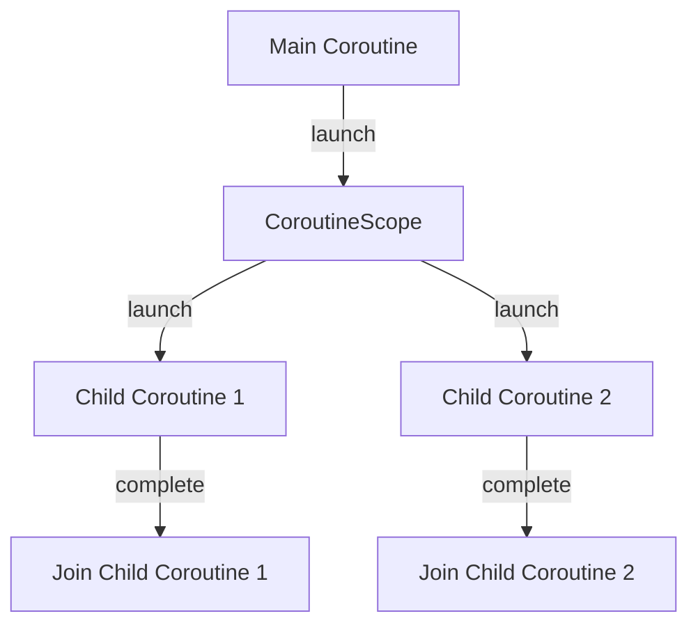
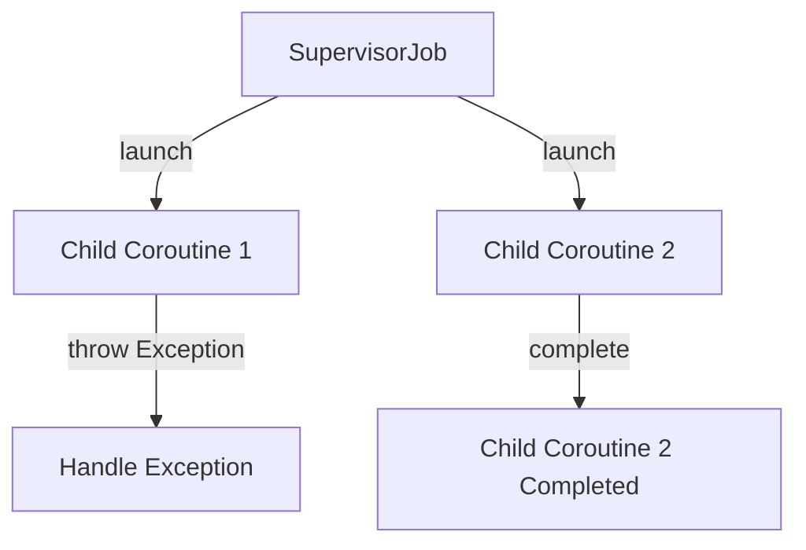

## 6.13 Coroutines Patterns

Kotlin coroutines provide a powerful way to handle asynchronous programming, making it easier to write non-blocking code. In this section, we will delve into advanced coroutines patterns, focusing on structured concurrency, asynchronous flow handling, shared mutable state, and exception handling. These patterns are crucial for expert software engineers and architects looking to build robust and efficient Kotlin applications.

### Structured Concurrency

Structured concurrency is a design principle that ensures coroutines are managed in a hierarchical structure. This approach helps in managing the lifecycle of coroutines, ensuring that they are properly started and completed, and that resources are released when no longer needed.

#### Managing Coroutines with Scopes

In Kotlin, coroutines are launched within a scope, which defines the lifecycle of the coroutine. The most common scopes are `GlobalScope`, `CoroutineScope`, and `MainScope`. However, using `GlobalScope` is generally discouraged as it does not adhere to structured concurrency principles.

**Example: Using CoroutineScope**

```kotlin
import kotlinx.coroutines.*

fun main() = runBlocking {
    val job = CoroutineScope(Dispatchers.Default).launch {
        // Coroutine code here
        delay(1000L)
        println("Coroutine completed")
    }
    job.join()
    println("Main program completed")
}
```

In this example, a new coroutine is launched within a `CoroutineScope`, which is tied to the `Dispatchers.Default` dispatcher. The `runBlocking` block ensures that the main thread waits for the coroutine to complete.

#### Key Participants

- **CoroutineScope**: Defines the lifecycle of coroutines.
- **Job**: Represents a cancellable unit of work.
- **Dispatcher**: Determines the thread on which the coroutine runs.

#### Applicability

Use structured concurrency to manage complex asynchronous workflows, ensuring that all coroutines are properly scoped and their lifecycles are managed.

#### Design Considerations

- **Avoid using GlobalScope**: It can lead to memory leaks and unmanaged coroutines.
- **Use structured scopes**: Such as `viewModelScope` in Android or custom scopes tied to lifecycle events.

### Asynchronous Flow Handling

Kotlin Flows provide a powerful way to handle asynchronous streams of data. They are part of Kotlin's coroutines library and offer a declarative approach to handling data streams.

#### Using Kotlin Flows for Reactive Programming

Kotlin Flows are cold streams, meaning that they do not start emitting values until they are collected. This makes them suitable for reactive programming, where data is processed as it becomes available.

**Example: Simple Flow**

```kotlin
import kotlinx.coroutines.*
import kotlinx.coroutines.flow.*

fun main() = runBlocking {
    val flow = flow {
        for (i in 1..3) {
            delay(100L)
            emit(i)
        }
    }

    flow.collect { value ->
        println("Received $value")
    }
}
```

In this example, a flow is created that emits values from 1 to 3, with a delay between each emission. The `collect` function is used to receive and process the emitted values.

#### Key Participants

- **Flow**: Represents a cold asynchronous stream of data.
- **Collector**: Consumes values emitted by the flow.

#### Applicability

Use Kotlin Flows when you need to handle asynchronous data streams, such as network responses, user input, or sensor data.

#### Design Considerations

- **Cold vs. Hot Flows**: Understand the difference between cold (Flow) and hot (StateFlow, SharedFlow) streams.
- **Backpressure Handling**: Use operators like `buffer`, `conflate`, and `collectLatest` to manage backpressure.

### Shared Mutable State

Managing shared mutable state in concurrent applications can be challenging. Kotlin provides several mechanisms to handle shared state safely.

#### Avoiding Concurrency Issues with Immutable Data

Immutable data structures are a key concept in functional programming and can help avoid concurrency issues by ensuring that data cannot be modified once created.

**Example: Using Immutable Data**

```kotlin
data class User(val name: String, val age: Int)

fun main() {
    val user = User("Alice", 30)
    // user.age = 31 // Error: Val cannot be reassigned
    val updatedUser = user.copy(age = 31)
    println(updatedUser)
}
```

In this example, the `User` data class is immutable, meaning its properties cannot be changed after creation. Instead, a new instance is created with the updated age.

#### Key Participants

- **Immutable Data Structures**: Data classes, collections, and other structures that cannot be modified after creation.

#### Applicability

Use immutable data structures to avoid concurrency issues and ensure thread safety in your applications.

#### Design Considerations

- **Prefer Immutability**: Whenever possible, use immutable data structures.
- **Use Atomic Operations**: For mutable state, use atomic operations or synchronization mechanisms.

### Exception Handling in Coroutines

Handling exceptions in coroutines requires a different approach compared to traditional synchronous code. Kotlin provides several mechanisms to handle exceptions gracefully.

#### Supervisors and Exception Propagation

Supervisors are a special type of coroutine scope that allow you to control how exceptions are propagated.

**Example: Using SupervisorScope**

```kotlin
import kotlinx.coroutines.*

fun main() = runBlocking {
    val supervisor = SupervisorJob()

    with(CoroutineScope(Dispatchers.Default + supervisor)) {
        val child1 = launch {
            try {
                delay(1000)
                throw Exception("Child 1 failed")
            } catch (e: Exception) {
                println("Caught exception: ${e.message}")
            }
        }

        val child2 = launch {
            delay(2000)
            println("Child 2 completed")
        }

        child1.join()
        child2.join()
    }
}
```

In this example, the `SupervisorJob` allows `child2` to complete even if `child1` fails. This is because exceptions in a supervisor scope do not propagate to sibling coroutines.

#### Key Participants

- **SupervisorJob**: A job that controls exception propagation.
- **CoroutineExceptionHandler**: Handles uncaught exceptions in coroutines.

#### Applicability

Use supervisors and exception handlers to manage exceptions in complex coroutine hierarchies, ensuring that failures in one coroutine do not affect others.

#### Design Considerations

- **Use SupervisorJob for Independent Coroutines**: When coroutines should not affect each other.
- **Handle Exceptions Gracefully**: Use `try-catch` blocks and `CoroutineExceptionHandler` to manage exceptions.

### Visualizing Coroutines Patterns

To better understand these patterns, let's visualize the flow of coroutines and exception handling using Mermaid.js diagrams.

#### Diagram: Structured Concurrency



This diagram illustrates how structured concurrency ensures that all child coroutines are launched within a scope and are properly joined upon completion.

#### Diagram: Exception Handling with SupervisorJob



This diagram shows how a `SupervisorJob` allows `Child Coroutine 2` to complete even if `Child Coroutine 1` throws an exception.

### Try It Yourself

Experiment with the code examples provided in this section. Try modifying the coroutine scopes, adding more child coroutines, or introducing different types of exceptions to see how they are handled.

### Knowledge Check

- What is structured concurrency, and why is it important?
- How do Kotlin Flows differ from traditional streams?
- Why is immutability important in concurrent programming?
- How does a `SupervisorJob` differ from a regular `Job`?

### Embrace the Journey

Remember, mastering coroutines patterns is just the beginning. As you continue to explore Kotlin's powerful concurrency model, you'll find new ways to build efficient and responsive applications. Keep experimenting, stay curious, and enjoy the journey!

## Quiz Time!



### What is the primary purpose of structured concurrency in Kotlin?

- [x] To manage the lifecycle of coroutines in a hierarchical structure.
- [ ] To allow coroutines to run on multiple threads simultaneously.
- [ ] To ensure all coroutines are launched in the `GlobalScope`.
- [ ] To simplify exception handling in coroutines.

> **Explanation:** Structured concurrency ensures that coroutines are managed in a hierarchical structure, allowing for proper lifecycle management and resource cleanup.

### Which of the following is a key feature of Kotlin Flows?

- [x] They are cold streams that start emitting values only when collected.
- [ ] They are hot streams that emit values continuously.
- [ ] They require manual backpressure handling.
- [ ] They cannot be used for reactive programming.

> **Explanation:** Kotlin Flows are cold streams, meaning they only start emitting values when collected, making them suitable for reactive programming.

### How does immutability help in concurrent programming?

- [x] It prevents data from being modified, reducing concurrency issues.
- [ ] It allows data to be shared across multiple threads without synchronization.
- [ ] It increases the performance of concurrent applications.
- [ ] It simplifies exception handling in coroutines.

> **Explanation:** Immutability prevents data from being modified, reducing the risk of concurrency issues by ensuring thread safety.

### What is the role of a `SupervisorJob` in Kotlin coroutines?

- [x] It controls exception propagation, allowing sibling coroutines to continue running.
- [ ] It ensures all coroutines are launched in the `GlobalScope`.
- [ ] It handles exceptions automatically without requiring `try-catch` blocks.
- [ ] It manages the lifecycle of all coroutines in an application.

> **Explanation:** A `SupervisorJob` controls exception propagation, allowing sibling coroutines to continue running even if one fails.

### Which of the following is a key participant in structured concurrency?

- [x] CoroutineScope
- [ ] GlobalScope
- [ ] Flow
- [ ] Collector

> **Explanation:** `CoroutineScope` is a key participant in structured concurrency, defining the lifecycle of coroutines.

### What is the primary difference between cold and hot streams in Kotlin?

- [x] Cold streams start emitting values only when collected, while hot streams emit continuously.
- [ ] Cold streams emit values continuously, while hot streams start emitting only when collected.
- [ ] Cold streams require manual backpressure handling, while hot streams do not.
- [ ] Cold streams cannot be used for reactive programming, while hot streams can.

> **Explanation:** Cold streams, like Kotlin Flows, start emitting values only when collected, while hot streams emit continuously.

### How can you handle exceptions in a coroutine hierarchy?

- [x] Use a `SupervisorJob` to control exception propagation.
- [ ] Use `GlobalScope` to manage exceptions.
- [ ] Use `try-catch` blocks in every coroutine.
- [ ] Use `CoroutineScope` to automatically handle exceptions.

> **Explanation:** A `SupervisorJob` allows you to control exception propagation, ensuring that sibling coroutines can continue running even if one fails.

### What is a common use case for Kotlin Flows?

- [x] Handling asynchronous data streams, such as network responses.
- [ ] Managing the lifecycle of coroutines.
- [ ] Handling exceptions in coroutine hierarchies.
- [ ] Managing shared mutable state.

> **Explanation:** Kotlin Flows are commonly used for handling asynchronous data streams, such as network responses or user input.

### Which keyword is used to launch a coroutine in a specific scope?

- [x] launch
- [ ] async
- [ ] runBlocking
- [ ] collect

> **Explanation:** The `launch` keyword is used to start a coroutine within a specific scope, such as `CoroutineScope`.

### True or False: Using `GlobalScope` is recommended for structured concurrency.

- [ ] True
- [x] False

> **Explanation:** Using `GlobalScope` is generally discouraged in structured concurrency as it can lead to memory leaks and unmanaged coroutines.


