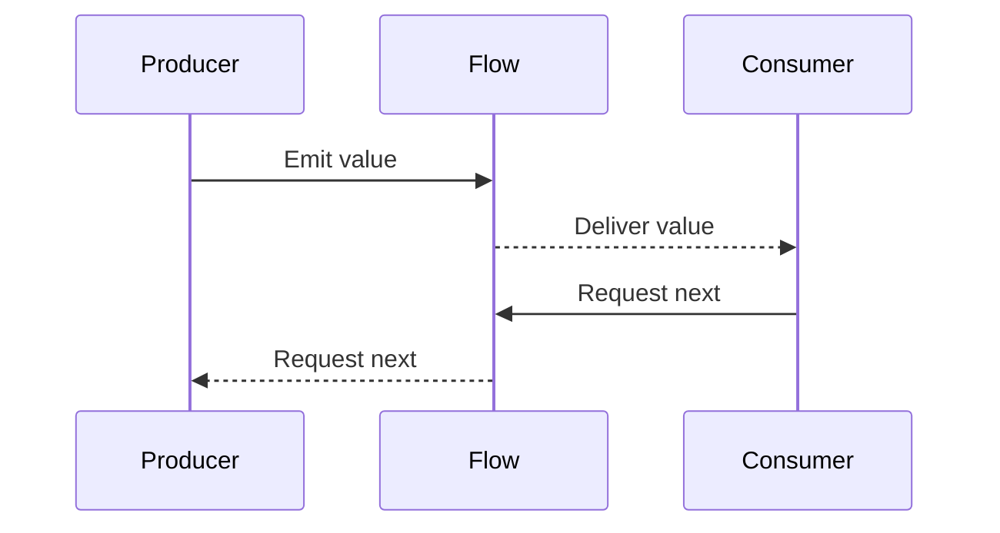

## 6.14 Reactive Streams

Reactive Streams is a programming paradigm that enables asynchronous data processing with non-blocking backpressure. In the Kotlin ecosystem, this is predominantly achieved using Kotlin Flows, which provide a powerful and flexible way to handle streams of data. This section will guide you through the concepts, implementation, and considerations of using Reactive Streams in Kotlin, with a focus on Kotlin Flows.

### Understanding Reactive Streams

Reactive Streams aim to provide a standard for asynchronous stream processing with non-blocking backpressure. The main goal is to allow the processing of potentially infinite data streams in a way that is both efficient and responsive to the consumer's demand.

#### Key Concepts

- **Asynchronous Data Flow**: Data is processed as it becomes available, without blocking the execution of other operations.
- **Backpressure**: A mechanism to handle the situation where the rate of data production exceeds the rate of data consumption.
- **Non-blocking**: Operations do not block the execution thread, allowing for more efficient resource utilization.

### Kotlin Flows: The Core of Reactive Streams in Kotlin

Kotlin Flows are a part of the Kotlin Coroutines library and provide a type-safe way to handle asynchronous streams of data. They are designed to be both easy to use and highly efficient.

#### Key Features of Kotlin Flows

- **Cold Streams**: Flows are cold, meaning they do not produce values until they are collected.
- **Backpressure Handling**: Flows handle backpressure by suspending the producer when the consumer is not ready to receive more data.
- **Declarative API**: Flows provide a rich set of operators for transforming and combining data streams.

#### Basic Flow Example

Let's start with a simple example of a Kotlin Flow:

```kotlin
import kotlinx.coroutines.flow.*
import kotlinx.coroutines.runBlocking

fun simpleFlow(): Flow<Int> = flow {
    for (i in 1..5) {
        emit(i)
    }
}

fun main() = runBlocking {
    simpleFlow().collect { value ->
        println(value)
    }
}
```

In this example, `simpleFlow` is a function that returns a `Flow<Int>`. The `flow` builder is used to define the flow, and the `emit` function is used to produce values. The `collect` function is used to consume the values emitted by the flow.

### Advanced Flow Operations

Kotlin Flows provide a variety of operators that allow you to transform and combine streams of data.

#### Transforming Flows

You can use operators like `map`, `filter`, and `transform` to modify the data in a flow.

```kotlin
fun transformedFlow(): Flow<String> = flow {
    for (i in 1..5) {
        emit(i)
    }
}.map { value ->
    "Number: $value"
}

fun main() = runBlocking {
    transformedFlow().collect { value ->
        println(value)
    }
}
```

In this example, the `map` operator is used to transform each integer into a string.

#### Combining Flows

Flows can be combined using operators like `zip` and `combine`.

```kotlin
fun flow1(): Flow<Int> = flow {
    emit(1)
    emit(2)
}

fun flow2(): Flow<String> = flow {
    emit("A")
    emit("B")
}

fun main() = runBlocking {
    flow1().zip(flow2()) { intVal, strVal ->
        "$intVal -> $strVal"
    }.collect { result ->
        println(result)
    }
}
```

Here, the `zip` operator is used to combine two flows into a single flow of paired values.

### Handling Backpressure

Backpressure is a critical aspect of Reactive Streams. It ensures that the system remains stable even when the producer generates data faster than the consumer can process it.

#### Backpressure Strategies

Kotlin Flows handle backpressure by suspending the producer when the consumer is not ready to receive more data. This is achieved through the use of coroutines, which allow for non-blocking suspension.

#### Example: Backpressure in Action

```kotlin
fun fastProducer(): Flow<Int> = flow {
    for (i in 1..1000) {
        emit(i)
    }
}

fun main() = runBlocking {
    fastProducer().collect { value ->
        println("Received $value")
        kotlinx.coroutines.delay(100) // Simulate slow consumer
    }
}
```

In this example, the producer emits values rapidly, but the consumer processes them slowly, demonstrating how Kotlin Flows handle backpressure by suspending the producer.

### Concurrency Considerations

Concurrency is an important consideration when working with Reactive Streams. Kotlin Flows leverage coroutines to provide a simple and efficient way to handle concurrency.

#### Using Flows with Coroutines

Flows can be used in conjunction with coroutines to perform concurrent operations.

```kotlin
fun concurrentFlow(): Flow<Int> = flow {
    for (i in 1..5) {
        emit(i)
        kotlinx.coroutines.delay(100) // Simulate work
    }
}

fun main() = runBlocking {
    kotlinx.coroutines.launch {
        concurrentFlow().collect { value ->
            println("Collector 1: $value")
        }
    }

    kotlinx.coroutines.launch {
        concurrentFlow().collect { value ->
            println("Collector 2: $value")
        }
    }
}
```

In this example, two collectors are launched concurrently, each processing the flow independently.

### Visualizing Reactive Streams

To better understand the flow of data in Reactive Streams, let's visualize the process using a sequence diagram.



This diagram illustrates the interaction between the producer, flow, and consumer, highlighting the backpressure mechanism.

### Practical Use Cases

Reactive Streams are widely used in various applications, from data processing pipelines to real-time data feeds.

#### Example: Real-Time Data Processing

Consider a scenario where you need to process real-time sensor data. Reactive Streams can be used to handle the continuous flow of data efficiently.

```kotlin
fun sensorDataFlow(): Flow<SensorData> = flow {
    while (true) {
        val data = readSensorData()
        emit(data)
        kotlinx.coroutines.delay(1000) // Simulate sensor reading interval
    }
}

fun main() = runBlocking {
    sensorDataFlow().collect { data ->
        processSensorData(data)
    }
}
```

In this example, `sensorDataFlow` continuously emits sensor data, which is then processed by the consumer.

### Design Considerations

When implementing Reactive Streams in Kotlin, consider the following:

- **Error Handling**: Use operators like `catch` to handle errors gracefully.
- **Resource Management**: Ensure that resources are properly managed, especially when dealing with long-running streams.
- **Performance**: Optimize the flow operations to minimize overhead and maximize throughput.

### Differences and Similarities with Other Patterns

Reactive Streams share similarities with other asynchronous patterns, such as callbacks and promises, but offer more robust handling of backpressure and concurrency.

#### Differences

- **Callbacks**: Reactive Streams provide a more structured approach to handling asynchronous data compared to traditional callbacks.
- **Promises/Futures**: While promises handle single asynchronous results, Reactive Streams handle multiple values over time.

#### Similarities

- **Asynchronous Execution**: Both Reactive Streams and other asynchronous patterns aim to improve responsiveness and resource utilization.

### Try It Yourself

Experiment with the code examples provided in this section. Try modifying the flow operations, adjusting the backpressure handling, or introducing additional concurrency to see how the system behaves.

### Knowledge Check

- How do Kotlin Flows handle backpressure?
- What are the key differences between Reactive Streams and traditional callbacks?
- How can you combine multiple flows in Kotlin?

### Conclusion

Reactive Streams in Kotlin provide a powerful and flexible way to handle asynchronous data processing. By leveraging Kotlin Flows, you can build efficient, responsive applications that handle data streams with ease. Remember, this is just the beginning. As you progress, you'll discover more advanced techniques and patterns to enhance your reactive programming skills.

## Quiz Time!



### What is the primary purpose of Reactive Streams?

- [x] To provide a standard for asynchronous stream processing with non-blocking backpressure.
- [ ] To handle synchronous data processing.
- [ ] To replace traditional callbacks with promises.
- [ ] To improve UI rendering performance.

> **Explanation:** Reactive Streams aim to provide a standard for asynchronous stream processing with non-blocking backpressure, allowing efficient handling of data streams.

### How do Kotlin Flows handle backpressure?

- [x] By suspending the producer when the consumer is not ready to receive more data.
- [ ] By buffering data until the consumer is ready.
- [ ] By discarding excess data.
- [ ] By using a separate thread for each data item.

> **Explanation:** Kotlin Flows handle backpressure by suspending the producer, allowing the consumer to process data at its own pace.

### Which operator is used to transform data in a Kotlin Flow?

- [x] map
- [ ] zip
- [ ] combine
- [ ] filter

> **Explanation:** The `map` operator is used to transform data in a Kotlin Flow, applying a function to each emitted item.

### What is a key feature of Kotlin Flows?

- [x] They are cold streams, meaning they do not produce values until collected.
- [ ] They are hot streams, continuously producing values.
- [ ] They require manual backpressure management.
- [ ] They are only used for UI updates.

> **Explanation:** Kotlin Flows are cold streams, producing values only when collected, which allows for efficient resource management.

### Which of the following is NOT a way to combine flows in Kotlin?

- [ ] zip
- [ ] combine
- [x] filter
- [ ] merge

> **Explanation:** The `filter` operator is used to filter data, not to combine flows. `zip`, `combine`, and `merge` are used to combine flows.

### What is the role of the `collect` function in a Kotlin Flow?

- [x] To consume the values emitted by the flow.
- [ ] To transform the data in the flow.
- [ ] To handle errors in the flow.
- [ ] To create a new flow.

> **Explanation:** The `collect` function is used to consume the values emitted by a Kotlin Flow, processing each item as it is received.

### How can you handle errors in a Kotlin Flow?

- [x] Using the `catch` operator.
- [ ] Using the `map` operator.
- [ ] Using the `zip` operator.
- [ ] Using the `merge` operator.

> **Explanation:** The `catch` operator is used to handle errors in a Kotlin Flow, allowing for graceful error handling.

### What is a practical use case for Reactive Streams?

- [x] Real-time data processing.
- [ ] Static data analysis.
- [ ] UI rendering.
- [ ] File I/O operations.

> **Explanation:** Reactive Streams are well-suited for real-time data processing, efficiently handling continuous data flows.

### Which of the following is a concurrency consideration when using Kotlin Flows?

- [x] Using coroutines to perform concurrent operations.
- [ ] Using multiple threads for each flow.
- [ ] Avoiding the use of suspending functions.
- [ ] Disabling backpressure handling.

> **Explanation:** Kotlin Flows leverage coroutines to perform concurrent operations, providing efficient concurrency management.

### True or False: Reactive Streams can only be used for network operations.

- [ ] True
- [x] False

> **Explanation:** Reactive Streams can be used for a wide range of applications, including data processing pipelines, real-time data feeds, and more, not just network operations.


