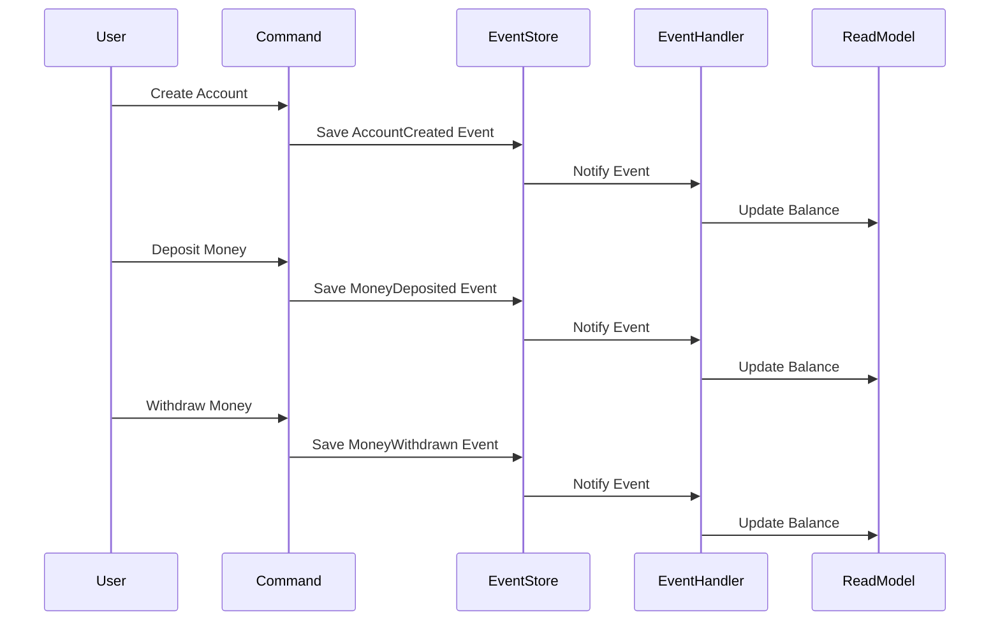

## 6.15 Event Sourcing Pattern

### Introduction to Event Sourcing

Event Sourcing is a powerful architectural pattern that captures all changes to the application state as a sequence of events. Instead of storing the current state of an object, Event Sourcing records every change as an event. This allows the system to reconstruct past states by replaying these events. Event Sourcing is particularly useful in systems where auditability, traceability, and the ability to reconstruct historical states are crucial.

### Intent

The primary intent of the Event Sourcing pattern is to ensure that every change to the state of an application is captured as an event object. These events are stored in an event store, which acts as the source of truth for the system's state. By replaying these events, you can reconstruct the state of the application at any point in time.

### Key Participants

- **Event**: Represents a change in the state of the application.
- **Event Store**: A storage mechanism for persisting events.
- **Aggregate**: A cluster of domain objects that can be treated as a single unit.
- **Command**: An instruction to perform an action that results in one or more events.
- **Event Handler**: A component that processes events and updates the read model.

### Applicability

Event Sourcing is applicable in scenarios where:

- **Auditability**: You need a complete audit trail of changes to the system.
- **Traceability**: You want to trace the origin of changes and understand the sequence of events.
- **Complex Business Logic**: The business logic involves complex state transitions that are better represented as events.
- **Reconstructing State**: You need to reconstruct past states of the application for debugging or analysis.

### Implementing Event Sourcing in Kotlin

Let's explore how to implement Event Sourcing in Kotlin by building a simple bank account application. We'll capture account transactions as events and use them to reconstruct the account's balance.

#### Step 1: Define Events

First, define the events that represent changes to the account state.

```kotlin
sealed class AccountEvent {
    data class AccountCreated(val accountId: String, val initialBalance: Double) : AccountEvent()
    data class MoneyDeposited(val accountId: String, val amount: Double) : AccountEvent()
    data class MoneyWithdrawn(val accountId: String, val amount: Double) : AccountEvent()
}
```

#### Step 2: Create an Event Store

Next, create an event store to persist events. For simplicity, we'll use an in-memory list.

```kotlin
class EventStore {
    private val events = mutableListOf<AccountEvent>()

    fun save(event: AccountEvent) {
        events.add(event)
    }

    fun getEvents(): List<AccountEvent> = events.toList()
}
```

#### Step 3: Implement Command Handling

Commands represent actions that result in events. Implement command handling to process these actions.

```kotlin
class AccountService(private val eventStore: EventStore) {

    fun createAccount(accountId: String, initialBalance: Double) {
        val event = AccountEvent.AccountCreated(accountId, initialBalance)
        eventStore.save(event)
    }

    fun depositMoney(accountId: String, amount: Double) {
        val event = AccountEvent.MoneyDeposited(accountId, amount)
        eventStore.save(event)
    }

    fun withdrawMoney(accountId: String, amount: Double) {
        val event = AccountEvent.MoneyWithdrawn(accountId, amount)
        eventStore.save(event)
    }
}
```

#### Step 4: Reconstruct State from Events

To reconstruct the account's state, replay the events from the event store.

```kotlin
class AccountProjection(private val eventStore: EventStore) {

    fun getBalance(accountId: String): Double {
        return eventStore.getEvents()
            .filter { it is AccountEvent && it.accountId == accountId }
            .fold(0.0) { balance, event ->
                when (event) {
                    is AccountEvent.AccountCreated -> event.initialBalance
                    is AccountEvent.MoneyDeposited -> balance + event.amount
                    is AccountEvent.MoneyWithdrawn -> balance - event.amount
                }
            }
    }
}
```

### Visualizing Event Sourcing

Here is a visual representation of the Event Sourcing process:



### Design Considerations

When implementing Event Sourcing, consider the following:

- **Event Versioning**: As your application evolves, events may change. Implement versioning to handle changes gracefully.
- **Event Consistency**: Ensure that events are consistent and accurately reflect the changes in the system.
- **Performance**: Replaying events can be resource-intensive. Consider using snapshots to optimize performance.
- **Scalability**: Design the event store to handle a large volume of events efficiently.

### Differences and Similarities

Event Sourcing is often confused with the Command Query Responsibility Segregation (CQRS) pattern. While both patterns can be used together, they serve different purposes. Event Sourcing focuses on capturing changes as events, while CQRS separates the read and write models.

### Try It Yourself

Experiment with the code examples by modifying the events or adding new command types. For instance, try implementing a transfer money command that involves two accounts.

### References and Links

- [Martin Fowler on Event Sourcing](https://martinfowler.com/eaaDev/EventSourcing.html)
- [Event Sourcing in Microservices](https://microservices.io/patterns/data/event-sourcing.html)

### Knowledge Check

- **What is the primary intent of the Event Sourcing pattern?**
- **How does Event Sourcing differ from traditional state storage?**
- **What are the key participants in the Event Sourcing pattern?**

### Embrace the Journey

Remember, mastering Event Sourcing is a journey. As you progress, you'll build more complex and robust systems. Keep experimenting, stay curious, and enjoy the journey!

## Quiz Time!



### What is the primary purpose of the Event Sourcing pattern?

- [x] To capture all changes to the application state as events.
- [ ] To store the current state of an object in a database.
- [ ] To separate read and write models.
- [ ] To optimize database performance.

> **Explanation:** The Event Sourcing pattern captures all changes to the application state as events, allowing for reconstruction of past states.

### How does Event Sourcing differ from traditional state storage?

- [x] It records every change as an event rather than storing the current state.
- [ ] It uses a relational database to store the current state.
- [ ] It focuses on optimizing query performance.
- [ ] It does not allow for state reconstruction.

> **Explanation:** Event Sourcing records every change as an event, enabling reconstruction of past states, unlike traditional storage which stores the current state.

### What is an Event Store in the context of Event Sourcing?

- [x] A storage mechanism for persisting events.
- [ ] A database for storing the current state.
- [ ] A service for handling user commands.
- [ ] A tool for optimizing performance.

> **Explanation:** An Event Store is a storage mechanism for persisting events, acting as the source of truth for the system's state.

### Which of the following is a key participant in the Event Sourcing pattern?

- [x] Event
- [ ] Database
- [ ] Cache
- [ ] Load Balancer

> **Explanation:** An Event is a key participant in the Event Sourcing pattern, representing a change in the state of the application.

### What is the role of an Event Handler in Event Sourcing?

- [x] To process events and update the read model.
- [ ] To store events in the database.
- [ ] To execute user commands.
- [ ] To optimize query performance.

> **Explanation:** An Event Handler processes events and updates the read model, ensuring that the system reflects the latest changes.

### What is a potential challenge when implementing Event Sourcing?

- [x] Replaying events can be resource-intensive.
- [ ] Storing the current state is difficult.
- [ ] Handling user commands is complex.
- [ ] Optimizing query performance is challenging.

> **Explanation:** Replaying events can be resource-intensive, especially in systems with a large volume of events.

### How can performance be optimized in an Event Sourcing system?

- [x] By using snapshots to reduce the number of events to replay.
- [ ] By storing the current state in a cache.
- [ ] By optimizing database queries.
- [ ] By using a relational database.

> **Explanation:** Using snapshots can reduce the number of events that need to be replayed, optimizing performance in an Event Sourcing system.

### What is a common use case for Event Sourcing?

- [x] Systems requiring auditability and traceability.
- [ ] Systems with simple state transitions.
- [ ] Systems focused on query performance.
- [ ] Systems with minimal state changes.

> **Explanation:** Event Sourcing is commonly used in systems requiring auditability and traceability, where a complete history of changes is needed.

### What is the relationship between Event Sourcing and CQRS?

- [x] They can be used together but serve different purposes.
- [ ] They are the same pattern.
- [ ] Event Sourcing is a subset of CQRS.
- [ ] CQRS is a subset of Event Sourcing.

> **Explanation:** Event Sourcing and CQRS can be used together but serve different purposes. Event Sourcing captures changes as events, while CQRS separates read and write models.

### True or False: Event Sourcing allows for the reconstruction of past states.

- [x] True
- [ ] False

> **Explanation:** True. Event Sourcing allows for the reconstruction of past states by replaying the sequence of events.


