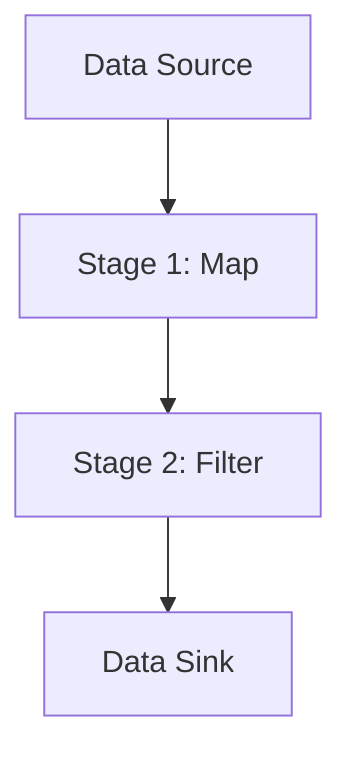

## 6.16 Pipeline Pattern

In the world of software engineering, the need to process data efficiently and effectively is paramount. The Pipeline Pattern is a powerful design pattern that allows developers to process data through a sequence of stages, each performing a specific transformation or operation. In Kotlin, this pattern can be elegantly implemented using sequences and flows, leveraging Kotlin's expressive syntax and powerful concurrency features.

### Intent

The Pipeline Pattern is designed to process data in a series of stages, where each stage performs a specific operation on the data. This pattern is particularly useful for data processing tasks that require a series of transformations, such as filtering, mapping, and aggregating data.

### Key Participants

- **Data Source**: The initial input to the pipeline, which can be a collection, a stream, or any data-producing entity.
- **Pipeline Stages**: Each stage in the pipeline performs a specific operation on the data. Stages can be composed of functions that transform, filter, or aggregate data.
- **Data Sink**: The final output of the pipeline, which can be a collection, a file, or any data-consuming entity.

### Applicability

The Pipeline Pattern is applicable in scenarios where:

- Data needs to be processed in a series of transformations.
- Operations can be performed independently and in sequence.
- There is a need to improve code readability and maintainability by separating concerns into distinct stages.
- Asynchronous or reactive data processing is required.

### Implementing Pipelines with Sequences

Kotlin sequences provide a lazy evaluation mechanism, allowing you to build pipelines that process data efficiently without unnecessary intermediate collections. Let's explore how to implement a simple pipeline using sequences.

```kotlin
fun main() {
    // Data source: A list of numbers
    val numbers = listOf(1, 2, 3, 4, 5)

    // Pipeline stages using sequences
    val result = numbers.asSequence()
        .map { it * 2 } // Stage 1: Multiply each number by 2
        .filter { it > 5 } // Stage 2: Filter numbers greater than 5
        .toList() // Convert the sequence back to a list

    // Data sink: Print the result
    println(result) // Output: [6, 8, 10]
}
```

In this example, we start with a list of numbers and transform it through a sequence of stages. Each stage performs a specific operation, such as mapping and filtering, and the final result is collected into a list.

### Implementing Pipelines with Flows

Kotlin Flows provide a powerful way to handle asynchronous data streams, making them ideal for implementing pipelines that require reactive programming. Flows are cold streams, meaning they don't produce data until they are collected.

```kotlin
import kotlinx.coroutines.*
import kotlinx.coroutines.flow.*

fun main() = runBlocking {
    // Data source: A flow of numbers
    val numberFlow = flow {
        for (i in 1..5) {
            emit(i) // Emit numbers from 1 to 5
            delay(100) // Simulate asynchronous operation
        }
    }

    // Pipeline stages using flows
    numberFlow
        .map { it * 2 } // Stage 1: Multiply each number by 2
        .filter { it > 5 } // Stage 2: Filter numbers greater than 5
        .collect { println(it) } // Data sink: Collect and print the result
}
```

In this example, we use a flow to emit numbers asynchronously. The pipeline stages are defined using flow operators like `map` and `filter`, and the final result is collected and printed.

### Design Considerations

- **Lazy Evaluation**: Both sequences and flows support lazy evaluation, which can improve performance by avoiding unnecessary computations.
- **Concurrency**: Flows are designed for asynchronous data processing, making them suitable for handling data streams in concurrent applications.
- **Error Handling**: Consider how errors are propagated and handled within the pipeline. Flows provide mechanisms for handling exceptions and retries.
- **Backpressure**: In reactive systems, managing backpressure is crucial to prevent overwhelming consumers. Flows offer operators like `buffer` and `conflate` to manage backpressure effectively.

### Differences and Similarities

- **Sequences vs. Flows**: Sequences are synchronous and lazy, while flows are asynchronous and lazy. Use sequences for in-memory data processing and flows for asynchronous data streams.
- **Operators**: Both sequences and flows support a rich set of operators for transforming data, such as `map`, `filter`, and `reduce`.

### Visualizing the Pipeline Pattern

To better understand the flow of data through a pipeline, let's visualize the process using a Mermaid.js diagram.



This diagram illustrates the flow of data from the source through each stage of the pipeline, ultimately reaching the data sink.

### Try It Yourself

Experiment with the pipeline pattern by modifying the code examples. Here are some suggestions:

- Add additional stages to the pipeline, such as `reduce` or `flatMap`.
- Implement error handling in the flow pipeline using `catch` and `retry` operators.
- Explore the use of `buffer` and `conflate` in flows to manage backpressure.

### Knowledge Check

- What are the key differences between sequences and flows in Kotlin?
- How does lazy evaluation benefit the pipeline pattern?
- What are some common use cases for the pipeline pattern in software development?

### Embrace the Journey

Remember, mastering the pipeline pattern is just one step in your journey as a Kotlin developer. As you continue to explore and experiment with design patterns, you'll gain a deeper understanding of how to build efficient, maintainable, and scalable applications. Keep experimenting, stay curious, and enjoy the journey!

## Quiz Time!



### What is the primary intent of the Pipeline Pattern?

- [x] To process data through a sequence of stages
- [ ] To handle errors in a program
- [ ] To manage state changes in an application
- [ ] To provide a simplified interface to a complex subsystem

> **Explanation:** The Pipeline Pattern is designed to process data through a series of stages, each performing a specific transformation or operation.

### Which Kotlin feature is ideal for implementing asynchronous pipelines?

- [ ] Sequences
- [x] Flows
- [ ] Lists
- [ ] Arrays

> **Explanation:** Kotlin Flows provide a powerful way to handle asynchronous data streams, making them ideal for implementing pipelines that require reactive programming.

### What is a key benefit of using lazy evaluation in pipelines?

- [x] It improves performance by avoiding unnecessary computations
- [ ] It simplifies error handling
- [ ] It enhances code readability
- [ ] It allows for synchronous data processing

> **Explanation:** Lazy evaluation can improve performance by avoiding unnecessary computations, as operations are only performed when needed.

### How can you manage backpressure in Kotlin Flows?

- [ ] By using sequences
- [x] By using operators like `buffer` and `conflate`
- [ ] By using lists
- [ ] By using arrays

> **Explanation:** In reactive systems, managing backpressure is crucial, and Flows offer operators like `buffer` and `conflate` to manage backpressure effectively.

### What is the difference between sequences and flows in Kotlin?

- [x] Sequences are synchronous and lazy, while flows are asynchronous and lazy
- [ ] Sequences are asynchronous and lazy, while flows are synchronous and lazy
- [ ] Both sequences and flows are synchronous
- [ ] Both sequences and flows are asynchronous

> **Explanation:** Sequences are synchronous and lazy, while flows are asynchronous and lazy, making them suitable for different use cases.

### Which operator would you use to transform data in a pipeline?

- [x] `map`
- [ ] `reduce`
- [ ] `collect`
- [ ] `emit`

> **Explanation:** The `map` operator is used to transform data in a pipeline by applying a function to each element.

### What is a common use case for the Pipeline Pattern?

- [x] Data processing tasks that require a series of transformations
- [ ] Managing application state
- [ ] Handling user input
- [ ] Rendering UI components

> **Explanation:** The Pipeline Pattern is commonly used for data processing tasks that require a series of transformations, such as filtering, mapping, and aggregating data.

### How do you handle errors in a flow pipeline?

- [ ] By using sequences
- [x] By using operators like `catch` and `retry`
- [ ] By using lists
- [ ] By using arrays

> **Explanation:** Flows provide mechanisms for handling exceptions and retries using operators like `catch` and `retry`.

### What is the role of the data sink in a pipeline?

- [x] To consume the final output of the pipeline
- [ ] To transform data in the pipeline
- [ ] To produce data for the pipeline
- [ ] To handle errors in the pipeline

> **Explanation:** The data sink is the final output of the pipeline, which can be a collection, a file, or any data-consuming entity.

### True or False: Flows in Kotlin are cold streams.

- [x] True
- [ ] False

> **Explanation:** Flows in Kotlin are cold streams, meaning they don't produce data until they are collected.


