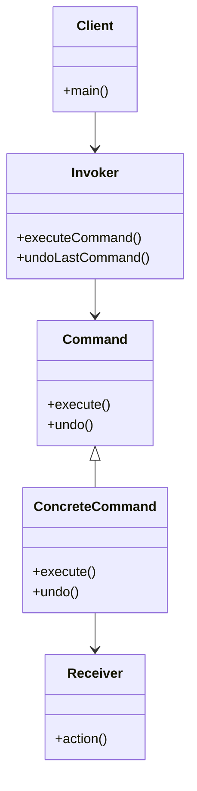

## 6.2 Command Pattern

The Command Pattern is a behavioral design pattern that turns a request into a stand-alone object containing all the information about the request. This transformation allows for parameterizing clients with queues, requests, and operations, and supports undoable operations. In Kotlin, the Command Pattern can be elegantly implemented using classes, lambdas, and function types, providing a flexible and powerful way to encapsulate actions.

### Intent

The primary intent of the Command Pattern is to encapsulate a request as an object, thereby allowing for parameterization of clients with different requests, queuing of requests, and logging of the requests. It also provides support for undoable operations.

### Key Participants

1. **Command Interface**: Declares an interface for executing an operation.
2. **Concrete Command**: Implements the Command interface and defines the binding between a Receiver object and an action.
3. **Receiver**: Knows how to perform the operations associated with carrying out a request.
4. **Invoker**: Asks the command to carry out the request.
5. **Client**: Creates a ConcreteCommand object and sets its receiver.

### Applicability

Use the Command Pattern when you want to:

- Parameterize objects by an action to perform.
- Specify, queue, and execute requests at different times.
- Support undo operations.
- Support logging changes so that they can be reapplied in case of a system crash.
- Structure a system around high-level operations built on primitive operations.

### Implementing Commands with Classes and Lambdas

In Kotlin, you can implement the Command Pattern using both classes and lambdas. Let's start by implementing it with classes.

#### Example: Implementing with Classes

```kotlin
// Command Interface
interface Command {
    fun execute()
}

// Receiver
class Light {
    fun turnOn() {
        println("The light is on")
    }

    fun turnOff() {
        println("The light is off")
    }
}

// Concrete Command for turning on the light
class TurnOnCommand(private val light: Light) : Command {
    override fun execute() {
        light.turnOn()
    }
}

// Concrete Command for turning off the light
class TurnOffCommand(private val light: Light) : Command {
    override fun execute() {
        light.turnOff()
    }
}

// Invoker
class RemoteControl {
    private val commands = mutableListOf<Command>()

    fun addCommand(command: Command) {
        commands.add(command)
    }

    fun executeCommands() {
        for (command in commands) {
            command.execute()
        }
    }
}

// Client
fun main() {
    val light = Light()
    val turnOn = TurnOnCommand(light)
    val turnOff = TurnOffCommand(light)

    val remoteControl = RemoteControl()
    remoteControl.addCommand(turnOn)
    remoteControl.addCommand(turnOff)

    remoteControl.executeCommands()
}
```

In this example, the `Light` class is the receiver, and the `TurnOnCommand` and `TurnOffCommand` are concrete commands that encapsulate the actions of turning the light on and off. The `RemoteControl` class acts as the invoker that executes the commands.

#### Example: Implementing with Lambdas

Kotlin's support for higher-order functions and lambdas allows us to simplify the Command Pattern by using function types instead of defining a separate interface for commands.

```kotlin
// Receiver
class Light {
    fun turnOn() {
        println("The light is on")
    }

    fun turnOff() {
        println("The light is off")
    }
}

// Invoker
class RemoteControl {
    private val commands = mutableListOf<() -> Unit>()

    fun addCommand(command: () -> Unit) {
        commands.add(command)
    }

    fun executeCommands() {
        for (command in commands) {
            command()
        }
    }
}

// Client
fun main() {
    val light = Light()

    val remoteControl = RemoteControl()
    remoteControl.addCommand { light.turnOn() }
    remoteControl.addCommand { light.turnOff() }

    remoteControl.executeCommands()
}
```

In this version, we use lambdas to encapsulate the commands, which makes the code more concise and eliminates the need for separate command classes.

### Using Function Types for Command Patterns

Function types in Kotlin provide a powerful way to represent commands. By using function types, you can easily create and manage commands without the overhead of creating multiple classes.

#### Example: Function Type Commands

```kotlin
// Receiver
class Light {
    fun turnOn() {
        println("The light is on")
    }

    fun turnOff() {
        println("The light is off")
    }
}

// Invoker
class RemoteControl {
    private val commands = mutableListOf<() -> Unit>()

    fun addCommand(command: () -> Unit) {
        commands.add(command)
    }

    fun executeCommands() {
        for (command in commands) {
            command()
        }
    }
}

// Client
fun main() {
    val light = Light()

    val remoteControl = RemoteControl()
    remoteControl.addCommand(light::turnOn)
    remoteControl.addCommand(light::turnOff)

    remoteControl.executeCommands()
}
```

Here, we use function references (`light::turnOn` and `light::turnOff`) as commands. This approach leverages Kotlin's function types to simplify the command pattern implementation.

### Undo/Redo Functionality

One of the powerful features of the Command Pattern is its ability to support undo and redo operations. To implement this, we need to maintain a history of commands and provide a mechanism to reverse the actions.

#### Example: Implementing Undo/Redo

```kotlin
// Command Interface with undo
interface Command {
    fun execute()
    fun undo()
}

// Receiver
class Light {
    fun turnOn() {
        println("The light is on")
    }

    fun turnOff() {
        println("The light is off")
    }
}

// Concrete Command for turning on the light
class TurnOnCommand(private val light: Light) : Command {
    override fun execute() {
        light.turnOn()
    }

    override fun undo() {
        light.turnOff()
    }
}

// Concrete Command for turning off the light
class TurnOffCommand(private val light: Light) : Command {
    override fun execute() {
        light.turnOff()
    }

    override fun undo() {
        light.turnOn()
    }
}

// Invoker with undo/redo functionality
class RemoteControl {
    private val commandHistory = mutableListOf<Command>()

    fun executeCommand(command: Command) {
        command.execute()
        commandHistory.add(command)
    }

    fun undoLastCommand() {
        if (commandHistory.isNotEmpty()) {
            val lastCommand = commandHistory.removeAt(commandHistory.size - 1)
            lastCommand.undo()
        }
    }
}

// Client
fun main() {
    val light = Light()
    val turnOn = TurnOnCommand(light)
    val turnOff = TurnOffCommand(light)

    val remoteControl = RemoteControl()
    remoteControl.executeCommand(turnOn)
    remoteControl.executeCommand(turnOff)

    // Undo last command
    remoteControl.undoLastCommand()
}
```

In this example, each command implements an `undo` method that reverses its action. The `RemoteControl` class maintains a history of executed commands and provides an `undoLastCommand` method to reverse the last command.

### Design Considerations

When implementing the Command Pattern in Kotlin, consider the following:

- **Command Granularity**: Determine the level of granularity for commands. Fine-grained commands provide more flexibility but may increase complexity.
- **State Management**: Ensure that the receiver's state is managed correctly, especially when implementing undo/redo functionality.
- **Performance**: Consider the performance implications of maintaining a command history, especially in systems with high-frequency command execution.
- **Kotlin Features**: Leverage Kotlin's features such as lambdas, function references, and higher-order functions to simplify command implementation.

### Differences and Similarities

The Command Pattern is often compared to other behavioral patterns such as the Strategy Pattern and the Observer Pattern. Here are some key differences and similarities:

- **Command vs. Strategy**: Both patterns encapsulate actions, but the Command Pattern focuses on executing commands, while the Strategy Pattern focuses on selecting algorithms.
- **Command vs. Observer**: The Command Pattern encapsulates requests as objects, while the Observer Pattern defines a one-to-many dependency between objects.

### Visualizing the Command Pattern

To better understand the Command Pattern, let's visualize the relationships between its key participants using a class diagram.



In this diagram, the `Command` interface is implemented by `ConcreteCommand`, which interacts with the `Receiver`. The `Invoker` holds a reference to the `Command` and executes it, while the `Client` initializes the `Invoker` and commands.

### Try It Yourself

Experiment with the Command Pattern by implementing the following modifications:

- Add a new command to dim the light to a specific brightness level.
- Implement a redo functionality in the `RemoteControl` class.
- Use a stack instead of a list for the command history to improve the efficiency of undo operations.

### Knowledge Check

- How does the Command Pattern encapsulate requests?
- What are the benefits of using lambdas for command implementation in Kotlin?
- How can you implement undo/redo functionality using the Command Pattern?

### Embrace the Journey

Remember, mastering design patterns is a journey. As you continue to explore and implement the Command Pattern in Kotlin, you'll gain a deeper understanding of how to encapsulate actions and build flexible, maintainable systems. Keep experimenting, stay curious, and enjoy the journey!

## Quiz Time!



### What is the primary intent of the Command Pattern?

- [x] To encapsulate a request as an object
- [ ] To provide a simplified interface to a complex subsystem
- [ ] To define a family of interchangeable algorithms
- [ ] To separate abstraction from implementation

> **Explanation:** The Command Pattern's primary intent is to encapsulate a request as an object, allowing for parameterization and queuing of requests.

### Which Kotlin feature can simplify the implementation of the Command Pattern?

- [x] Lambdas
- [ ] Data classes
- [ ] Sealed classes
- [ ] Companion objects

> **Explanation:** Lambdas in Kotlin can simplify the implementation of the Command Pattern by reducing the need for separate command classes.

### What is a key benefit of using the Command Pattern?

- [x] It supports undo operations
- [ ] It allows for dynamic method dispatch
- [ ] It provides a way to iterate over a collection
- [ ] It enables lazy initialization

> **Explanation:** A key benefit of the Command Pattern is its support for undo operations by encapsulating actions as objects.

### How does the Command Pattern differ from the Strategy Pattern?

- [x] Command focuses on executing commands, while Strategy focuses on selecting algorithms
- [ ] Command defines a one-to-many dependency, while Strategy encapsulates requests
- [ ] Command uses function types, while Strategy uses classes
- [ ] Command is a structural pattern, while Strategy is a behavioral pattern

> **Explanation:** The Command Pattern focuses on executing commands, while the Strategy Pattern focuses on selecting algorithms.

### What is the role of the Receiver in the Command Pattern?

- [x] To perform the operations associated with carrying out a request
- [ ] To encapsulate a request as an object
- [ ] To declare an interface for executing an operation
- [ ] To ask the command to carry out the request

> **Explanation:** The Receiver in the Command Pattern knows how to perform the operations associated with carrying out a request.

### What is the purpose of the Invoker in the Command Pattern?

- [x] To ask the command to carry out the request
- [ ] To encapsulate a request as an object
- [ ] To perform the operations associated with carrying out a request
- [ ] To declare an interface for executing an operation

> **Explanation:** The Invoker in the Command Pattern is responsible for asking the command to carry out the request.

### Which of the following is a common use case for the Command Pattern?

- [x] Implementing undo functionality
- [ ] Iterating over a collection
- [ ] Providing a simplified interface to a complex subsystem
- [ ] Separating abstraction from implementation

> **Explanation:** A common use case for the Command Pattern is implementing undo functionality by encapsulating actions as objects.

### How can you implement redo functionality in the Command Pattern?

- [x] By maintaining a history of executed commands
- [ ] By using sealed classes
- [ ] By defining a family of interchangeable algorithms
- [ ] By separating abstraction from implementation

> **Explanation:** Redo functionality can be implemented in the Command Pattern by maintaining a history of executed commands and re-executing them.

### What is a potential downside of maintaining a command history?

- [x] Increased memory usage
- [ ] Reduced code readability
- [ ] Increased complexity of algorithms
- [ ] Reduced flexibility of the system

> **Explanation:** Maintaining a command history can lead to increased memory usage, especially in systems with high-frequency command execution.

### True or False: The Command Pattern can be used to support logging changes for system recovery.

- [x] True
- [ ] False

> **Explanation:** True. The Command Pattern can support logging changes, which can be reapplied in case of a system crash.


