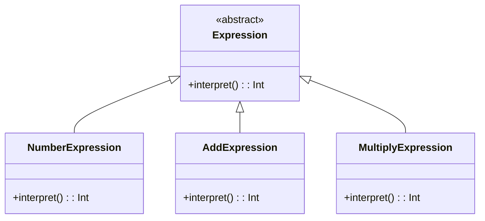

## 6.3 Interpreter Pattern

The Interpreter Pattern is a powerful behavioral design pattern that provides a way to evaluate sentences in a language. It is particularly useful for defining a grammar for a language and interpreting sentences in that language. In this section, we will explore how to implement the Interpreter Pattern in Kotlin, leveraging Kotlin's unique features such as sealed classes and pattern matching.

### Intent

The primary intent of the Interpreter Pattern is to define a representation for a grammar of a language and provide an interpreter to evaluate sentences in that language. This pattern is particularly useful when you have a simple language or a set of commands that need to be interpreted.

### Key Participants

1. **Abstract Expression**: Declares an abstract `interpret` operation that is common to all nodes in the abstract syntax tree.
2. **Terminal Expression**: Implements an `interpret` operation associated with terminal symbols in the grammar.
3. **Nonterminal Expression**: Represents rules in the grammar. It maintains references to other expressions and implements the `interpret` operation for nonterminal symbols.
4. **Context**: Contains information that is global to the interpreter.
5. **Client**: Builds the abstract syntax tree representing a particular sentence in the language defined by the grammar.

### Applicability

Use the Interpreter Pattern when:

- You have a simple language or grammar that needs to be interpreted.
- The grammar is simple and can be represented using a class hierarchy.
- You need to evaluate expressions in a language frequently.

### Building Parsers with Recursive Descent

Recursive descent parsing is a top-down parsing technique that uses a set of recursive procedures to process the input. Each procedure corresponds to a nonterminal in the grammar. Let's explore how to build a parser using recursive descent in Kotlin.

#### Example: Arithmetic Expression Interpreter

Consider a simple arithmetic expression language with the following grammar:

```
Expression ::= Term ('+' Term)*
Term       ::= Factor ('*' Factor)*
Factor     ::= Number | '(' Expression ')'
Number     ::= [0-9]+
```

We will build an interpreter for this language using recursive descent parsing.

#### Step 1: Define the Abstract Expression

First, define an abstract class `Expression` with an `interpret` method:

```kotlin
abstract class Expression {
    abstract fun interpret(): Int
}
```

#### Step 2: Implement Terminal Expressions

Implement terminal expressions for numbers:

```kotlin
class NumberExpression(private val number: Int) : Expression() {
    override fun interpret(): Int = number
}
```

#### Step 3: Implement Nonterminal Expressions

Implement nonterminal expressions for addition and multiplication:

```kotlin
class AddExpression(private val left: Expression, private val right: Expression) : Expression() {
    override fun interpret(): Int = left.interpret() + right.interpret()
}

class MultiplyExpression(private val left: Expression, private val right: Expression) : Expression() {
    override fun interpret(): Int = left.interpret() * right.interpret()
}
```

#### Step 4: Implement the Parser

Implement a parser using recursive descent:

```kotlin
class Parser(private val tokens: List<String>) {
    private var currentPosition = 0

    fun parse(): Expression {
        return parseExpression()
    }

    private fun parseExpression(): Expression {
        var result = parseTerm()
        while (currentToken() == "+") {
            consumeToken("+")
            result = AddExpression(result, parseTerm())
        }
        return result
    }

    private fun parseTerm(): Expression {
        var result = parseFactor()
        while (currentToken() == "*") {
            consumeToken("*")
            result = MultiplyExpression(result, parseFactor())
        }
        return result
    }

    private fun parseFactor(): Expression {
        val token = currentToken()
        return when {
            token.matches(Regex("\\d+")) -> {
                consumeToken(token)
                NumberExpression(token.toInt())
            }
            token == "(" -> {
                consumeToken("(")
                val expression = parseExpression()
                consumeToken(")")
                expression
            }
            else -> throw IllegalArgumentException("Unexpected token: $token")
        }
    }

    private fun currentToken(): String = tokens[currentPosition]

    private fun consumeToken(expected: String) {
        if (currentToken() == expected) {
            currentPosition++
        } else {
            throw IllegalArgumentException("Expected $expected but found ${currentToken()}")
        }
    }
}
```

#### Step 5: Test the Interpreter

Finally, test the interpreter:

```kotlin
fun main() {
    val expression = "(3 + 5) * 2"
    val tokens = expression.replace("(", " ( ").replace(")", " ) ").split("\\s+".toRegex()).filter { it.isNotEmpty() }
    val parser = Parser(tokens)
    val result = parser.parse().interpret()
    println("Result: $result") // Output: Result: 16
}
```

### Using Sealed Classes and Pattern Matching

Kotlin's sealed classes and pattern matching provide a powerful way to implement the Interpreter Pattern. Sealed classes allow you to define a restricted class hierarchy, which is perfect for representing grammar rules.

#### Example: Boolean Expression Interpreter

Consider a simple boolean expression language with the following grammar:

```
Expression ::= Term ('OR' Term)*
Term       ::= Factor ('AND' Factor)*
Factor     ::= 'TRUE' | 'FALSE' | '(' Expression ')'
```

#### Step 1: Define Sealed Classes

Define sealed classes for expressions:

```kotlin
sealed class BooleanExpression {
    abstract fun interpret(): Boolean
}

data class TrueExpression(val value: Boolean = true) : BooleanExpression() {
    override fun interpret(): Boolean = value
}

data class FalseExpression(val value: Boolean = false) : BooleanExpression() {
    override fun interpret(): Boolean = value
}

data class OrExpression(val left: BooleanExpression, val right: BooleanExpression) : BooleanExpression() {
    override fun interpret(): Boolean = left.interpret() || right.interpret()
}

data class AndExpression(val left: BooleanExpression, val right: BooleanExpression) : BooleanExpression() {
    override fun interpret(): Boolean = left.interpret() && right.interpret()
}
```

#### Step 2: Implement the Parser

Implement a parser using sealed classes:

```kotlin
class BooleanParser(private val tokens: List<String>) {
    private var currentPosition = 0

    fun parse(): BooleanExpression {
        return parseExpression()
    }

    private fun parseExpression(): BooleanExpression {
        var result = parseTerm()
        while (currentToken() == "OR") {
            consumeToken("OR")
            result = OrExpression(result, parseTerm())
        }
        return result
    }

    private fun parseTerm(): BooleanExpression {
        var result = parseFactor()
        while (currentToken() == "AND") {
            consumeToken("AND")
            result = AndExpression(result, parseFactor())
        }
        return result
    }

    private fun parseFactor(): BooleanExpression {
        val token = currentToken()
        return when (token) {
            "TRUE" -> {
                consumeToken("TRUE")
                TrueExpression()
            }
            "FALSE" -> {
                consumeToken("FALSE")
                FalseExpression()
            }
            "(" -> {
                consumeToken("(")
                val expression = parseExpression()
                consumeToken(")")
                expression
            }
            else -> throw IllegalArgumentException("Unexpected token: $token")
        }
    }

    private fun currentToken(): String = tokens[currentPosition]

    private fun consumeToken(expected: String) {
        if (currentToken() == expected) {
            currentPosition++
        } else {
            throw IllegalArgumentException("Expected $expected but found ${currentToken()}")
        }
    }
}
```

#### Step 3: Test the Interpreter

Test the boolean expression interpreter:

```kotlin
fun main() {
    val expression = "(TRUE AND FALSE) OR TRUE"
    val tokens = expression.replace("(", " ( ").replace(")", " ) ").split("\\s+".toRegex()).filter { it.isNotEmpty() }
    val parser = BooleanParser(tokens)
    val result = parser.parse().interpret()
    println("Result: $result") // Output: Result: true
}
```

### Design Considerations

When implementing the Interpreter Pattern, consider the following:

- **Complexity**: The Interpreter Pattern can lead to a large number of classes for complex grammars. Consider using other parsing techniques for more complex languages.
- **Performance**: Recursive descent parsing can be inefficient for large inputs. Consider optimizing the parser or using a different parsing strategy if performance is a concern.
- **Kotlin Features**: Leverage Kotlin's sealed classes and pattern matching to simplify the implementation and improve type safety.

### Differences and Similarities

The Interpreter Pattern is often confused with the Visitor Pattern. While both patterns involve traversing a structure, the Interpreter Pattern focuses on evaluating expressions, whereas the Visitor Pattern is used to perform operations on elements of an object structure.

### Visualizing the Interpreter Pattern

Below is a class diagram illustrating the structure of the Interpreter Pattern:



### Try It Yourself

Experiment with the code examples by:

- Modifying the grammar to include subtraction and division.
- Implementing additional nonterminal expressions.
- Extending the boolean expression interpreter to support NOT operations.

### Knowledge Check

- What is the primary intent of the Interpreter Pattern?
- How does recursive descent parsing work?
- How can sealed classes and pattern matching be used in the Interpreter Pattern?
- What are the key participants in the Interpreter Pattern?

### Embrace the Journey

Remember, mastering the Interpreter Pattern is just the beginning. As you progress, you'll be able to tackle more complex languages and grammars. Keep experimenting, stay curious, and enjoy the journey!

## Quiz Time!



### What is the primary intent of the Interpreter Pattern?

- [x] To define a representation for a grammar and provide an interpreter to evaluate sentences.
- [ ] To separate the construction of a complex object from its representation.
- [ ] To provide a simplified interface to a complex subsystem.
- [ ] To define a family of algorithms and make them interchangeable.

> **Explanation:** The Interpreter Pattern is used to define a representation for a grammar and provide an interpreter to evaluate sentences in that language.

### Which of the following is a key participant in the Interpreter Pattern?

- [x] Abstract Expression
- [ ] Singleton
- [ ] Facade
- [ ] Observer

> **Explanation:** The Abstract Expression is a key participant in the Interpreter Pattern, representing the common interface for all nodes in the abstract syntax tree.

### How does recursive descent parsing work?

- [x] By using a set of recursive procedures to process the input.
- [ ] By using a single iterative loop to process the input.
- [ ] By using a stack to manage the parsing process.
- [ ] By using a queue to manage the parsing process.

> **Explanation:** Recursive descent parsing uses a set of recursive procedures, each corresponding to a nonterminal in the grammar, to process the input.

### What is the role of sealed classes in the Interpreter Pattern?

- [x] To define a restricted class hierarchy for grammar rules.
- [ ] To provide a mechanism for lazy initialization.
- [ ] To enable the creation of singletons.
- [ ] To facilitate asynchronous programming.

> **Explanation:** Sealed classes are used to define a restricted class hierarchy, which is ideal for representing grammar rules in the Interpreter Pattern.

### What is a potential drawback of the Interpreter Pattern?

- [x] It can lead to a large number of classes for complex grammars.
- [ ] It is not suitable for object-oriented programming.
- [ ] It cannot be used with recursive descent parsing.
- [ ] It is incompatible with Kotlin's type system.

> **Explanation:** The Interpreter Pattern can lead to a large number of classes for complex grammars, which can increase complexity.

### Which Kotlin feature can simplify the implementation of the Interpreter Pattern?

- [x] Sealed classes
- [ ] Companion objects
- [ ] Inline functions
- [ ] Delegated properties

> **Explanation:** Sealed classes can simplify the implementation of the Interpreter Pattern by providing a restricted class hierarchy for grammar rules.

### What is the difference between the Interpreter Pattern and the Visitor Pattern?

- [x] The Interpreter Pattern focuses on evaluating expressions, while the Visitor Pattern performs operations on elements of an object structure.
- [ ] The Interpreter Pattern is used for creating objects, while the Visitor Pattern is used for managing object lifecycles.
- [ ] The Interpreter Pattern is used for managing object lifecycles, while the Visitor Pattern is used for creating objects.
- [ ] The Interpreter Pattern and the Visitor Pattern are identical in purpose and implementation.

> **Explanation:** The Interpreter Pattern focuses on evaluating expressions, whereas the Visitor Pattern is used to perform operations on elements of an object structure.

### What is a common use case for the Interpreter Pattern?

- [x] Evaluating sentences in a simple language.
- [ ] Managing dependencies in a large application.
- [ ] Providing a simplified interface to a complex subsystem.
- [ ] Implementing reactive programming patterns.

> **Explanation:** The Interpreter Pattern is commonly used for evaluating sentences in a simple language or grammar.

### How can you extend the boolean expression interpreter to support NOT operations?

- [x] By implementing a new nonterminal expression for NOT operations.
- [ ] By modifying the existing terminal expressions.
- [ ] By changing the context of the interpreter.
- [ ] By using a different parsing strategy.

> **Explanation:** To support NOT operations, you can implement a new nonterminal expression specifically for NOT operations.

### True or False: The Interpreter Pattern is only suitable for complex languages.

- [ ] True
- [x] False

> **Explanation:** The Interpreter Pattern is particularly useful for simple languages or grammars, not just complex ones.


