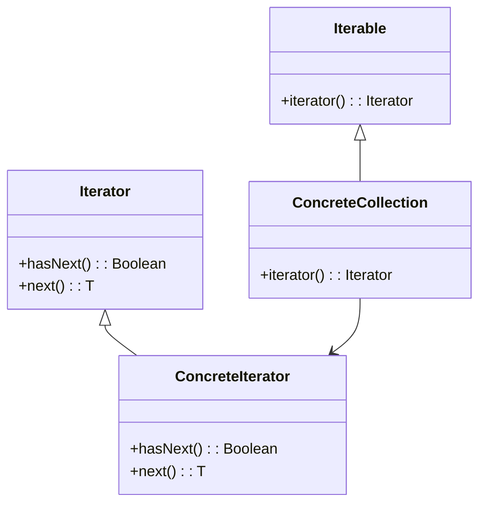

## 6.4 Iterator Pattern

The Iterator Pattern is a fundamental design pattern that provides a way to access elements of a collection sequentially without exposing the underlying representation. This pattern is particularly useful in Kotlin, where collections and sequences play a significant role in data manipulation and processing. In this section, we will delve into the intricacies of the Iterator Pattern, explore Kotlin's Iterable and Iterator interfaces, and demonstrate how to implement custom iterators and sequences.

### Intent

The primary intent of the Iterator Pattern is to provide a standard way to traverse a collection of objects. It decouples the traversal logic from the collection itself, allowing for flexible iteration mechanisms. This pattern is essential for enabling polymorphic iteration over different types of collections.

### Key Participants

- **Iterator Interface**: Defines methods for accessing and traversing elements.
- **Concrete Iterator**: Implements the Iterator interface and keeps track of the current position in the traversal.
- **Iterable Interface**: Provides an iterator() method that returns an instance of the Iterator interface.
- **Concrete Collection**: Implements the Iterable interface to return an iterator for its elements.

### Applicability

Use the Iterator Pattern when:

- You need to access elements of a collection without exposing its internal structure.
- You want to provide multiple traversal methods over a collection.
- You need to iterate over different types of collections in a uniform manner.

### Using Kotlin's Iterable and Iterator Interfaces

Kotlin provides built-in support for the Iterator Pattern through its Iterable and Iterator interfaces. Let's explore these interfaces and how they facilitate sequential access to collections.

#### Iterable Interface

The `Iterable` interface represents a collection that can be iterated over. It contains a single method, `iterator()`, which returns an instance of the `Iterator` interface.

```kotlin
interface Iterable<T> {
    operator fun iterator(): Iterator<T>
}
```

#### Iterator Interface

The `Iterator` interface provides methods to traverse a collection:

- `hasNext()`: Returns `true` if there are more elements to iterate over.
- `next()`: Returns the next element in the iteration.

```kotlin
interface Iterator<T> {
    operator fun hasNext(): Boolean
    operator fun next(): T
}
```

#### Example: Iterating Over a List

Let's demonstrate how to use the `Iterable` and `Iterator` interfaces to iterate over a list in Kotlin.

```kotlin
fun main() {
    val numbers = listOf(1, 2, 3, 4, 5)
    val iterator = numbers.iterator()

    while (iterator.hasNext()) {
        val number = iterator.next()
        println(number)
    }
}
```

In this example, we create a list of numbers and obtain an iterator using the `iterator()` method. We then use a `while` loop to iterate over the elements, printing each one.

### Implementing Custom Iterators

While Kotlin's standard library provides iterators for common collections, there are scenarios where custom iteration logic is required. Let's explore how to implement custom iterators in Kotlin.

#### Custom Iterator Example

Suppose we have a custom collection class, `CustomCollection`, and we want to provide a custom iterator for it.

```kotlin
class CustomCollection<T>(private val items: List<T>) : Iterable<T> {
    override fun iterator(): Iterator<T> {
        return CustomIterator(items)
    }

    private class CustomIterator<T>(private val items: List<T>) : Iterator<T> {
        private var index = 0

        override fun hasNext(): Boolean {
            return index < items.size
        }

        override fun next(): T {
            if (!hasNext()) throw NoSuchElementException()
            return items[index++]
        }
    }
}

fun main() {
    val customCollection = CustomCollection(listOf("A", "B", "C"))
    for (item in customCollection) {
        println(item)
    }
}
```

In this example, `CustomCollection` implements the `Iterable` interface and provides a custom iterator, `CustomIterator`, which iterates over the elements of the collection.

### Sequences in Kotlin

Kotlin's `Sequence` interface provides a way to represent potentially infinite collections. Sequences are useful for processing large datasets or when lazy evaluation is desired.

#### Creating a Sequence

A sequence can be created using the `sequence` function or by converting a collection to a sequence using the `asSequence()` method.

```kotlin
fun main() {
    val sequence = sequence {
        yield(1)
        yield(2)
        yield(3)
    }

    sequence.forEach { println(it) }
}
```

In this example, we create a sequence using the `sequence` function and yield values lazily. The `forEach` function is used to iterate over the sequence.

#### Custom Sequence Example

Let's implement a custom sequence that generates Fibonacci numbers.

```kotlin
fun fibonacciSequence(): Sequence<Int> = sequence {
    var a = 0
    var b = 1

    yield(a)
    yield(b)

    while (true) {
        val next = a + b
        yield(next)
        a = b
        b = next
    }
}

fun main() {
    val fibonacci = fibonacciSequence().take(10)
    println(fibonacci.toList())
}
```

In this example, the `fibonacciSequence` function returns a sequence of Fibonacci numbers. We use the `take` function to limit the sequence to the first 10 numbers.

### Design Considerations

When implementing the Iterator Pattern in Kotlin, consider the following:

- **Performance**: Custom iterators should be efficient, especially when dealing with large datasets.
- **Thread Safety**: Ensure that iterators are thread-safe if they will be used in concurrent environments.
- **Error Handling**: Handle cases where the iterator reaches the end of the collection gracefully.

### Differences and Similarities

The Iterator Pattern is often compared with other patterns, such as the Composite Pattern. While both patterns deal with collections, the Composite Pattern focuses on tree structures, whereas the Iterator Pattern focuses on sequential access.

### Visualizing the Iterator Pattern

To better understand the Iterator Pattern, let's visualize the relationship between the key participants using a class diagram.



In this diagram, `ConcreteCollection` implements the `Iterable` interface and provides an iterator, `ConcreteIterator`, which implements the `Iterator` interface.

### Try It Yourself

Experiment with the code examples provided in this section. Try modifying the `CustomCollection` class to support reverse iteration or implement a custom sequence that generates prime numbers. This hands-on approach will deepen your understanding of the Iterator Pattern in Kotlin.

### Knowledge Check

Before we conclude, let's reinforce your understanding with a few questions:

- What is the primary purpose of the Iterator Pattern?
- How does the `Iterable` interface facilitate iteration in Kotlin?
- What are the benefits of using sequences in Kotlin?

### Embrace the Journey

Remember, mastering design patterns is an ongoing journey. The Iterator Pattern is just one of many tools in your software engineering toolkit. As you continue to explore and apply these patterns, you'll become more adept at designing robust and maintainable software systems. Keep experimenting, stay curious, and enjoy the journey!

## Quiz Time!



### What is the primary purpose of the Iterator Pattern?

- [x] To provide a way to access elements of a collection sequentially without exposing its underlying structure.
- [ ] To sort elements in a collection.
- [ ] To filter elements in a collection.
- [ ] To modify elements in a collection.

> **Explanation:** The Iterator Pattern is designed to provide a standard way to traverse a collection without exposing its internal representation.

### Which interface in Kotlin represents a collection that can be iterated over?

- [x] Iterable
- [ ] Iterator
- [ ] Collection
- [ ] Sequence

> **Explanation:** The `Iterable` interface represents a collection that can be iterated over, providing an `iterator()` method that returns an `Iterator`.

### What method does the Iterator interface provide to check if there are more elements to iterate over?

- [x] hasNext()
- [ ] next()
- [ ] previous()
- [ ] reset()

> **Explanation:** The `hasNext()` method is used to check if there are more elements to iterate over in a collection.

### How can you create a sequence in Kotlin?

- [x] Using the `sequence` function or by converting a collection using `asSequence()`.
- [ ] Using the `listOf` function.
- [ ] Using the `mapOf` function.
- [ ] Using the `setOf` function.

> **Explanation:** A sequence can be created using the `sequence` function or by converting a collection to a sequence using the `asSequence()` method.

### What is a key advantage of using sequences in Kotlin?

- [x] Lazy evaluation
- [ ] Faster iteration
- [ ] Smaller memory footprint
- [ ] Easier syntax

> **Explanation:** Sequences in Kotlin are evaluated lazily, which can improve performance when processing large datasets or when only a subset of the data is needed.

### Which method in the Iterator interface returns the next element in the iteration?

- [x] next()
- [ ] hasNext()
- [ ] getNext()
- [ ] advance()

> **Explanation:** The `next()` method is used to retrieve the next element in the iteration.

### What should you consider when implementing custom iterators?

- [x] Performance, thread safety, and error handling
- [ ] Only performance
- [ ] Only thread safety
- [ ] Only error handling

> **Explanation:** When implementing custom iterators, it's important to consider performance, thread safety, and error handling to ensure robust and efficient iteration.

### How can you limit the number of elements in a sequence?

- [x] Using the `take` function
- [ ] Using the `limit` function
- [ ] Using the `restrict` function
- [ ] Using the `bound` function

> **Explanation:** The `take` function is used to limit the number of elements in a sequence.

### What is the relationship between the Iterable and Iterator interfaces?

- [x] Iterable provides an iterator() method that returns an Iterator.
- [ ] Iterator provides an iterable() method that returns an Iterable.
- [ ] They are unrelated.
- [ ] They are the same interface.

> **Explanation:** The `Iterable` interface provides an `iterator()` method that returns an `Iterator`, allowing for iteration over the collection.

### True or False: The Iterator Pattern is often compared with the Composite Pattern.

- [x] True
- [ ] False

> **Explanation:** True. The Iterator Pattern is often compared with the Composite Pattern, as both deal with collections, but they focus on different aspects of data structure and access.




