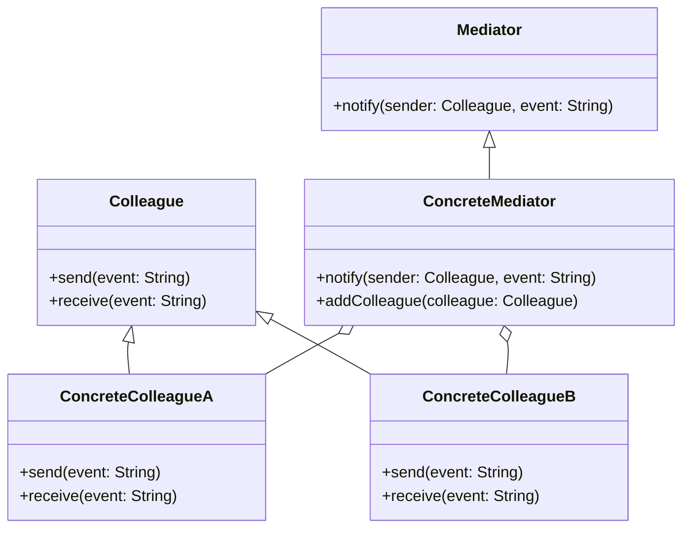

## 6.5 Mediator Pattern

In the world of software design, managing communication between multiple objects can become complex and cumbersome. The Mediator Pattern offers a solution by centralizing the communication logic, reducing dependencies, and simplifying the interactions between objects. This section delves into the Mediator Pattern, its implementation in Kotlin, and how it can be enhanced using Kotlin's coroutines and channels for efficient communication.

### Intent

The Mediator Pattern aims to reduce the complexity of communication between objects by introducing a mediator object that handles the interactions. Instead of objects referring to each other directly, they communicate through the mediator, promoting loose coupling and enhancing maintainability.

### Key Participants

1. **Mediator**: Defines an interface for communication between Colleague objects.
2. **ConcreteMediator**: Implements the Mediator interface and coordinates communication between Colleague objects.
3. **Colleague**: Represents an object that communicates with other Colleagues through the Mediator.
4. **ConcreteColleague**: Implements the Colleague interface and interacts with the Mediator.

### Applicability

Use the Mediator Pattern when:

- A set of objects communicate in complex ways, and you want to simplify their interactions.
- You want to promote loose coupling between interacting objects.
- You need to centralize control logic for communication.

### Implementing the Mediator Pattern in Kotlin

Let's explore how to implement the Mediator Pattern in Kotlin using interfaces and events.

#### Step 1: Define the Mediator Interface

The Mediator interface defines the contract for communication between Colleague objects.

```kotlin
interface Mediator {
    fun notify(sender: Colleague, event: String)
}
```

#### Step 2: Create the Colleague Class

The Colleague class represents an object that communicates through the Mediator.

```kotlin
abstract class Colleague(protected val mediator: Mediator) {
    abstract fun send(event: String)
    abstract fun receive(event: String)
}
```

#### Step 3: Implement ConcreteColleague Classes

ConcreteColleague classes implement the Colleague interface and interact with the Mediator.

```kotlin
class ConcreteColleagueA(mediator: Mediator) : Colleague(mediator) {
    override fun send(event: String) {
        println("ColleagueA sends event: $event")
        mediator.notify(this, event)
    }

    override fun receive(event: String) {
        println("ColleagueA receives event: $event")
    }
}

class ConcreteColleagueB(mediator: Mediator) : Colleague(mediator) {
    override fun send(event: String) {
        println("ColleagueB sends event: $event")
        mediator.notify(this, event)
    }

    override fun receive(event: String) {
        println("ColleagueB receives event: $event")
    }
}
```

#### Step 4: Implement the ConcreteMediator Class

The ConcreteMediator class coordinates communication between Colleague objects.

```kotlin
class ConcreteMediator : Mediator {
    private val colleagues = mutableListOf<Colleague>()

    fun addColleague(colleague: Colleague) {
        colleagues.add(colleague)
    }

    override fun notify(sender: Colleague, event: String) {
        for (colleague in colleagues) {
            if (colleague != sender) {
                colleague.receive(event)
            }
        }
    }
}
```

#### Step 5: Demonstrate the Mediator Pattern

Let's see the Mediator Pattern in action.

```kotlin
fun main() {
    val mediator = ConcreteMediator()

    val colleagueA = ConcreteColleagueA(mediator)
    val colleagueB = ConcreteColleagueB(mediator)

    mediator.addColleague(colleagueA)
    mediator.addColleague(colleagueB)

    colleagueA.send("Hello from A")
    colleagueB.send("Hello from B")
}
```

### Design Considerations

- **Centralized Control**: The Mediator centralizes control logic, making it easier to manage and modify communication between objects.
- **Loose Coupling**: By decoupling objects, the Mediator Pattern enhances maintainability and scalability.
- **Complexity**: While the Mediator Pattern reduces complexity between objects, the mediator itself can become complex if not managed properly.

### Using Coroutines and Channels for Communication

Kotlin's coroutines and channels provide powerful tools for managing asynchronous communication. Let's enhance the Mediator Pattern using these features.

#### Step 1: Update the Mediator Interface

Modify the Mediator interface to use coroutines for asynchronous communication.

```kotlin
interface CoroutineMediator {
    suspend fun notify(sender: CoroutineColleague, event: String)
}
```

#### Step 2: Create the CoroutineColleague Class

The CoroutineColleague class represents an object that communicates asynchronously through the Mediator.

```kotlin
abstract class CoroutineColleague(protected val mediator: CoroutineMediator) {
    abstract suspend fun send(event: String)
    abstract suspend fun receive(event: String)
}
```

#### Step 3: Implement ConcreteCoroutineColleague Classes

ConcreteCoroutineColleague classes implement the CoroutineColleague interface and interact with the Mediator.

```kotlin
class CoroutineColleagueA(mediator: CoroutineMediator) : CoroutineColleague(mediator) {
    override suspend fun send(event: String) {
        println("CoroutineColleagueA sends event: $event")
        mediator.notify(this, event)
    }

    override suspend fun receive(event: String) {
        println("CoroutineColleagueA receives event: $event")
    }
}

class CoroutineColleagueB(mediator: CoroutineMediator) : CoroutineColleague(mediator) {
    override suspend fun send(event: String) {
        println("CoroutineColleagueB sends event: $event")
        mediator.notify(this, event)
    }

    override suspend fun receive(event: String) {
        println("CoroutineColleagueB receives event: $event")
    }
}
```

#### Step 4: Implement the CoroutineMediator Class

The CoroutineMediator class coordinates asynchronous communication between CoroutineColleague objects using channels.

```kotlin
import kotlinx.coroutines.channels.Channel
import kotlinx.coroutines.launch
import kotlinx.coroutines.runBlocking

class CoroutineMediatorImpl : CoroutineMediator {
    private val channel = Channel<Pair<CoroutineColleague, String>>()

    init {
        runBlocking {
            launch {
                for ((sender, event) in channel) {
                    notifyAllExcept(sender, event)
                }
            }
        }
    }

    private suspend fun notifyAllExcept(sender: CoroutineColleague, event: String) {
        // Notify all colleagues except the sender
    }

    override suspend fun notify(sender: CoroutineColleague, event: String) {
        channel.send(sender to event)
    }
}
```

#### Step 5: Demonstrate the Coroutine Mediator Pattern

Let's see the Coroutine Mediator Pattern in action.

```kotlin
fun main() = runBlocking {
    val mediator = CoroutineMediatorImpl()

    val colleagueA = CoroutineColleagueA(mediator)
    val colleagueB = CoroutineColleagueB(mediator)

    launch { colleagueA.send("Hello from Coroutine A") }
    launch { colleagueB.send("Hello from Coroutine B") }
}
```

### Visualizing the Mediator Pattern

To better understand the Mediator Pattern, let's visualize the communication flow between objects.



### Differences and Similarities

The Mediator Pattern is often compared to the Observer Pattern. While both patterns handle communication between objects, the Mediator Pattern centralizes control, whereas the Observer Pattern allows objects to subscribe to events and react independently.

### Try It Yourself

Experiment with the Mediator Pattern by modifying the code examples:

- Add more Colleague classes and observe how the Mediator manages communication.
- Implement additional logic in the ConcreteMediator to handle specific events.
- Use different communication strategies, such as broadcasting events to all Colleagues.

### Knowledge Check

- What is the primary purpose of the Mediator Pattern?
- How does the Mediator Pattern promote loose coupling?
- What are the benefits of using coroutines and channels in the Mediator Pattern?

### Embrace the Journey

Remember, mastering design patterns is a journey. As you explore the Mediator Pattern, consider how it can simplify communication in your projects. Keep experimenting, stay curious, and enjoy the process of learning and applying these powerful design concepts!

## Quiz Time!



### What is the primary role of the Mediator Pattern?

- [x] To centralize communication between objects
- [ ] To create a hierarchy of classes
- [ ] To encapsulate object creation
- [ ] To provide a simplified interface to a complex subsystem

> **Explanation:** The Mediator Pattern centralizes communication between objects, reducing dependencies and simplifying interactions.

### Which of the following is a key benefit of the Mediator Pattern?

- [x] Loose coupling between objects
- [ ] Increased object creation
- [ ] Tight coupling between objects
- [ ] Simplified object hierarchy

> **Explanation:** The Mediator Pattern promotes loose coupling by allowing objects to communicate through a central mediator rather than directly with each other.

### How does the Mediator Pattern differ from the Observer Pattern?

- [x] The Mediator centralizes control, while the Observer allows independent reactions
- [ ] The Mediator uses inheritance, while the Observer uses composition
- [ ] The Mediator is used for object creation, while the Observer is for communication
- [ ] The Mediator simplifies interfaces, while the Observer encapsulates algorithms

> **Explanation:** The Mediator Pattern centralizes control of communication, whereas the Observer Pattern allows objects to independently subscribe and react to events.

### What Kotlin feature can enhance the Mediator Pattern for asynchronous communication?

- [x] Coroutines and channels
- [ ] Data classes
- [ ] Sealed classes
- [ ] Extension functions

> **Explanation:** Coroutines and channels in Kotlin provide powerful tools for managing asynchronous communication, enhancing the Mediator Pattern.

### In the Mediator Pattern, what is the role of a Colleague?

- [x] To communicate with other Colleagues through the Mediator
- [ ] To encapsulate object creation
- [ ] To manage the lifecycle of objects
- [ ] To provide a simplified interface to a complex subsystem

> **Explanation:** A Colleague communicates with other Colleagues through the Mediator, which coordinates the interactions.

### What is a potential drawback of the Mediator Pattern?

- [x] The mediator can become complex if not managed properly
- [ ] It increases dependencies between objects
- [ ] It requires extensive use of inheritance
- [ ] It limits the number of objects that can communicate

> **Explanation:** While the Mediator Pattern reduces complexity between objects, the mediator itself can become complex if it handles too much logic.

### Which of the following is a key participant in the Mediator Pattern?

- [x] ConcreteMediator
- [ ] AbstractFactory
- [ ] Singleton
- [ ] Decorator

> **Explanation:** The ConcreteMediator is a key participant in the Mediator Pattern, implementing the communication logic between Colleagues.

### How can you experiment with the Mediator Pattern in Kotlin?

- [x] By adding more Colleague classes and observing communication
- [ ] By reducing the number of Colleague classes
- [ ] By removing the Mediator class
- [ ] By using only synchronous communication

> **Explanation:** Experimenting with more Colleague classes and observing how the Mediator manages communication can deepen understanding of the pattern.

### What is the main advantage of using channels in the Mediator Pattern?

- [x] Efficient asynchronous communication
- [ ] Simplified object creation
- [ ] Enhanced inheritance hierarchy
- [ ] Reduced memory usage

> **Explanation:** Channels in Kotlin provide efficient asynchronous communication, making them ideal for enhancing the Mediator Pattern.

### True or False: The Mediator Pattern is used to encapsulate object creation.

- [ ] True
- [x] False

> **Explanation:** False. The Mediator Pattern is not used for object creation; it is used to centralize communication between objects.


