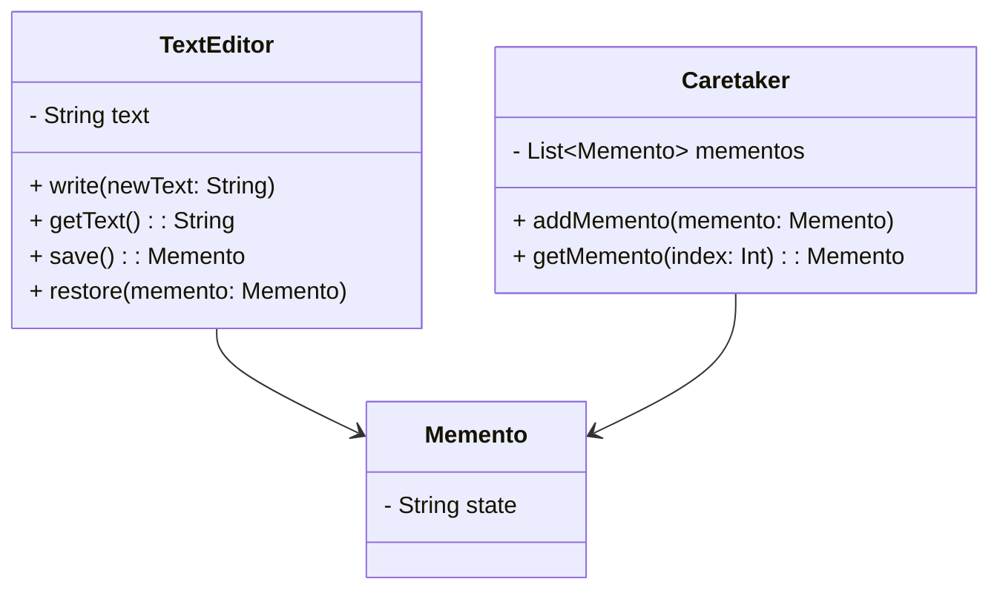

## 6.6 Memento Pattern

The Memento Pattern is a behavioral design pattern that allows you to capture and restore the state of an object without violating its encapsulation. This pattern is particularly useful when you need to provide undo functionality or save the state of an object at a particular point in time. In this section, we will explore how to implement the Memento Pattern in Kotlin, leveraging Kotlin's powerful features such as data classes and serialization.

### Intent

The primary intent of the Memento Pattern is to capture the internal state of an object so that it can be restored to that state later. This is achieved without exposing the object's internal structure or implementation details. The pattern is composed of three main participants:

1. **Originator**: The object whose state needs to be saved and restored.
2. **Memento**: A representation of the saved state.
3. **Caretaker**: Manages the mementos and is responsible for storing and restoring the state.

### Key Participants

- **Originator**: This is the object whose state you want to save. It creates a memento containing a snapshot of its current state and uses the memento to restore its state.
- **Memento**: This is a value object that acts as a snapshot of the originator's state. It is immutable and only accessible by the originator.
- **Caretaker**: This is responsible for keeping track of mementos. It requests a memento from the originator, stores it, and later provides it back to the originator when needed.

### Applicability

Use the Memento Pattern when:

- You need to save and restore the state of an object.
- You want to implement undo functionality.
- You want to maintain encapsulation boundaries by not exposing the internal state of an object.

### Implementing Mementos with Data Classes

Kotlin's data classes are a perfect fit for implementing mementos due to their concise syntax and built-in support for copying and equality checking. Let's walk through an example of implementing the Memento Pattern in Kotlin.

#### Example: Text Editor with Undo Functionality

Imagine a simple text editor where you want to implement undo functionality. The editor will be our originator, and we will use a data class to represent the memento.

```kotlin
// Originator
class TextEditor {
    private var text: String = ""

    fun write(newText: String) {
        text += newText
    }

    fun getText(): String = text

    fun save(): Memento = Memento(text)

    fun restore(memento: Memento) {
        text = memento.state
    }

    // Memento
    data class Memento(val state: String)
}

// Caretaker
class Caretaker {
    private val mementos: MutableList<TextEditor.Memento> = mutableListOf()

    fun addMemento(memento: TextEditor.Memento) {
        mementos.add(memento)
    }

    fun getMemento(index: Int): TextEditor.Memento? {
        return if (index in mementos.indices) mementos[index] else null
    }
}

fun main() {
    val editor = TextEditor()
    val caretaker = Caretaker()

    editor.write("Hello, ")
    caretaker.addMemento(editor.save())

    editor.write("World!")
    caretaker.addMemento(editor.save())

    println("Current Text: ${editor.getText()}") // Output: Hello, World!

    editor.restore(caretaker.getMemento(0)!!)
    println("After Undo: ${editor.getText()}") // Output: Hello, 
}
```

### Caretaker Management of Mementos

The caretaker is responsible for managing the mementos. It stores the mementos and provides them back to the originator when needed. In the above example, the `Caretaker` class uses a list to store mementos. This allows us to implement undo functionality by restoring the previous state of the text editor.

### Serialization Considerations

When implementing the Memento Pattern, especially in distributed systems or applications that require persistence, serialization becomes an important consideration. Kotlin provides several options for serialization, including the kotlinx.serialization library.

#### Example: Serializing Mementos

Let's extend our text editor example to include serialization of mementos.

```kotlin
import kotlinx.serialization.*
import kotlinx.serialization.json.*

// Memento with Serialization
@Serializable
data class SerializableMemento(val state: String)

class SerializableTextEditor {
    private var text: String = ""

    fun write(newText: String) {
        text += newText
    }

    fun getText(): String = text

    fun save(): SerializableMemento = SerializableMemento(text)

    fun restore(memento: SerializableMemento) {
        text = memento.state
    }
}

fun main() {
    val editor = SerializableTextEditor()
    editor.write("Hello, Kotlin!")

    // Serialize the memento
    val memento = editor.save()
    val json = Json.encodeToString(memento)
    println("Serialized Memento: $json")

    // Deserialize the memento
    val deserializedMemento = Json.decodeFromString<SerializableMemento>(json)
    editor.restore(deserializedMemento)
    println("Restored Text: ${editor.getText()}") // Output: Hello, Kotlin!
}
```

### Design Considerations

When using the Memento Pattern, consider the following:

- **Memory Usage**: Storing multiple mementos can consume significant memory, especially if the state is large. Consider using compression or limiting the number of stored mementos.
- **Serialization**: Ensure that the memento is serializable if you need to persist it. Use Kotlin's serialization library for efficient serialization and deserialization.
- **Immutability**: Mementos should be immutable to prevent accidental changes to the saved state.

### Differences and Similarities

The Memento Pattern is often compared with the Command Pattern, as both can be used to implement undo functionality. However, the Command Pattern focuses on encapsulating actions as objects, whereas the Memento Pattern focuses on capturing and restoring state. Use the Memento Pattern when you need to save the state of an object, and the Command Pattern when you need to encapsulate operations.

### Visualizing the Memento Pattern

To better understand the Memento Pattern, let's visualize the interaction between the originator, memento, and caretaker using a class diagram.



### Try It Yourself

Experiment with the Memento Pattern by modifying the code examples:

- **Add Redo Functionality**: Extend the caretaker to support redo operations by maintaining a separate stack for undone mementos.
- **Limit Memento Storage**: Implement a mechanism to limit the number of stored mementos, such as a fixed-size queue.
- **Enhance Serialization**: Explore different serialization formats, such as XML or ProtoBuf, and compare their performance.

### Knowledge Check

- What is the primary purpose of the Memento Pattern?
- How does the Memento Pattern maintain encapsulation?
- What are the key participants in the Memento Pattern?
- How can you implement the Memento Pattern in Kotlin using data classes?
- What are some considerations when serializing mementos?

### Embrace the Journey

Remember, mastering design patterns is a journey. The Memento Pattern is just one of many patterns that can help you build robust and maintainable software. Keep experimenting, stay curious, and enjoy the journey!

## Quiz Time!



### What is the primary purpose of the Memento Pattern?

- [x] To capture and restore the state of an object without violating encapsulation.
- [ ] To encapsulate actions as objects.
- [ ] To provide a simplified interface to a complex subsystem.
- [ ] To define a family of interchangeable algorithms.

> **Explanation:** The Memento Pattern is designed to capture and restore the state of an object without exposing its internal structure.

### Which participant in the Memento Pattern is responsible for storing and restoring the state?

- [ ] Originator
- [x] Caretaker
- [ ] Memento
- [ ] Observer

> **Explanation:** The Caretaker is responsible for managing mementos, storing them, and providing them back to the originator when needed.

### How does the Memento Pattern maintain encapsulation?

- [x] By using a separate memento object to store the state.
- [ ] By exposing the internal state of the object.
- [ ] By using inheritance to share state.
- [ ] By using global variables to store state.

> **Explanation:** The Memento Pattern maintains encapsulation by using a separate memento object to store the state, keeping the internal structure of the originator hidden.

### What is a key advantage of using Kotlin's data classes for mementos?

- [x] They provide a concise syntax and built-in support for copying and equality checking.
- [ ] They allow for dynamic typing and runtime type checking.
- [ ] They enable direct manipulation of the originator's state.
- [ ] They automatically serialize to XML.

> **Explanation:** Kotlin's data classes offer a concise syntax and built-in support for copying and equality checking, making them ideal for implementing mementos.

### What is a consideration when serializing mementos?

- [x] Ensuring the memento is serializable if persistence is needed.
- [ ] Using global variables to store serialized data.
- [ ] Avoiding the use of data classes for serialization.
- [ ] Always using XML for serialization.

> **Explanation:** When serializing mementos, it's important to ensure they are serializable, especially if you need to persist them.

### Which pattern is often compared with the Memento Pattern for implementing undo functionality?

- [x] Command Pattern
- [ ] Observer Pattern
- [ ] Strategy Pattern
- [ ] Decorator Pattern

> **Explanation:** The Command Pattern is often compared with the Memento Pattern for implementing undo functionality, as both can be used for this purpose.

### What is a potential drawback of the Memento Pattern?

- [x] High memory usage if many mementos are stored.
- [ ] Difficulty in maintaining encapsulation.
- [ ] Inability to restore state.
- [ ] Complexity in implementing the originator.

> **Explanation:** A potential drawback of the Memento Pattern is high memory usage if many mementos are stored, especially if the state is large.

### How can you limit the number of stored mementos?

- [x] By implementing a fixed-size queue or stack.
- [ ] By using global variables to store mementos.
- [ ] By exposing the internal state of the originator.
- [ ] By using inheritance to share state.

> **Explanation:** You can limit the number of stored mementos by implementing a fixed-size queue or stack, ensuring that only a certain number of mementos are kept at any time.

### What is the role of the Originator in the Memento Pattern?

- [x] To create and restore mementos.
- [ ] To manage the storage of mementos.
- [ ] To provide a simplified interface to a complex subsystem.
- [ ] To define a family of interchangeable algorithms.

> **Explanation:** The Originator is responsible for creating and restoring mementos, capturing its own state and later restoring it.

### True or False: The Memento Pattern exposes the internal structure of the originator.

- [ ] True
- [x] False

> **Explanation:** False. The Memento Pattern does not expose the internal structure of the originator, maintaining encapsulation by using a separate memento object.


