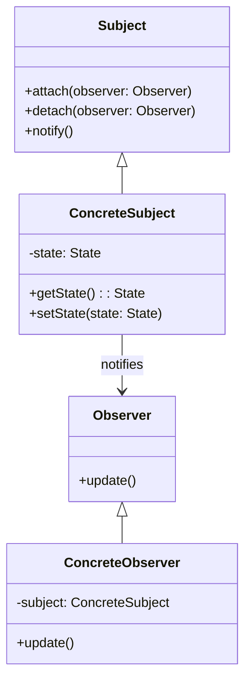

## 6.7 Observer Pattern

The Observer Pattern is a fundamental design pattern in software engineering, facilitating the publish-subscribe mechanism. It allows an object, known as the subject, to maintain a list of dependents, called observers, and automatically notify them of any state changes. This pattern is particularly useful in scenarios where a change in one object requires updates to other objects without tightly coupling them.

### Intent

The primary intent of the Observer Pattern is to define a one-to-many dependency between objects, ensuring that when one object changes state, all its dependents are notified and updated automatically. This pattern promotes loose coupling between the subject and its observers, enhancing flexibility and scalability.

### Key Participants

1. **Subject**: Maintains a list of observers and provides methods to attach, detach, and notify them.
2. **Observer**: Defines an interface for objects that should be notified of changes in the subject.
3. **ConcreteSubject**: Implements the subject interface and maintains the state of interest.
4. **ConcreteObserver**: Implements the observer interface and updates its state in response to notifications from the subject.

### Applicability

Use the Observer Pattern when:

- Changes to one object require changes to others, and you want to avoid tight coupling.
- An abstraction has two aspects, one dependent on the other.
- You want to create a reusable and flexible system for event handling.

### Implementing the Observer Pattern in Kotlin

Kotlin offers several features and libraries that make implementing the Observer Pattern both efficient and idiomatic. Let's explore some of these techniques.

#### Using Delegated Properties and Observable Patterns

Kotlin's standard library provides support for observable properties through delegated properties. This feature allows you to automatically notify observers when a property changes.

```kotlin
import kotlin.properties.Delegates

class WeatherStation {
    var temperature: Float by Delegates.observable(0.0f) { property, oldValue, newValue ->
        println("Temperature changed from $oldValue to $newValue")
    }
}

fun main() {
    val weatherStation = WeatherStation()
    weatherStation.temperature = 25.0f
    weatherStation.temperature = 30.0f
}
```

In this example, the `temperature` property is observed, and any change triggers a lambda function that prints the old and new values.

#### Leveraging Kotlin Flows

Kotlin Flows are part of the `kotlinx.coroutines` library and provide a powerful way to handle asynchronous data streams. They are particularly useful for implementing reactive programming patterns.

```kotlin
import kotlinx.coroutines.*
import kotlinx.coroutines.flow.*

fun main() = runBlocking {
    val temperatureFlow = flow {
        repeat(5) {
            emit((20..30).random().toFloat())
            delay(1000)
        }
    }

    temperatureFlow.collect { temperature ->
        println("New temperature: $temperature")
    }
}
```

In this example, a flow is created to emit random temperature values every second. The `collect` function is used to observe and react to these emissions.

#### Using LiveData in Android

LiveData is a lifecycle-aware data holder class provided by the Android Jetpack library. It is designed to hold data that can be observed within a given lifecycle.

```kotlin
import androidx.lifecycle.LiveData
import androidx.lifecycle.MutableLiveData
import androidx.lifecycle.ViewModel

class WeatherViewModel : ViewModel() {
    private val _temperature = MutableLiveData<Float>()
    val temperature: LiveData<Float> get() = _temperature

    fun updateTemperature(newTemperature: Float) {
        _temperature.value = newTemperature
    }
}
```

In this Android-specific example, `LiveData` is used to observe changes in temperature. The `WeatherViewModel` class updates the temperature, and any observers of `temperature` will be notified of changes.

#### Reactive Programming with Flow and SharedFlow

Kotlin's `SharedFlow` is a hot stream that can be used to broadcast events to multiple subscribers. It is particularly useful in scenarios where multiple observers need to react to the same event.

```kotlin
import kotlinx.coroutines.*
import kotlinx.coroutines.flow.*

fun main() = runBlocking {
    val sharedFlow = MutableSharedFlow<Float>()

    launch {
        sharedFlow.collect { temperature ->
            println("Observer 1: New temperature: $temperature")
        }
    }

    launch {
        sharedFlow.collect { temperature ->
            println("Observer 2: New temperature: $temperature")
        }
    }

    launch {
        repeat(5) {
            sharedFlow.emit((20..30).random().toFloat())
            delay(1000)
        }
    }
}
```

In this example, a `MutableSharedFlow` is used to emit temperature values. Two observers collect these values, demonstrating how `SharedFlow` can broadcast events to multiple subscribers.

### Diagrams

To better understand the Observer Pattern, let's visualize the interaction between the subject and observers using a class diagram.



This diagram illustrates the relationship between the subject and observers, highlighting the methods used for attaching, detaching, and notifying observers.

### Design Considerations

When implementing the Observer Pattern in Kotlin, consider the following:

- **Thread Safety**: Ensure that the subject's state changes and observer notifications are thread-safe, especially in concurrent environments.
- **Memory Leaks**: Be cautious of memory leaks caused by long-lived observers. Consider using weak references or lifecycle-aware components like LiveData.
- **Performance**: Minimize the overhead of notifying observers by batching updates or using efficient data structures.

### Differences and Similarities

The Observer Pattern is often compared to the Publish-Subscribe Pattern. While both involve broadcasting events to multiple listeners, the Observer Pattern typically involves a direct relationship between the subject and observers, whereas Publish-Subscribe decouples the publisher and subscribers through a message broker.

### Try It Yourself

To deepen your understanding of the Observer Pattern, try modifying the code examples:

- Experiment with different types of data streams using Kotlin Flows.
- Implement a custom observer pattern using interfaces and classes.
- Use LiveData in an Android project to observe changes in UI components.

### Knowledge Check

- What are the key participants in the Observer Pattern?
- How does Kotlin's `SharedFlow` differ from a regular `Flow`?
- What are some considerations for ensuring thread safety in the Observer Pattern?

### Embrace the Journey

Remember, mastering design patterns is a journey. As you explore the Observer Pattern in Kotlin, you'll gain insights into building flexible and scalable software systems. Keep experimenting, stay curious, and enjoy the journey!

## Quiz Time!



### What is the primary intent of the Observer Pattern?

- [x] To define a one-to-many dependency between objects.
- [ ] To encapsulate a request as an object.
- [ ] To provide a way to access elements of a collection sequentially.
- [ ] To separate the construction of a complex object from its representation.

> **Explanation:** The Observer Pattern's primary intent is to define a one-to-many dependency between objects, ensuring that when one object changes state, all its dependents are notified and updated automatically.

### Which Kotlin feature is used to create observable properties?

- [x] Delegated Properties
- [ ] Extension Functions
- [ ] Sealed Classes
- [ ] Data Classes

> **Explanation:** Kotlin's Delegated Properties feature allows you to create observable properties that automatically notify observers of changes.

### What is the difference between a Flow and a SharedFlow in Kotlin?

- [x] A Flow is a cold stream, while a SharedFlow is a hot stream.
- [ ] A Flow is a hot stream, while a SharedFlow is a cold stream.
- [ ] Both are cold streams.
- [ ] Both are hot streams.

> **Explanation:** In Kotlin, a Flow is a cold stream, meaning it starts emitting values when a collector is present. A SharedFlow, on the other hand, is a hot stream that can broadcast values to multiple subscribers.

### What is a key consideration when using the Observer Pattern in concurrent environments?

- [x] Thread Safety
- [ ] Code Readability
- [ ] Memory Usage
- [ ] Code Complexity

> **Explanation:** Thread safety is a key consideration when using the Observer Pattern in concurrent environments, as state changes and observer notifications need to be handled safely.

### Which Android component is lifecycle-aware and can be used to observe data changes?

- [x] LiveData
- [ ] ViewModel
- [ ] RecyclerView
- [ ] Fragment

> **Explanation:** LiveData is a lifecycle-aware component in Android that can be used to observe data changes and update the UI accordingly.

### How can you prevent memory leaks when using the Observer Pattern?

- [x] Use weak references or lifecycle-aware components.
- [ ] Increase the heap size.
- [ ] Use more observers.
- [ ] Avoid using threads.

> **Explanation:** To prevent memory leaks when using the Observer Pattern, you can use weak references or lifecycle-aware components like LiveData to manage observer lifecycles.

### What is a common use case for the Observer Pattern?

- [x] Implementing event handling systems.
- [ ] Building complex mathematical models.
- [ ] Designing database schemas.
- [ ] Creating static web pages.

> **Explanation:** A common use case for the Observer Pattern is implementing event handling systems, where changes in one part of the system need to be communicated to other parts.

### What is a potential drawback of the Observer Pattern?

- [x] It can lead to memory leaks if not managed properly.
- [ ] It increases code complexity significantly.
- [ ] It requires a lot of boilerplate code.
- [ ] It is not suitable for real-time systems.

> **Explanation:** A potential drawback of the Observer Pattern is that it can lead to memory leaks if observers are not managed properly, especially in long-lived applications.

### What is the role of the ConcreteObserver in the Observer Pattern?

- [x] It updates its state in response to notifications from the subject.
- [ ] It maintains a list of observers.
- [ ] It defines an interface for objects that should be notified.
- [ ] It provides methods to attach and detach observers.

> **Explanation:** The ConcreteObserver in the Observer Pattern updates its state in response to notifications from the subject, implementing the observer interface.

### True or False: The Observer Pattern is the same as the Publish-Subscribe Pattern.

- [ ] True
- [x] False

> **Explanation:** False. While the Observer Pattern and Publish-Subscribe Pattern both involve broadcasting events to multiple listeners, they differ in their implementation. The Observer Pattern involves a direct relationship between the subject and observers, whereas Publish-Subscribe decouples the publisher and subscribers through a message broker.


