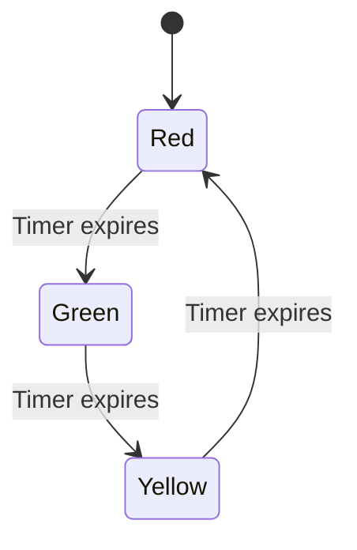

## 6.8 State Pattern

The State Pattern is a behavioral design pattern that allows an object to change its behavior when its internal state changes. This pattern is particularly useful when an object must change its behavior at runtime depending on its state. By encapsulating state-specific behavior into separate classes, the State Pattern promotes cleaner, more maintainable code by avoiding complex conditional logic.

### Intent

The primary intent of the State Pattern is to allow an object to alter its behavior when its internal state changes. The object will appear to change its class. This pattern is useful in scenarios where an object can be in one of several states, and the behavior of the object changes based on its current state.

### Key Participants

1. **Context**: Maintains an instance of a ConcreteState subclass that defines the current state.
2. **State**: Defines an interface for encapsulating the behavior associated with a particular state of the Context.
3. **ConcreteState**: Implements the behavior associated with a state of the Context.

### Applicability

Use the State Pattern when:

- An object’s behavior depends on its state, and it must change its behavior at runtime depending on that state.
- Operations have large, multipart conditional statements that depend on the object’s state. The State Pattern puts each branch of the conditional in a separate class.

### Implementing the State Pattern in Kotlin

Kotlin provides powerful features such as sealed classes and enum classes that can be effectively used to implement the State Pattern. These features allow for a more idiomatic and concise implementation of the pattern.

#### Using Sealed Classes

Sealed classes in Kotlin are a great fit for implementing the State Pattern because they allow you to define a restricted class hierarchy. This means you can define a set of subclasses that are known at compile time, which makes it easier to handle state transitions and encapsulation.

```kotlin
// Define the State interface
sealed class State {
    abstract fun handle(context: Context)
}

// Concrete States
class StateA : State() {
    override fun handle(context: Context) {
        println("StateA handling request.")
        context.state = StateB() // Transition to StateB
    }
}

class StateB : State() {
    override fun handle(context: Context) {
        println("StateB handling request.")
        context.state = StateA() // Transition to StateA
    }
}

// Context class
class Context(var state: State) {
    fun request() {
        state.handle(this)
    }
}

// Usage
fun main() {
    val context = Context(StateA())
    context.request() // StateA handling request.
    context.request() // StateB handling request.
}
```

In this example, we define a `State` sealed class with two concrete states: `StateA` and `StateB`. The `Context` class maintains a reference to a `State` object and delegates state-specific behavior to this object. The `handle` method in each state class defines the behavior and transitions to the next state.

#### Using Enum Classes

Enum classes can also be used to implement the State Pattern, especially when the number of states is fixed and known at compile time. Enum classes provide a simple way to define a set of constants, each of which can have its own behavior.

```kotlin
// Define the State enum
enum class State {
    STATE_A {
        override fun handle(context: Context) {
            println("StateA handling request.")
            context.state = STATE_B // Transition to StateB
        }
    },
    STATE_B {
        override fun handle(context: Context) {
            println("StateB handling request.")
            context.state = STATE_A // Transition to StateA
        }
    };

    abstract fun handle(context: Context)
}

// Context class
class Context(var state: State) {
    fun request() {
        state.handle(this)
    }
}

// Usage
fun main() {
    val context = Context(State.STATE_A)
    context.request() // StateA handling request.
    context.request() // StateB handling request.
}
```

In this example, each constant in the `State` enum class overrides the `handle` method to define its behavior and transition logic. The `Context` class interacts with the current state in a similar manner as with sealed classes.

### State Transitions and Encapsulation

State transitions are a crucial aspect of the State Pattern. In the examples above, state transitions are handled within the `handle` method of each state. This encapsulates the logic for transitioning from one state to another within the state classes themselves, promoting a clean separation of concerns.

Encapsulation is achieved by keeping the state-specific behavior and transition logic within the state classes. The `Context` class is only responsible for maintaining the current state and delegating requests to the state object. This separation of responsibilities makes the code easier to maintain and extend.

### Design Considerations

When implementing the State Pattern, consider the following:

- **Complexity**: The State Pattern can introduce additional complexity by requiring a class for each state. However, this complexity is often offset by the clarity and maintainability it provides.
- **State Explosion**: If there are a large number of states, the number of classes can grow significantly. Consider using other patterns like the Strategy Pattern if the number of states becomes unwieldy.
- **State Transitions**: Ensure that state transitions are well-defined and that the system can handle unexpected transitions gracefully.

### Differences and Similarities

The State Pattern is often confused with the Strategy Pattern. While both patterns involve encapsulating behavior, they serve different purposes:

- **State Pattern**: Focuses on changing behavior based on the state of the object. The state itself can change over time.
- **Strategy Pattern**: Focuses on selecting an algorithm or behavior at runtime. The strategy is typically chosen at the start and does not change.

### Try It Yourself

To deepen your understanding of the State Pattern, try modifying the code examples above:

- Add a new state and define its behavior.
- Implement a more complex state transition logic.
- Use the State Pattern in a real-world scenario, such as a traffic light system or a vending machine.

### Visualizing State Transitions

To better understand how state transitions work in the State Pattern, consider the following state transition diagram for a simple traffic light system:



In this diagram, the traffic light system transitions between three states: Red, Green, and Yellow. Each state transition occurs when a timer expires, illustrating a simple yet effective use of the State Pattern.

### References and Links

For further reading on the State Pattern and its applications, consider the following resources:

- [Design Patterns: Elements of Reusable Object-Oriented Software](https://en.wikipedia.org/wiki/Design_Patterns) by Erich Gamma, Richard Helm, Ralph Johnson, and John Vlissides.
- [Kotlin Documentation on Sealed Classes](https://kotlinlang.org/docs/sealed-classes.html)
- [Kotlin Documentation on Enum Classes](https://kotlinlang.org/docs/enum-classes.html)

### Knowledge Check

Before we wrap up, let's test your understanding of the State Pattern with a few questions:

1. What is the primary intent of the State Pattern?
2. How do sealed classes in Kotlin help implement the State Pattern?
3. What is the difference between the State Pattern and the Strategy Pattern?
4. How does the State Pattern promote encapsulation?
5. What are some potential drawbacks of using the State Pattern?

### Embrace the Journey

Remember, mastering design patterns is a journey. As you continue to explore and apply the State Pattern in your projects, you'll gain a deeper understanding of how to design robust, maintainable software. Keep experimenting, stay curious, and enjoy the journey!

## Quiz Time!



### What is the primary intent of the State Pattern?

- [x] To allow an object to alter its behavior when its internal state changes.
- [ ] To encapsulate algorithms within a class.
- [ ] To provide a simplified interface to a complex subsystem.
- [ ] To define a family of interchangeable algorithms.

> **Explanation:** The State Pattern allows an object to change its behavior when its internal state changes, making it appear as if the object has changed its class.

### How do sealed classes in Kotlin help implement the State Pattern?

- [x] They allow defining a restricted class hierarchy known at compile time.
- [ ] They provide a way to define constants with behavior.
- [ ] They enable dynamic method dispatch.
- [ ] They simplify the creation of singleton objects.

> **Explanation:** Sealed classes in Kotlin allow you to define a restricted class hierarchy, making it easier to handle state transitions and encapsulation.

### What is the difference between the State Pattern and the Strategy Pattern?

- [x] The State Pattern focuses on changing behavior based on the object's state, while the Strategy Pattern focuses on selecting an algorithm at runtime.
- [ ] The State Pattern is used for structural changes, while the Strategy Pattern is used for behavioral changes.
- [ ] The State Pattern uses inheritance, while the Strategy Pattern uses composition.
- [ ] The State Pattern is for static behavior, while the Strategy Pattern is for dynamic behavior.

> **Explanation:** The State Pattern changes behavior based on the object's state, whereas the Strategy Pattern selects an algorithm at runtime.

### How does the State Pattern promote encapsulation?

- [x] By keeping state-specific behavior and transition logic within state classes.
- [ ] By using private fields to hide data.
- [ ] By providing getter and setter methods.
- [ ] By implementing interfaces for all classes.

> **Explanation:** The State Pattern encapsulates state-specific behavior and transition logic within state classes, promoting a clean separation of concerns.

### What are some potential drawbacks of using the State Pattern?

- [x] Increased complexity and potential state explosion.
- [ ] Difficulty in maintaining code.
- [ ] Lack of flexibility in changing behavior.
- [ ] Inability to handle multiple states.

> **Explanation:** The State Pattern can introduce additional complexity and potential state explosion if there are many states.

### Which Kotlin feature is particularly useful for implementing the State Pattern?

- [x] Sealed classes
- [ ] Data classes
- [ ] Companion objects
- [ ] Inline functions

> **Explanation:** Sealed classes are particularly useful for implementing the State Pattern due to their ability to define a restricted class hierarchy.

### In the State Pattern, what role does the Context play?

- [x] Maintains an instance of a ConcreteState subclass that defines the current state.
- [ ] Defines an interface for encapsulating behavior.
- [ ] Implements the behavior associated with a state.
- [ ] Provides a simplified interface to a complex subsystem.

> **Explanation:** The Context maintains an instance of a ConcreteState subclass that defines the current state.

### How can the State Pattern improve code maintainability?

- [x] By reducing complex conditional logic.
- [ ] By increasing the number of classes.
- [ ] By using global variables.
- [ ] By relying on static methods.

> **Explanation:** The State Pattern improves code maintainability by reducing complex conditional logic and encapsulating state-specific behavior.

### What is a common use case for the State Pattern?

- [x] Implementing a traffic light system.
- [ ] Sorting a list of numbers.
- [ ] Calculating the factorial of a number.
- [ ] Parsing a JSON file.

> **Explanation:** A traffic light system is a common use case for the State Pattern, as it involves state transitions and behavior changes.

### True or False: The State Pattern is only applicable in object-oriented programming.

- [ ] True
- [x] False

> **Explanation:** The State Pattern can be applied in various programming paradigms, including object-oriented and functional programming.


