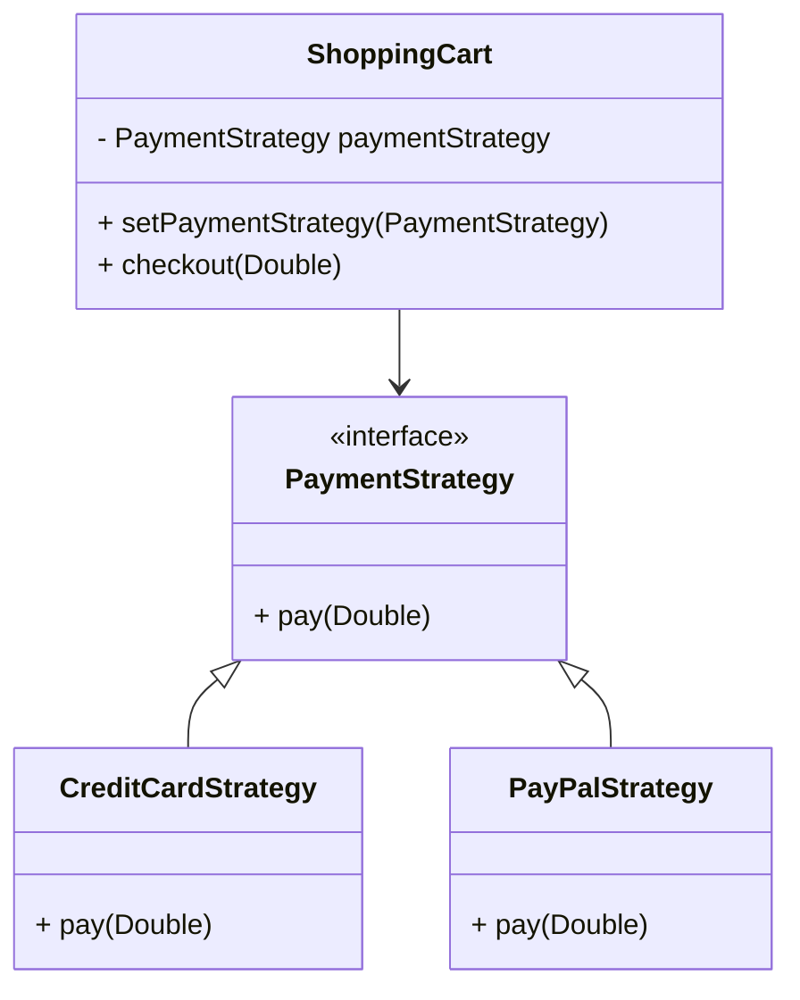

## 6.9 Strategy Pattern

The Strategy Pattern is a behavioral design pattern that enables defining a family of algorithms, encapsulating each one, and making them interchangeable. This pattern allows the algorithm to vary independently from clients that use it. In Kotlin, the Strategy Pattern can be elegantly implemented using function types and lambdas, making the code more concise and expressive.

### Intent

The primary intent of the Strategy Pattern is to define a set of algorithms, encapsulate each one, and make them interchangeable. This pattern allows the client to choose an algorithm at runtime, providing flexibility and promoting the open/closed principle by enabling the addition of new strategies without altering existing code.

### Key Participants

1. **Strategy**: An interface common to all supported algorithms. Context uses this interface to call the algorithm defined by a ConcreteStrategy.
2. **ConcreteStrategy**: Classes that implement the Strategy interface, each providing a different implementation of the algorithm.
3. **Context**: Maintains a reference to a Strategy object and is configured with a ConcreteStrategy object. Context interacts with the Strategy interface to execute the algorithm.

### Applicability

Use the Strategy Pattern when:

- You have multiple related classes that differ only in their behavior.
- You need different variants of an algorithm.
- You want to avoid exposing complex, algorithm-specific data structures.
- A class defines many behaviors, and these appear as multiple conditional statements in its operations.

### Implementing Strategy Pattern in Kotlin

Kotlin's support for higher-order functions and lambdas makes it particularly well-suited for implementing the Strategy Pattern. Let's explore how to implement this pattern using Kotlin's features.

#### Traditional Implementation with Interfaces

First, let's look at a traditional implementation using interfaces:

```kotlin
// Strategy interface
interface PaymentStrategy {
    fun pay(amount: Double)
}

// ConcreteStrategy A
class CreditCardStrategy(private val cardNumber: String) : PaymentStrategy {
    override fun pay(amount: Double) {
        println("Paid $$amount using Credit Card ending with ${cardNumber.takeLast(4)}")
    }
}

// ConcreteStrategy B
class PayPalStrategy(private val email: String) : PaymentStrategy {
    override fun pay(amount: Double) {
        println("Paid $$amount using PayPal account $email")
    }
}

// Context
class ShoppingCart {
    private var paymentStrategy: PaymentStrategy? = null

    fun setPaymentStrategy(strategy: PaymentStrategy) {
        this.paymentStrategy = strategy
    }

    fun checkout(amount: Double) {
        paymentStrategy?.pay(amount) ?: println("Payment strategy not set!")
    }
}

// Usage
fun main() {
    val cart = ShoppingCart()
    cart.setPaymentStrategy(CreditCardStrategy("1234-5678-9012-3456"))
    cart.checkout(100.0)

    cart.setPaymentStrategy(PayPalStrategy("user@example.com"))
    cart.checkout(200.0)
}
```

In this example, `PaymentStrategy` is the Strategy interface, `CreditCardStrategy` and `PayPalStrategy` are ConcreteStrategies, and `ShoppingCart` is the Context.

#### Using Function Types and Lambdas

Kotlin allows us to simplify the Strategy Pattern using function types and lambdas, eliminating the need for explicit strategy classes:

```kotlin
// Define a function type for the strategy
typealias PaymentStrategy = (Double) -> Unit

// Context
class ShoppingCart {
    private var paymentStrategy: PaymentStrategy? = null

    fun setPaymentStrategy(strategy: PaymentStrategy) {
        this.paymentStrategy = strategy
    }

    fun checkout(amount: Double) {
        paymentStrategy?.invoke(amount) ?: println("Payment strategy not set!")
    }
}

// Usage
fun main() {
    val cart = ShoppingCart()

    // Using lambdas as strategies
    cart.setPaymentStrategy { amount ->
        println("Paid $$amount using Credit Card")
    }
    cart.checkout(100.0)

    cart.setPaymentStrategy { amount ->
        println("Paid $$amount using PayPal")
    }
    cart.checkout(200.0)
}
```

Here, we define `PaymentStrategy` as a function type `(Double) -> Unit`, and use lambdas to implement different payment strategies. This approach reduces boilerplate code and leverages Kotlin's expressive syntax.

### Design Considerations

When using the Strategy Pattern in Kotlin, consider the following:

- **Flexibility**: The Strategy Pattern provides flexibility by allowing the algorithm to be selected at runtime. This is particularly useful in scenarios where the algorithm needs to change dynamically based on user input or other runtime conditions.
- **Encapsulation**: Encapsulating algorithms in separate classes or functions promotes separation of concerns and makes the codebase easier to maintain and extend.
- **Performance**: Using function types and lambdas can lead to more efficient code, as it reduces the overhead associated with creating and managing multiple concrete strategy classes.
- **Readability**: While using lambdas can make the code more concise, it is essential to ensure that the code remains readable and maintainable. Clear naming conventions and documentation can help achieve this.

### Differences and Similarities

The Strategy Pattern is often confused with the State Pattern. Both patterns involve changing behavior at runtime, but they differ in their intent and implementation:

- **Strategy Pattern**: Focuses on defining a family of algorithms and making them interchangeable. The client chooses the algorithm to use.
- **State Pattern**: Focuses on allowing an object to change its behavior when its internal state changes. The object itself manages state transitions.

### Visualizing the Strategy Pattern

Let's visualize the Strategy Pattern using a class diagram:



This diagram illustrates the relationship between the `ShoppingCart` (Context), `PaymentStrategy` (Strategy), and its concrete implementations (`CreditCardStrategy` and `PayPalStrategy`).

### Try It Yourself

Experiment with the Strategy Pattern by modifying the code examples:

- **Add a new payment strategy**: Implement a new strategy, such as `BitcoinStrategy`, and integrate it into the `ShoppingCart`.
- **Use a different context**: Create a new context, such as an `OrderProcessor`, that uses the Strategy Pattern to handle different order processing algorithms.
- **Experiment with lambdas**: Try using different lambda expressions as strategies, and observe how they affect the behavior of the `ShoppingCart`.

### Knowledge Check

- **What is the primary intent of the Strategy Pattern?**
- **How does Kotlin's support for function types and lambdas enhance the Strategy Pattern?**
- **What are the key differences between the Strategy Pattern and the State Pattern?**

### Summary

The Strategy Pattern is a powerful tool for defining interchangeable algorithms, promoting flexibility, and adhering to the open/closed principle. Kotlin's support for function types and lambdas makes it particularly well-suited for implementing this pattern, allowing developers to write concise and expressive code. By understanding and applying the Strategy Pattern, you can create flexible and maintainable software architectures that adapt to changing requirements.

## Quiz Time!



### What is the primary intent of the Strategy Pattern?

- [x] To define a family of interchangeable algorithms.
- [ ] To encapsulate object creation.
- [ ] To manage object state changes.
- [ ] To provide a simplified interface to a complex subsystem.

> **Explanation:** The Strategy Pattern is intended to define a family of algorithms, encapsulate each one, and make them interchangeable.

### How does Kotlin's support for function types and lambdas enhance the Strategy Pattern?

- [x] By reducing boilerplate code.
- [x] By allowing concise and expressive syntax.
- [ ] By increasing the number of classes required.
- [ ] By complicating the implementation.

> **Explanation:** Kotlin's function types and lambdas reduce boilerplate code and allow for a more concise and expressive implementation of the Strategy Pattern.

### What is a key difference between the Strategy Pattern and the State Pattern?

- [x] Strategy Pattern focuses on interchangeable algorithms, while State Pattern focuses on behavior changes due to state changes.
- [ ] Strategy Pattern manages object state changes, while State Pattern defines interchangeable algorithms.
- [ ] Both patterns are identical in their implementation.
- [ ] Strategy Pattern is used for object creation, while State Pattern is used for encapsulating algorithms.

> **Explanation:** The Strategy Pattern focuses on defining interchangeable algorithms, while the State Pattern focuses on changing behavior based on an object's internal state.

### Which of the following is a benefit of using the Strategy Pattern?

- [x] It promotes the open/closed principle.
- [ ] It reduces the need for encapsulation.
- [ ] It simplifies object creation.
- [ ] It eliminates the need for interfaces.

> **Explanation:** The Strategy Pattern promotes the open/closed principle by allowing new strategies to be added without altering existing code.

### In Kotlin, how can you define a strategy using a lambda?

- [x] By using a function type and passing a lambda expression.
- [ ] By creating a new class for each strategy.
- [ ] By using an abstract class.
- [ ] By defining a companion object.

> **Explanation:** In Kotlin, strategies can be defined using function types and lambda expressions, which simplifies the implementation.

### What is the role of the Context in the Strategy Pattern?

- [x] To maintain a reference to a Strategy object and interact with it.
- [ ] To define the algorithm interface.
- [ ] To implement the algorithm.
- [ ] To provide a simplified interface to a complex subsystem.

> **Explanation:** The Context maintains a reference to a Strategy object and interacts with it to execute the algorithm.

### Which Kotlin feature allows for concise implementation of the Strategy Pattern?

- [x] Lambdas and function types.
- [ ] Data classes.
- [ ] Sealed classes.
- [ ] Companion objects.

> **Explanation:** Lambdas and function types in Kotlin allow for a concise and expressive implementation of the Strategy Pattern.

### What is a potential drawback of using lambdas for the Strategy Pattern?

- [x] Reduced readability if not properly documented.
- [ ] Increased boilerplate code.
- [ ] Incompatibility with Kotlin.
- [ ] Requirement for additional classes.

> **Explanation:** While lambdas reduce boilerplate code, they can reduce readability if not properly documented or named.

### How does the Strategy Pattern promote flexibility in software design?

- [x] By allowing algorithms to be selected at runtime.
- [ ] By reducing the number of classes.
- [ ] By simplifying object creation.
- [ ] By eliminating the need for interfaces.

> **Explanation:** The Strategy Pattern promotes flexibility by allowing different algorithms to be selected and used at runtime.

### True or False: The Strategy Pattern and the State Pattern are identical in their implementation.

- [ ] True
- [x] False

> **Explanation:** The Strategy Pattern and the State Pattern are not identical; they have different intents and implementations.


