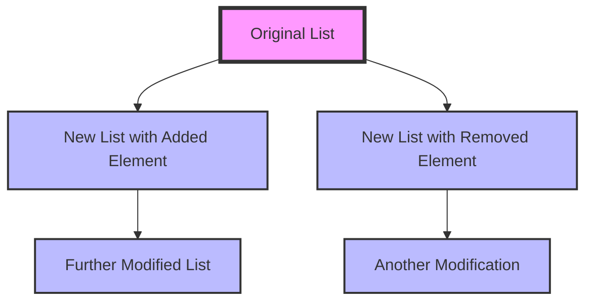

## 7.1 Immutability and Persistent Data Structures

In the realm of software engineering, immutability and persistent data structures have emerged as pivotal concepts, especially within functional programming paradigms. Kotlin, with its modern language features, offers robust support for immutability, making it an ideal choice for developers looking to build reliable and maintainable applications. In this section, we will delve into the principles of immutability, explore the benefits of using persistent data structures, and provide practical guidance on implementing these concepts in Kotlin.

### Understanding Immutability

**Immutability** refers to the state of an object that cannot be modified after its creation. This concept is fundamental in functional programming, where functions are expected to produce the same output for the same input without side effects. Immutability offers several advantages:

- **Predictability**: Immutable objects are inherently thread-safe, as their state cannot change unexpectedly. This predictability simplifies reasoning about code and reduces the likelihood of bugs.
- **Ease of Testing**: Since immutable objects do not change state, they are easier to test. Test cases can rely on consistent behavior without worrying about side effects.
- **Improved Performance**: While it might seem counterintuitive, immutability can lead to performance improvements. Immutable objects can be safely shared across threads without synchronization, and certain optimizations, such as memoization, become feasible.

#### Immutability in Kotlin

Kotlin embraces immutability through several language features:

- **`val` Keyword**: Declaring a variable with `val` makes it immutable. Once assigned, its reference cannot be changed.
  
  ```kotlin
  val immutableList = listOf(1, 2, 3)
  ```

- **Data Classes**: Kotlin's data classes provide a concise way to create immutable objects. By default, all properties in a data class are `val`, promoting immutability.

  ```kotlin
  data class Point(val x: Int, val y: Int)
  ```

- **Copy Function**: Data classes come with a `copy` function, allowing you to create modified copies of an object without altering the original.

  ```kotlin
  val point1 = Point(1, 2)
  val point2 = point1.copy(y = 3) // point1 remains unchanged
  ```

### Persistent Data Structures

**Persistent data structures** are immutable data structures that preserve the previous version of themselves when modified. They are a cornerstone of functional programming, allowing developers to work with complex data without the risk of unintended side effects.

#### Benefits of Persistent Data Structures

- **Efficiency**: Persistent data structures are designed to share as much structure as possible between versions, minimizing memory usage and improving performance.
- **Concurrency**: Since persistent data structures are immutable, they can be safely accessed by multiple threads without synchronization.
- **Undo/Redo Functionality**: The ability to retain previous versions of data makes implementing features like undo/redo straightforward.

#### Implementing Persistent Data Structures in Kotlin

Kotlin does not include built-in persistent data structures, but several libraries provide these capabilities. One such library is [Kotlin Collections Immutable](https://github.com/Kotlin/kotlinx.collections.immutable), which offers a range of persistent collections.

Here's how you can use persistent lists with this library:

```kotlin
import kotlinx.collections.immutable.persistentListOf

fun main() {
    val list = persistentListOf(1, 2, 3)
    val newList = list.add(4)

    println(list) // Output: [1, 2, 3]
    println(newList) // Output: [1, 2, 3, 4]
}
```

In this example, `newList` is a new version of the list with the additional element, while `list` remains unchanged.

### Custom Persistent Structures

While libraries provide a convenient way to work with persistent data structures, there may be cases where you need to implement custom structures. Let's explore how to create a simple persistent stack in Kotlin.

#### Designing a Persistent Stack

A stack is a last-in, first-out (LIFO) data structure. To make it persistent, each operation should return a new stack without modifying the original.

```kotlin
class PersistentStack<T>(private val elements: List<T> = emptyList()) {

    fun push(element: T): PersistentStack<T> {
        return PersistentStack(elements + element)
    }

    fun pop(): Pair<T, PersistentStack<T>>? {
        return if (elements.isEmpty()) {
            null
        } else {
            elements.last() to PersistentStack(elements.dropLast(1))
        }
    }

    fun peek(): T? = elements.lastOrNull()

    fun isEmpty(): Boolean = elements.isEmpty()
}
```

#### Using the Persistent Stack

```kotlin
fun main() {
    val stack = PersistentStack<Int>()
    val stack1 = stack.push(1)
    val stack2 = stack1.push(2)

    println(stack2.peek()) // Output: 2
    val (poppedElement, stack3) = stack2.pop()!!
    println(poppedElement) // Output: 2
    println(stack3.peek()) // Output: 1
}
```

In this example, each operation on the stack returns a new instance, preserving the previous state.

### Visualizing Immutability and Persistence

To better understand the concept of persistent data structures, let's visualize how a persistent list might be represented in memory.



**Diagram Description**: This diagram illustrates how modifications to a persistent list result in new versions, with shared structure between them to optimize memory usage.

### Practical Considerations

While immutability and persistent data structures offer numerous benefits, there are practical considerations to keep in mind:

- **Performance Overhead**: Although persistent data structures are optimized for efficiency, they may introduce some overhead compared to mutable structures. Profiling and benchmarking are essential to ensure performance requirements are met.
- **Memory Usage**: Sharing structure between versions helps reduce memory usage, but it's important to monitor memory consumption, especially in applications with large datasets.
- **Library Support**: Evaluate the maturity and support of libraries providing persistent data structures. Community support and documentation can significantly impact development experience.

### Differences and Similarities with Other Patterns

Immutability and persistent data structures are often associated with functional programming, but they can be used alongside other design patterns:

- **Singleton Pattern**: Both immutability and the Singleton pattern aim to control object state, but while immutability focuses on preventing state changes, the Singleton pattern ensures a single instance.
- **Observer Pattern**: Immutability simplifies the implementation of the Observer pattern by ensuring that observers receive consistent state updates without side effects.

### Try It Yourself

To deepen your understanding, try modifying the persistent stack implementation:

- **Add a `size` method** to return the number of elements in the stack.
- **Implement a `clear` method** to return an empty stack.
- **Create a persistent queue** using a similar approach.

### References and Further Reading

- [Kotlin Collections Immutable](https://github.com/Kotlin/kotlinx.collections.immutable) - A library providing persistent collections for Kotlin.
- [Functional Programming in Kotlin](https://www.manning.com/books/functional-programming-in-kotlin) - A comprehensive guide to functional programming concepts in Kotlin.

### Knowledge Check

- **What are the benefits of immutability in software design?**
- **How do persistent data structures differ from mutable ones?**
- **What are some practical considerations when using persistent data structures?**

### Embrace the Journey

Remember, mastering immutability and persistent data structures is just the beginning. As you continue to explore these concepts, you'll discover new ways to build robust and efficient applications. Keep experimenting, stay curious, and enjoy the journey!

## Quiz Time!



### What is a key benefit of immutability in software design?

- [x] Predictability and thread safety
- [ ] Increased memory usage
- [ ] Complexity in code
- [ ] Slower performance

> **Explanation:** Immutability ensures that objects cannot change state, making them inherently thread-safe and predictable, which simplifies reasoning about code.

### How do persistent data structures differ from mutable ones?

- [x] They preserve previous versions of themselves
- [ ] They consume more memory
- [ ] They are always slower
- [ ] They cannot be used in functional programming

> **Explanation:** Persistent data structures are immutable and preserve previous versions, allowing for efficient state management without side effects.

### Which Kotlin feature promotes immutability?

- [x] `val` keyword
- [ ] `var` keyword
- [ ] `fun` keyword
- [ ] `class` keyword

> **Explanation:** The `val` keyword in Kotlin declares an immutable variable, ensuring that its reference cannot be changed after assignment.

### What is a potential drawback of using persistent data structures?

- [x] Performance overhead
- [ ] Lack of library support
- [ ] Incompatibility with Kotlin
- [ ] Increased mutability

> **Explanation:** While persistent data structures are optimized for efficiency, they may introduce some performance overhead compared to mutable structures.

### What library provides persistent collections for Kotlin?

- [x] Kotlin Collections Immutable
- [ ] Kotlin Standard Library
- [ ] Java Collections Framework
- [ ] Apache Commons

> **Explanation:** Kotlin Collections Immutable is a library that offers a range of persistent collections for Kotlin.

### What is a common use case for persistent data structures?

- [x] Implementing undo/redo functionality
- [ ] Reducing memory usage
- [ ] Increasing code complexity
- [ ] Enhancing mutability

> **Explanation:** Persistent data structures are ideal for implementing features like undo/redo, as they retain previous versions of data.

### How can you create a modified copy of a data class in Kotlin?

- [x] Using the `copy` function
- [ ] Using the `clone` function
- [ ] Using the `new` keyword
- [ ] Using the `create` function

> **Explanation:** Kotlin's data classes provide a `copy` function, allowing you to create modified copies of an object without altering the original.

### What is the primary advantage of using immutable objects in concurrent programming?

- [x] They are inherently thread-safe
- [ ] They require more synchronization
- [ ] They are mutable
- [ ] They increase complexity

> **Explanation:** Immutable objects are inherently thread-safe because their state cannot change, eliminating the need for synchronization.

### Which keyword is used to declare an immutable variable in Kotlin?

- [x] `val`
- [ ] `var`
- [ ] `let`
- [ ] `const`

> **Explanation:** The `val` keyword is used to declare an immutable variable in Kotlin, ensuring its reference cannot be changed.

### True or False: Persistent data structures in Kotlin are always slower than mutable structures.

- [ ] True
- [x] False

> **Explanation:** While persistent data structures may introduce some overhead, they are optimized for efficiency and can perform comparably to mutable structures in many cases.


