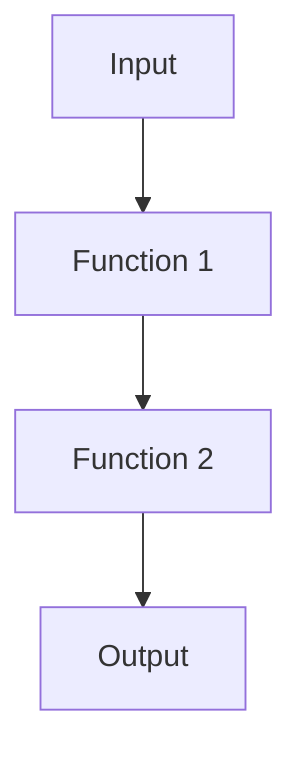

## 7.10 Function Composition

Function composition is a powerful concept in functional programming that allows developers to build complex operations by combining simpler functions. In Kotlin, function composition is a key feature that supports modular and reusable code. By composing functions, we can create new functions that are the result of applying one function to the result of another. This approach not only enhances code readability but also promotes a clean and maintainable codebase.

### Understanding Function Composition

Function composition involves creating a new function by chaining together two or more functions. The output of one function becomes the input of the next. This concept is akin to mathematical function composition, where if you have two functions, `f(x)` and `g(x)`, the composition `f(g(x))` applies `g` first and then `f` to the result.

#### Why Use Function Composition?

- **Modularity**: Break down complex operations into smaller, manageable functions.
- **Reusability**: Reuse existing functions to create new functionality.
- **Readability**: Simplify code by reducing nested function calls.
- **Maintainability**: Make it easier to update and test individual components.

### Function Composition in Kotlin

Kotlin provides a straightforward way to compose functions using the `compose` and `andThen` extension functions. These functions are part of the Kotlin standard library and are available for any function type.

#### The `compose` Function

The `compose` function allows you to create a new function by composing two functions. The function `f.compose(g)` results in a new function that applies `g` first and then `f`. This is equivalent to the mathematical notation `f(g(x))`.

```kotlin
fun <P1, P2, R> ((P2) -> R).compose(other: (P1) -> P2): (P1) -> R {
    return { p1: P1 -> this(other(p1)) }
}
```

#### The `andThen` Function

The `andThen` function is similar to `compose`, but it applies the functions in reverse order. The function `f.andThen(g)` results in a new function that applies `f` first and then `g`. This is equivalent to `g(f(x))`.

```kotlin
fun <P1, R, R2> ((P1) -> R).andThen(other: (R) -> R2): (P1) -> R2 {
    return { p1: P1 -> other(this(p1)) }
}
```

### Practical Examples

Let's explore how to use `compose` and `andThen` in Kotlin with practical examples.

#### Example 1: Basic Function Composition

Consider two simple functions: one that doubles a number and another that adds five to a number.

```kotlin
val double: (Int) -> Int = { it * 2 }
val addFive: (Int) -> Int = { it + 5 }

// Using compose
val doubleThenAddFive = addFive.compose(double)
println(doubleThenAddFive(3)) // Output: 11

// Using andThen
val addFiveThenDouble = double.andThen(addFive)
println(addFiveThenDouble(3)) // Output: 16
```

In this example, `doubleThenAddFive` first doubles the number and then adds five, while `addFiveThenDouble` first adds five and then doubles the result.

#### Example 2: Composing String Functions

Let's create a more complex example involving string manipulation.

```kotlin
val toUpperCase: (String) -> String = { it.uppercase() }
val exclaim: (String) -> String = { "$it!" }
val repeat: (String) -> String = { it.repeat(3) }

// Compose functions
val shout = toUpperCase.compose(exclaim).compose(repeat)
println(shout("hello")) // Output: HELLO!HELLO!HELLO!

// AndThen functions
val excited = repeat.andThen(exclaim).andThen(toUpperCase)
println(excited("wow")) // Output: WOW!WOW!WOW!
```

Here, `shout` repeats the string, adds an exclamation mark, and converts it to uppercase, while `excited` performs the operations in reverse order.

### Visualizing Function Composition

To better understand function composition, let's visualize the process using a flowchart. This diagram illustrates how data flows through composed functions.



In this diagram, `Function 1` processes the input and passes the result to `Function 2`, which then produces the final output.

### Advanced Function Composition Techniques

Function composition can be extended to more complex scenarios, such as composing functions with different types or using higher-order functions.

#### Composing Functions with Different Types

When composing functions with different input and output types, ensure that the output type of one function matches the input type of the next.

```kotlin
val toString: (Int) -> String = { it.toString() }
val length: (String) -> Int = { it.length }

// Compose functions
val intToStringLength = length.compose(toString)
println(intToStringLength(12345)) // Output: 5
```

#### Using Higher-Order Functions

Higher-order functions, which take functions as parameters or return functions, can be composed just like regular functions.

```kotlin
fun <A, B, C> compose(f: (B) -> C, g: (A) -> B): (A) -> C = { a -> f(g(a)) }

val increment: (Int) -> Int = { it + 1 }
val square: (Int) -> Int = { it * it }

val incrementThenSquare = compose(square, increment)
println(incrementThenSquare(4)) // Output: 25
```

### Design Considerations

When using function composition, consider the following design aspects:

- **Function Purity**: Ensure that functions are pure, meaning they have no side effects and always produce the same output for the same input.
- **Error Handling**: Handle potential errors gracefully, especially when composing functions that may throw exceptions.
- **Performance**: Be mindful of performance implications, as excessive composition can lead to deep call stacks.

### Differences and Similarities with Other Patterns

Function composition is often compared to other design patterns, such as the Chain of Responsibility pattern. While both involve chaining operations, function composition focuses on creating new functions, whereas the Chain of Responsibility involves passing requests through a chain of handlers.

### Try It Yourself

Experiment with function composition by modifying the examples provided. Try creating your own functions and composing them in different orders. Consider scenarios where function composition can simplify your codebase.

### References and Further Reading

- [Kotlin Official Documentation](https://kotlinlang.org/docs/home.html)
- [Functional Programming in Kotlin](https://www.manning.com/books/functional-programming-in-kotlin)
- [Compose and AndThen in Kotlin](https://kotlinlang.org/api/latest/jvm/stdlib/kotlin/-function1/compose.html)

### Knowledge Check

To reinforce your understanding of function composition, consider the following questions:

1. What is function composition, and why is it useful?
2. How does the `compose` function differ from the `andThen` function?
3. What are some design considerations when using function composition?
4. How can you handle errors in composed functions?
5. What are the similarities and differences between function composition and the Chain of Responsibility pattern?

## Quiz Time!



### What is the primary purpose of function composition in Kotlin?

- [x] To create new functions by combining existing ones.
- [ ] To improve the performance of existing functions.
- [ ] To simplify the syntax of existing functions.
- [ ] To convert functions into classes.

> **Explanation:** Function composition is used to create new functions by combining existing ones, allowing for modular and reusable code.

### Which function applies the first function and then the second in Kotlin?

- [ ] compose
- [x] andThen
- [ ] map
- [ ] filter

> **Explanation:** The `andThen` function applies the first function and then the second, equivalent to `g(f(x))`.

### What is a key benefit of using function composition?

- [x] Modularity and reusability of code.
- [ ] Increased complexity of code.
- [ ] Reduced readability.
- [ ] Increased memory usage.

> **Explanation:** Function composition promotes modularity and reusability, making code easier to manage and understand.

### In function composition, what does the `compose` function do?

- [x] Applies the second function first and then the first.
- [ ] Applies the first function first and then the second.
- [ ] Combines functions into a list.
- [ ] Converts functions into classes.

> **Explanation:** The `compose` function applies the second function first and then the first, equivalent to `f(g(x))`.

### How can you handle errors in composed functions?

- [x] By using try-catch blocks around composed functions.
- [ ] By ignoring errors in composed functions.
- [ ] By converting errors into warnings.
- [ ] By using global error handlers.

> **Explanation:** Errors in composed functions can be handled using try-catch blocks to ensure graceful error handling.

### What is a potential downside of excessive function composition?

- [x] Deep call stacks leading to performance issues.
- [ ] Increased readability of code.
- [ ] Simplified error handling.
- [ ] Reduced code modularity.

> **Explanation:** Excessive function composition can lead to deep call stacks, which may affect performance.

### How does function composition differ from the Chain of Responsibility pattern?

- [x] Function composition creates new functions, while Chain of Responsibility passes requests through handlers.
- [ ] Function composition is used for error handling, while Chain of Responsibility is not.
- [ ] Function composition is a structural pattern, while Chain of Responsibility is not.
- [ ] Function composition is used for UI design, while Chain of Responsibility is not.

> **Explanation:** Function composition focuses on creating new functions, while the Chain of Responsibility pattern involves passing requests through a chain of handlers.

### What is a higher-order function in Kotlin?

- [x] A function that takes other functions as parameters or returns a function.
- [ ] A function that only performs mathematical operations.
- [ ] A function that is used for error handling.
- [ ] A function that is only used in UI design.

> **Explanation:** A higher-order function is one that takes other functions as parameters or returns a function, enabling function composition.

### What is the result of using `compose` with two functions where the output type of the first does not match the input type of the second?

- [x] A compilation error.
- [ ] A runtime error.
- [ ] A warning.
- [ ] A successful composition with default values.

> **Explanation:** If the output type of the first function does not match the input type of the second, it results in a compilation error.

### True or False: Function composition can only be used with pure functions.

- [x] True
- [ ] False

> **Explanation:** Function composition is most effective with pure functions, as they have no side effects and always produce the same output for the same input.



Remember, mastering function composition is just the beginning. As you continue to explore Kotlin's functional programming capabilities, you'll find even more ways to create efficient, modular, and reusable code. Keep experimenting, stay curious, and enjoy the journey!
