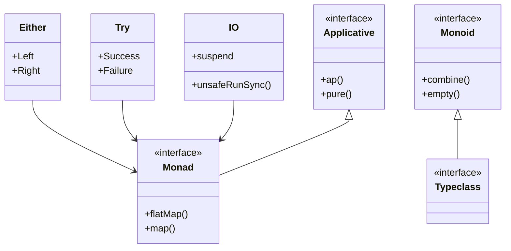

## 7.11 Arrow Library Patterns

In the realm of Kotlin programming, the Arrow library stands out as a powerful toolkit for functional programming. It provides a comprehensive suite of tools and patterns that enable developers to write more expressive, concise, and safe code. In this section, we will delve into the core components of the Arrow library, including data types like `Either`, `Try`, and `IO`, as well as advanced concepts such as monad comprehensions, applicatives, monoids, typeclasses, and higher-kinded types.

### Introduction to Arrow

Arrow is a functional programming library for Kotlin that provides a wide array of abstractions and data types to facilitate functional programming paradigms. It is inspired by libraries like Scala's Cats and Haskell's standard library, bringing similar capabilities to the Kotlin ecosystem.

#### Key Features of Arrow

- **Data Types**: Arrow offers a variety of data types that encapsulate common functional programming patterns, such as `Option`, `Either`, `Try`, and `IO`.
- **Typeclasses**: Arrow provides a rich set of typeclasses that enable polymorphic functions and higher-order abstractions.
- **Monad Comprehensions**: Simplify complex operations involving monads through concise syntax.
- **Applicatives and Monoids**: Facilitate the combination of independent computations and aggregation of values.
- **Higher-Kinded Types**: Allow for more abstract and reusable code patterns.

Let's explore these features in detail, starting with the fundamental data types.

### Arrow Data Types

Arrow's data types are designed to handle common scenarios in functional programming, such as optional values, error handling, and side effects.

#### Either

The `Either` type represents a value that can be one of two possible types, commonly referred to as `Left` and `Right`. It is often used for error handling, where `Left` represents an error and `Right` represents a successful result.

```kotlin
import arrow.core.Either
import arrow.core.left
import arrow.core.right

fun divide(a: Int, b: Int): Either<String, Int> =
    if (b == 0) "Division by zero".left()
    else (a / b).right()

fun main() {
    val result = divide(10, 0)
    result.fold(
        { error -> println("Error: $error") },
        { value -> println("Result: $value") }
    )
}
```

In this example, `divide` returns an `Either` type, encapsulating the possibility of an error (`Left`) or a successful computation (`Right`).

#### Try

The `Try` type is used for computations that may throw exceptions. It provides a way to handle exceptions in a functional style, encapsulating the result of a computation that can either succeed or fail.

```kotlin
import arrow.core.Try

fun parseInt(str: String): Try<Int> =
    Try { str.toInt() }

fun main() {
    val result = parseInt("123a")
    result.fold(
        { throwable -> println("Failed with exception: ${throwable.message}") },
        { value -> println("Parsed value: $value") }
    )
}
```

Here, `parseInt` uses `Try` to safely attempt parsing a string into an integer, handling any potential exceptions.

#### IO

The `IO` type represents a computation that performs side effects. It allows you to describe side-effectful operations in a pure, referentially transparent way.

```kotlin
import arrow.fx.IO

fun readLineIO(): IO<String> = IO { readLine() ?: "" }

fun main() {
    val program = readLineIO().map { input ->
        "You entered: $input"
    }
    program.unsafeRunSync().let(::println)
}
```

In this example, `readLineIO` is an `IO` action that reads a line from the console. The `unsafeRunSync` method is used to execute the IO action.

### Monad Comprehensions

Monad comprehensions in Arrow allow you to work with monadic values in a more readable and concise way. They simplify the chaining of operations on monadic values.

```kotlin
import arrow.core.Either
import arrow.core.computations.either

suspend fun compute(): Either<String, Int> = either {
    val a = Either.Right(5).bind()
    val b = Either.Right(10).bind()
    a + b
}

fun main() {
    val result = compute()
    println(result)
}
```

In this example, `either` is used to perform monad comprehensions with `Either` values, allowing for a more straightforward expression of computations.

### Applicatives and Monoids

Applicatives and monoids are powerful abstractions that facilitate the combination and aggregation of values.

#### Applicatives

Applicatives allow you to apply functions to arguments that are wrapped in a context, such as `Option` or `Either`.

```kotlin
import arrow.core.Option
import arrow.core.Some
import arrow.core.none
import arrow.core.extensions.option.apply.tupled

fun main() {
    val option1 = Some(1)
    val option2 = Some(2)
    val option3 = none<Int>()

    val result = Option.tupled(option1, option2, option3)
    println(result) // Output: None
}
```

In this example, `Option.tupled` combines multiple `Option` values, resulting in `None` if any of the options are `None`.

#### Monoids

Monoids provide a way to combine values of the same type using an associative operation and an identity element.

```kotlin
import arrow.core.extensions.int.monoid.add
import arrow.core.extensions.monoid

fun main() {
    val sum = listOf(1, 2, 3).fold(0, Int.monoid().add())
    println(sum) // Output: 6
}
```

Here, `Int.monoid().add()` is used to sum a list of integers, demonstrating the use of monoids for aggregation.

### Typeclasses and Higher-Kinded Types

Typeclasses in Arrow provide a way to define behavior that can be implemented by different types. Higher-kinded types enable more abstract and reusable code patterns.

#### Typeclasses

Typeclasses define a set of functions that can be implemented by different types, allowing for polymorphic behavior.

```kotlin
import arrow.core.Eq
import arrow.core.extensions.eq

data class Person(val name: String, val age: Int)

fun main() {
    val personEq = Eq { a: Person, b: Person -> a.name == b.name && a.age == b.age }
    val person1 = Person("Alice", 30)
    val person2 = Person("Alice", 30)

    println(personEq.run { person1.eqv(person2) }) // Output: true
}
```

In this example, a custom `Eq` typeclass is defined for the `Person` data class, allowing for equality comparison.

#### Higher-Kinded Types

Higher-kinded types enable more abstract and flexible code, allowing you to write functions that work with any type that has a certain structure.

```kotlin
import arrow.Kind
import arrow.core.ForOption
import arrow.core.Option
import arrow.core.extensions.option.monad.monad
import arrow.core.fix
import arrow.core.some

fun <F> Kind<F, Int>.double(M: arrow.typeclasses.Monad<F>): Kind<F, Int> =
    M.run { flatMap { just(it * 2) } }

fun main() {
    val optionMonad = Option.monad()
    val result = 5.some().double(optionMonad).fix()
    println(result) // Output: Some(10)
}
```

In this example, `double` is a function that works with any monadic type, demonstrating the use of higher-kinded types.

### Visualizing Arrow Concepts

To better understand the relationships between these concepts, let's visualize them using Mermaid.js diagrams.



This diagram illustrates the relationships between the core Arrow data types and the functional programming abstractions they implement.

### Try It Yourself

To deepen your understanding of Arrow, try modifying the code examples provided. For instance, experiment with different data types, implement custom typeclasses, or explore how monad comprehensions can simplify complex logic. Remember, the best way to learn is by doing!

### References and Further Reading

- [Arrow Documentation](https://arrow-kt.io/docs/)
- [Functional Programming in Kotlin](https://www.manning.com/books/functional-programming-in-kotlin)
- [Kotlin Language Documentation](https://kotlinlang.org/docs/reference/)

### Knowledge Check

1. What is the primary purpose of the `Either` type in Arrow?
2. How does the `Try` type handle exceptions in a functional style?
3. What are monad comprehensions, and how do they simplify code?
4. Explain the role of applicatives in functional programming.
5. How do monoids facilitate value aggregation?
6. What is a typeclass, and how does it enable polymorphic behavior?
7. Describe the concept of higher-kinded types and their benefits.
8. How can you use Arrow's `IO` type to manage side effects?
9. What is the relationship between applicatives and monads?
10. How can you implement a custom typeclass in Arrow?

### Embrace the Journey

Remember, mastering functional programming with Arrow is a journey. As you explore these concepts and patterns, you'll unlock new ways to write more expressive and maintainable Kotlin code. Keep experimenting, stay curious, and enjoy the journey!

## Quiz Time!



### What is the primary purpose of the `Either` type in Arrow?

- [x] To represent a value that can be one of two possible types, often used for error handling.
- [ ] To encapsulate side-effectful computations.
- [ ] To handle exceptions in a functional style.
- [ ] To perform asynchronous operations.

> **Explanation:** The `Either` type is used to represent a value that can be one of two possible types, commonly used for error handling where `Left` represents an error and `Right` represents a successful result.

### How does the `Try` type handle exceptions in a functional style?

- [x] By encapsulating the result of a computation that can either succeed or fail, handling exceptions gracefully.
- [ ] By providing a default value in case of an exception.
- [ ] By logging the exception and continuing execution.
- [ ] By terminating the program on an exception.

> **Explanation:** The `Try` type encapsulates the result of a computation that can either succeed or fail, allowing exceptions to be handled gracefully in a functional style.

### What are monad comprehensions, and how do they simplify code?

- [x] They allow for more readable and concise chaining of operations on monadic values.
- [ ] They provide a way to handle exceptions in a functional style.
- [ ] They enable asynchronous operations to be performed.
- [ ] They encapsulate side-effectful computations.

> **Explanation:** Monad comprehensions allow for more readable and concise chaining of operations on monadic values, simplifying complex logic.

### Explain the role of applicatives in functional programming.

- [x] They allow you to apply functions to arguments that are wrapped in a context, such as `Option` or `Either`.
- [ ] They handle exceptions in a functional style.
- [ ] They represent a value that can be one of two possible types.
- [ ] They perform asynchronous operations.

> **Explanation:** Applicatives allow you to apply functions to arguments that are wrapped in a context, facilitating the combination of independent computations.

### How do monoids facilitate value aggregation?

- [x] By providing a way to combine values of the same type using an associative operation and an identity element.
- [ ] By handling exceptions in a functional style.
- [ ] By encapsulating side-effectful computations.
- [ ] By performing asynchronous operations.

> **Explanation:** Monoids provide a way to combine values of the same type using an associative operation and an identity element, facilitating aggregation.

### What is a typeclass, and how does it enable polymorphic behavior?

- [x] A typeclass defines a set of functions that can be implemented by different types, allowing for polymorphic behavior.
- [ ] A typeclass encapsulates side-effectful computations.
- [ ] A typeclass handles exceptions in a functional style.
- [ ] A typeclass performs asynchronous operations.

> **Explanation:** A typeclass defines a set of functions that can be implemented by different types, enabling polymorphic behavior.

### Describe the concept of higher-kinded types and their benefits.

- [x] Higher-kinded types enable more abstract and flexible code, allowing functions to work with any type that has a certain structure.
- [ ] Higher-kinded types handle exceptions in a functional style.
- [ ] Higher-kinded types encapsulate side-effectful computations.
- [ ] Higher-kinded types perform asynchronous operations.

> **Explanation:** Higher-kinded types enable more abstract and flexible code, allowing functions to work with any type that has a certain structure.

### How can you use Arrow's `IO` type to manage side effects?

- [x] By describing side-effectful operations in a pure, referentially transparent way.
- [ ] By handling exceptions in a functional style.
- [ ] By representing a value that can be one of two possible types.
- [ ] By performing asynchronous operations.

> **Explanation:** Arrow's `IO` type allows you to describe side-effectful operations in a pure, referentially transparent way, managing side effects effectively.

### What is the relationship between applicatives and monads?

- [x] Applicatives are a generalization of monads, allowing for the combination of independent computations.
- [ ] Applicatives handle exceptions in a functional style.
- [ ] Applicatives encapsulate side-effectful computations.
- [ ] Applicatives perform asynchronous operations.

> **Explanation:** Applicatives are a generalization of monads, allowing for the combination of independent computations, whereas monads allow for dependent computations.

### How can you implement a custom typeclass in Arrow?

- [x] By defining a set of functions that can be implemented by different types, enabling polymorphic behavior.
- [ ] By encapsulating side-effectful computations.
- [ ] By handling exceptions in a functional style.
- [ ] By performing asynchronous operations.

> **Explanation:** Implementing a custom typeclass in Arrow involves defining a set of functions that can be implemented by different types, enabling polymorphic behavior.


