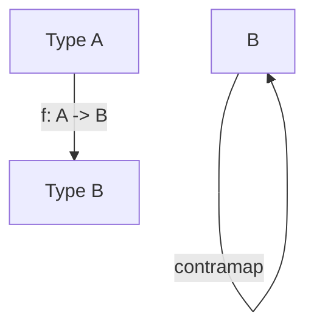

## 7.12 Cofunctor and Contravariant Functor

In the realm of functional programming, functors are a fundamental concept that allows us to apply functions over wrapped values. While most developers are familiar with the concept of functors and their covariant nature, the notions of cofunctors and contravariant functors are less commonly discussed. In this section, we will delve into these advanced functional programming concepts, focusing on their application in Kotlin. We will explore variance in functors, understand the differences between covariant, contravariant, and invariant functors, and provide practical examples to illustrate these concepts.

### Understanding Variance in Functors

Before diving into cofunctors and contravariant functors, it's essential to understand the concept of variance. Variance describes how subtyping between more complex types relates to subtyping between their components. In Kotlin, variance is a crucial concept, especially when dealing with generics.

- **Covariance**: A type `A` is covariant if `A<B>` is a subtype of `A<C>` whenever `B` is a subtype of `C`. Covariance is expressed in Kotlin using the `out` keyword. It allows you to read from a generic type but not write to it.

- **Contravariance**: A type `A` is contravariant if `A<B>` is a supertype of `A<C>` whenever `B` is a subtype of `C`. Contravariance is expressed in Kotlin using the `in` keyword. It allows you to write to a generic type but not read from it.

- **Invariance**: A type `A` is invariant if `A<B>` is neither a subtype nor a supertype of `A<C>`, regardless of the relationship between `B` and `C`.

Understanding these concepts is crucial for grasping how cofunctors and contravariant functors operate.

### What is a Functor?

In functional programming, a functor is a type that implements a `map` function. This function allows you to apply a function to a wrapped value. In Kotlin, a functor can be represented as an interface:

```kotlin
interface Functor<F> {
    fun <A, B> map(fa: F, f: (A) -> B): F
}
```

The `map` function takes a value of type `F<A>` and a function from `A` to `B`, and returns a value of type `F<B>`. This is the essence of a covariant functor.

### Introducing Cofunctors

A cofunctor, or contravariant functor, is a type that implements a `contramap` function. This function allows you to apply a function to a wrapped value in a contravariant manner. In Kotlin, a cofunctor can be represented as an interface:

```kotlin
interface Cofunctor<F> {
    fun <A, B> contramap(fa: F, f: (B) -> A): F
}
```

The `contramap` function takes a value of type `F<A>` and a function from `B` to `A`, and returns a value of type `F<B>`. This is the essence of a contravariant functor.

### Contravariant Functors in Practice

To better understand contravariant functors, let's consider a practical example. Suppose we have a class `Printer` that prints values of a specific type:

```kotlin
class Printer<A>(val print: (A) -> Unit) {
    fun printValue(value: A) {
        print(value)
    }
}
```

We can define a contramap function for `Printer` to transform a `Printer<B>` into a `Printer<A>` using a function from `A` to `B`:

```kotlin
fun <A, B> Printer<B>.contramap(f: (A) -> B): Printer<A> {
    return Printer { a -> this.print(f(a)) }
}
```

Here's how you can use the `contramap` function:

```kotlin
val intPrinter = Printer<Int> { println("Int: $it") }
val stringPrinter = intPrinter.contramap { str: String -> str.length }

stringPrinter.printValue("Hello") // Prints: Int: 5
```

In this example, we have a `Printer<Int>` that prints integers. By using `contramap`, we transform it into a `Printer<String>` that prints the length of a string.

### Visualizing Contravariant Functors

To visualize the concept of contravariant functors, consider the following diagram:



This diagram illustrates how a contravariant functor allows you to transform a function from `A` to `B` into a function from `F<A>` to `F<B>`.

### Key Participants

- **Cofunctor Interface**: Defines the `contramap` function.
- **Printer Class**: An example of a contravariant functor.
- **Function Transformation**: The process of transforming a function from `A` to `B` into a function from `F<A>` to `F<B>`.

### Applicability

Contravariant functors are applicable in scenarios where you need to transform input types. They are particularly useful in contexts like logging, printing, or validation, where you need to adapt the input type of a function or class.

### Design Considerations

When using contravariant functors, consider the following:

- **Type Safety**: Ensure that the transformation function is type-safe and does not introduce runtime errors.
- **Read vs. Write**: Remember that contravariant functors allow you to write to a type but not read from it.

### Differences and Similarities

Contravariant functors are often confused with covariant functors. The key difference is the direction of the transformation:

- **Covariant Functor**: Transforms `F<A>` to `F<B>` using a function from `A` to `B`.
- **Contravariant Functor**: Transforms `F<A>` to `F<B>` using a function from `B` to `A`.

### Try It Yourself

Experiment with the `Printer` example by creating different transformation functions. Try transforming a `Printer<Double>` to a `Printer<String>` using a function that converts a string to a double.

### Conclusion

Understanding cofunctors and contravariant functors is an essential step in mastering advanced functional programming concepts in Kotlin. These concepts allow you to apply transformations in a contravariant manner, providing flexibility and power in your functional programming toolkit. As you continue to explore functional programming, remember to experiment, stay curious, and enjoy the journey!

## Quiz Time!



### What is a contravariant functor?

- [x] A type that implements a `contramap` function.
- [ ] A type that implements a `map` function.
- [ ] A type that implements a `flatMap` function.
- [ ] A type that implements a `filter` function.

> **Explanation:** A contravariant functor is a type that implements a `contramap` function, allowing you to transform input types in a contravariant manner.

### What keyword is used in Kotlin to express contravariance?

- [ ] out
- [x] in
- [ ] var
- [ ] val

> **Explanation:** The `in` keyword is used in Kotlin to express contravariance, allowing you to write to a generic type but not read from it.

### Which of the following is an example of a contravariant functor?

- [x] Printer
- [ ] List
- [ ] Option
- [ ] Future

> **Explanation:** `Printer` is an example of a contravariant functor, as it can transform input types using the `contramap` function.

### What does the `contramap` function do?

- [x] Transforms a function from `B` to `A` into a function from `F<A>` to `F<B>`.
- [ ] Transforms a function from `A` to `B` into a function from `F<A>` to `F<B>`.
- [ ] Transforms a function from `F<A>` to `F<B>` into a function from `A` to `B`.
- [ ] Transforms a function from `F<B>` to `F<A>` into a function from `B` to `A`.

> **Explanation:** The `contramap` function transforms a function from `B` to `A` into a function from `F<A>` to `F<B>`, allowing contravariant transformations.

### What is the key difference between covariant and contravariant functors?

- [x] The direction of the transformation.
- [ ] The type of function used.
- [ ] The number of parameters.
- [ ] The return type.

> **Explanation:** The key difference between covariant and contravariant functors is the direction of the transformation. Covariant functors transform `F<A>` to `F<B>` using a function from `A` to `B`, while contravariant functors transform `F<A>` to `F<B>` using a function from `B` to `A`.

### In Kotlin, how is covariance expressed?

- [x] Using the `out` keyword.
- [ ] Using the `in` keyword.
- [ ] Using the `val` keyword.
- [ ] Using the `var` keyword.

> **Explanation:** Covariance in Kotlin is expressed using the `out` keyword, allowing you to read from a generic type but not write to it.

### Which of the following is NOT a variance type in Kotlin?

- [ ] Covariance
- [ ] Contravariance
- [ ] Invariance
- [x] Transvariance

> **Explanation:** Transvariance is not a variance type in Kotlin. The three types of variance in Kotlin are covariance, contravariance, and invariance.

### What is the purpose of variance in Kotlin?

- [x] To describe how subtyping between complex types relates to subtyping between their components.
- [ ] To define the scope of a variable.
- [ ] To determine the memory allocation of an object.
- [ ] To specify the access level of a class.

> **Explanation:** Variance in Kotlin describes how subtyping between complex types relates to subtyping between their components, allowing for safe and flexible use of generics.

### Which function allows you to apply a function to a wrapped value in a covariant manner?

- [x] map
- [ ] contramap
- [ ] flatMap
- [ ] filter

> **Explanation:** The `map` function allows you to apply a function to a wrapped value in a covariant manner, transforming `F<A>` to `F<B>` using a function from `A` to `B`.

### True or False: A contravariant functor allows you to read from a type but not write to it.

- [ ] True
- [x] False

> **Explanation:** False. A contravariant functor allows you to write to a type but not read from it, as it transforms input types in a contravariant manner.


