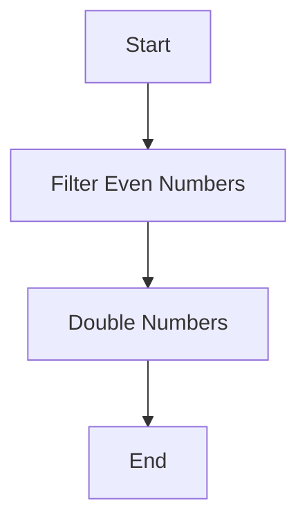

## 7.14 Transducers

In the world of functional programming, transducers offer a powerful way to compose sequence transformations efficiently. They provide a mechanism to decouple the process of transforming data from the data structures themselves, allowing for more flexible and reusable code. In this section, we will explore the concept of transducers in Kotlin, understand their benefits, and see how they can be implemented to enhance performance and composability in your applications.

### Understanding Transducers

Transducers are a concept borrowed from Clojure, a functional programming language. They are a type of composable higher-order function that can transform data without being tied to a specific data structure. This means you can apply the same transformation logic to different types of collections, streams, or even asynchronous data sources.

#### Key Concepts

- **Composable**: Transducers allow you to compose multiple transformations into a single, efficient transformation pipeline.
- **Reusable**: Since transducers are not tied to a specific data structure, they can be reused across different contexts.
- **Efficient**: Transducers minimize intermediate data structures, reducing memory overhead and improving performance.

### Why Use Transducers?

Transducers provide several advantages over traditional sequence transformations:

1. **Efficiency**: By eliminating intermediate collections, transducers reduce memory usage and improve performance.
2. **Composability**: Transducers enable you to build complex transformation pipelines by composing simple transformations.
3. **Flexibility**: Transducers can be applied to various data sources, including collections, streams, and channels.

### Implementing Transducers in Kotlin

Let's dive into how you can implement transducers in Kotlin. We'll start with a simple example and gradually build up to more complex scenarios.

#### Basic Transducer Example

Consider a scenario where you want to filter and map a list of integers. Traditionally, you might write:

```kotlin
val numbers = listOf(1, 2, 3, 4, 5)
val result = numbers.filter { it % 2 == 0 }.map { it * 2 }
println(result) // Output: [4, 8]
```

With transducers, you can achieve the same result more efficiently:

```kotlin
fun <T, R> mapTransducer(transform: (T) -> R): (R, T) -> R = { acc, value -> acc + transform(value) }

fun <T> filterTransducer(predicate: (T) -> Boolean): (List<T>, T) -> List<T> = { acc, value ->
    if (predicate(value)) acc + value else acc
}

val transduce = { numbers: List<Int> ->
    numbers.fold(emptyList()) { acc, value ->
        filterTransducer<Int> { it % 2 == 0 }(acc, value)
            .let { mapTransducer<Int, Int> { it * 2 }(it, value) }
    }
}

println(transduce(numbers)) // Output: [4, 8]
```

#### Explanation

- **Map Transducer**: A function that takes a transformation function and returns a new function that applies the transformation to each element.
- **Filter Transducer**: A function that takes a predicate and returns a new function that filters elements based on the predicate.
- **Transduce Function**: Combines the map and filter transducers into a single transformation pipeline.

### Advanced Transducer Techniques

Now that we have a basic understanding of transducers, let's explore more advanced techniques and scenarios.

#### Composing Transducers

One of the key benefits of transducers is their composability. You can easily combine multiple transducers into a single transformation pipeline.

```kotlin
fun <T, R> compose(vararg transducers: (List<T>, T) -> List<T>): (List<T>, T) -> List<T> = { acc, value ->
    transducers.fold(acc) { intermediate, transducer -> transducer(intermediate, value) }
}

val composedTransducer = compose(
    filterTransducer<Int> { it % 2 == 0 },
    mapTransducer<Int, Int> { it * 2 }
)

val composedResult = numbers.fold(emptyList(), composedTransducer)
println(composedResult) // Output: [4, 8]
```

#### Transducers with Different Data Sources

Transducers are not limited to lists. You can apply them to various data sources, such as sequences, streams, or channels.

##### Using Transducers with Sequences

```kotlin
val sequence = sequenceOf(1, 2, 3, 4, 5)
val sequenceResult = sequence
    .filter { it % 2 == 0 }
    .map { it * 2 }
    .toList()

println(sequenceResult) // Output: [4, 8]
```

##### Using Transducers with Channels

```kotlin
import kotlinx.coroutines.*
import kotlinx.coroutines.channels.*

fun CoroutineScope.produceNumbers() = produce {
    for (i in 1..5) send(i)
}

fun CoroutineScope.filterEvenNumbers(input: ReceiveChannel<Int>) = produce {
    for (value in input) {
        if (value % 2 == 0) send(value)
    }
}

fun CoroutineScope.doubleNumbers(input: ReceiveChannel<Int>) = produce {
    for (value in input) send(value * 2)
}

runBlocking {
    val numbers = produceNumbers()
    val evenNumbers = filterEvenNumbers(numbers)
    val doubledNumbers = doubleNumbers(evenNumbers)

    for (value in doubledNumbers) {
        println(value) // Output: 4, 8
    }
}
```

### Design Considerations

When implementing transducers in Kotlin, consider the following:

- **Performance**: Transducers can improve performance by reducing intermediate data structures, but they may introduce complexity. Evaluate the trade-offs for your specific use case.
- **Readability**: While transducers offer composability, they can make code harder to read. Ensure that your transducer pipelines are well-documented and easy to understand.
- **Kotlin Features**: Leverage Kotlin's features, such as extension functions and higher-order functions, to create clean and idiomatic transducer implementations.

### Differences and Similarities with Other Patterns

Transducers share similarities with other functional design patterns, such as:

- **Pipelines**: Both transducers and pipelines involve composing multiple transformations. However, transducers focus on eliminating intermediate data structures.
- **Monads**: Transducers and monads both provide a way to chain operations, but transducers are specifically designed for sequence transformations.

### Try It Yourself

Experiment with transducers by modifying the code examples above. Try adding additional transformations, such as `reduce` or `flatMap`, to see how they can be composed with existing transducers.

### Visualizing Transducers

To better understand how transducers work, let's visualize the transformation process using a flowchart.



**Figure 1: Transducer Transformation Flowchart**

This flowchart illustrates the sequence of transformations applied by the transducers. The input data flows through each transformation step, resulting in the final output.

### References and Further Reading

- [Clojure Transducers](https://clojure.org/reference/transducers)
- [Kotlin Sequences](https://kotlinlang.org/docs/sequences.html)
- [Kotlin Coroutines and Channels](https://kotlinlang.org/docs/channels.html)

### Knowledge Check

1. What are transducers, and how do they differ from traditional sequence transformations?
2. How can transducers improve performance in your applications?
3. What are some design considerations when implementing transducers in Kotlin?
4. How can you compose multiple transducers into a single transformation pipeline?
5. What are the similarities and differences between transducers and pipelines?

### Embrace the Journey

Remember, this is just the beginning. As you progress, you'll discover more ways to leverage transducers for efficient and composable sequence transformations. Keep experimenting, stay curious, and enjoy the journey!

## Quiz Time!



### What is a transducer in functional programming?

- [x] A composable higher-order function for transforming data
- [ ] A data structure for storing sequences
- [ ] A type of coroutine in Kotlin
- [ ] A method for handling exceptions

> **Explanation:** A transducer is a composable higher-order function that transforms data, allowing for efficient and reusable sequence transformations.

### What is one key advantage of using transducers?

- [x] They minimize intermediate data structures
- [ ] They increase memory usage
- [ ] They are tied to specific data structures
- [ ] They are only applicable to lists

> **Explanation:** Transducers minimize intermediate data structures, reducing memory usage and improving performance.

### How can transducers be composed in Kotlin?

- [x] By combining multiple transducers into a single transformation pipeline
- [ ] By using inheritance
- [ ] By creating separate functions for each transformation
- [ ] By using global variables

> **Explanation:** Transducers can be composed by combining multiple transducers into a single transformation pipeline, allowing for complex transformations.

### What is a potential drawback of using transducers?

- [x] They can introduce complexity
- [ ] They always improve readability
- [ ] They are limited to synchronous data sources
- [ ] They cannot be used with channels

> **Explanation:** While transducers offer composability and efficiency, they can introduce complexity and may make code harder to read.

### Which Kotlin feature is useful for implementing transducers?

- [x] Extension functions
- [ ] Global variables
- [ ] Inheritance
- [ ] Reflection

> **Explanation:** Extension functions are useful for implementing transducers, allowing for clean and idiomatic code.

### What is the primary focus of transducers compared to pipelines?

- [x] Eliminating intermediate data structures
- [ ] Enhancing data visualization
- [ ] Simplifying data storage
- [ ] Increasing data redundancy

> **Explanation:** Transducers focus on eliminating intermediate data structures, improving performance and efficiency.

### Can transducers be applied to asynchronous data sources in Kotlin?

- [x] Yes, they can be used with channels
- [ ] No, they are limited to synchronous data sources
- [ ] Only with sequences
- [ ] Only with lists

> **Explanation:** Transducers can be applied to asynchronous data sources in Kotlin, such as channels, allowing for flexible data transformations.

### What is a common use case for transducers?

- [x] Composing sequence transformations
- [ ] Managing database connections
- [ ] Handling user authentication
- [ ] Designing user interfaces

> **Explanation:** Transducers are commonly used for composing sequence transformations, providing efficient and reusable data processing.

### How do transducers relate to monads?

- [x] Both provide a way to chain operations
- [ ] Transducers are a type of monad
- [ ] Monads are only applicable to lists
- [ ] Transducers and monads are unrelated

> **Explanation:** Both transducers and monads provide a way to chain operations, but transducers are specifically designed for sequence transformations.

### True or False: Transducers are limited to list transformations.

- [ ] True
- [x] False

> **Explanation:** False. Transducers are not limited to list transformations; they can be applied to various data sources, including sequences, streams, and channels.


