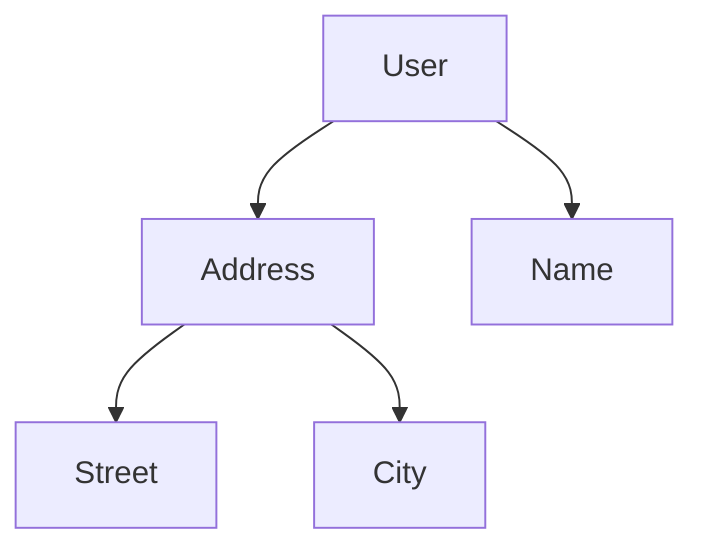

## 7.15 Lenses and Optics

In the realm of functional programming, managing immutable data structures efficiently is a critical skill. Kotlin, with its robust type system and functional capabilities, offers powerful tools for handling immutability. One such tool is the concept of optics, which includes lenses, prisms, and isos. These abstractions allow developers to work with immutable data structures in a concise and expressive manner. In this section, we will delve into the world of lenses and optics, focusing on their implementation in Kotlin using the Arrow library.

### Introduction to Optics

Optics are composable abstractions that allow you to focus on specific parts of a data structure. They provide a way to access and modify data without mutating the original structure. This is particularly useful in functional programming, where immutability is a core principle.

#### Key Concepts

- **Lens**: A lens is a first-class getter and setter for a specific field within a data structure. It allows you to focus on a single field, read its value, and create a modified copy of the structure with a new value for that field.
- **Prism**: A prism is used to work with sum types, such as sealed classes or enums. It focuses on a specific case of a sum type, allowing you to safely access and modify it.
- **Iso**: An iso is an isomorphism between two types, meaning there is a two-way conversion between them. It allows you to transform data back and forth between two representations.

### Why Use Optics?

Using optics in Kotlin provides several advantages:

- **Immutability**: Optics allow you to work with immutable data structures without compromising on convenience or expressiveness.
- **Composability**: Optics can be composed to focus on deeply nested fields, making it easier to work with complex data structures.
- **Type Safety**: Optics leverage Kotlin's type system to provide compile-time guarantees, reducing runtime errors.

### Arrow Optics

Arrow is a popular functional programming library for Kotlin that provides a comprehensive suite of optics. It includes implementations for lenses, prisms, isos, and more. Let's explore how to use Arrow Optics to manage immutable data structures in Kotlin.

#### Setting Up Arrow Optics

To use Arrow Optics in your Kotlin project, you need to add the Arrow Optics dependency to your build configuration. Here's how you can do it with Gradle:

```kotlin
dependencies {
    implementation("io.arrow-kt:arrow-optics:1.0.0")
    kapt("io.arrow-kt:arrow-meta:1.0.0")
}
```

Ensure you have the Kotlin annotation processing tool (KAPT) enabled in your project to generate optics.

### Working with Lenses

Lenses are the most commonly used optics. They allow you to focus on a specific field within a data structure, providing a way to read and modify it.

#### Creating a Lens

Let's start by creating a simple data class and a lens for one of its fields:

```kotlin
data class Address(val street: String, val city: String)
data class User(val name: String, val address: Address)

val addressStreetLens = Lens(
    get = { user: User -> user.address.street },
    set = { user: User, newStreet: String -> user.copy(address = user.address.copy(street = newStreet)) }
)
```

In this example, `addressStreetLens` is a lens that focuses on the `street` field of the `address` property in the `User` data class. It provides a `get` function to read the street and a `set` function to create a new `User` instance with an updated street.

#### Using Lenses

You can use lenses to read and modify data in a functional way:

```kotlin
val user = User("Alice", Address("Main St", "Springfield"))

// Reading the street
val street = addressStreetLens.get(user)
println(street) // Output: Main St

// Modifying the street
val updatedUser = addressStreetLens.set(user, "Elm St")
println(updatedUser) // Output: User(name=Alice, address=Address(street=Elm St, city=Springfield))
```

#### Composing Lenses

Lenses can be composed to focus on deeply nested fields. Arrow Optics provides a convenient way to compose lenses:

```kotlin
val userAddressLens = Lens(
    get = { user: User -> user.address },
    set = { user: User, newAddress: Address -> user.copy(address = newAddress) }
)

val composedLens = userAddressLens compose addressStreetLens

val newStreet = composedLens.get(user)
val modifiedUser = composedLens.set(user, "Oak St")
```

In this example, `composedLens` is a composition of `userAddressLens` and `addressStreetLens`, allowing you to focus directly on the `street` field of a `User`.

### Visualizing Lenses

To better understand how lenses work, let's visualize the process of composing lenses and accessing nested fields.



This diagram represents the structure of the `User` data class, with lenses focusing on specific fields.

### Working with Prisms

Prisms are used to work with sum types, such as sealed classes or enums. They allow you to focus on a specific case of a sum type.

#### Creating a Prism

Consider a sealed class representing different shapes:

```kotlin
sealed class Shape {
    data class Circle(val radius: Double) : Shape()
    data class Rectangle(val width: Double, val height: Double) : Shape()
}

val circlePrism = Prism(
    getOrModify = { shape: Shape ->
        when (shape) {
            is Shape.Circle -> Either.Right(shape.radius)
            else -> Either.Left(shape)
        }
    },
    reverseGet = { radius: Double -> Shape.Circle(radius) }
)
```

In this example, `circlePrism` is a prism that focuses on the `Circle` case of the `Shape` sealed class. It provides a `getOrModify` function to safely access the radius and a `reverseGet` function to create a `Circle` from a radius.

#### Using Prisms

You can use prisms to safely access and modify sum types:

```kotlin
val shape: Shape = Shape.Circle(5.0)

// Accessing the radius
val radius = circlePrism.getOrModify(shape).orNull()
println(radius) // Output: 5.0

// Modifying the radius
val newShape = circlePrism.reverseGet(10.0)
println(newShape) // Output: Shape.Circle(radius=10.0)
```

### Working with Isos

Isos represent a bidirectional transformation between two types. They are useful when you need to convert data back and forth between two representations.

#### Creating an Iso

Let's create an iso for converting between a `Pair` and a custom `Point` class:

```kotlin
data class Point(val x: Int, val y: Int)

val pointIso = Iso(
    get = { point: Point -> Pair(point.x, point.y) },
    reverseGet = { pair: Pair<Int, Int> -> Point(pair.first, pair.second) }
)
```

In this example, `pointIso` is an iso that converts between a `Point` and a `Pair<Int, Int>`.

#### Using Isos

You can use isos to transform data between two types:

```kotlin
val point = Point(3, 4)

// Converting to Pair
val pair = pointIso.get(point)
println(pair) // Output: (3, 4)

// Converting back to Point
val newPoint = pointIso.reverseGet(pair)
println(newPoint) // Output: Point(x=3, y=4)
```

### Design Considerations

When using optics in Kotlin, consider the following:

- **Performance**: Optics provide a convenient way to work with immutable data, but they may introduce overhead due to copying. Use them judiciously in performance-critical code.
- **Readability**: Optics can make code more readable by abstracting away the details of accessing and modifying data. However, excessive use of optics may lead to complex and hard-to-understand code.
- **Type Safety**: Optics leverage Kotlin's type system to provide compile-time guarantees. Ensure that your optics are correctly defined to avoid runtime errors.

### Differences and Similarities

Optics are often compared to other functional programming concepts, such as:

- **Monads**: Both optics and monads provide a way to work with data in a functional style. However, optics focus on accessing and modifying data, while monads focus on chaining computations.
- **Functional Lenses in Other Languages**: Optics in Kotlin are similar to lenses in other functional programming languages, such as Haskell and Scala. The core concepts are the same, but the syntax and implementation details may differ.

### Try It Yourself

To get hands-on experience with optics in Kotlin, try modifying the code examples provided in this section. Here are some suggestions:

- Create a lens for a different field in the `User` data class, such as `city`.
- Implement a prism for the `Rectangle` case of the `Shape` sealed class.
- Use an iso to convert between a custom data class and a different representation.

### Conclusion

Lenses and optics provide a powerful way to manage immutable data structures in Kotlin. By leveraging the Arrow library, you can work with lenses, prisms, and isos to access and modify data in a functional and type-safe manner. As you explore these concepts further, you'll discover new ways to simplify and enhance your Kotlin code.

## Quiz Time!



### What is a lens in the context of optics?

- [x] A first-class getter and setter for a specific field within a data structure.
- [ ] A tool for managing concurrency in Kotlin.
- [ ] A way to handle exceptions in functional programming.
- [ ] A method for optimizing performance in Kotlin applications.

> **Explanation:** A lens is a first-class getter and setter for a specific field within a data structure, allowing you to read and modify it without mutating the original structure.

### What is the primary use of a prism?

- [x] To work with sum types, such as sealed classes or enums.
- [ ] To optimize performance in Kotlin applications.
- [ ] To manage concurrency in Kotlin.
- [ ] To handle exceptions in functional programming.

> **Explanation:** A prism is used to work with sum types, such as sealed classes or enums, allowing you to focus on a specific case of a sum type.

### What is an iso in optics?

- [x] An isomorphism between two types, allowing two-way conversion.
- [ ] A tool for managing concurrency in Kotlin.
- [ ] A method for optimizing performance in Kotlin applications.
- [ ] A way to handle exceptions in functional programming.

> **Explanation:** An iso is an isomorphism between two types, meaning there is a two-way conversion between them.

### How can you compose lenses in Kotlin?

- [x] By using the `compose` function to combine two lenses.
- [ ] By using the `merge` function to combine two lenses.
- [ ] By using the `add` function to combine two lenses.
- [ ] By using the `combine` function to combine two lenses.

> **Explanation:** Lenses can be composed using the `compose` function to focus on deeply nested fields.

### What library provides a comprehensive suite of optics for Kotlin?

- [x] Arrow
- [ ] Ktor
- [ ] Retrofit
- [ ] Dagger

> **Explanation:** Arrow is a popular functional programming library for Kotlin that provides a comprehensive suite of optics.

### What is the purpose of the `getOrModify` function in a prism?

- [x] To safely access a specific case of a sum type.
- [ ] To optimize performance in Kotlin applications.
- [ ] To manage concurrency in Kotlin.
- [ ] To handle exceptions in functional programming.

> **Explanation:** The `getOrModify` function in a prism is used to safely access a specific case of a sum type.

### What is the main advantage of using optics in Kotlin?

- [x] They allow you to work with immutable data structures in a concise and expressive manner.
- [ ] They optimize performance in Kotlin applications.
- [ ] They manage concurrency in Kotlin.
- [ ] They handle exceptions in functional programming.

> **Explanation:** Optics allow you to work with immutable data structures in a concise and expressive manner, providing a way to access and modify data without mutating the original structure.

### What is the `reverseGet` function used for in an iso?

- [x] To convert data back to its original representation.
- [ ] To optimize performance in Kotlin applications.
- [ ] To manage concurrency in Kotlin.
- [ ] To handle exceptions in functional programming.

> **Explanation:** The `reverseGet` function in an iso is used to convert data back to its original representation.

### What is a potential drawback of using optics in performance-critical code?

- [x] They may introduce overhead due to copying.
- [ ] They can lead to runtime errors.
- [ ] They are not type-safe.
- [ ] They cannot be composed.

> **Explanation:** Optics may introduce overhead due to copying, which can be a drawback in performance-critical code.

### True or False: Optics in Kotlin are similar to lenses in other functional programming languages.

- [x] True
- [ ] False

> **Explanation:** Optics in Kotlin are similar to lenses in other functional programming languages, such as Haskell and Scala, with similar core concepts but different syntax and implementation details.


