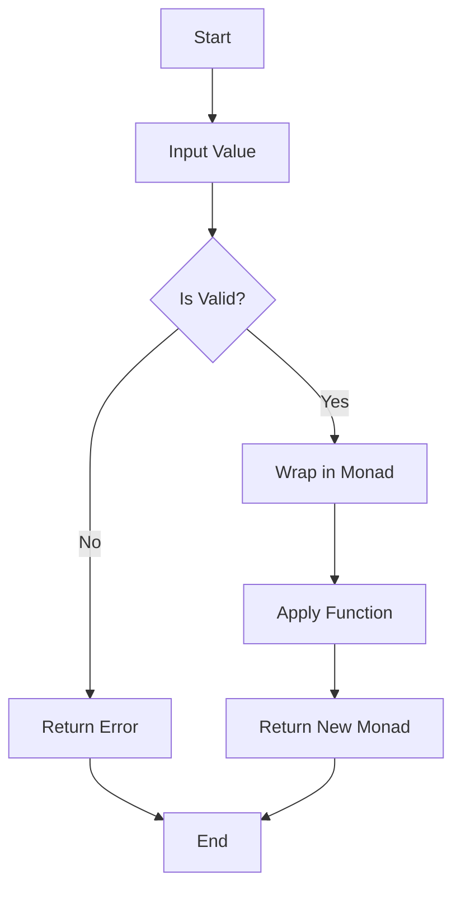

## 7.2 Monads and Functors in Kotlin

In the realm of functional programming, monads and functors are essential concepts that help manage side effects and enhance code modularity. In Kotlin, these patterns are implemented using types like `Result`, `Option`, and `Either`. This section will guide you through understanding monadic structures, using these types, and chaining operations with monads.

### Understanding Monadic Structures

Monads are a type of abstract data type used to represent computations instead of data in the domain model. They provide a way to structure programs generically. A monad is essentially a design pattern used to handle program-wide concerns in a functional way.

#### Key Characteristics of Monads

1. **Unit (or Return):** A function that takes a value and puts it into a monadic context. In Kotlin, this is often represented by factory methods or constructors.

2. **Bind (or FlatMap):** A function that takes a monadic value and a function from a plain value to a monadic value, and returns a monadic value. This is used to chain operations.

3. **Associativity:** The order of applying operations does not change the result.

#### Monad Laws

Monads must satisfy three laws:

- **Left Identity:** `unit(a).flatMap(f) == f(a)`
- **Right Identity:** `m.flatMap(unit) == m`
- **Associativity:** `m.flatMap(f).flatMap(g) == m.flatMap(x -> f(x).flatMap(g))`

### Functors in Kotlin

A functor is a type that implements a map function, which applies a function to a wrapped value. In Kotlin, this is often seen in collections and other data structures that support transformation.

#### Key Characteristics of Functors

1. **Map Function:** Applies a function to the value inside the functor, returning a new functor with the transformed value.

2. **Preservation of Structure:** The structure of the functor is preserved during transformation.

#### Functor Laws

Functors must satisfy two laws:

- **Identity:** `f.map(identity) == f`
- **Composition:** `f.map(g).map(h) == f.map(g andThen h)`

### Using `Result`, `Option`, `Either` Types

Kotlin provides several types that embody monadic behavior, such as `Result`, `Option`, and `Either`. These types help manage computations that may fail or have multiple outcomes.

#### `Result` Type

The `Result` type represents a computation that can either succeed or fail. It is a sealed class in Kotlin, providing a way to handle success and failure in a type-safe manner.

```kotlin
fun divide(a: Int, b: Int): Result<Int> {
    return if (b == 0) {
        Result.failure(ArithmeticException("Division by zero"))
    } else {
        Result.success(a / b)
    }
}

fun main() {
    val result = divide(10, 0)
    result.onSuccess { println("Result: $it") }
          .onFailure { println("Error: ${it.message}") }
}
```

#### `Option` Type

The `Option` type is used to represent optional values. It can be either `Some` or `None`, similar to `Nullable` types in Kotlin but with more functional capabilities.

```kotlin
sealed class Option<out T> {
    object None : Option<Nothing>()
    data class Some<out T>(val value: T) : Option<T>()
}

fun <T> Option<T>.getOrElse(default: T): T = when (this) {
    is Option.Some -> value
    is Option.None -> default
}

fun main() {
    val someValue: Option<Int> = Option.Some(5)
    val noneValue: Option<Int> = Option.None

    println(someValue.getOrElse(0)) // Output: 5
    println(noneValue.getOrElse(0)) // Output: 0
}
```

#### `Either` Type

The `Either` type is used to represent a value that can be one of two types. It is often used for computations that can return two different types of results, such as success or error.

```kotlin
sealed class Either<out L, out R> {
    data class Left<out L>(val value: L) : Either<L, Nothing>()
    data class Right<out R>(val value: R) : Either<Nothing, R>()
}

fun divideEither(a: Int, b: Int): Either<String, Int> {
    return if (b == 0) {
        Either.Left("Division by zero")
    } else {
        Either.Right(a / b)
    }
}

fun main() {
    val result = divideEither(10, 0)
    when (result) {
        is Either.Left -> println("Error: ${result.value}")
        is Either.Right -> println("Result: ${result.value}")
    }
}
```

### Chaining Operations with Monads

Monads allow us to chain operations in a clean and readable way. This is achieved using the `flatMap` function, which is a key component of monads.

#### Example: Chaining with `Result`

```kotlin
fun parseNumber(str: String): Result<Int> =
    str.toIntOrNull()?.let { Result.success(it) } ?: Result.failure(NumberFormatException("Invalid number"))

fun reciprocal(x: Int): Result<Double> =
    if (x == 0) Result.failure(ArithmeticException("Division by zero"))
    else Result.success(1.0 / x)

fun main() {
    val result = parseNumber("10")
        .flatMap { reciprocal(it) }
        .onSuccess { println("Reciprocal: $it") }
        .onFailure { println("Error: ${it.message}") }
}
```

#### Example: Chaining with `Either`

```kotlin
fun parseNumberEither(str: String): Either<String, Int> =
    str.toIntOrNull()?.let { Either.Right(it) } ?: Either.Left("Invalid number")

fun reciprocalEither(x: Int): Either<String, Double> =
    if (x == 0) Either.Left("Division by zero")
    else Either.Right(1.0 / x)

fun main() {
    val result = parseNumberEither("10")
        .flatMap { reciprocalEither(it) }
    when (result) {
        is Either.Left -> println("Error: ${result.value}")
        is Either.Right -> println("Reciprocal: ${result.value}")
    }
}
```

### Visualizing Monads and Functors

Let's visualize how monads and functors work using a simple flowchart.



**Diagram Description:** This flowchart illustrates the process of wrapping a value in a monad, applying a function, and returning a new monad. If the input is invalid, an error is returned.

### Design Considerations

- **When to Use Monads:** Use monads when you need to handle computations that may fail or have multiple outcomes. They provide a clean way to chain operations and manage side effects.

- **Kotlin Specific Features:** Kotlin's sealed classes and extension functions make it easy to implement monadic behavior. Use these features to create custom monads tailored to your needs.

- **Pitfalls:** Be mindful of the complexity that can arise from excessive use of monads. Ensure that the use of monads enhances code clarity and maintainability.

### Differences and Similarities

- **Monads vs. Functors:** While both monads and functors allow for transformations, monads provide additional capabilities for chaining operations and managing side effects.

- **Option vs. Nullable:** `Option` provides a more functional approach to handling optional values compared to Kotlin's built-in nullable types.

### Try It Yourself

Experiment with the code examples provided. Try modifying the input values and observe how the monadic structures handle different scenarios. Implement your own monadic types using Kotlin's sealed classes and extension functions.

### Knowledge Check

- **Question:** What are the key characteristics of a monad?
- **Question:** How does the `flatMap` function facilitate chaining operations in monads?
- **Question:** What is the difference between `Either` and `Result` types in Kotlin?

### Embrace the Journey

Remember, mastering monads and functors is a journey. As you progress, you'll find new ways to apply these patterns to solve complex problems. Keep experimenting, stay curious, and enjoy the journey!

## Quiz Time!



### What is a Monad in functional programming?

- [x] An abstract data type used to represent computations.
- [ ] A type of loop structure.
- [ ] A design pattern for object-oriented programming.
- [ ] A type of variable declaration.

> **Explanation:** A monad is an abstract data type used to represent computations instead of data in the domain model.

### Which function is essential for chaining operations in monads?

- [ ] map
- [x] flatMap
- [ ] filter
- [ ] reduce

> **Explanation:** The `flatMap` function is essential for chaining operations in monads, allowing for the composition of monadic functions.

### What does the `Either` type represent?

- [ ] A collection of values.
- [x] A value that can be one of two types.
- [ ] A single value or null.
- [ ] A type-safe wrapper for nullable types.

> **Explanation:** The `Either` type represents a value that can be one of two types, often used for computations that can return two different types of results.

### What is the primary purpose of a functor?

- [x] To apply a function to a wrapped value.
- [ ] To encapsulate side effects.
- [ ] To manage state changes.
- [ ] To handle exceptions.

> **Explanation:** A functor is a type that implements a map function, which applies a function to a wrapped value.

### Which of the following is NOT a monad law?

- [ ] Left Identity
- [ ] Right Identity
- [ ] Associativity
- [x] Commutativity

> **Explanation:** Commutativity is not a monad law. The monad laws are Left Identity, Right Identity, and Associativity.

### What does the `Option` type represent in Kotlin?

- [ ] A collection of optional values.
- [x] An optional value that can be `Some` or `None`.
- [ ] A nullable type.
- [ ] A type-safe wrapper for collections.

> **Explanation:** The `Option` type represents an optional value that can be `Some` or `None`, providing a more functional approach to handling optional values.

### How does the `Result` type handle computations in Kotlin?

- [x] By representing computations that can either succeed or fail.
- [ ] By encapsulating multiple values.
- [ ] By providing a default value for nulls.
- [ ] By managing state transitions.

> **Explanation:** The `Result` type represents computations that can either succeed or fail, providing a way to handle success and failure in a type-safe manner.

### What is the purpose of the `map` function in a functor?

- [x] To apply a function to the value inside the functor.
- [ ] To chain operations.
- [ ] To handle errors.
- [ ] To manage state changes.

> **Explanation:** The `map` function in a functor applies a function to the value inside the functor, returning a new functor with the transformed value.

### Which Kotlin feature is commonly used to implement monadic behavior?

- [ ] Data classes
- [x] Sealed classes
- [ ] Interfaces
- [ ] Annotations

> **Explanation:** Kotlin's sealed classes are commonly used to implement monadic behavior, allowing for the creation of custom monads.

### True or False: Monads and functors are only applicable in functional programming languages.

- [ ] True
- [x] False

> **Explanation:** Monads and functors are applicable in any programming language that supports functional programming concepts, including Kotlin.



By understanding and applying monads and functors in Kotlin, you can write more modular, maintainable, and expressive code. Use these concepts to manage side effects and enhance your functional programming skills.
