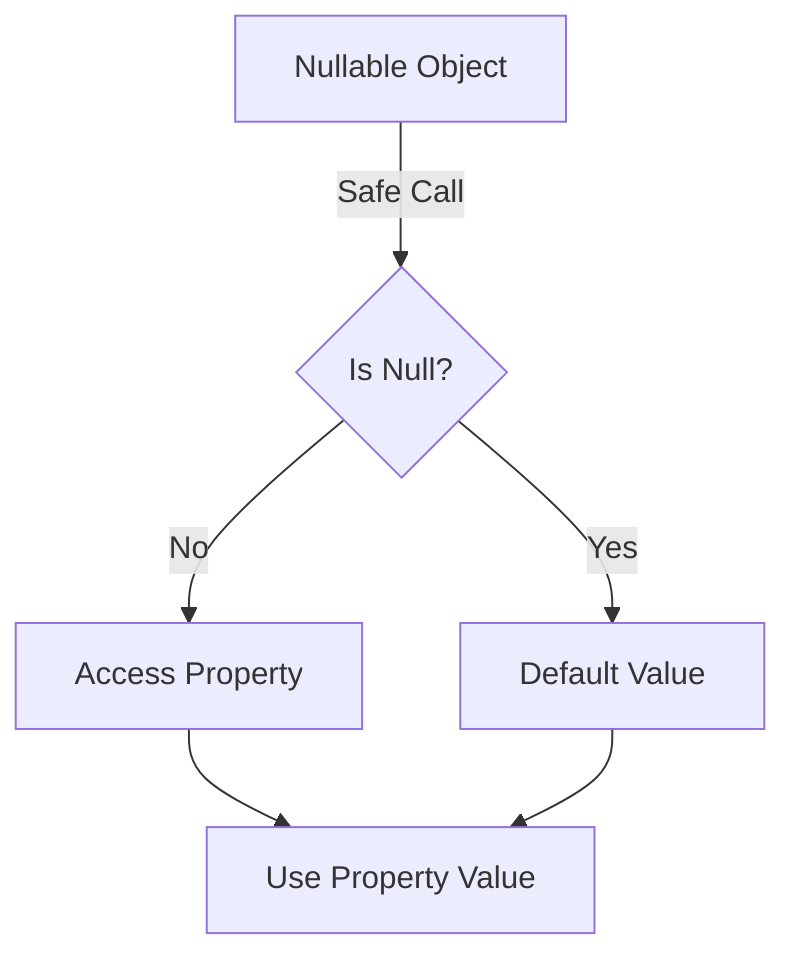

## 7.3 Optionals and Null Safety Patterns

In the world of programming, null references have been a notorious source of bugs and errors. Kotlin, a modern programming language, addresses this issue head-on with its robust null safety features. In this section, we will delve into Kotlin's approach to null safety, focusing on optionals, safe calls, and the Elvis operator. By the end of this guide, you'll have a deep understanding of how to leverage these features to write safer and more reliable Kotlin code.

### Understanding Null Safety in Kotlin

Null safety is a core feature of Kotlin, designed to eliminate the dreaded `NullPointerException` (NPE) from your code. In Kotlin, nullability is part of the type system, meaning that the compiler can enforce null safety at compile time. This is a significant departure from languages like Java, where nullability is not explicitly handled by the type system.

#### Nullable and Non-Nullable Types

In Kotlin, types are divided into two categories: nullable and non-nullable. A non-nullable type cannot hold a null value, while a nullable type can. This distinction is made using the `?` symbol.

- **Non-Nullable Type**: A type that cannot be null. For example, `String` is a non-nullable type.
- **Nullable Type**: A type that can hold a null value. For example, `String?` is a nullable type.

```kotlin
val nonNullableString: String = "Hello, Kotlin"
// val nullableString: String = null // This will cause a compile-time error

val nullableString: String? = null // This is allowed
```

### Safe Calls in Kotlin

Safe calls are a feature in Kotlin that allows you to safely access properties and methods of a nullable object without risking a `NullPointerException`. The safe call operator `?.` is used for this purpose. When you use a safe call, if the object is null, the expression evaluates to null instead of throwing an exception.

#### Using Safe Calls

Safe calls are particularly useful when you need to access a property or method of an object that might be null. Here's an example:

```kotlin
val length: Int? = nullableString?.length
```

In this example, if `nullableString` is null, `length` will also be null. Otherwise, it will hold the length of the string.

#### Chaining Safe Calls

You can chain multiple safe calls together to safely navigate through a series of nullable objects. This is especially useful when dealing with complex data structures.

```kotlin
data class Address(val city: String?)
data class User(val address: Address?)

val user: User? = User(Address("New York"))

val city: String? = user?.address?.city
```

In this example, if `user`, `address`, or `city` is null, the entire expression evaluates to null.

### The Elvis Operator `?:`

The Elvis operator is a concise way to handle nullable expressions by providing a default value in case the expression is null. It is represented by `?:`.

#### Using the Elvis Operator

The Elvis operator allows you to specify a default value that will be used if the expression on the left is null.

```kotlin
val length: Int = nullableString?.length ?: 0
```

In this example, if `nullableString` is null, `length` will be assigned the value `0`.

#### Combining Safe Calls and the Elvis Operator

You can combine safe calls and the Elvis operator to safely access properties and provide defaults in a single expression.

```kotlin
val city: String = user?.address?.city ?: "Unknown"
```

Here, if `user`, `address`, or `city` is null, `city` will be assigned the value `"Unknown"`.

### Best Practices for Null Safety

Kotlin's null safety features are powerful tools for writing robust code, but they require careful use to be effective. Here are some best practices to keep in mind:

#### Prefer Non-Nullable Types

Whenever possible, prefer non-nullable types. This reduces the need for null checks and makes your code easier to reason about.

```kotlin
fun greet(name: String) {
    println("Hello, $name!")
}
```

#### Use Safe Calls and the Elvis Operator

Use safe calls and the Elvis operator to handle nullable types gracefully. This helps you avoid `NullPointerException` and makes your code more concise.

```kotlin
fun printCity(user: User?) {
    val city = user?.address?.city ?: "Unknown"
    println("City: $city")
}
```

#### Avoid Unnecessary Nullable Types

Avoid making types nullable unless there's a good reason. This helps prevent null-related bugs and keeps your code clean.

```kotlin
// Avoid this
fun getUserName(user: User?): String? {
    return user?.name
}

// Prefer this
fun getUserName(user: User): String {
    return user.name
}
```

### Advanced Null Safety Patterns

Kotlin's null safety features can be combined with other language features to create advanced patterns for handling nullability.

#### Null Safety with Extension Functions

Extension functions can be used to add null-safe operations to existing types. This allows you to encapsulate null checks and provide default behavior.

```kotlin
fun String?.orEmpty(): String {
    return this ?: ""
}

val nullableString: String? = null
val nonNullableString: String = nullableString.orEmpty()
```

#### Null Safety with Data Classes

Data classes in Kotlin are a great way to model data with null safety. You can use nullable types and default values to handle missing data gracefully.

```kotlin
data class User(val name: String, val email: String?)

fun printUserInfo(user: User) {
    val email = user.email ?: "No email provided"
    println("Name: ${user.name}, Email: $email")
}
```

### Visualizing Null Safety Patterns

To better understand how null safety patterns work in Kotlin, let's visualize the flow of a safe call combined with the Elvis operator.



**Figure 1: Flowchart of Safe Call and Elvis Operator**

In this flowchart, we start with a nullable object. A safe call checks if the object is null. If it is, we use a default value. If not, we access the property and use its value.

### Try It Yourself

Experiment with the following code snippets to deepen your understanding of Kotlin's null safety features. Try modifying the code to see how different scenarios affect the output.

```kotlin
fun main() {
    val nullableString: String? = null
    val length: Int = nullableString?.length ?: -1
    println("Length: $length") // Output: Length: -1

    val user: User? = User(Address("San Francisco"))
    val city: String = user?.address?.city ?: "Unknown"
    println("City: $city") // Output: City: San Francisco
}
```

### Knowledge Check

Before we wrap up, let's reinforce what we've learned with a few questions:

- What is the purpose of the safe call operator `?.`?
- How does the Elvis operator `?:` help in handling null values?
- Why is it beneficial to prefer non-nullable types in Kotlin?

### Embrace the Journey

Remember, mastering null safety in Kotlin is a journey. As you continue to explore and experiment with these features, you'll become more adept at writing robust and reliable code. Keep pushing the boundaries of what you can achieve with Kotlin's powerful type system!

## Quiz Time!



### What is the primary purpose of the safe call operator `?.` in Kotlin?

- [x] To safely access properties and methods of a nullable object without risking a `NullPointerException`.
- [ ] To convert a nullable type to a non-nullable type.
- [ ] To throw an exception if a nullable object is null.
- [ ] To concatenate strings.

> **Explanation:** The safe call operator `?.` allows you to safely access properties and methods of a nullable object, returning null if the object is null, thus avoiding a `NullPointerException`.

### How does the Elvis operator `?:` help in handling null values?

- [x] It provides a default value if the expression on the left is null.
- [ ] It throws an exception if the expression on the left is null.
- [ ] It converts a nullable type to a non-nullable type.
- [ ] It concatenates strings.

> **Explanation:** The Elvis operator `?:` is used to provide a default value if the expression on the left is null, allowing for concise handling of nullable values.

### Which of the following is a best practice for null safety in Kotlin?

- [x] Prefer non-nullable types whenever possible.
- [ ] Use nullable types for all variables.
- [ ] Avoid using the safe call operator.
- [ ] Always use `!!` to assert non-nullability.

> **Explanation:** Preferring non-nullable types whenever possible reduces the need for null checks and makes your code easier to reason about.

### What does the following Kotlin code snippet output?
```kotlin
val nullableString: String? = null
val length: Int = nullableString?.length ?: -1
println("Length: $length")
```

- [x] Length: -1
- [ ] Length: 0
- [ ] Length: null
- [ ] Length: 5

> **Explanation:** Since `nullableString` is null, the safe call returns null, and the Elvis operator provides the default value `-1`.

### In Kotlin, what does the `?` symbol denote when used in a type declaration?

- [x] The type can hold a null value.
- [ ] The type is non-nullable.
- [ ] The type is a primitive type.
- [ ] The type is an array.

> **Explanation:** In Kotlin, the `?` symbol denotes that the type can hold a null value, making it a nullable type.

### What is the result of using the `!!` operator in Kotlin?

- [x] It throws a `NullPointerException` if the value is null.
- [ ] It converts a nullable type to a non-nullable type without any checks.
- [ ] It provides a default value if the value is null.
- [ ] It concatenates two strings.

> **Explanation:** The `!!` operator is used to assert that a value is non-null, and it throws a `NullPointerException` if the value is null.

### Which Kotlin feature allows you to add null-safe operations to existing types?

- [x] Extension functions
- [ ] Safe calls
- [ ] Elvis operator
- [ ] Data classes

> **Explanation:** Extension functions allow you to add null-safe operations to existing types, encapsulating null checks and providing default behavior.

### What is the output of the following code snippet?
```kotlin
val user: User? = User(Address("San Francisco"))
val city: String = user?.address?.city ?: "Unknown"
println("City: $city")
```

- [x] City: San Francisco
- [ ] City: Unknown
- [ ] City: null
- [ ] City: New York

> **Explanation:** Since `user` and `address` are not null, the safe call accesses the `city` property, resulting in "City: San Francisco".

### True or False: In Kotlin, all types are non-nullable by default.

- [x] True
- [ ] False

> **Explanation:** In Kotlin, all types are non-nullable by default, and you must explicitly mark a type as nullable using the `?` symbol.

### Which of the following is a benefit of using Kotlin's null safety features?

- [x] Reducing the risk of `NullPointerException`.
- [x] Making code more concise and readable.
- [ ] Increasing the complexity of code.
- [ ] Eliminating the need for error handling.

> **Explanation:** Kotlin's null safety features reduce the risk of `NullPointerException` and make code more concise and readable by handling nullability explicitly.


