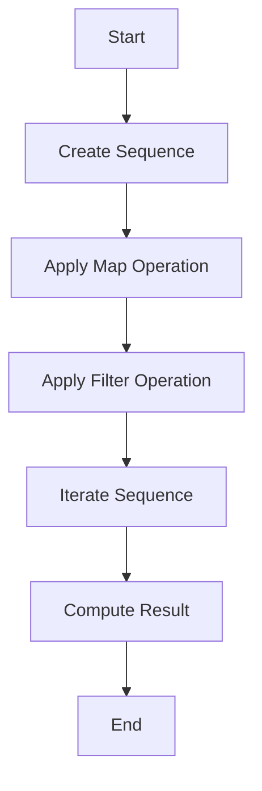

## 7.6 Lazy Evaluation

Lazy evaluation is a powerful concept in functional programming that allows computations to be deferred until their results are actually needed. This can lead to significant performance improvements, especially in scenarios where not all elements of a data structure are required. In Kotlin, lazy evaluation is primarily achieved through lazy sequences and lazy properties. Let's delve into these concepts and explore how they can be leveraged to write efficient and performant Kotlin code.

### Understanding Lazy Evaluation

Lazy evaluation is a strategy that delays the evaluation of an expression until its value is needed. This can be particularly useful in optimizing performance by avoiding unnecessary calculations, reducing memory usage, and improving the responsiveness of applications.

#### Benefits of Lazy Evaluation

1. **Performance Optimization**: By deferring computations, lazy evaluation can help reduce the time complexity of algorithms, especially when dealing with large datasets.
2. **Memory Efficiency**: Lazy evaluation can help conserve memory by not holding onto unnecessary data.
3. **Improved Responsiveness**: Applications can remain responsive by performing computations only when required.

### Lazy Sequences in Kotlin

Kotlin provides a powerful feature called sequences, which are collections that support lazy evaluation. Unlike lists, which are eagerly evaluated, sequences compute their elements on demand.

#### Creating Sequences

You can create sequences in Kotlin using the `sequence` builder. This allows you to define a sequence of elements that are computed lazily.

```kotlin
val lazySequence = sequence {
    yield(1)
    yield(2)
    yield(3)
    // More elements can be added here
}
```

In this example, the sequence is defined using the `sequence` builder, and elements are added using the `yield` function. The elements are not computed until they are accessed.

#### Transforming Sequences

Sequences support a variety of transformation operations, such as `map`, `filter`, and `flatMap`. These operations are also lazy, meaning they are only applied when the sequence is iterated over.

```kotlin
val transformedSequence = lazySequence
    .map { it * 2 }
    .filter { it > 2 }
```

In this example, the sequence is transformed by doubling each element and then filtering out elements less than or equal to 2. The transformations are not applied until the sequence is iterated over.

#### Iterating Over Sequences

To iterate over a sequence and trigger the evaluation of its elements, you can use a loop or a terminal operation such as `toList`.

```kotlin
for (element in transformedSequence) {
    println(element)
}

// Or convert to a list
val resultList = transformedSequence.toList()
println(resultList)
```

### Lazy Properties in Kotlin

In addition to lazy sequences, Kotlin also supports lazy properties. A lazy property is a property whose value is computed only once, upon first access, and then cached for subsequent accesses.

#### Declaring Lazy Properties

You can declare a lazy property using the `lazy` function. This function takes a lambda that computes the property's value.

```kotlin
val lazyValue: String by lazy {
    println("Computing lazy value")
    "Hello, Kotlin!"
}
```

In this example, the `lazyValue` property is computed only when it is first accessed. The lambda passed to `lazy` is executed at that time, and its result is cached.

#### Accessing Lazy Properties

When you access a lazy property, the lambda is executed, and its result is returned. Subsequent accesses return the cached value without re-executing the lambda.

```kotlin
println(lazyValue) // Output: Computing lazy value \n Hello, Kotlin!
println(lazyValue) // Output: Hello, Kotlin!
```

### Lazy Evaluation in Practice

Let's explore a practical example of lazy evaluation in Kotlin. Suppose we have a large dataset and we want to perform a series of transformations and calculations on it. Using lazy sequences, we can optimize the performance of these operations.

#### Example: Processing a Large Dataset

Consider a scenario where we have a list of numbers and we want to perform the following operations:

1. Double each number.
2. Filter out numbers less than 10.
3. Sum the remaining numbers.

Using lazy sequences, we can achieve this efficiently:

```kotlin
val numbers = (1..1_000_000).toList()

val result = numbers.asSequence()
    .map { it * 2 }
    .filter { it >= 10 }
    .sum()

println("Sum of numbers: $result")
```

In this example, the `asSequence` function converts the list into a sequence, enabling lazy evaluation. The `map` and `filter` operations are applied lazily, and the `sum` operation triggers the evaluation of the sequence.

### Visualizing Lazy Evaluation

To better understand how lazy evaluation works, let's visualize the process using a flowchart.



**Figure 1: Lazy Evaluation Process**

In this flowchart, the sequence is created, and transformations are applied lazily. The evaluation is triggered only when the sequence is iterated over, leading to the computation of the final result.

### Design Considerations

When using lazy evaluation in Kotlin, consider the following:

1. **Use Lazy Evaluation for Large Datasets**: Lazy evaluation is particularly beneficial when working with large datasets, as it can significantly reduce memory usage and improve performance.
2. **Be Mindful of Side Effects**: Since lazy evaluation defers computations, any side effects within transformations may not occur when expected. Ensure that side effects are handled appropriately.
3. **Understand When Evaluation Occurs**: Evaluation is triggered by terminal operations such as `toList`, `sum`, or iteration. Be aware of when these operations occur to avoid unintended computations.

### Differences and Similarities

Lazy evaluation is often compared to eager evaluation, where computations are performed immediately. The key difference is that lazy evaluation defers computations until necessary, while eager evaluation performs them upfront. Both approaches have their use cases, and the choice between them depends on the specific requirements of your application.

### Try It Yourself

To get hands-on experience with lazy evaluation, try modifying the code examples provided. Experiment with different transformations and observe how lazy evaluation affects performance. For example, try adding more complex operations to the sequence and measure the time taken to compute the results.

### Knowledge Check

1. What is lazy evaluation, and how does it differ from eager evaluation?
2. How can lazy sequences improve performance in Kotlin applications?
3. What are some potential pitfalls of using lazy evaluation?
4. How do lazy properties work, and when should they be used?
5. What are some common use cases for lazy evaluation in real-world applications?

### Embrace the Journey

Remember, mastering lazy evaluation is just one step in your journey as a Kotlin developer. As you continue to explore the language and its features, you'll discover new ways to optimize your code and improve performance. Keep experimenting, stay curious, and enjoy the journey!

## Quiz Time!



### What is lazy evaluation?

- [x] A strategy that delays the evaluation of an expression until its value is needed.
- [ ] A method to eagerly compute all elements of a collection.
- [ ] A technique to store data in a database.
- [ ] A way to execute code in parallel.

> **Explanation:** Lazy evaluation is a strategy that defers computations until their results are actually needed, optimizing performance and resource usage.

### How are sequences different from lists in Kotlin?

- [x] Sequences are lazily evaluated, while lists are eagerly evaluated.
- [ ] Sequences can only hold integers, while lists can hold any type.
- [ ] Sequences are immutable, while lists are mutable.
- [ ] Sequences are part of the Java standard library, while lists are not.

> **Explanation:** Sequences in Kotlin are lazily evaluated, meaning their elements are computed on demand, unlike lists which are eagerly evaluated.

### What function is used to declare a lazy property in Kotlin?

- [x] `lazy`
- [ ] `lateinit`
- [ ] `deferred`
- [ ] `async`

> **Explanation:** The `lazy` function is used to declare a lazy property in Kotlin, allowing its value to be computed only once upon first access.

### Which of the following operations triggers the evaluation of a sequence?

- [x] Iteration over the sequence
- [ ] Applying a `map` operation
- [ ] Applying a `filter` operation
- [ ] Defining the sequence with `sequence` builder

> **Explanation:** Evaluation of a sequence is triggered by iteration or terminal operations like `toList` or `sum`, not by intermediate operations like `map` or `filter`.

### What is a potential pitfall of using lazy evaluation?

- [x] Side effects may not occur when expected.
- [ ] It always increases memory usage.
- [ ] It forces immediate computation of all elements.
- [ ] It is incompatible with Kotlin's type system.

> **Explanation:** Since lazy evaluation defers computations, any side effects within transformations may not occur when expected, which can be a potential pitfall.

### Which keyword is used to yield elements in a sequence builder?

- [x] `yield`
- [ ] `return`
- [ ] `break`
- [ ] `continue`

> **Explanation:** The `yield` keyword is used in a sequence builder to produce elements lazily.

### What is the primary benefit of using lazy properties?

- [x] They compute their value only once upon first access.
- [ ] They allow for mutable state.
- [ ] They automatically synchronize access across threads.
- [ ] They are always faster than eager properties.

> **Explanation:** Lazy properties compute their value only once upon first access and cache the result for subsequent accesses, optimizing performance.

### How can you convert a sequence to a list in Kotlin?

- [x] Using the `toList` function
- [ ] Using the `asList` function
- [ ] Using the `map` function
- [ ] Using the `filter` function

> **Explanation:** The `toList` function is used to convert a sequence to a list in Kotlin, triggering the evaluation of the sequence.

### What is the result of accessing a lazy property multiple times?

- [x] The cached value is returned without re-executing the lambda.
- [ ] The lambda is executed each time.
- [ ] An exception is thrown.
- [ ] The property is reset to its initial state.

> **Explanation:** Once a lazy property is accessed and its value computed, the result is cached, and subsequent accesses return the cached value without re-executing the lambda.

### True or False: Lazy evaluation can help reduce memory usage.

- [x] True
- [ ] False

> **Explanation:** Lazy evaluation can help reduce memory usage by deferring computations and not holding onto unnecessary data until needed.


