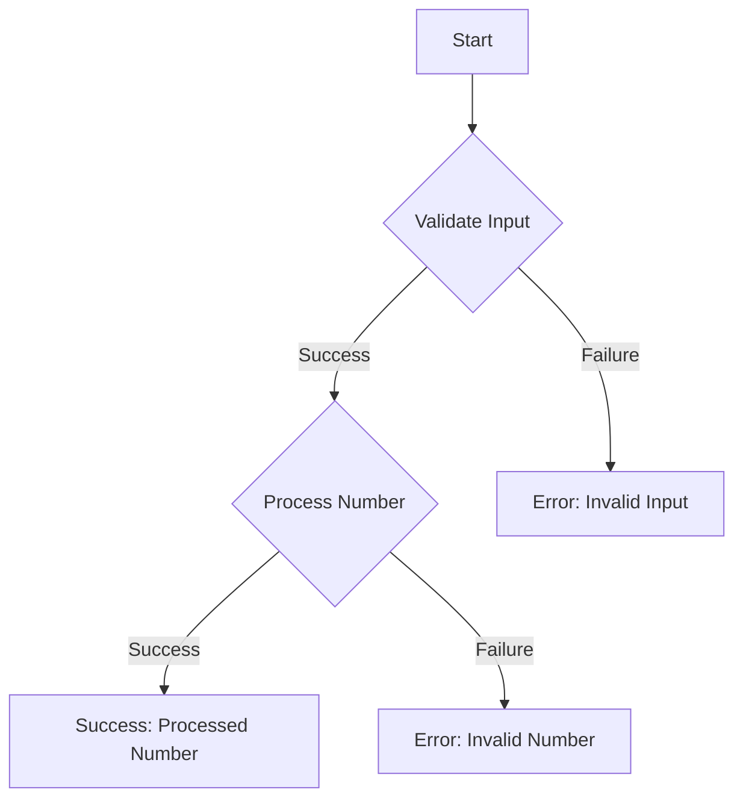

## 7.7 Functional Error Handling

In the realm of software engineering, handling errors gracefully is paramount to building robust and reliable applications. Kotlin, with its rich set of features, provides powerful tools for functional error handling. This section delves into using `Result` and `Either` types, chaining operations safely, and implementing railway-oriented programming. Let's embark on this journey to master functional error handling in Kotlin.

### Introduction to Functional Error Handling

Functional error handling is a paradigm that emphasizes the use of functional programming techniques to manage errors in a predictable and composable manner. Unlike traditional error handling, which often relies on exceptions, functional error handling uses types to represent success or failure, making error handling explicit and type-safe.

#### Key Concepts

- **Immutability**: Functional programming promotes immutability, which helps in maintaining consistent state and avoiding side effects.
- **Type Safety**: By using types to represent errors, we ensure that error handling is enforced at compile time.
- **Composability**: Functional error handling allows us to compose operations, making it easier to build complex logic from simpler components.

### Using `Result` Type in Kotlin

Kotlin's `Result` type is a built-in feature designed to represent the outcome of an operation that can either succeed or fail. It encapsulates a value of type `T` for success or an exception for failure.

#### Creating and Using `Result`

To create a `Result`, we use the `runCatching` function, which executes a block of code and captures any exceptions:

```kotlin
fun divide(a: Int, b: Int): Result<Int> {
    return runCatching {
        if (b == 0) throw IllegalArgumentException("Division by zero")
        a / b
    }
}
```

#### Handling `Result`

We can handle the outcome of a `Result` using various methods:

- `onSuccess`: Executes a block of code if the operation was successful.
- `onFailure`: Executes a block of code if the operation failed.

```kotlin
val result = divide(10, 2)

result.onSuccess { value ->
    println("Success: $value")
}.onFailure { exception ->
    println("Error: ${exception.message}")
}
```

#### Transforming `Result`

Kotlin provides methods like `map` and `flatMap` to transform the value inside a `Result`, allowing us to chain operations:

```kotlin
val transformedResult = result.map { it * 2 }
```

### Using `Either` Type

While Kotlin's `Result` type is useful, it is limited to representing success and failure. The `Either` type, commonly used in functional programming, can represent two possible values, typically a `Left` (error) and a `Right` (success).

#### Implementing `Either`

Kotlin does not have a built-in `Either` type, but we can implement it ourselves or use libraries like Arrow. Here's a simple implementation:

```kotlin
sealed class Either<out L, out R> {
    data class Left<out L>(val value: L) : Either<L, Nothing>()
    data class Right<out R>(val value: R) : Either<Nothing, R>()
}
```

#### Using `Either`

To use `Either`, we create instances of `Left` or `Right`:

```kotlin
fun divideEither(a: Int, b: Int): Either<String, Int> {
    return if (b == 0) Either.Left("Division by zero")
    else Either.Right(a / b)
}

val resultEither = divideEither(10, 0)

when (resultEither) {
    is Either.Left -> println("Error: ${resultEither.value}")
    is Either.Right -> println("Success: ${resultEither.value}")
}
```

### Chaining Operations Safely

Functional error handling shines when chaining operations. By using types like `Result` and `Either`, we can safely compose operations without worrying about exceptions.

#### Chaining with `Result`

We can chain operations using `map` and `flatMap`:

```kotlin
val finalResult = divide(10, 2)
    .map { it * 2 }
    .flatMap { divide(it, 2) }

finalResult.onSuccess { println("Final Success: $it") }
    .onFailure { println("Final Error: ${it.message}") }
```

#### Chaining with `Either`

Similarly, we can chain operations with `Either` using extension functions:

```kotlin
fun <L, R, T> Either<L, R>.map(transform: (R) -> T): Either<L, T> = when (this) {
    is Either.Left -> this
    is Either.Right -> Either.Right(transform(value))
}

fun <L, R, T> Either<L, R>.flatMap(transform: (R) -> Either<L, T>): Either<L, T> = when (this) {
    is Either.Left -> this
    is Either.Right -> transform(value)
}

val finalEither = divideEither(10, 2)
    .map { it * 2 }
    .flatMap { divideEither(it, 2) }

when (finalEither) {
    is Either.Left -> println("Final Error: ${finalEither.value}")
    is Either.Right -> println("Final Success: ${finalEither.value}")
}
```

### Railway-Oriented Programming

Railway-oriented programming is a functional programming pattern that visualizes the flow of operations as a railway track, where each step can either continue on the success track or switch to the failure track.

#### Implementing Railway-Oriented Programming

To implement railway-oriented programming, we use types like `Result` or `Either` to represent the tracks. Each operation is a switch that can direct the flow based on success or failure.

```kotlin
fun validateInput(input: String): Either<String, Int> {
    return if (input.isBlank()) Either.Left("Input cannot be blank")
    else Either.Right(input.toIntOrNull() ?: return Either.Left("Invalid number"))
}

fun processNumber(number: Int): Either<String, Int> {
    return if (number < 0) Either.Left("Number must be positive")
    else Either.Right(number * 2)
}

val input = "42"
val railwayResult = validateInput(input)
    .flatMap { processNumber(it) }

when (railwayResult) {
    is Either.Left -> println("Railway Error: ${railwayResult.value}")
    is Either.Right -> println("Railway Success: ${railwayResult.value}")
}
```

### Visualizing Railway-Oriented Programming

To better understand railway-oriented programming, let's visualize the flow using a Mermaid.js diagram:



This diagram illustrates how each step in the process can lead to a success or failure track, guiding the flow of operations.

### Design Considerations

When implementing functional error handling, consider the following:

- **Clarity**: Ensure that the code is clear and easy to understand. Use meaningful names for `Left` and `Right` values.
- **Performance**: Be mindful of the performance implications of using functional constructs, especially in performance-critical applications.
- **Error Messages**: Provide informative error messages to aid in debugging and user feedback.

### Differences and Similarities

- **Result vs. Either**: While both `Result` and `Either` can represent success and failure, `Either` is more flexible, allowing for custom error types.
- **Exceptions**: Unlike exceptions, `Result` and `Either` make error handling explicit and type-safe, reducing the risk of unhandled errors.

### Try It Yourself

Now that we've explored functional error handling in Kotlin, try modifying the code examples to handle different types of errors or to chain additional operations. Experiment with different scenarios to deepen your understanding.

### References and Links

For further reading, explore the following resources:

- [Kotlin's Result Type](https://kotlinlang.org/api/latest/jvm/stdlib/kotlin/-result/)
- [Arrow Library for Kotlin](https://arrow-kt.io/)
- [Railway-Oriented Programming](https://fsharpforfunandprofit.com/rop/)

### Knowledge Check

To reinforce your understanding, consider the following questions:

- How does functional error handling differ from traditional error handling?
- What are the benefits of using `Result` and `Either` types?
- How can railway-oriented programming improve code readability and maintainability?

### Embrace the Journey

Remember, mastering functional error handling is just one step in your Kotlin journey. Keep experimenting, stay curious, and enjoy the process of building robust and reliable applications.

## Quiz Time!



### What is the primary advantage of using functional error handling?

- [x] It makes error handling explicit and type-safe.
- [ ] It eliminates the need for error handling.
- [ ] It simplifies code by removing all error checks.
- [ ] It automatically logs all errors.

> **Explanation:** Functional error handling makes error handling explicit and type-safe, ensuring that errors are managed predictably.

### How do you create a `Result` in Kotlin?

- [x] By using the `runCatching` function.
- [ ] By using the `try` block.
- [ ] By using the `catch` block.
- [ ] By using the `finally` block.

> **Explanation:** The `runCatching` function is used to create a `Result` by executing a block of code and capturing any exceptions.

### What is the purpose of the `Either` type?

- [x] To represent two possible values, typically a success and an error.
- [ ] To represent only successful outcomes.
- [ ] To replace all exceptions in Kotlin.
- [ ] To simplify string manipulation.

> **Explanation:** The `Either` type is used to represent two possible values, such as a success and an error, providing flexibility in error handling.

### How can you chain operations with `Result`?

- [x] By using `map` and `flatMap` methods.
- [ ] By using `try` and `catch` blocks.
- [ ] By using `if` and `else` statements.
- [ ] By using `for` loops.

> **Explanation:** The `map` and `flatMap` methods allow chaining operations with `Result`, enabling safe composition of functions.

### What is railway-oriented programming?

- [x] A pattern that visualizes operations as a railway track with success and failure paths.
- [ ] A pattern for optimizing database queries.
- [ ] A pattern for designing user interfaces.
- [ ] A pattern for managing network connections.

> **Explanation:** Railway-oriented programming visualizes operations as a railway track, where each step can lead to a success or failure path.

### Which Kotlin library provides an implementation of the `Either` type?

- [x] Arrow
- [ ] Ktor
- [ ] Retrofit
- [ ] Exposed

> **Explanation:** The Arrow library provides an implementation of the `Either` type, along with other functional programming constructs.

### What is a key benefit of using `Either` over `Result`?

- [x] `Either` allows for custom error types.
- [ ] `Either` automatically logs errors.
- [ ] `Either` is built into Kotlin.
- [ ] `Either` eliminates all runtime exceptions.

> **Explanation:** `Either` allows for custom error types, providing more flexibility compared to `Result`, which is limited to exceptions.

### How can you implement railway-oriented programming in Kotlin?

- [x] By using types like `Result` or `Either` to represent success and failure tracks.
- [ ] By using global variables to track errors.
- [ ] By using nested `try` blocks.
- [ ] By using recursion.

> **Explanation:** Railway-oriented programming is implemented using types like `Result` or `Either`, which represent success and failure tracks.

### What is the role of the `map` function in functional error handling?

- [x] To transform the success value inside a `Result` or `Either`.
- [ ] To log error messages.
- [ ] To catch exceptions.
- [ ] To iterate over collections.

> **Explanation:** The `map` function is used to transform the success value inside a `Result` or `Either`, allowing for safe chaining of operations.

### True or False: Functional error handling eliminates the need for error handling in code.

- [ ] True
- [x] False

> **Explanation:** Functional error handling does not eliminate the need for error handling; instead, it provides a structured and type-safe way to manage errors.


