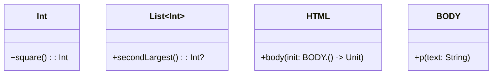

## 7.8 Extension Functions and Functional Patterns

Kotlin's extension functions are a powerful feature that allows developers to add new functionality to existing classes without modifying their source code. This capability aligns perfectly with functional programming paradigms, enabling more expressive and concise code. In this section, we will delve into how extension functions can be leveraged to implement functional patterns, enhance existing APIs, and create more maintainable and readable code.

### Understanding Extension Functions

Extension functions in Kotlin allow you to "extend" a class with new functionality without having to inherit from the class or use any type of design pattern such as Decorator. This is achieved by defining a function outside the class but with the class as its receiver type.

#### Basic Syntax and Usage

To define an extension function, you specify the receiver type followed by a dot and the function name. Here's a simple example:

```kotlin
// Extension function to calculate the square of an integer
fun Int.square(): Int {
    return this * this
}

fun main() {
    val number = 4
    println("Square of $number is ${number.square()}") // Output: Square of 4 is 16
}
```

In this example, `square` is an extension function for the `Int` class. It can be called on any integer value, providing a more intuitive and readable way to perform the operation.

#### Key Characteristics

- **Static Dispatch**: Extension functions are resolved statically, meaning they are determined at compile time based on the type of the expression on which they are called.
- **No Access to Private Members**: Extension functions cannot access the private or protected members of the class they are extending.
- **Receiver Object**: The `this` keyword inside an extension function refers to the receiver object, the instance of the class on which the function is called.

### Enhancing APIs with Extension Functions

Extension functions can significantly enhance existing APIs by allowing developers to add utility methods that are specific to their use cases. This can lead to cleaner and more maintainable code.

#### Example: Enhancing a List API

Consider a scenario where you frequently need to find the second largest element in a list. Instead of repeating this logic throughout your codebase, you can define an extension function:

```kotlin
fun List<Int>.secondLargest(): Int? {
    if (this.size < 2) return null
    val sortedList = this.sortedDescending()
    return sortedList[1]
}

fun main() {
    val numbers = listOf(3, 1, 4, 1, 5, 9)
    println("Second largest number is ${numbers.secondLargest()}") // Output: Second largest number is 5
}
```

This extension function makes the code more expressive and reduces duplication.

### Functional Patterns with Extension Functions

Kotlin's extension functions can be used to implement various functional programming patterns, making your code more declarative and concise.

#### Higher-Order Functions

Higher-order functions are functions that take other functions as parameters or return them. Extension functions can be used to define higher-order functions that operate on collections or other data structures.

```kotlin
fun <T> List<T>.applyIf(predicate: (T) -> Boolean, action: (T) -> Unit) {
    for (item in this) {
        if (predicate(item)) {
            action(item)
        }
    }
}

fun main() {
    val numbers = listOf(1, 2, 3, 4, 5)
    numbers.applyIf({ it % 2 == 0 }) { println("$it is even") }
    // Output: 2 is even
    //         4 is even
}
```

In this example, `applyIf` is an extension function that takes a predicate and an action, applying the action to all elements that satisfy the predicate.

#### Function Composition

Function composition is a powerful concept in functional programming where you combine two or more functions to produce a new function. Kotlin's extension functions can facilitate this pattern.

```kotlin
infix fun <P1, R, R2> ((P1) -> R).compose(f: (R) -> R2): (P1) -> R2 {
    return { p1: P1 -> f(this(p1)) }
}

fun main() {
    val multiplyByTwo: (Int) -> Int = { it * 2 }
    val addThree: (Int) -> Int = { it + 3 }

    val composedFunction = multiplyByTwo compose addThree

    println(composedFunction(5)) // Output: 13
}
```

Here, the `compose` extension function allows us to create a new function by composing `multiplyByTwo` and `addThree`.

### Designing DSLs with Extension Functions

Domain-Specific Languages (DSLs) are specialized mini-languages tailored to a specific problem domain. Kotlin's extension functions are instrumental in designing DSLs, allowing you to create expressive and readable APIs.

#### Example: Building a Simple HTML DSL

```kotlin
class HTML {
    private val elements = mutableListOf<String>()

    fun body(init: BODY.() -> Unit) {
        val body = BODY()
        body.init()
        elements.add(body.toString())
    }

    override fun toString(): String {
        return elements.joinToString(separator = "\n", prefix = "<html>\n", postfix = "\n</html>")
    }
}

class BODY {
    private val elements = mutableListOf<String>()

    fun p(text: String) {
        elements.add("<p>$text</p>")
    }

    override fun toString(): String {
        return elements.joinToString(separator = "\n", prefix = "<body>\n", postfix = "\n</body>")
    }
}

fun html(init: HTML.() -> Unit): HTML {
    val html = HTML()
    html.init()
    return html
}

fun main() {
    val document = html {
        body {
            p("Hello, World!")
            p("This is a simple DSL example.")
        }
    }
    println(document)
}
```

In this example, we use extension functions to define a simple HTML DSL. The `html` and `body` functions allow us to construct HTML documents in a more readable and structured way.

### Try It Yourself

To deepen your understanding, try modifying the HTML DSL example to add support for additional HTML elements, such as `h1`, `h2`, and `ul` (unordered list). Experiment with creating nested structures and see how extension functions can make the DSL more expressive.

### Visualizing Extension Functions

To better understand how extension functions work, let's visualize their interaction with existing classes using a class diagram.



**Diagram Description**: This class diagram illustrates how extension functions add new methods to existing classes like `Int` and `List<Int>`, and how they can be used to build DSLs with classes like `HTML` and `BODY`.

### Advantages of Using Extension Functions

- **Increased Readability**: Extension functions allow you to write code that is more intuitive and closer to natural language.
- **Encapsulation**: They enable you to encapsulate utility functions that are specific to your application's domain.
- **Reduced Boilerplate**: By adding methods directly to classes, you eliminate the need for utility classes and static methods.
- **Enhanced API Design**: Extension functions can be used to design APIs that are more flexible and easier to use.

### Design Considerations

When using extension functions, consider the following:

- **Static Dispatch**: Remember that extension functions are statically dispatched. They do not override member functions.
- **Namespace Conflicts**: Be cautious of naming conflicts, especially when importing multiple extension functions with the same name.
- **Performance**: While extension functions are generally efficient, be mindful of performance implications when using them extensively in performance-critical code.

### Differences and Similarities with Other Patterns

Extension functions are often compared to other design patterns like Decorator and Adapter. Here are some distinctions:

- **Decorator Pattern**: Unlike the Decorator pattern, extension functions do not require wrapping objects or modifying their structure. They provide a more lightweight way to add functionality.
- **Adapter Pattern**: Extension functions can serve a similar purpose to the Adapter pattern by allowing you to add methods that adapt an existing interface to a new one. However, they do not provide the same level of abstraction or encapsulation as a full adapter class.

### Conclusion

Extension functions in Kotlin are a versatile tool that can significantly enhance the expressiveness and maintainability of your code. By leveraging them to implement functional patterns, enhance APIs, and design DSLs, you can create more readable and efficient applications. Remember to consider their static nature and potential for naming conflicts when designing your codebase.

## Quiz Time!



### What is a key characteristic of Kotlin's extension functions?

- [x] They are resolved statically at compile time.
- [ ] They can access private members of the class.
- [ ] They override member functions.
- [ ] They require inheritance to function.

> **Explanation:** Extension functions are resolved statically at compile time, meaning they do not override member functions and cannot access private members of the class.

### How do extension functions enhance existing APIs?

- [x] By allowing developers to add utility methods specific to their use cases.
- [ ] By modifying the source code of existing classes.
- [ ] By requiring inheritance from existing classes.
- [ ] By increasing the complexity of the codebase.

> **Explanation:** Extension functions allow developers to add utility methods specific to their use cases without modifying the source code of existing classes, enhancing the API's flexibility and usability.

### What is the primary benefit of using extension functions in DSL design?

- [x] They allow for more expressive and readable APIs.
- [ ] They enforce strict type checking.
- [ ] They reduce the need for higher-order functions.
- [ ] They simplify the inheritance hierarchy.

> **Explanation:** Extension functions enable the creation of more expressive and readable APIs, which is particularly beneficial in designing domain-specific languages (DSLs).

### Which Kotlin feature is used in the example to create a simple HTML DSL?

- [x] Extension functions
- [ ] Inheritance
- [ ] Abstract classes
- [ ] Interfaces

> **Explanation:** The example uses extension functions to create a simple HTML DSL, allowing for a more readable and structured way to construct HTML documents.

### What is a potential drawback of using extension functions extensively?

- [x] Naming conflicts can occur, especially with multiple imports.
- [ ] They are always less efficient than member functions.
- [ ] They require additional memory allocation.
- [ ] They cannot be used with generic types.

> **Explanation:** A potential drawback of using extension functions extensively is the possibility of naming conflicts, especially when importing multiple extension functions with the same name.

### How can extension functions be used to implement higher-order functions?

- [x] By defining functions that take other functions as parameters.
- [ ] By modifying the class's inheritance hierarchy.
- [ ] By overriding existing member functions.
- [ ] By accessing private members of the class.

> **Explanation:** Extension functions can be used to implement higher-order functions by defining functions that take other functions as parameters, allowing for more flexible and reusable code.

### What is the result of the composed function in the function composition example?

- [x] 13
- [ ] 10
- [ ] 15
- [ ] 8

> **Explanation:** The composed function first multiplies the input by two and then adds three, resulting in 13 when the input is 5.

### What is a common use case for extension functions in Kotlin?

- [x] Adding utility methods to existing classes.
- [ ] Modifying the inheritance hierarchy.
- [ ] Enforcing strict type checking.
- [ ] Reducing memory allocation.

> **Explanation:** A common use case for extension functions in Kotlin is adding utility methods to existing classes, enhancing their functionality without modifying their source code.

### Which pattern is often compared to extension functions due to its ability to add functionality?

- [x] Decorator Pattern
- [ ] Singleton Pattern
- [ ] Factory Pattern
- [ ] Observer Pattern

> **Explanation:** The Decorator pattern is often compared to extension functions due to its ability to add functionality to existing classes, although extension functions provide a more lightweight approach.

### True or False: Extension functions can override member functions of a class.

- [ ] True
- [x] False

> **Explanation:** False. Extension functions cannot override member functions of a class; they are resolved statically at compile time.



Remember, this is just the beginning. As you progress, you'll build more complex and interactive applications using Kotlin's powerful features. Keep experimenting, stay curious, and enjoy the journey!
