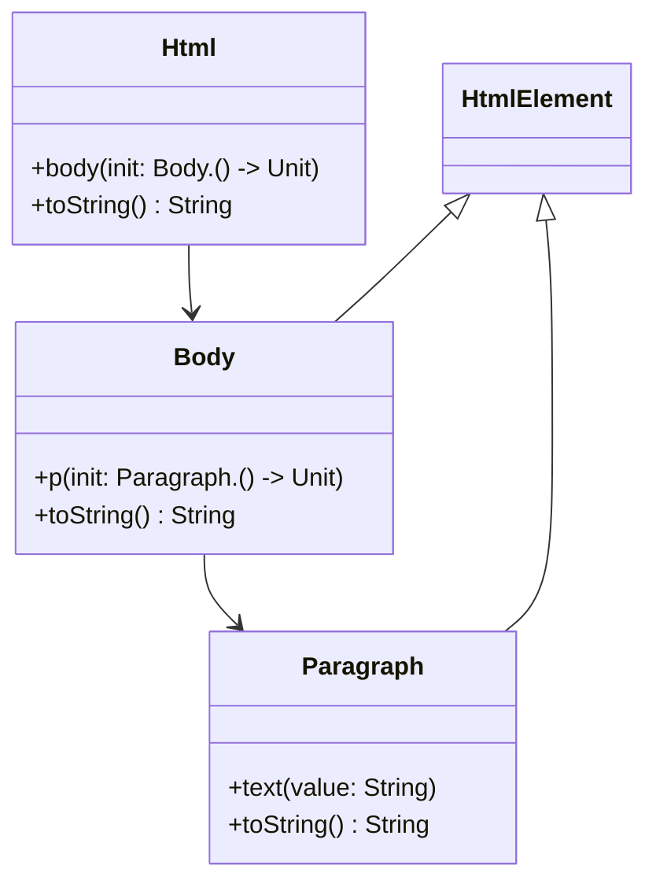

## 7.9 Designing DSLs

Designing Domain-Specific Languages (DSLs) in Kotlin is an advanced technique that allows developers to create expressive, concise, and readable code tailored to specific problem domains. Kotlin's language features, such as lambdas with receivers and type-safe builders, make it an ideal choice for crafting DSLs. In this section, we will delve into the concepts, techniques, and best practices for designing DSLs in Kotlin, providing you with the tools to enhance your codebases with custom, domain-specific syntax.

### Introduction to DSLs

A Domain-Specific Language (DSL) is a specialized language tailored to a particular application domain. Unlike general-purpose programming languages, DSLs are designed to express solutions in a way that is natural and intuitive for domain experts. DSLs can be internal, embedded within a host language, or external, with their own syntax and parser.

#### Why Use DSLs?

- **Expressiveness**: DSLs allow you to express complex logic in a way that is closer to the problem domain, making the code more understandable and maintainable.
- **Abstraction**: They provide a higher level of abstraction, hiding implementation details and focusing on the domain logic.
- **Productivity**: DSLs can increase productivity by reducing boilerplate code and simplifying complex operations.

### Kotlin's Features for DSL Design

Kotlin offers several features that facilitate the creation of internal DSLs:

- **Lambdas with Receivers**: These allow you to extend the functionality of objects within a lambda, providing a clean and concise syntax for building DSLs.
- **Type-safe Builders**: Kotlin's type system ensures that the DSL constructs are used correctly, reducing runtime errors.
- **Extension Functions and Properties**: These enable you to add new functionality to existing classes without modifying their source code.

### Building Blocks of a Kotlin DSL

#### Lambdas with Receivers

Lambdas with receivers are a cornerstone of Kotlin DSLs. They allow you to define a lambda that operates within the context of a receiver object, enabling you to call methods and access properties of the receiver directly.

```kotlin
class Html {
    private val children = mutableListOf<HtmlElement>()

    fun body(init: Body.() -> Unit) {
        val body = Body().apply(init)
        children.add(body)
    }

    override fun toString(): String {
        return children.joinToString(separator = "\n") { it.toString() }
    }
}

class Body : HtmlElement {
    private val children = mutableListOf<HtmlElement>()

    fun p(init: Paragraph.() -> Unit) {
        val paragraph = Paragraph().apply(init)
        children.add(paragraph)
    }

    override fun toString(): String {
        return "<body>\n${children.joinToString(separator = "\n") { it.toString() }}\n</body>"
    }
}

class Paragraph : HtmlElement {
    private var text = ""

    fun text(value: String) {
        text = value
    }

    override fun toString(): String {
        return "<p>$text</p>"
    }
}

interface HtmlElement

fun html(init: Html.() -> Unit): Html {
    return Html().apply(init)
}

// Usage
val document = html {
    body {
        p {
            text("Hello, world!")
        }
    }
}

println(document)
```

In this example, the `html` function uses a lambda with receiver to build an HTML document. The `Body` and `Paragraph` classes are used as receivers, allowing you to define their content in a natural, hierarchical manner.

#### Type-safe Builders

Type-safe builders leverage Kotlin's type system to enforce correct usage of DSL constructs. They ensure that the DSL is used in a way that adheres to the domain rules, preventing invalid configurations at compile time.

```kotlin
class Menu {
    private val items = mutableListOf<MenuItem>()

    fun item(name: String, action: () -> Unit) {
        items.add(MenuItem(name, action))
    }

    fun build(): List<MenuItem> = items
}

class MenuItem(val name: String, val action: () -> Unit)

fun menu(init: Menu.() -> Unit): List<MenuItem> {
    return Menu().apply(init).build()
}

// Usage
val myMenu = menu {
    item("Home") { println("Home clicked") }
    item("Settings") { println("Settings clicked") }
}

myMenu.forEach { println(it.name) }
```

In this example, the `menu` function uses a type-safe builder to create a list of menu items. The `Menu` class ensures that only valid menu items are added, and the DSL syntax is clear and intuitive.

### Advanced DSL Techniques

#### Nested DSLs

Nested DSLs allow you to build complex structures by nesting DSLs within each other. This technique is useful for representing hierarchical data or configurations.

```kotlin
class Table {
    private val rows = mutableListOf<Row>()

    fun row(init: Row.() -> Unit) {
        val row = Row().apply(init)
        rows.add(row)
    }

    override fun toString(): String {
        return rows.joinToString(separator = "\n") { it.toString() }
    }
}

class Row {
    private val cells = mutableListOf<Cell>()

    fun cell(init: Cell.() -> Unit) {
        val cell = Cell().apply(init)
        cells.add(cell)
    }

    override fun toString(): String {
        return cells.joinToString(separator = " | ") { it.toString() }
    }
}

class Cell {
    private var content = ""

    fun content(value: String) {
        content = value
    }

    override fun toString(): String {
        return content
    }
}

fun table(init: Table.() -> Unit): Table {
    return Table().apply(init)
}

// Usage
val myTable = table {
    row {
        cell { content("Row 1, Cell 1") }
        cell { content("Row 1, Cell 2") }
    }
    row {
        cell { content("Row 2, Cell 1") }
        cell { content("Row 2, Cell 2") }
    }
}

println(myTable)
```

In this example, the `table` DSL allows you to define a table with rows and cells. Each level of the hierarchy is represented by a class, and the DSL syntax mirrors the structure of the data.

#### DSLs with Configuration and Validation

DSLs can include configuration options and validation logic to ensure that the constructed objects meet certain criteria.

```kotlin
class ServerConfig {
    var host: String = "localhost"
    var port: Int = 8080

    fun validate() {
        require(port in 1..65535) { "Port must be between 1 and 65535" }
    }
}

fun serverConfig(init: ServerConfig.() -> Unit): ServerConfig {
    return ServerConfig().apply(init).also { it.validate() }
}

// Usage
val config = serverConfig {
    host = "example.com"
    port = 8080
}

println("Host: ${config.host}, Port: ${config.port}")
```

In this example, the `serverConfig` DSL allows you to configure a server with a host and port. The `validate` function ensures that the port is within a valid range, providing immediate feedback if the configuration is incorrect.

### Try It Yourself

Experiment with the provided DSL examples by modifying the code to suit your needs. Try adding new elements to the HTML DSL, such as `div` or `span`, or extend the menu DSL with additional configuration options. By experimenting with these examples, you'll gain a deeper understanding of how DSLs work and how to tailor them to your specific domain.

### Visualizing DSL Design

To better understand the structure and flow of a DSL, let's visualize the HTML DSL example using a class diagram.



**Diagram Description:** This class diagram illustrates the relationship between the `Html`, `Body`, and `Paragraph` classes in the HTML DSL. The `Html` class contains a `body` method, which in turn contains a `p` method for paragraphs. Both `Body` and `Paragraph` implement the `HtmlElement` interface, allowing them to be treated as elements within the HTML structure.

### Design Considerations

When designing a DSL, consider the following:

- **Domain Relevance**: Ensure that the DSL syntax closely aligns with the domain concepts and terminology.
- **Readability**: Aim for a syntax that is easy to read and understand, even for those unfamiliar with the underlying implementation.
- **Flexibility**: Design the DSL to be flexible enough to accommodate future changes and extensions.
- **Error Handling**: Provide meaningful error messages and validation to guide users in using the DSL correctly.

### Differences and Similarities

DSLs are often compared to APIs and libraries, but they serve different purposes. While APIs provide a set of functions or classes for interacting with a system, DSLs offer a higher-level, domain-specific syntax that abstracts away implementation details. DSLs can be seen as a layer on top of APIs, providing a more intuitive interface for domain experts.

### Conclusion

Designing DSLs in Kotlin is a powerful technique that can greatly enhance the expressiveness and maintainability of your code. By leveraging Kotlin's language features, such as lambdas with receivers and type-safe builders, you can create DSLs that are both intuitive and robust. As you continue to explore and experiment with DSLs, you'll discover new ways to simplify complex logic and improve the clarity of your code.

Remember, this is just the beginning. As you progress, you'll build more complex and interactive DSLs. Keep experimenting, stay curious, and enjoy the journey!

## Quiz Time!



### What is a Domain-Specific Language (DSL)?

- [x] A specialized language tailored to a particular application domain.
- [ ] A general-purpose programming language.
- [ ] A type of database query language.
- [ ] A markup language for web development.

> **Explanation:** A DSL is designed to express solutions in a way that is natural and intuitive for domain experts, focusing on a specific application domain.

### Which Kotlin feature is essential for building DSLs?

- [x] Lambdas with receivers
- [ ] Data classes
- [ ] Companion objects
- [ ] Inline functions

> **Explanation:** Lambdas with receivers allow you to define a lambda that operates within the context of a receiver object, enabling DSL-like syntax.

### What is the purpose of type-safe builders in Kotlin DSLs?

- [x] To enforce correct usage of DSL constructs and reduce runtime errors.
- [ ] To provide a way to serialize objects.
- [ ] To enhance the performance of Kotlin applications.
- [ ] To simplify the syntax of Kotlin expressions.

> **Explanation:** Type-safe builders leverage Kotlin's type system to ensure that DSL constructs are used correctly, preventing invalid configurations at compile time.

### How can nested DSLs be useful?

- [x] They allow you to build complex structures by nesting DSLs within each other.
- [ ] They provide a way to execute code in parallel.
- [ ] They enhance the security of Kotlin applications.
- [ ] They reduce the memory footprint of applications.

> **Explanation:** Nested DSLs are useful for representing hierarchical data or configurations, allowing for more complex and structured DSLs.

### What is a key advantage of using DSLs?

- [x] Increased expressiveness and readability of code.
- [ ] Faster execution speed.
- [ ] Reduced file size of applications.
- [ ] Enhanced security features.

> **Explanation:** DSLs allow you to express complex logic in a way that is closer to the problem domain, making the code more understandable and maintainable.

### What is the role of validation in a DSL?

- [x] To ensure that the constructed objects meet certain criteria and provide immediate feedback if the configuration is incorrect.
- [ ] To compile the DSL into machine code.
- [ ] To encrypt the DSL for security purposes.
- [ ] To convert the DSL into a general-purpose language.

> **Explanation:** Validation logic in a DSL ensures that the constructed objects adhere to domain rules, providing immediate feedback if the configuration is incorrect.

### What is a common pitfall when designing DSLs?

- [x] Making the DSL too complex or difficult to read.
- [ ] Using too many comments in the code.
- [ ] Relying solely on external libraries.
- [ ] Avoiding the use of classes and objects.

> **Explanation:** A common pitfall is designing a DSL that is too complex or difficult to read, which can negate the benefits of using a DSL.

### How do DSLs differ from APIs?

- [x] DSLs offer a higher-level, domain-specific syntax that abstracts away implementation details.
- [ ] DSLs are always faster than APIs.
- [ ] DSLs are used exclusively for web development.
- [ ] DSLs provide lower-level access to system resources.

> **Explanation:** DSLs provide a more intuitive interface for domain experts, focusing on domain-specific syntax rather than implementation details.

### Can DSLs be used for configuration purposes?

- [x] True
- [ ] False

> **Explanation:** DSLs can be used for configuration purposes, allowing users to define settings and options in a domain-specific syntax.

### What is a benefit of using lambdas with receivers in DSLs?

- [x] They allow for a clean and concise syntax by enabling methods and properties of the receiver to be accessed directly.
- [ ] They automatically optimize the performance of the DSL.
- [ ] They provide built-in security features for the DSL.
- [ ] They eliminate the need for type checking in the DSL.

> **Explanation:** Lambdas with receivers allow for a clean and concise syntax by enabling methods and properties of the receiver to be accessed directly, which is essential for DSL design.


