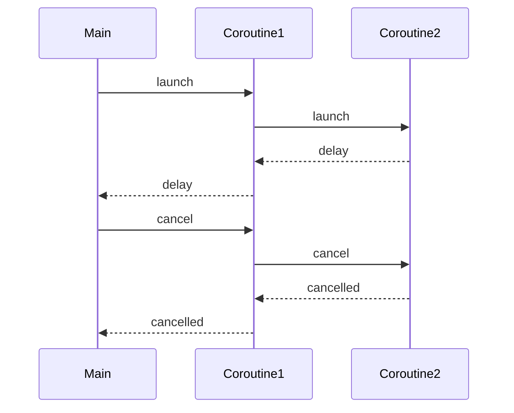

## 8.1 Coroutines in Kotlin

Kotlin coroutines are a powerful tool for asynchronous programming, offering a way to write non-blocking code in a sequential style. As expert developers, understanding coroutines is crucial for building efficient, responsive applications. This section delves into the intricacies of Kotlin coroutines, exploring suspending functions, coroutine builders, context, and more.

### Introduction to Coroutines

Coroutines are a concurrency design pattern that you can use on the JVM and Android to simplify code that executes asynchronously. They allow you to write asynchronous code that looks like synchronous code, making it easier to read and maintain.

#### What Are Coroutines?

Coroutines are a form of cooperative multitasking. Unlike threads, which are preemptive, coroutines yield control voluntarily. This means that coroutines can suspend their execution at a certain point and resume later, allowing other coroutines to run in the meantime.

#### Benefits of Using Coroutines

- **Simplified Code**: Write asynchronous code in a sequential manner.
- **Non-blocking**: Avoid blocking threads, leading to more efficient resource usage.
- **Lightweight**: Coroutines are much lighter than threads, allowing you to run thousands of them concurrently.

### Understanding Suspending Functions

Suspending functions are the building blocks of coroutines. They are functions that can be paused and resumed at a later time.

#### What is a Suspending Function?

A suspending function is a function that can suspend the execution of a coroutine without blocking the thread. It is marked with the `suspend` keyword.

```kotlin
suspend fun fetchData(): String {
    // Simulate a network call
    delay(1000)
    return "Data fetched"
}
```

In the example above, `fetchData` is a suspending function that simulates a network call using `delay`, which is a suspending function provided by the Kotlin standard library.

#### How Suspending Functions Work

Suspending functions can only be called from within a coroutine or another suspending function. They allow the coroutine to be paused and resumed, freeing up the thread to do other work in the meantime.

### Coroutine Builders

Coroutine builders are functions that help you create and start coroutines. The most common coroutine builders are `launch`, `async`, and `runBlocking`.

#### Launch

The `launch` builder is used to start a new coroutine without blocking the current thread. It returns a `Job` object, which represents the coroutine.

```kotlin
fun main() = runBlocking {
    launch {
        val data = fetchData()
        println(data)
    }
}
```

In this example, `launch` starts a new coroutine that calls `fetchData` and prints the result.

#### Async

The `async` builder is used to start a new coroutine and return a `Deferred` object, which represents a future result. You can use the `await` function to get the result.

```kotlin
fun main() = runBlocking {
    val deferred = async {
        fetchData()
    }
    println(deferred.await())
}
```

Here, `async` starts a new coroutine and returns a `Deferred` object. The `await` function is used to get the result of the coroutine.

#### RunBlocking

The `runBlocking` builder is used to start a coroutine in a blocking way. It is mainly used in main functions and tests.

```kotlin
fun main() = runBlocking {
    println(fetchData())
}
```

In this example, `runBlocking` is used to start a coroutine that calls `fetchData` and prints the result.

### Coroutine Context and Dispatchers

The coroutine context is a set of elements that define the behavior of a coroutine. It includes a `Job`, a `CoroutineDispatcher`, and other elements.

#### CoroutineDispatcher

The `CoroutineDispatcher` determines the thread or threads that the coroutine will run on. The most common dispatchers are `Dispatchers.Default`, `Dispatchers.IO`, and `Dispatchers.Main`.

- **Dispatchers.Default**: Used for CPU-intensive work.
- **Dispatchers.IO**: Used for I/O operations.
- **Dispatchers.Main**: Used for UI operations on Android.

```kotlin
fun main() = runBlocking {
    launch(Dispatchers.Default) {
        println("Running on Default")
    }
    launch(Dispatchers.IO) {
        println("Running on IO")
    }
}
```

In this example, two coroutines are started with different dispatchers.

#### Job

A `Job` represents a coroutine. It can be used to manage the lifecycle of a coroutine, including cancellation.

```kotlin
fun main() = runBlocking {
    val job = launch {
        repeat(1000) { i ->
            println("Job: $i")
            delay(500)
        }
    }
    delay(1300)
    println("Cancelling job")
    job.cancelAndJoin()
    println("Job cancelled")
}
```

Here, a `Job` is used to start a coroutine that prints numbers. The job is cancelled after 1.3 seconds.

### Exception Handling in Coroutines

Exception handling in coroutines is different from regular exception handling. Coroutines use structured concurrency, which means that exceptions are propagated up the coroutine hierarchy.

#### Try-Catch

You can use `try-catch` blocks to handle exceptions in coroutines.

```kotlin
fun main() = runBlocking {
    val job = launch {
        try {
            repeat(1000) { i ->
                println("Job: $i")
                delay(500)
            }
        } catch (e: CancellationException) {
            println("Job cancelled")
        }
    }
    delay(1300)
    println("Cancelling job")
    job.cancelAndJoin()
}
```

In this example, a `try-catch` block is used to handle the `CancellationException` when the job is cancelled.

#### CoroutineExceptionHandler

The `CoroutineExceptionHandler` is used to handle exceptions that are not caught by `try-catch` blocks.

```kotlin
fun main() = runBlocking {
    val handler = CoroutineExceptionHandler { _, exception ->
        println("Caught $exception")
    }
    val job = launch(handler) {
        throw AssertionError("Error")
    }
    job.join()
}
```

Here, a `CoroutineExceptionHandler` is used to catch an `AssertionError` thrown by the coroutine.

### Structured Concurrency

Structured concurrency is a design principle that ensures that coroutines are properly managed and do not leak resources. It is achieved by using coroutine scopes.

#### CoroutineScope

A `CoroutineScope` defines the lifecycle of coroutines. When a scope is cancelled, all coroutines within that scope are also cancelled.

```kotlin
fun main() = runBlocking {
    launch {
        delay(1000)
        println("Task from runBlocking")
    }
    coroutineScope {
        launch {
            delay(500)
            println("Task from nested launch")
        }
        delay(100)
        println("Task from coroutine scope")
    }
    println("Coroutine scope is over")
}
```

In this example, `coroutineScope` is used to create a new scope for the nested launch.

### Channels and Flow

Channels and Flow are used for communication between coroutines.

#### Channels

Channels are a way to send and receive data between coroutines.

```kotlin
fun main() = runBlocking {
    val channel = Channel<Int>()
    launch {
        for (x in 1..5) channel.send(x * x)
        channel.close()
    }
    for (y in channel) println(y)
}
```

In this example, a channel is used to send and receive data between coroutines.

#### Flow

Flow is a cold asynchronous data stream that emits values sequentially.

```kotlin
fun simple(): Flow<Int> = flow {
    for (i in 1..3) {
        delay(100)
        emit(i)
    }
}

fun main() = runBlocking {
    simple().collect { value -> println(value) }
}
```

Here, a `Flow` is used to emit values sequentially, which are collected in the `main` function.

### Visualizing Coroutine Execution

To better understand how coroutines work, let's visualize their execution using a sequence diagram.



This diagram illustrates the sequence of events when launching and cancelling coroutines.

### Try It Yourself

Experiment with the code examples provided in this section. Try modifying the delay times, adding more coroutines, or using different dispatchers to see how the behavior changes. This hands-on approach will deepen your understanding of coroutines.

### Key Takeaways

- Coroutines allow you to write asynchronous code in a sequential style.
- Suspending functions are the building blocks of coroutines.
- Coroutine builders like `launch`, `async`, and `runBlocking` help you create and manage coroutines.
- The coroutine context and dispatchers determine the execution environment of coroutines.
- Exception handling in coroutines uses structured concurrency.
- Channels and Flow facilitate communication between coroutines.

### References and Further Reading

- [Kotlin Coroutines Guide](https://kotlinlang.org/docs/coroutines-guide.html)
- [Kotlin Coroutines API](https://kotlinlang.org/api/kotlinx.coroutines/)
- [Structured Concurrency](https://kotlinlang.org/docs/structured-concurrency.html)

### Embrace the Journey

Remember, mastering coroutines is just the beginning. As you continue to explore Kotlin, you'll discover even more powerful features and patterns. Keep experimenting, stay curious, and enjoy the journey!

## Quiz Time!



### What is a coroutine in Kotlin?

- [x] A concurrency design pattern for simplifying asynchronous code.
- [ ] A type of thread that runs in the background.
- [ ] A function that blocks the main thread.
- [ ] A data structure for storing asynchronous tasks.

> **Explanation:** Coroutines are a concurrency design pattern that simplifies asynchronous code by allowing it to be written in a sequential style.

### Which keyword is used to define a suspending function?

- [x] suspend
- [ ] async
- [ ] launch
- [ ] delay

> **Explanation:** The `suspend` keyword is used to define a suspending function, which can be paused and resumed.

### What does the `launch` coroutine builder return?

- [x] A Job object
- [ ] A Deferred object
- [ ] A CoroutineScope object
- [ ] A Channel object

> **Explanation:** The `launch` coroutine builder returns a `Job` object, which represents the coroutine.

### How do you handle exceptions in coroutines?

- [x] Using try-catch blocks or CoroutineExceptionHandler
- [ ] By ignoring them
- [ ] Using a separate thread
- [ ] By restarting the coroutine

> **Explanation:** Exceptions in coroutines can be handled using `try-catch` blocks or a `CoroutineExceptionHandler`.

### What is the purpose of the `CoroutineDispatcher`?

- [x] To determine the thread or threads that the coroutine will run on.
- [ ] To manage the lifecycle of a coroutine.
- [ ] To handle exceptions in coroutines.
- [ ] To send and receive data between coroutines.

> **Explanation:** The `CoroutineDispatcher` determines the thread or threads that the coroutine will run on.

### What is a `Channel` used for in coroutines?

- [x] To send and receive data between coroutines.
- [ ] To manage coroutine exceptions.
- [ ] To define the lifecycle of a coroutine.
- [ ] To block the main thread.

> **Explanation:** A `Channel` is used to send and receive data between coroutines.

### What is the difference between `launch` and `async`?

- [x] `launch` returns a Job, while `async` returns a Deferred.
- [ ] `launch` blocks the main thread, while `async` does not.
- [ ] `launch` is used for I/O operations, while `async` is not.
- [ ] `launch` is used for UI operations, while `async` is not.

> **Explanation:** `launch` returns a `Job`, while `async` returns a `Deferred`, which represents a future result.

### What is structured concurrency?

- [x] A design principle that ensures coroutines are properly managed and do not leak resources.
- [ ] A way to create coroutines without blocking the main thread.
- [ ] A method for handling exceptions in coroutines.
- [ ] A technique for sending data between coroutines.

> **Explanation:** Structured concurrency is a design principle that ensures coroutines are properly managed and do not leak resources.

### What is a `Flow` in Kotlin?

- [x] A cold asynchronous data stream that emits values sequentially.
- [ ] A hot data stream that emits values continuously.
- [ ] A type of coroutine builder.
- [ ] A function that blocks the main thread.

> **Explanation:** A `Flow` is a cold asynchronous data stream that emits values sequentially.

### True or False: Coroutines are heavier than threads.

- [ ] True
- [x] False

> **Explanation:** Coroutines are much lighter than threads, allowing you to run thousands of them concurrently.


