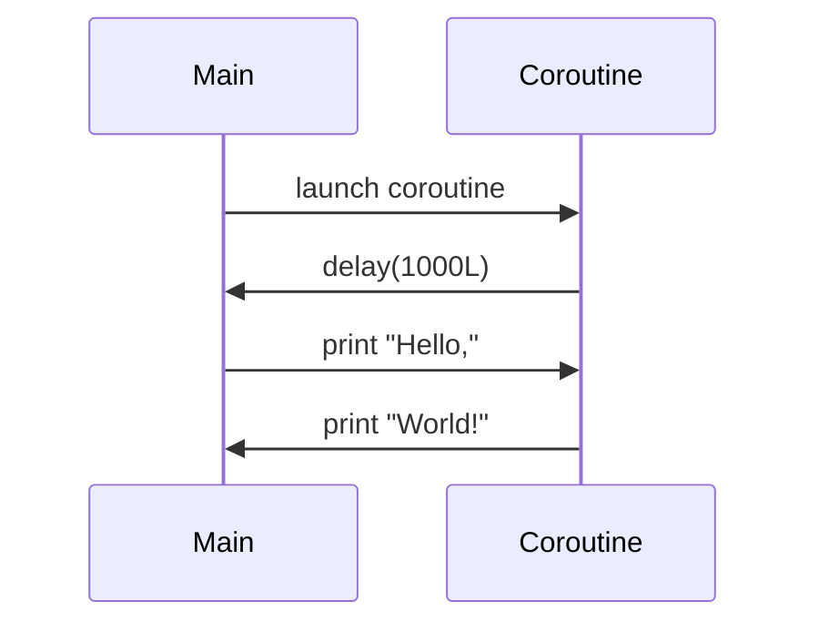

## 8.10 Concurrency Libraries and Tools

Concurrency is a cornerstone of modern software development, enabling applications to perform multiple tasks simultaneously and efficiently. In Kotlin, concurrency is primarily handled using coroutines, which provide a powerful and flexible way to write asynchronous code. This section will delve into the concurrency libraries and tools available in Kotlin, focusing on `kotlinx.coroutines` and integration with reactive frameworks.

### Introduction to Kotlin Coroutines

Kotlin coroutines are a design pattern that you can use on Android to simplify code that executes asynchronously. They enable you to write code that appears to be synchronous but is actually asynchronous and non-blocking. Coroutines are lightweight threads that allow you to write asynchronous code in a sequential manner.

#### Key Concepts of Coroutines

- **Suspend Functions**: These are functions that can be paused and resumed later. They are the building blocks of coroutines.
- **Coroutine Scope**: Defines the lifecycle of coroutines. When a scope is canceled, all coroutines within it are canceled.
- **Coroutine Context**: Provides information about the coroutine, such as its job and dispatcher.

### Using `kotlinx.coroutines`

The `kotlinx.coroutines` library is the foundation for coroutine support in Kotlin. It provides a rich API for managing concurrency, including launching coroutines, handling exceptions, and controlling coroutine lifecycles.

#### Coroutine Builders

- **launch**: Launches a new coroutine without blocking the current thread.
- **async**: Similar to `launch`, but returns a `Deferred` object, which can be used to obtain the result of the coroutine.
- **runBlocking**: A coroutine builder that blocks the current thread until its coroutine completes.

```kotlin
import kotlinx.coroutines.*

fun main() = runBlocking {
    launch {
        delay(1000L)
        println("World!")
    }
    println("Hello,")
}
```

In this example, `launch` starts a new coroutine, and `runBlocking` ensures that the main function waits for the coroutine to complete.

#### Coroutine Dispatchers

Dispatchers determine the thread on which a coroutine runs. The `kotlinx.coroutines` library provides several dispatchers:

- **Dispatchers.Default**: Used for CPU-intensive tasks.
- **Dispatchers.IO**: Optimized for I/O operations.
- **Dispatchers.Main**: Used for UI operations on Android.

```kotlin
launch(Dispatchers.IO) {
    // Perform network request
}
```

#### Exception Handling in Coroutines

Handling exceptions in coroutines is crucial for building robust applications. Kotlin provides structured concurrency, which ensures that exceptions are propagated correctly.

```kotlin
val handler = CoroutineExceptionHandler { _, exception ->
    println("Caught $exception")
}

GlobalScope.launch(handler) {
    throw AssertionError("Error!")
}
```

### Integration with Reactive Frameworks

Reactive programming is a paradigm that focuses on asynchronous data streams and the propagation of change. Kotlin's coroutines can be integrated with reactive frameworks like RxJava and Reactor to build responsive applications.

#### RxJava with Kotlin Coroutines

RxJava is a popular library for reactive programming in Java. Kotlin provides extensions to convert between coroutines and RxJava types.

```kotlin
import io.reactivex.rxjava3.core.Observable
import kotlinx.coroutines.rx3.await

suspend fun fetchData(): String {
    return Observable.just("Data").await()
}
```

#### Reactor with Kotlin Coroutines

Reactor is another reactive library that can be used with Kotlin coroutines. It provides a powerful API for building reactive applications.

```kotlin
import reactor.core.publisher.Mono
import kotlinx.coroutines.reactor.mono

fun fetchData(): Mono<String> = mono {
    "Data"
}
```

### Advanced Coroutine Patterns

#### Structured Concurrency

Structured concurrency ensures that coroutines are launched in a specific scope, and their lifecycles are tied to the scope's lifecycle. This helps prevent memory leaks and ensures that resources are released appropriately.

```kotlin
fun main() = runBlocking {
    coroutineScope {
        launch {
            delay(1000L)
            println("Task from runBlocking")
        }
    }
    println("Coroutine scope is over")
}
```

#### Flow for Asynchronous Data Streams

Kotlin's Flow is a powerful tool for handling asynchronous data streams. It is similar to RxJava's Observable but integrates seamlessly with coroutines.

```kotlin
import kotlinx.coroutines.flow.*

fun simple(): Flow<Int> = flow {
    for (i in 1..3) {
        delay(100)
        emit(i)
    }
}

fun main() = runBlocking {
    simple().collect { value -> println(value) }
}
```

### Visualizing Coroutine Execution

To better understand how coroutines work, let's visualize the execution flow of a simple coroutine program.



This diagram shows the sequence of operations in a coroutine program, highlighting the non-blocking nature of coroutines.

### Best Practices for Using Coroutines

- **Use Structured Concurrency**: Always launch coroutines in a specific scope to manage their lifecycles effectively.
- **Handle Exceptions Properly**: Use `CoroutineExceptionHandler` to catch and handle exceptions in coroutines.
- **Choose the Right Dispatcher**: Select the appropriate dispatcher based on the nature of the task (CPU-intensive, I/O, etc.).

### Tools for Concurrency in Kotlin

Several tools and libraries can enhance concurrency management in Kotlin applications:

- **Kotlinx.coroutines**: The primary library for coroutine support.
- **RxJava**: A reactive programming library that can be integrated with coroutines.
- **Reactor**: Another reactive library that works well with Kotlin coroutines.
- **Flow**: A Kotlin-specific library for handling asynchronous data streams.

### Conclusion

Concurrency in Kotlin is a powerful feature that enables developers to write efficient and responsive applications. By leveraging `kotlinx.coroutines` and integrating with reactive frameworks, you can build applications that are both performant and easy to maintain. Remember to follow best practices, such as using structured concurrency and handling exceptions properly, to ensure your applications are robust and reliable.

## Quiz Time!



### What is the primary library for coroutine support in Kotlin?

- [x] kotlinx.coroutines
- [ ] RxJava
- [ ] Reactor
- [ ] Flow

> **Explanation:** `kotlinx.coroutines` is the primary library for coroutine support in Kotlin, providing a comprehensive API for managing concurrency.


### Which coroutine builder blocks the current thread until its coroutine completes?

- [ ] launch
- [ ] async
- [x] runBlocking
- [ ] coroutineScope

> **Explanation:** `runBlocking` is a coroutine builder that blocks the current thread until its coroutine completes, making it useful for testing and simple main functions.


### What dispatcher should be used for CPU-intensive tasks?

- [x] Dispatchers.Default
- [ ] Dispatchers.IO
- [ ] Dispatchers.Main
- [ ] Dispatchers.Unconfined

> **Explanation:** `Dispatchers.Default` is optimized for CPU-intensive tasks, providing a pool of threads for parallel execution.


### How can you handle exceptions in coroutines?

- [ ] Using try-catch blocks
- [x] Using CoroutineExceptionHandler
- [ ] Using a global error handler
- [ ] Using a custom exception class

> **Explanation:** `CoroutineExceptionHandler` is used to catch and handle exceptions in coroutines, ensuring proper error handling.


### Which reactive framework is commonly used with Kotlin coroutines?

- [x] RxJava
- [ ] Spring
- [ ] Hibernate
- [ ] Retrofit

> **Explanation:** RxJava is a popular reactive framework that can be integrated with Kotlin coroutines for building responsive applications.


### What is the purpose of structured concurrency?

- [ ] To improve performance
- [x] To manage coroutine lifecycles
- [ ] To simplify code
- [ ] To enhance security

> **Explanation:** Structured concurrency ensures that coroutines are launched in a specific scope, managing their lifecycles effectively and preventing memory leaks.


### What is Kotlin Flow used for?

- [ ] Handling UI updates
- [x] Handling asynchronous data streams
- [ ] Managing database connections
- [ ] Performing network requests

> **Explanation:** Kotlin Flow is used for handling asynchronous data streams, providing a powerful tool for managing data flow in applications.


### Which function converts an RxJava Observable to a coroutine?

- [ ] toCoroutine
- [ ] convert
- [x] await
- [ ] suspend

> **Explanation:** The `await` function is used to convert an RxJava Observable to a coroutine, allowing seamless integration between the two.


### What is the role of CoroutineScope?

- [ ] To define the thread on which a coroutine runs
- [x] To define the lifecycle of coroutines
- [ ] To handle exceptions in coroutines
- [ ] To manage coroutine contexts

> **Explanation:** CoroutineScope defines the lifecycle of coroutines, ensuring that they are canceled when the scope is canceled.


### True or False: Coroutines are blocking threads.

- [ ] True
- [x] False

> **Explanation:** False. Coroutines are non-blocking and allow you to write asynchronous code in a sequential manner.


