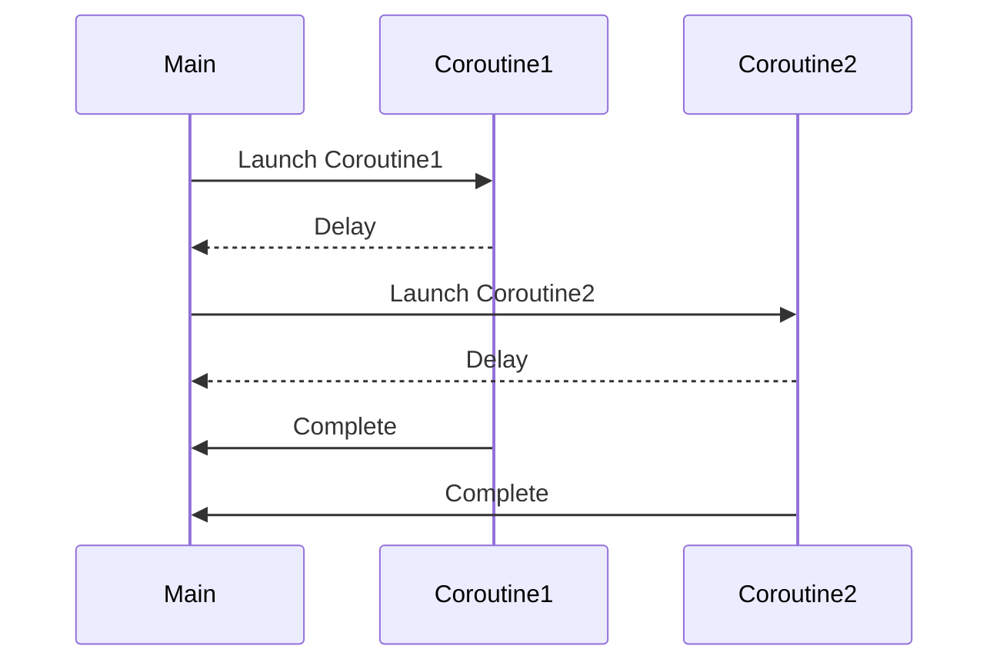

## 8.11 Testing Concurrency

Concurrency is a fundamental aspect of modern software development, allowing applications to perform multiple tasks simultaneously. In Kotlin, coroutines provide a powerful and efficient way to handle concurrent programming. However, testing concurrent code can be challenging due to the non-deterministic nature of concurrent execution. This section will explore strategies for testing concurrency in Kotlin, focusing on coroutines and ensuring thread safety.

### Understanding Concurrency in Kotlin

Before diving into testing strategies, it's important to understand the basics of concurrency in Kotlin. Concurrency allows multiple computations to happen at the same time, which can lead to improved performance and responsiveness in applications. Kotlin provides coroutines as a lightweight and efficient way to handle concurrency.

#### Coroutines in Kotlin

Coroutines are a design pattern used to simplify code that executes asynchronously. They allow you to write asynchronous code in a sequential style, making it easier to read and maintain. Coroutines are non-blocking and can be suspended and resumed, allowing for efficient use of resources.

Here's a simple example of a coroutine in Kotlin:

```kotlin
import kotlinx.coroutines.*

fun main() = runBlocking {
    launch {
        delay(1000L)
        println("World!")
    }
    println("Hello,")
}
```

In this example, `launch` starts a new coroutine that delays for 1 second before printing "World!". Meanwhile, "Hello," is printed immediately, demonstrating non-blocking behavior.

### Challenges in Testing Concurrent Code

Testing concurrent code presents unique challenges due to the non-deterministic nature of concurrent execution. Some of the key challenges include:

- **Race Conditions**: Occur when multiple threads access shared data simultaneously, leading to unpredictable results.
- **Deadlocks**: Happen when two or more threads are blocked forever, waiting for each other.
- **Thread Safety**: Ensuring that shared data is accessed and modified safely by multiple threads.

To effectively test concurrent code, it's crucial to address these challenges and ensure that your code behaves correctly under concurrent execution.

### Strategies for Testing Concurrency

Testing concurrency requires a combination of strategies and tools to ensure that your code is correct and efficient. Here are some key strategies for testing concurrency in Kotlin:

#### 1. Unit Testing with Coroutines

Unit testing is a fundamental part of software development, and it is equally important for concurrent code. When testing coroutines, you can use the `kotlinx-coroutines-test` library, which provides utilities for testing coroutines.

Here's an example of a unit test for a coroutine:

```kotlin
import kotlinx.coroutines.*
import kotlinx.coroutines.test.*
import org.junit.Test
import kotlin.test.assertEquals

class CoroutineTest {

    @Test
    fun testCoroutine() = runBlockingTest {
        val result = async {
            delay(1000L)
            "Hello, World!"
        }.await()

        assertEquals("Hello, World!", result)
    }
}
```

In this example, `runBlockingTest` is used to run the coroutine in a test environment, allowing you to control the execution and verify the results.

#### 2. Using Mocking Frameworks

Mocking frameworks can be used to simulate the behavior of dependencies in concurrent code. This allows you to isolate the code under test and focus on its behavior.

Here's an example using the `MockK` library:

```kotlin
import io.mockk.*
import kotlinx.coroutines.*
import kotlinx.coroutines.test.*
import org.junit.Test

class MockingTest {

    @Test
    fun testWithMock() = runBlockingTest {
        val mockService = mockk<SomeService>()
        coEvery { mockService.fetchData() } returns "Mocked Data"

        val result = mockService.fetchData()

        assertEquals("Mocked Data", result)
        coVerify { mockService.fetchData() }
    }
}
```

In this example, `MockK` is used to mock a service and verify its behavior in a coroutine context.

#### 3. Testing Thread Safety

Ensuring thread safety is crucial in concurrent programming. You can use tools like `Atomic` classes and `Mutex` to manage shared data safely.

Here's an example of testing thread safety with a `Mutex`:

```kotlin
import kotlinx.coroutines.*
import kotlinx.coroutines.sync.*
import org.junit.Test
import kotlin.test.assertEquals

class ThreadSafetyTest {

    private var counter = 0
    private val mutex = Mutex()

    @Test
    fun testThreadSafety() = runBlocking {
        val jobs = List(1000) {
            launch {
                repeat(1000) {
                    mutex.withLock {
                        counter++
                    }
                }
            }
        }
        jobs.forEach { it.join() }
        assertEquals(1000000, counter)
    }
}
```

In this example, a `Mutex` is used to ensure that the `counter` is incremented safely by multiple coroutines.

### Ensuring Thread Safety

Thread safety is a critical aspect of concurrent programming, ensuring that shared data is accessed and modified safely by multiple threads. Here are some techniques to ensure thread safety in Kotlin:

#### 1. Immutability

Using immutable data structures can help ensure thread safety by preventing shared data from being modified. In Kotlin, you can use `val` to declare immutable variables.

#### 2. Synchronization

Synchronization mechanisms like `Mutex` and `Semaphore` can be used to control access to shared resources. These tools ensure that only one thread can access a resource at a time.

#### 3. Atomic Operations

Atomic operations are indivisible operations that can be used to safely modify shared data. Kotlin provides atomic classes like `AtomicInteger` and `AtomicReference` for this purpose.

Here's an example of using `AtomicInteger`:

```kotlin
import kotlinx.coroutines.*
import java.util.concurrent.atomic.AtomicInteger
import org.junit.Test
import kotlin.test.assertEquals

class AtomicTest {

    private val counter = AtomicInteger(0)

    @Test
    fun testAtomicOperations() = runBlocking {
        val jobs = List(1000) {
            launch {
                repeat(1000) {
                    counter.incrementAndGet()
                }
            }
        }
        jobs.forEach { it.join() }
        assertEquals(1000000, counter.get())
    }
}
```

In this example, `AtomicInteger` is used to safely increment a counter by multiple coroutines.

### Tools and Frameworks for Testing Concurrency

Several tools and frameworks can assist in testing concurrency in Kotlin. Here are some popular ones:

#### 1. `kotlinx-coroutines-test`

The `kotlinx-coroutines-test` library provides utilities for testing coroutines, including `TestCoroutineDispatcher` and `TestCoroutineScope`.

#### 2. Mocking Libraries

Libraries like `MockK` and `Mockito` can be used to mock dependencies and verify behavior in concurrent code.

#### 3. Static Analysis Tools

Static analysis tools like `Detekt` can help identify potential concurrency issues in your code.

### Best Practices for Testing Concurrency

Here are some best practices to keep in mind when testing concurrency in Kotlin:

- **Isolate Concurrent Code**: Focus on testing the behavior of concurrent code in isolation, using mocking frameworks to simulate dependencies.
- **Use Timeouts**: Use timeouts in your tests to prevent them from hanging indefinitely.
- **Test for Race Conditions**: Write tests that specifically target potential race conditions in your code.
- **Use Static Analysis Tools**: Leverage static analysis tools to identify potential concurrency issues early in the development process.

### Try It Yourself

To get hands-on experience with testing concurrency in Kotlin, try modifying the code examples provided in this section. Experiment with different coroutine contexts, synchronization mechanisms, and mocking frameworks to see how they affect the behavior of your concurrent code.

### Visualizing Concurrency

To better understand the flow of concurrent execution, let's visualize a simple coroutine workflow using Mermaid.js:



This diagram illustrates the sequence of events when two coroutines are launched concurrently. Both coroutines delay for a period before completing, demonstrating non-blocking behavior.

### Knowledge Check

Before moving on, let's review some key concepts:

- What are the main challenges in testing concurrent code?
- How can you ensure thread safety in Kotlin?
- What tools and frameworks can assist in testing concurrency?

### Embrace the Journey

Testing concurrency can be challenging, but it's an essential skill for developing robust and efficient applications. Remember, this is just the beginning. As you progress, you'll build more complex and concurrent systems. Keep experimenting, stay curious, and enjoy the journey!

## Quiz Time!



### What is the primary purpose of using coroutines in Kotlin?

- [x] To simplify asynchronous programming
- [ ] To replace all Java threads
- [ ] To make code run faster
- [ ] To avoid using functions

> **Explanation:** Coroutines are used to simplify asynchronous programming by allowing developers to write non-blocking code in a sequential style.

### Which library provides utilities for testing coroutines in Kotlin?

- [x] kotlinx-coroutines-test
- [ ] JUnit
- [ ] Mockito
- [ ] KotlinTest

> **Explanation:** The `kotlinx-coroutines-test` library provides utilities specifically designed for testing coroutines.

### What is a race condition?

- [x] A situation where multiple threads access shared data simultaneously
- [ ] A type of coroutine
- [ ] A method of optimizing code
- [ ] A feature of Kotlin's type system

> **Explanation:** A race condition occurs when multiple threads access shared data simultaneously, leading to unpredictable results.

### How can you ensure thread safety when accessing shared data?

- [x] Use synchronization mechanisms like Mutex
- [ ] Use more threads
- [ ] Avoid using coroutines
- [ ] Use global variables

> **Explanation:** Synchronization mechanisms like `Mutex` can be used to control access to shared resources, ensuring thread safety.

### Which of the following is an atomic operation in Kotlin?

- [x] AtomicInteger.incrementAndGet()
- [ ] println()
- [ ] delay()
- [ ] launch()

> **Explanation:** `AtomicInteger.incrementAndGet()` is an atomic operation that safely modifies shared data.

### What is the purpose of using timeouts in concurrent tests?

- [x] To prevent tests from hanging indefinitely
- [ ] To make tests run faster
- [ ] To increase test coverage
- [ ] To reduce code complexity

> **Explanation:** Timeouts are used in tests to prevent them from hanging indefinitely, ensuring that tests complete in a reasonable time.

### Which tool can help identify potential concurrency issues in your code?

- [x] Detekt
- [ ] Gradle
- [ ] Kotlin DSL
- [ ] Android Studio

> **Explanation:** Detekt is a static analysis tool that can help identify potential concurrency issues in your code.

### What is the role of MockK in testing concurrent code?

- [x] To simulate the behavior of dependencies
- [ ] To replace coroutines
- [ ] To optimize code performance
- [ ] To manage thread pools

> **Explanation:** MockK is used to simulate the behavior of dependencies, allowing you to isolate the code under test.

### What is the benefit of using immutable data structures in concurrent programming?

- [x] They prevent shared data from being modified
- [ ] They make code run faster
- [ ] They reduce memory usage
- [ ] They simplify syntax

> **Explanation:** Immutable data structures prevent shared data from being modified, which helps ensure thread safety.

### True or False: Coroutines are blocking operations.

- [ ] True
- [x] False

> **Explanation:** Coroutines are non-blocking operations, allowing for efficient use of resources by suspending and resuming execution.


