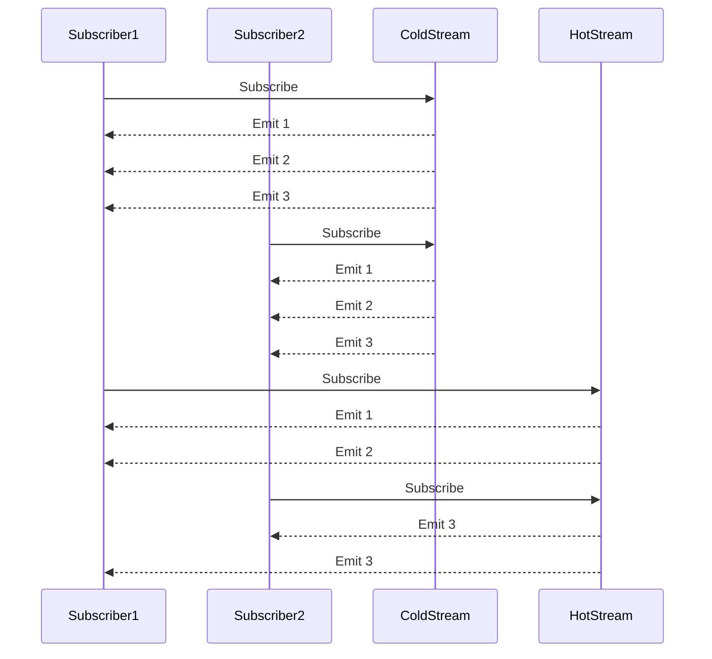

## 8.2 Flows and Reactive Streams

In the ever-evolving landscape of software development, the ability to efficiently handle asynchronous data streams is crucial. Kotlin Flows and Reactive Streams provide powerful tools for managing asynchronous operations, enabling developers to build responsive and resilient applications. In this section, we will delve into the concepts of Flows and Reactive Streams, explore the differences between cold and hot streams, and demonstrate how to implement reactive patterns using Kotlin's Flow API.

### Introduction to Reactive Programming

Reactive programming is a paradigm that focuses on asynchronous data streams and the propagation of change. It allows developers to build systems that are responsive, resilient, and scalable. Reactive programming is particularly useful in scenarios where applications need to handle a large number of concurrent events or data streams, such as real-time data processing, user interfaces, and network communication.

Kotlin's Flow API is a key component of its support for reactive programming. It provides a declarative way to work with asynchronous data streams, allowing developers to compose and transform data in a concise and expressive manner.

### Understanding Kotlin Flows

Kotlin Flows are a part of the `kotlinx.coroutines` library and are designed to handle asynchronous data streams. A Flow represents a stream of values that are asynchronously computed, and it can be used to emit multiple values sequentially.

#### Key Features of Flows

- **Cold Streams**: Flows are cold by nature, meaning that the data is not produced until there is a subscriber. This makes Flows efficient and resource-friendly, as they only consume resources when needed.
- **Suspending Functions**: Flows can be used with suspending functions, allowing for seamless integration with Kotlin's coroutines.
- **Backpressure Handling**: Flows provide built-in support for backpressure, ensuring that producers do not overwhelm consumers with data.
- **Operators**: Flows come with a rich set of operators for transforming, filtering, and combining data streams.

#### Creating and Consuming Flows

Let's start by creating a simple Flow that emits a sequence of numbers:

```kotlin
import kotlinx.coroutines.flow.Flow
import kotlinx.coroutines.flow.flow
import kotlinx.coroutines.runBlocking
import kotlinx.coroutines.flow.collect

fun numberFlow(): Flow<Int> = flow {
    for (i in 1..5) {
        emit(i) // Emit a value
    }
}

fun main() = runBlocking {
    numberFlow().collect { value ->
        println("Received: $value")
    }
}
```

In this example, we define a `numberFlow` function that returns a Flow of integers. The `flow` builder is used to create the Flow, and the `emit` function is called to emit values. The `collect` terminal operator is used to consume the values emitted by the Flow.

### Cold vs. Hot Streams

Understanding the difference between cold and hot streams is essential for effectively using Flows and Reactive Streams.

#### Cold Streams

Cold streams, like Kotlin Flows, do not produce data until they are actively subscribed to. Each subscriber to a cold stream receives its own independent sequence of data. This behavior is beneficial in scenarios where you want to ensure that each subscriber gets a fresh copy of the data.

**Example of a Cold Stream:**

```kotlin
import kotlinx.coroutines.flow.Flow
import kotlinx.coroutines.flow.flow
import kotlinx.coroutines.runBlocking
import kotlinx.coroutines.flow.collect

fun coldFlow(): Flow<Int> = flow {
    println("Flow started")
    for (i in 1..3) {
        emit(i)
    }
}

fun main() = runBlocking {
    val flow = coldFlow()
    println("Collecting first time")
    flow.collect { println("First collector: $it") }
    println("Collecting second time")
    flow.collect { println("Second collector: $it") }
}
```

In this example, the `coldFlow` function creates a cold stream. Notice that the "Flow started" message is printed each time the Flow is collected, indicating that the data is produced anew for each subscriber.

#### Hot Streams

Hot streams, on the other hand, produce data regardless of the presence of subscribers. Subscribers to a hot stream receive the data that is currently being produced. Hot streams are useful in scenarios where data is continuously generated, such as user input events or sensor data.

**Example of a Hot Stream using SharedFlow:**

```kotlin
import kotlinx.coroutines.*
import kotlinx.coroutines.flow.*

fun main() = runBlocking {
    val sharedFlow = MutableSharedFlow<Int>()
    
    launch {
        repeat(5) {
            delay(100)
            sharedFlow.emit(it)
            println("Emitted: $it")
        }
    }
    
    delay(250) // Delay to simulate late subscription
    sharedFlow.collect { println("Collector received: $it") }
}
```

In this example, we use `MutableSharedFlow` to create a hot stream. The data is emitted continuously, and the subscriber receives only the data emitted after it starts collecting.

### Implementing Reactive Patterns with Flows

Kotlin Flows provide a rich set of operators that allow developers to implement complex reactive patterns. Let's explore some common patterns and how they can be implemented using Flows.

#### Transforming Data Streams

Flows support a variety of operators for transforming data streams. The `map` operator can be used to apply a transformation to each element in the stream.

**Example of Using `map` Operator:**

```kotlin
import kotlinx.coroutines.flow.*
import kotlinx.coroutines.runBlocking

fun main() = runBlocking {
    (1..5).asFlow()
        .map { it * 2 }
        .collect { println(it) }
}
```

In this example, the `map` operator is used to double each value in the stream.

#### Filtering Data Streams

The `filter` operator allows you to filter elements based on a predicate.

**Example of Using `filter` Operator:**

```kotlin
import kotlinx.coroutines.flow.*
import kotlinx.coroutines.runBlocking

fun main() = runBlocking {
    (1..5).asFlow()
        .filter { it % 2 == 0 }
        .collect { println(it) }
}
```

Here, the `filter` operator is used to emit only even numbers.

#### Combining Data Streams

Flows can be combined using operators like `zip` and `combine`.

**Example of Using `zip` Operator:**

```kotlin
import kotlinx.coroutines.flow.*
import kotlinx.coroutines.runBlocking

fun main() = runBlocking {
    val flow1 = (1..3).asFlow()
    val flow2 = flowOf("A", "B", "C")
    
    flow1.zip(flow2) { a, b -> "$a$b" }
        .collect { println(it) }
}
```

In this example, the `zip` operator combines two flows into a single flow of pairs.

### Visualizing Cold vs. Hot Streams

To better understand the differences between cold and hot streams, let's visualize their behavior using a sequence diagram.



**Diagram Description:** In the sequence diagram above, the ColdStream produces a new sequence of data for each subscriber, while the HotStream emits data continuously, and subscribers receive data that is currently being produced.

### Advanced Flow Operators

Kotlin Flows provide several advanced operators that enable developers to implement complex reactive patterns. Let's explore some of these operators and their use cases.

#### FlatMapConcat

The `flatMapConcat` operator allows you to transform each element in a flow into another flow and concatenate the results.

**Example of Using `flatMapConcat`:**

```kotlin
import kotlinx.coroutines.flow.*
import kotlinx.coroutines.runBlocking

fun main() = runBlocking {
    (1..3).asFlow()
        .flatMapConcat { value ->
            flow {
                emit("$value: First")
                emit("$value: Second")
            }
        }
        .collect { println(it) }
}
```

In this example, `flatMapConcat` is used to transform each integer into a flow of two strings.

#### FlowOn

The `flowOn` operator allows you to change the context in which a flow is executed.

**Example of Using `flowOn`:**

```kotlin
import kotlinx.coroutines.*
import kotlinx.coroutines.flow.*

fun main() = runBlocking {
    (1..5).asFlow()
        .map { it * 2 }
        .flowOn(Dispatchers.Default)
        .collect { println(it) }
}
```

Here, the `flowOn` operator is used to execute the flow on a background thread.

### Error Handling in Flows

Error handling is an important aspect of working with asynchronous data streams. Kotlin Flows provide several operators for handling errors gracefully.

#### Catch Operator

The `catch` operator allows you to handle exceptions that occur during the flow collection.

**Example of Using `catch` Operator:**

```kotlin
import kotlinx.coroutines.flow.*
import kotlinx.coroutines.runBlocking

fun main() = runBlocking {
    (1..5).asFlow()
        .map { check(it != 3) { "Error on $it" }; it }
        .catch { e -> println("Caught exception: $e") }
        .collect { println(it) }
}
```

In this example, the `catch` operator is used to handle an exception that occurs when the value 3 is encountered.

#### Retry Operator

The `retry` operator allows you to retry the flow collection in case of an error.

**Example of Using `retry` Operator:**

```kotlin
import kotlinx.coroutines.flow.*
import kotlinx.coroutines.runBlocking

fun main() = runBlocking {
    var attempt = 0
    (1..5).asFlow()
        .map { check(it != 3 || attempt++ > 0) { "Error on $it" }; it }
        .retry(1) { e -> println("Retrying due to: $e"); true }
        .collect { println(it) }
}
```

Here, the `retry` operator is used to retry the flow collection once if an error occurs.

### Hot Streams with SharedFlow and StateFlow

Kotlin provides `SharedFlow` and `StateFlow` for working with hot streams. These types of flows are useful in scenarios where you want to share data between multiple subscribers.

#### SharedFlow

`SharedFlow` is a hot stream that can have multiple subscribers. It is useful for broadcasting events to multiple consumers.

**Example of Using `SharedFlow`:**

```kotlin
import kotlinx.coroutines.*
import kotlinx.coroutines.flow.*

fun main() = runBlocking {
    val sharedFlow = MutableSharedFlow<Int>()
    
    launch {
        repeat(5) {
            delay(100)
            sharedFlow.emit(it)
            println("Emitted: $it")
        }
    }
    
    delay(250)
    sharedFlow.collect { println("Collector received: $it") }
}
```

In this example, `MutableSharedFlow` is used to create a hot stream that emits integers. The collector receives only the data emitted after it starts collecting.

#### StateFlow

`StateFlow` is a special type of `SharedFlow` that holds the latest value and emits it to new subscribers. It is useful for representing state that can change over time.

**Example of Using `StateFlow`:**

```kotlin
import kotlinx.coroutines.*
import kotlinx.coroutines.flow.*

fun main() = runBlocking {
    val stateFlow = MutableStateFlow(0)
    
    launch {
        repeat(5) {
            delay(100)
            stateFlow.value = it
            println("State updated: $it")
        }
    }
    
    delay(250)
    stateFlow.collect { println("Collector received: $it") }
}
```

In this example, `MutableStateFlow` is used to create a hot stream that holds the latest state. The collector receives the current state and any updates.

### Try It Yourself

To deepen your understanding of Kotlin Flows and Reactive Streams, try modifying the code examples provided in this section. Experiment with different operators, error handling strategies, and stream types. Consider the following challenges:

- Modify the `numberFlow` example to emit a sequence of Fibonacci numbers.
- Create a `SharedFlow` that broadcasts a sequence of random numbers to multiple subscribers.
- Implement a `StateFlow` that represents the current temperature and updates every second.

### Conclusion

Kotlin Flows and Reactive Streams provide a powerful framework for handling asynchronous data streams. By understanding the differences between cold and hot streams and leveraging the rich set of operators available in the Flow API, developers can build responsive and resilient applications. Remember, this is just the beginning. As you progress, you'll build more complex and interactive applications. Keep experimenting, stay curious, and enjoy the journey!

## Quiz Time!



### What is a key feature of Kotlin Flows?

- [x] They are cold streams.
- [ ] They are hot streams.
- [ ] They do not support backpressure.
- [ ] They cannot be used with suspending functions.

> **Explanation:** Kotlin Flows are cold streams, meaning they do not produce data until they are subscribed to.

### Which operator is used to transform each element in a flow into another flow and concatenate the results?

- [ ] map
- [ ] filter
- [x] flatMapConcat
- [ ] zip

> **Explanation:** The `flatMapConcat` operator transforms each element in a flow into another flow and concatenates the results.

### What is the purpose of the `catch` operator in Kotlin Flows?

- [ ] To transform data
- [x] To handle exceptions
- [ ] To filter data
- [ ] To combine flows

> **Explanation:** The `catch` operator is used to handle exceptions that occur during the flow collection.

### What is the difference between cold and hot streams?

- [x] Cold streams produce data only when subscribed, hot streams produce data continuously.
- [ ] Cold streams produce data continuously, hot streams produce data only when subscribed.
- [ ] Cold streams are always faster than hot streams.
- [ ] Hot streams are always faster than cold streams.

> **Explanation:** Cold streams produce data only when subscribed, while hot streams produce data continuously regardless of subscribers.

### Which of the following is a hot stream in Kotlin?

- [ ] Flow
- [x] SharedFlow
- [ ] ColdFlow
- [ ] LazyFlow

> **Explanation:** `SharedFlow` is a hot stream that can have multiple subscribers.

### What does the `retry` operator do in Kotlin Flows?

- [ ] It transforms data.
- [ ] It filters data.
- [x] It retries the flow collection in case of an error.
- [ ] It combines flows.

> **Explanation:** The `retry` operator retries the flow collection in case of an error.

### How does the `flowOn` operator affect a flow?

- [ ] It filters data.
- [ ] It handles exceptions.
- [x] It changes the context in which a flow is executed.
- [ ] It combines flows.

> **Explanation:** The `flowOn` operator changes the context in which a flow is executed.

### What is the purpose of `StateFlow` in Kotlin?

- [ ] To handle exceptions
- [ ] To transform data
- [x] To hold the latest value and emit it to new subscribers
- [ ] To filter data

> **Explanation:** `StateFlow` holds the latest value and emits it to new subscribers.

### Which operator is used to apply a transformation to each element in a flow?

- [x] map
- [ ] filter
- [ ] zip
- [ ] flatMapConcat

> **Explanation:** The `map` operator is used to apply a transformation to each element in a flow.

### True or False: Kotlin Flows can be used with suspending functions.

- [x] True
- [ ] False

> **Explanation:** Kotlin Flows can be used with suspending functions, allowing for seamless integration with coroutines.


