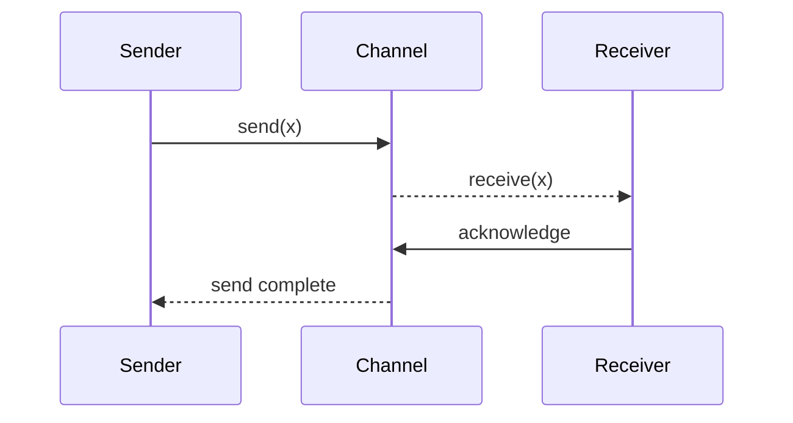
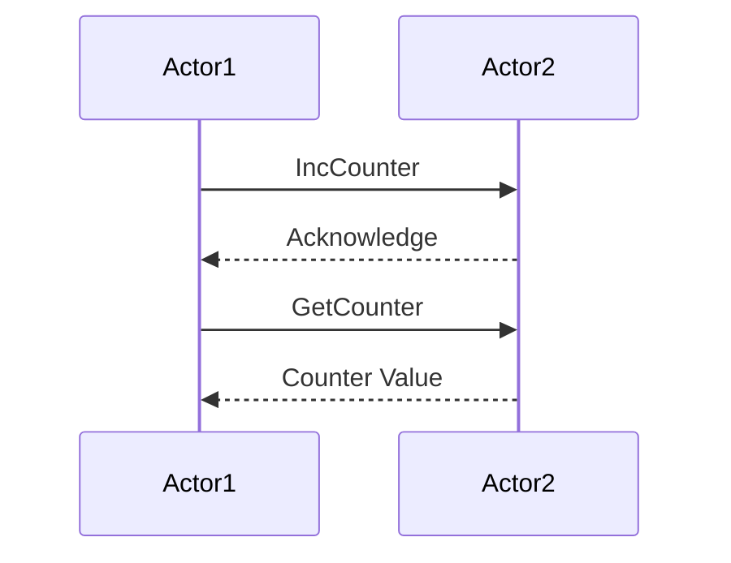
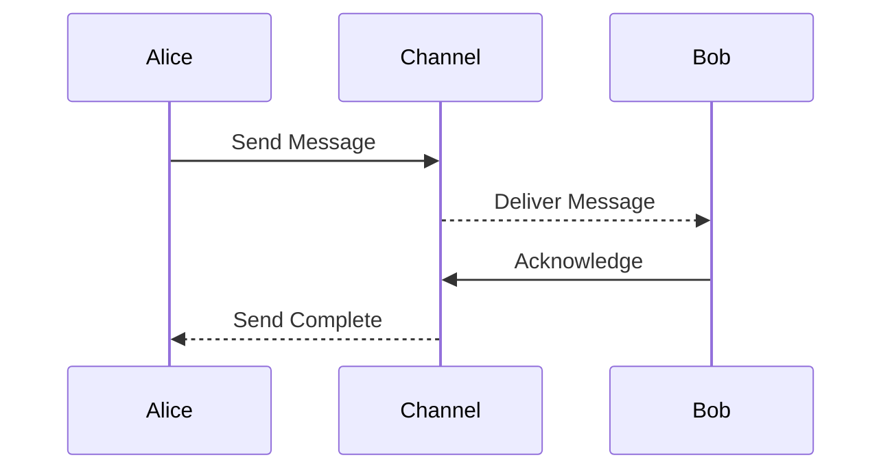

## 8.3 Channels and Actors

In the realm of concurrent programming, managing shared mutable state and ensuring thread safety can be challenging. Kotlin, with its coroutines, offers a robust solution through channels and the actor model. These tools enable developers to build scalable, efficient, and safe concurrent systems. Let's delve into the concepts of channels and actors, explore their implementation, and understand how they can be leveraged to build concurrent systems.

### Understanding Channels

Channels in Kotlin are a powerful primitive for communication between coroutines. They provide a way to send and receive data between coroutines, allowing for safe and structured communication.

#### What are Channels?

Channels are similar to blocking queues but designed for coroutines. They allow coroutines to communicate by sending and receiving messages. A channel can be thought of as a conduit through which data flows between coroutines.

#### Types of Channels

Kotlin provides several types of channels, each with different buffering strategies:

1. **Rendezvous Channel**: This is a channel with no buffer. The sender and receiver meet at the channel to exchange data. If the sender sends data before the receiver is ready, the sender will suspend until the receiver is ready to receive.

2. **Buffered Channel**: This channel has a buffer that can hold a specified number of elements. The sender can send data without suspending until the buffer is full.

3. **Conflated Channel**: This channel only keeps the most recent element. If the sender sends a new element before the receiver receives the previous one, the previous element is discarded.

4. **Unlimited Channel**: This channel has an unlimited buffer, allowing the sender to send data without ever suspending.

#### Implementing Channels

Let's explore how to implement channels in Kotlin with a simple example:

```kotlin
import kotlinx.coroutines.*
import kotlinx.coroutines.channels.Channel

fun main() = runBlocking {
    val channel = Channel<Int>() // Create a rendezvous channel

    // Launch a coroutine to send data
    launch {
        for (x in 1..5) {
            channel.send(x) // Send data to the channel
            println("Sent $x")
        }
        channel.close() // Close the channel when done
    }

    // Launch a coroutine to receive data
    launch {
        for (y in channel) {
            println("Received $y") // Receive data from the channel
        }
    }
}
```

In this example, we create a rendezvous channel and use two coroutines: one to send data and another to receive it. The `channel.send(x)` function suspends the sender coroutine until the receiver is ready to receive the data.

#### Visualizing Channel Communication

To better understand how channels facilitate communication between coroutines, consider the following sequence diagram:



This diagram illustrates the flow of data from the sender to the receiver through the channel. The sender sends data to the channel, which is then received by the receiver.

### The Actor Model

The actor model is a conceptual model that treats "actors" as the fundamental units of computation. In this model, actors are independent entities that communicate with each other through message passing. This model is particularly useful for building concurrent and distributed systems.

#### What is the Actor Model?

In the actor model, each actor has its own state and behavior. Actors communicate by sending messages to each other, and each actor processes messages sequentially. This eliminates the need for locks and other synchronization mechanisms, as each actor processes messages in isolation.

#### Implementing the Actor Model in Kotlin

Kotlin provides a convenient way to implement the actor model using coroutines and channels. Let's see an example:

```kotlin
import kotlinx.coroutines.*
import kotlinx.coroutines.channels.actor

sealed class CounterMsg
object IncCounter : CounterMsg() // One-way message to increment counter
class GetCounter(val response: CompletableDeferred<Int>) : CounterMsg() // A request with reply

fun CoroutineScope.counterActor() = actor<CounterMsg> {
    var counter = 0 // actor state

    for (msg in channel) { // iterate over incoming messages
        when (msg) {
            is IncCounter -> counter++
            is GetCounter -> msg.response.complete(counter)
        }
    }
}

fun main() = runBlocking {
    val counter = counterActor() // create the actor

    // Send messages to the actor
    counter.send(IncCounter)
    counter.send(IncCounter)

    // Prepare a response for the actor
    val response = CompletableDeferred<Int>()
    counter.send(GetCounter(response))

    println("Counter: ${response.await()}") // Print the counter value

    counter.close() // Close the actor
}
```

In this example, we define an actor that maintains a counter state. We send messages to increment the counter and retrieve its value. The actor processes each message sequentially, ensuring thread safety.

#### Visualizing Actor Communication

The following sequence diagram illustrates the communication between actors:



This diagram shows how Actor1 sends messages to Actor2, and Actor2 processes these messages sequentially.

### Building Concurrent Systems with Channels and Actors

Channels and actors provide a powerful abstraction for building concurrent systems. By leveraging these tools, we can build systems that are both efficient and easy to reason about.

#### Designing a Concurrent System

When designing a concurrent system, it's important to consider the following:

- **State Management**: Use actors to encapsulate state and ensure thread safety.
- **Communication**: Use channels for communication between different parts of the system.
- **Concurrency**: Leverage coroutines to manage concurrent tasks efficiently.

#### Example: Building a Chat System

Let's build a simple chat system using channels and actors:

```kotlin
import kotlinx.coroutines.*
import kotlinx.coroutines.channels.Channel

data class Message(val from: String, val text: String)

fun CoroutineScope.chatActor(name: String, channel: Channel<Message>) = launch {
    for (msg in channel) {
        println("[$name] Received message from ${msg.from}: ${msg.text}")
    }
}

fun main() = runBlocking {
    val channel = Channel<Message>()

    // Create chat actors
    val alice = chatActor("Alice", channel)
    val bob = chatActor("Bob", channel)

    // Send messages
    channel.send(Message("Alice", "Hello, Bob!"))
    channel.send(Message("Bob", "Hi, Alice!"))

    // Close the channel
    channel.close()

    // Wait for actors to finish
    alice.join()
    bob.join()
}
```

In this example, we create a chat system where each participant is represented by an actor. Messages are sent through a channel, and each actor processes incoming messages.

#### Visualizing the Chat System

The following sequence diagram illustrates the flow of messages in the chat system:



This diagram shows how messages are sent from Alice to Bob through the channel.

### Design Considerations

When using channels and actors, consider the following design considerations:

- **Buffering**: Choose the appropriate channel type based on your buffering needs.
- **Error Handling**: Implement error handling strategies to manage exceptions in coroutines.
- **Performance**: Optimize the use of channels and actors to minimize overhead and maximize throughput.

### Differences and Similarities

Channels and actors are both tools for managing concurrency, but they have different use cases:

- **Channels**: Best suited for communication between coroutines. They provide a flexible way to pass data between different parts of a system.
- **Actors**: Ideal for managing state and encapsulating behavior. They process messages sequentially, ensuring thread safety.

### Try It Yourself

Experiment with the examples provided by modifying the code:

- Change the channel type and observe how it affects communication.
- Add more participants to the chat system and see how the system scales.
- Implement error handling in the actor model to manage exceptions gracefully.

### Conclusion

Channels and actors are powerful tools for building concurrent systems in Kotlin. By leveraging these abstractions, we can build systems that are efficient, scalable, and easy to reason about. Remember, this is just the beginning. As you progress, you'll build more complex and interactive systems. Keep experimenting, stay curious, and enjoy the journey!

## Quiz Time!



### What is a rendezvous channel in Kotlin?

- [x] A channel with no buffer where sender and receiver meet to exchange data.
- [ ] A channel with an unlimited buffer.
- [ ] A channel that discards old data when new data arrives.
- [ ] A channel with a fixed buffer size.

> **Explanation:** A rendezvous channel has no buffer, meaning the sender and receiver must meet at the channel to exchange data.

### How do actors ensure thread safety in Kotlin?

- [x] By processing messages sequentially.
- [ ] By using locks and synchronization.
- [ ] By sharing state between threads.
- [ ] By using global variables.

> **Explanation:** Actors process messages one at a time, ensuring that state changes are isolated and thread-safe.

### What is the primary use of channels in Kotlin?

- [x] For communication between coroutines.
- [ ] For managing shared mutable state.
- [ ] For creating new threads.
- [ ] For implementing locks.

> **Explanation:** Channels are used for communication between coroutines, allowing them to pass data safely.

### Which channel type only keeps the most recent element?

- [ ] Rendezvous Channel
- [ ] Buffered Channel
- [x] Conflated Channel
- [ ] Unlimited Channel

> **Explanation:** A conflated channel discards previous elements if a new one is sent before the receiver receives the old one.

### What is the actor model primarily used for?

- [x] Managing state and encapsulating behavior.
- [ ] Creating new threads.
- [ ] Implementing locks.
- [ ] Sharing state between coroutines.

> **Explanation:** The actor model is used to manage state and encapsulate behavior, processing messages sequentially.

### How can you implement error handling in actors?

- [x] By catching exceptions within the actor's message processing loop.
- [ ] By using global exception handlers.
- [ ] By ignoring exceptions.
- [ ] By using locks.

> **Explanation:** Error handling in actors can be implemented by catching exceptions within the message processing loop.

### What happens if you send data to a closed channel?

- [ ] The data is buffered until the channel is reopened.
- [x] An exception is thrown.
- [ ] The data is silently discarded.
- [ ] The channel reopens automatically.

> **Explanation:** Sending data to a closed channel results in an exception being thrown.

### What is a CompletableDeferred used for in the actor model?

- [x] To send a request with a reply.
- [ ] To buffer messages.
- [ ] To create new coroutines.
- [ ] To manage shared state.

> **Explanation:** CompletableDeferred is used to send a request to an actor and receive a reply.

### What is the main advantage of using actors over traditional threading?

- [x] Simplified concurrency management without locks.
- [ ] Faster execution.
- [ ] More memory usage.
- [ ] Easier debugging.

> **Explanation:** Actors simplify concurrency management by processing messages sequentially, eliminating the need for locks.

### True or False: Channels can only be used with coroutines.

- [x] True
- [ ] False

> **Explanation:** Channels are designed to work with coroutines, allowing them to communicate and pass data safely.


