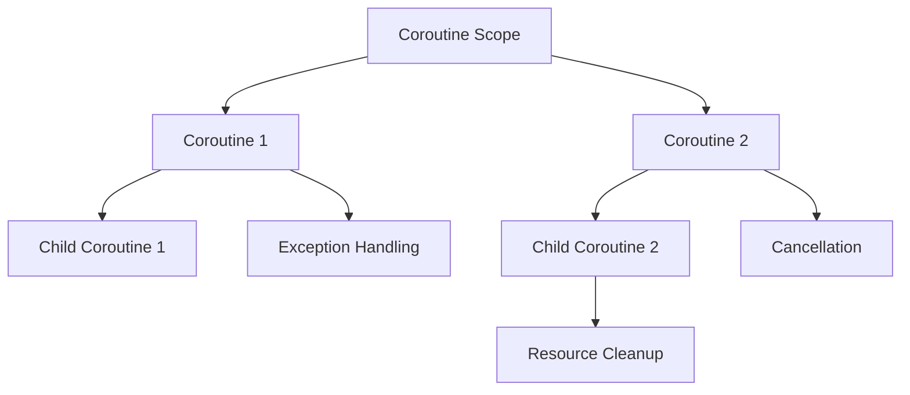

## 8.4 Structured Concurrency

Structured concurrency is a paradigm that ensures coroutines are managed in a predictable and organized manner, allowing developers to handle asynchronous tasks efficiently. In Kotlin, structured concurrency is achieved through the use of coroutine scopes and contexts, which provide a robust framework for managing coroutine lifecycles. This section delves into the principles of structured concurrency, exploring how it enhances code reliability, readability, and maintainability.

### Understanding Structured Concurrency

Structured concurrency is a design principle that organizes concurrent tasks into a well-defined structure. Unlike traditional concurrency models, where tasks can run independently and may lead to resource leaks or unexpected behavior, structured concurrency ensures that tasks are bound to a specific scope. This means that when a scope completes, all its child coroutines are also completed, ensuring no orphaned tasks remain.

#### Key Concepts

1. **Coroutine Scopes**: A coroutine scope defines the lifecycle of coroutines. It is responsible for launching coroutines and managing their completion. When a scope is canceled, all coroutines within it are also canceled.

2. **Coroutine Contexts**: A coroutine context is a set of configurations that define the behavior of a coroutine, including its dispatcher, job, and other elements. The context is inherited by child coroutines, ensuring consistent behavior across related tasks.

3. **Job Hierarchies**: In structured concurrency, coroutines are organized in a hierarchy where parent coroutines manage their children. This hierarchy ensures that if a parent coroutine is canceled, all its children are also canceled.

### Benefits of Structured Concurrency

- **Predictability**: By organizing coroutines into scopes, structured concurrency provides a clear and predictable execution flow, reducing the risk of resource leaks and orphaned tasks.

- **Error Handling**: Structured concurrency simplifies error handling by propagating exceptions through the coroutine hierarchy, allowing developers to handle errors at the appropriate level.

- **Resource Management**: By ensuring that all coroutines within a scope are completed or canceled together, structured concurrency facilitates efficient resource management.

- **Readability and Maintainability**: The clear structure provided by coroutine scopes and contexts enhances code readability and maintainability, making it easier for developers to understand and modify concurrent code.

### Coroutine Scopes

A coroutine scope is a key component of structured concurrency, defining the lifecycle and boundaries of coroutines. Scopes are responsible for launching coroutines and ensuring their completion or cancellation.

#### Creating Coroutine Scopes

In Kotlin, coroutine scopes can be created using various constructs, such as `GlobalScope`, `CoroutineScope`, and structured builders like `launch` and `async`. Each of these constructs serves a specific purpose and offers different levels of control over coroutine lifecycles.

```kotlin
import kotlinx.coroutines.*

fun main() = runBlocking {
    // Creating a coroutine scope using launch
    launch {
        println("Coroutine started")
        delay(1000L)
        println("Coroutine completed")
    }

    // Creating a coroutine scope using async
    val result = async {
        delay(500L)
        "Async result"
    }

    println("Result: ${result.await()}")
}
```

In the example above, we use `runBlocking` to create a blocking coroutine scope, which is useful for running coroutines in a main function or test. Within this scope, we launch a coroutine using `launch`, which starts a new coroutine without blocking the current thread. We also use `async` to start a coroutine that returns a result, demonstrating how coroutine scopes can manage multiple tasks concurrently.

#### Scope Builders

Kotlin provides several builders for creating coroutine scopes, each with its own characteristics:

- **`launch`**: Starts a new coroutine without blocking the current thread. It returns a `Job` that can be used to manage the coroutine's lifecycle.

- **`async`**: Similar to `launch`, but returns a `Deferred` object that represents a future result. The result can be obtained using the `await` function.

- **`runBlocking`**: Creates a blocking coroutine scope, useful for running coroutines in a main function or test. It blocks the current thread until all child coroutines are completed.

### Coroutine Contexts

A coroutine context is a set of configurations that define the behavior of a coroutine. It includes elements such as the dispatcher, job, and other context-specific data. The context is inherited by child coroutines, ensuring consistent behavior across related tasks.

#### Key Elements of a Coroutine Context

1. **Dispatcher**: Determines the thread or thread pool on which a coroutine runs. Common dispatchers include `Dispatchers.Default`, `Dispatchers.IO`, and `Dispatchers.Main`.

2. **Job**: Represents a coroutine's lifecycle and provides functions for managing its state, such as `cancel` and `join`.

3. **CoroutineName**: Allows assigning a name to a coroutine for debugging purposes.

4. **CoroutineExceptionHandler**: Handles uncaught exceptions in coroutines, providing a centralized mechanism for error handling.

#### Creating and Using Coroutine Contexts

Coroutine contexts can be created and modified using the `+` operator, allowing developers to combine different context elements. The following example demonstrates how to create a custom coroutine context:

```kotlin
import kotlinx.coroutines.*

fun main() = runBlocking {
    // Creating a custom coroutine context
    val customContext = Dispatchers.Default + CoroutineName("CustomCoroutine")

    // Launching a coroutine with the custom context
    launch(customContext) {
        println("Running in custom context: ${coroutineContext[CoroutineName]}")
    }
}
```

In this example, we create a custom coroutine context by combining `Dispatchers.Default` with a `CoroutineName`. We then launch a coroutine with this context, demonstrating how context elements can be used to configure coroutine behavior.

### Managing Coroutine Lifecycles

Structured concurrency provides a robust framework for managing coroutine lifecycles, ensuring that tasks are completed or canceled in a predictable manner. This section explores key techniques for managing coroutine lifecycles, including cancellation, exception handling, and resource cleanup.

#### Cancellation

Cancellation is an essential aspect of structured concurrency, allowing developers to terminate coroutines that are no longer needed. In Kotlin, cancellation is cooperative, meaning that coroutines must check for cancellation and respond appropriately.

```kotlin
import kotlinx.coroutines.*

fun main() = runBlocking {
    val job = launch {
        repeat(1000) { i ->
            println("Coroutine is working: $i")
            delay(500L)
        }
    }

    delay(2000L)
    println("Canceling coroutine")
    job.cancelAndJoin()
    println("Coroutine canceled")
}
```

In this example, we launch a coroutine that performs a repetitive task. After a delay, we cancel the coroutine using `cancelAndJoin`, which cancels the coroutine and waits for its completion. This demonstrates how structured concurrency facilitates controlled cancellation of coroutines.

#### Exception Handling

Structured concurrency simplifies exception handling by propagating exceptions through the coroutine hierarchy. This allows developers to handle errors at the appropriate level, ensuring that exceptions are managed consistently across related tasks.

```kotlin
import kotlinx.coroutines.*

fun main() = runBlocking {
    val handler = CoroutineExceptionHandler { _, exception ->
        println("Caught exception: $exception")
    }

    val job = launch(handler) {
        throw RuntimeException("Test exception")
    }

    job.join()
}
```

In this example, we use a `CoroutineExceptionHandler` to handle uncaught exceptions in a coroutine. The handler is added to the coroutine context, allowing it to catch and process exceptions as they occur.

#### Resource Cleanup

Structured concurrency provides mechanisms for resource cleanup, ensuring that resources are released when a coroutine is canceled or completed. The `finally` block can be used to perform cleanup tasks, such as closing files or releasing locks.

```kotlin
import kotlinx.coroutines.*

fun main() = runBlocking {
    val job = launch {
        try {
            repeat(1000) { i ->
                println("Coroutine is working: $i")
                delay(500L)
            }
        } finally {
            println("Performing cleanup")
        }
    }

    delay(2000L)
    println("Canceling coroutine")
    job.cancelAndJoin()
    println("Coroutine canceled")
}
```

In this example, we use a `finally` block to perform cleanup tasks when a coroutine is canceled. This ensures that resources are released appropriately, even if the coroutine is terminated prematurely.

### Visualizing Structured Concurrency

To better understand structured concurrency, let's visualize the relationship between coroutine scopes, contexts, and lifecycles using a Mermaid.js diagram.



**Diagram Description**: This diagram illustrates a coroutine scope containing two coroutines, each with its own child coroutine. The diagram highlights key lifecycle events, such as resource cleanup, exception handling, and cancellation, demonstrating how structured concurrency organizes and manages coroutines.

### Try It Yourself

To deepen your understanding of structured concurrency, try modifying the code examples provided in this section. Experiment with different coroutine scopes and contexts, and observe how changes affect coroutine behavior. Consider the following challenges:

- Modify the cancellation example to include a `finally` block that performs additional cleanup tasks.
- Create a custom coroutine context that includes a `CoroutineExceptionHandler`, and test how it handles different types of exceptions.
- Experiment with different dispatchers to observe how they affect coroutine execution.

### References and Further Reading

- [Kotlin Coroutines Guide](https://kotlinlang.org/docs/coroutines-guide.html)
- [Kotlin Coroutine Context and Dispatchers](https://kotlinlang.org/docs/coroutine-context-and-dispatchers.html)
- [Structured Concurrency in Kotlin](https://medium.com/androiddevelopers/structured-concurrency-722d765aa952)

### Knowledge Check

- What is structured concurrency, and how does it differ from traditional concurrency models?
- How do coroutine scopes and contexts contribute to structured concurrency?
- What are the benefits of using structured concurrency in Kotlin?
- How can you handle exceptions in a structured concurrency model?
- Describe how resource cleanup is managed in structured concurrency.

### Embrace the Journey

Structured concurrency is a powerful paradigm that enhances the reliability and maintainability of concurrent code. By mastering coroutine scopes and contexts, you can build robust applications that handle asynchronous tasks with ease. Remember, this is just the beginning. As you continue to explore Kotlin's concurrency features, you'll discover new ways to optimize and enhance your applications. Keep experimenting, stay curious, and enjoy the journey!

## Quiz Time!



### What is the primary purpose of structured concurrency in Kotlin?

- [x] To organize concurrent tasks into a well-defined structure
- [ ] To increase the speed of coroutine execution
- [ ] To allow coroutines to run independently without a scope
- [ ] To replace all traditional concurrency models

> **Explanation:** Structured concurrency organizes concurrent tasks into a well-defined structure, ensuring predictability and resource management.

### Which component defines the lifecycle of coroutines in structured concurrency?

- [x] Coroutine Scope
- [ ] Coroutine Context
- [ ] Coroutine Dispatcher
- [ ] Coroutine Job

> **Explanation:** A coroutine scope defines the lifecycle of coroutines, managing their completion and cancellation.

### What is the role of a coroutine context in structured concurrency?

- [x] To configure the behavior of a coroutine
- [ ] To determine the number of coroutines to launch
- [ ] To execute coroutines in parallel
- [ ] To replace coroutine scopes

> **Explanation:** A coroutine context configures the behavior of a coroutine, including its dispatcher, job, and other elements.

### How does structured concurrency simplify error handling?

- [x] By propagating exceptions through the coroutine hierarchy
- [ ] By ignoring exceptions in child coroutines
- [ ] By allowing exceptions to be handled only at the root level
- [ ] By automatically retrying failed coroutines

> **Explanation:** Structured concurrency propagates exceptions through the coroutine hierarchy, allowing for consistent error handling.

### What is the function of the `CoroutineExceptionHandler`?

- [x] To handle uncaught exceptions in coroutines
- [ ] To launch new coroutines
- [ ] To cancel running coroutines
- [ ] To manage coroutine scopes

> **Explanation:** The `CoroutineExceptionHandler` handles uncaught exceptions in coroutines, providing a centralized error handling mechanism.

### How can you perform resource cleanup in structured concurrency?

- [x] By using a `finally` block
- [ ] By manually stopping all coroutines
- [ ] By using a separate cleanup coroutine
- [ ] By relying on automatic garbage collection

> **Explanation:** A `finally` block can be used to perform resource cleanup when a coroutine is canceled or completed.

### What is the purpose of a dispatcher in a coroutine context?

- [x] To determine the thread or thread pool on which a coroutine runs
- [ ] To manage the lifecycle of coroutines
- [ ] To handle exceptions in coroutines
- [ ] To replace coroutine scopes

> **Explanation:** A dispatcher determines the thread or thread pool on which a coroutine runs, influencing its execution context.

### How do coroutine scopes enhance code readability?

- [x] By providing a clear structure for managing coroutine lifecycles
- [ ] By reducing the number of lines of code
- [ ] By eliminating the need for comments
- [ ] By automatically formatting the code

> **Explanation:** Coroutine scopes enhance code readability by providing a clear structure for managing coroutine lifecycles.

### What happens when a coroutine scope is canceled?

- [x] All coroutines within the scope are also canceled
- [ ] Only the parent coroutine is canceled
- [ ] The scope is paused but not canceled
- [ ] The scope continues running without interruption

> **Explanation:** When a coroutine scope is canceled, all coroutines within the scope are also canceled, ensuring no orphaned tasks remain.

### True or False: Structured concurrency allows coroutines to run independently without any scope.

- [ ] True
- [x] False

> **Explanation:** Structured concurrency requires coroutines to be organized within a scope, ensuring predictable execution and resource management.


