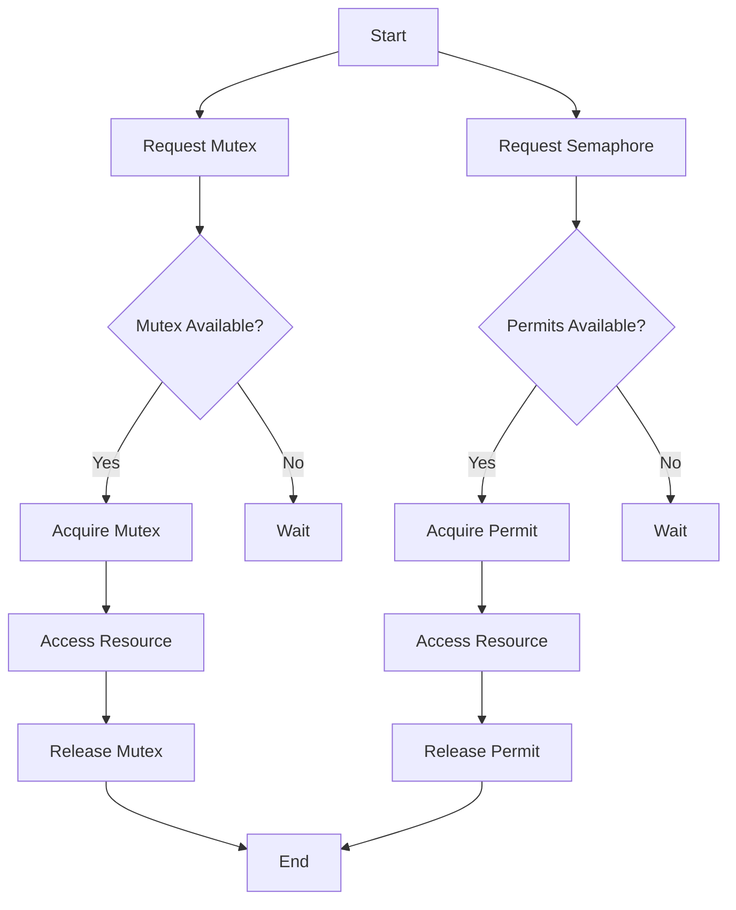

## 8.5 Concurrency Control

Concurrency control is a critical aspect of modern software development, especially in Kotlin, where the language's features and libraries provide robust support for concurrent and parallel programming. In this section, we delve into the mechanisms of concurrency control, focusing on mutexes, semaphores, and atomic operations. These tools help manage access to shared resources, prevent race conditions, and ensure thread safety.

### Understanding Concurrency in Kotlin

Concurrency involves multiple computations happening simultaneously, which can significantly improve the performance and responsiveness of applications. However, it also introduces complexities, such as race conditions, deadlocks, and data inconsistencies. Kotlin provides several constructs to handle concurrency effectively, including coroutines, which are lightweight threads that allow asynchronous programming.

#### Key Concepts in Concurrency

- **Thread Safety**: Ensuring that shared data is accessed and modified by multiple threads without causing inconsistencies.
- **Race Conditions**: Situations where the behavior of software depends on the relative timing of events, such as thread execution order.
- **Deadlocks**: A state where two or more threads are blocked forever, waiting for each other to release resources.
- **Livelocks**: A situation where threads keep changing states in response to each other without making progress.

### Mutexes: Ensuring Exclusive Access

A mutex (short for mutual exclusion) is a synchronization primitive used to prevent multiple threads from accessing a shared resource simultaneously. It ensures that only one thread can access a resource at a time, thus preventing race conditions.

#### Using Mutex in Kotlin

Kotlin provides a `Mutex` class in the `kotlinx.coroutines` library, which is designed to work seamlessly with coroutines. Here's how you can use a mutex to protect shared resources:

```kotlin
import kotlinx.coroutines.*
import kotlinx.coroutines.sync.Mutex
import kotlinx.coroutines.sync.withLock

val mutex = Mutex()
var sharedResource = 0

fun main() = runBlocking {
    val jobs = List(100) {
        launch {
            repeat(1000) {
                // Ensure exclusive access to sharedResource
                mutex.withLock {
                    sharedResource++
                }
            }
        }
    }
    jobs.forEach { it.join() }
    println("Final value of sharedResource: $sharedResource")
}
```

**Explanation:**
- **Mutex Initialization**: We create a `Mutex` object to control access to `sharedResource`.
- **withLock**: This function ensures that the code block is executed with exclusive access to the mutex. It suspends the coroutine until the lock is acquired.
- **Concurrency Control**: By using `withLock`, we prevent multiple coroutines from modifying `sharedResource` simultaneously, ensuring thread safety.

### Semaphores: Managing Resource Access

A semaphore is a more generalized synchronization primitive than a mutex. It controls access to a resource pool with a fixed number of permits. Unlike a mutex, which allows only one thread to access a resource, a semaphore can allow multiple threads, up to a specified limit.

#### Using Semaphore in Kotlin

Kotlin's `kotlinx.coroutines` library provides a `Semaphore` class, which can be used to manage access to resources:

```kotlin
import kotlinx.coroutines.*
import kotlinx.coroutines.sync.Semaphore
import kotlinx.coroutines.sync.withPermit

val semaphore = Semaphore(5) // Allow up to 5 concurrent accesses

fun main() = runBlocking {
    val jobs = List(100) {
        launch {
            repeat(10) {
                semaphore.withPermit {
                    // Simulate resource access
                    println("Accessing resource by ${Thread.currentThread().name}")
                    delay(100)
                }
            }
        }
    }
    jobs.forEach { it.join() }
}
```

**Explanation:**
- **Semaphore Initialization**: We create a `Semaphore` with 5 permits, allowing up to 5 concurrent accesses.
- **withPermit**: This function acquires a permit before executing the code block and releases it afterward. It ensures that no more than 5 coroutines access the resource simultaneously.

### Avoiding Shared Mutable State

Shared mutable state is a common source of concurrency issues. To avoid these problems, it's essential to minimize shared state and use immutable data structures whenever possible. When shared state is necessary, use synchronization primitives like mutexes and semaphores to control access.

#### Strategies to Avoid Shared Mutable State

1. **Immutability**: Use immutable data structures to prevent accidental modifications.
2. **Local State**: Keep state local to threads or coroutines whenever possible.
3. **Functional Programming**: Adopt functional programming principles, such as pure functions and immutability, to reduce shared state.

### Atomic Operations: Ensuring Consistent Updates

Atomic operations are indivisible operations that ensure consistency when multiple threads or coroutines attempt to update shared data. Kotlin provides atomic classes in the `kotlinx.atomicfu` library, which offer lock-free thread-safe operations.

#### Using Atomic Variables in Kotlin

Here's an example of using atomic variables to manage shared state:

```kotlin
import kotlinx.atomicfu.atomic
import kotlinx.coroutines.*

val atomicCounter = atomic(0)

fun main() = runBlocking {
    val jobs = List(100) {
        launch {
            repeat(1000) {
                atomicCounter.incrementAndGet()
            }
        }
    }
    jobs.forEach { it.join() }
    println("Final value of atomicCounter: ${atomicCounter.value}")
}
```

**Explanation:**
- **Atomic Initialization**: We create an atomic integer using `atomic(0)`.
- **incrementAndGet**: This method atomically increments the counter and returns the new value, ensuring thread safety without locks.

### Design Considerations

When designing concurrent applications, consider the following:

- **Granularity**: Choose the appropriate level of granularity for locks and atomic operations. Fine-grained locking can improve concurrency but may increase complexity.
- **Deadlock Prevention**: Avoid deadlocks by acquiring locks in a consistent order and using timeout mechanisms.
- **Performance**: Balance the overhead of synchronization with the need for thread safety. Excessive locking can degrade performance.
- **Scalability**: Design for scalability by minimizing contention and using non-blocking algorithms where possible.

### Differences and Similarities

- **Mutex vs. Semaphore**: A mutex is a binary semaphore with a single permit, while a semaphore can have multiple permits. Use a mutex for exclusive access and a semaphore for managing a pool of resources.
- **Atomic Operations vs. Locks**: Atomic operations provide lock-free synchronization, which can be more efficient than locks in some scenarios. However, they are limited to simple operations and may not replace the need for locks in complex scenarios.

### Visualizing Concurrency Control

Let's visualize the interaction of mutexes and semaphores in a concurrent system:



**Diagram Explanation:**
- **Mutex Flow**: A thread requests a mutex, checks availability, acquires it if available, accesses the resource, and releases the mutex.
- **Semaphore Flow**: A thread requests a semaphore, checks for available permits, acquires a permit if available, accesses the resource, and releases the permit.

### Try It Yourself

Experiment with the code examples provided:

- **Modify the Mutex Example**: Change the number of coroutines or iterations and observe the impact on the final value of `sharedResource`.
- **Adjust the Semaphore Permits**: Increase or decrease the number of permits in the semaphore example and see how it affects concurrent access.
- **Explore Atomic Operations**: Try using different atomic operations, such as `compareAndSet`, to understand their behavior.

### References and Links

- [Kotlin Coroutines Guide](https://kotlinlang.org/docs/coroutines-guide.html)
- [Kotlinx Coroutines Library](https://github.com/Kotlin/kotlinx.coroutines)
- [AtomicFU Library](https://github.com/Kotlin/kotlinx.atomicfu)

### Knowledge Check

- **What is the primary purpose of a mutex?**
- **How does a semaphore differ from a mutex?**
- **What are atomic operations, and when should they be used?**

### Embrace the Journey

Concurrency control is a complex but rewarding aspect of software development. As you explore these concepts, remember that practice and experimentation are key to mastering them. Keep pushing the boundaries, stay curious, and enjoy the journey of building robust concurrent applications in Kotlin!

---

## Quiz Time!



### What is the primary purpose of a mutex in concurrency control?

- [x] To ensure exclusive access to a shared resource
- [ ] To allow multiple threads to access a resource simultaneously
- [ ] To manage a pool of resources
- [ ] To perform atomic operations

> **Explanation:** A mutex ensures exclusive access to a shared resource, preventing race conditions by allowing only one thread to access the resource at a time.

### How does a semaphore differ from a mutex?

- [x] A semaphore allows multiple threads to access a resource up to a limit, while a mutex allows only one thread.
- [ ] A semaphore is used for atomic operations, while a mutex is not.
- [ ] A semaphore is always binary, while a mutex can have multiple permits.
- [ ] A semaphore is used for exclusive access, while a mutex is for shared access.

> **Explanation:** A semaphore can allow multiple threads to access a resource up to a specified limit, whereas a mutex allows only one thread at a time.

### What are atomic operations?

- [x] Indivisible operations that ensure consistency when multiple threads update shared data
- [ ] Operations that require locks to ensure thread safety
- [ ] Operations that allow multiple threads to access a resource simultaneously
- [ ] Operations that are always performed in parallel

> **Explanation:** Atomic operations are indivisible and ensure consistency when multiple threads attempt to update shared data without the need for locks.

### Which Kotlin library provides the `Mutex` and `Semaphore` classes?

- [x] kotlinx.coroutines
- [ ] kotlinx.atomicfu
- [ ] kotlin.collections
- [ ] kotlin.concurrent

> **Explanation:** The `kotlinx.coroutines` library provides the `Mutex` and `Semaphore` classes for concurrency control in Kotlin.

### What is the `withLock` function used for in Kotlin?

- [x] To execute a block of code with exclusive access to a mutex
- [ ] To acquire a semaphore permit
- [ ] To perform atomic operations
- [ ] To create a new coroutine

> **Explanation:** The `withLock` function is used to execute a block of code with exclusive access to a mutex, ensuring thread safety.

### What is the role of the `incrementAndGet` method in atomic operations?

- [x] To atomically increment a counter and return the new value
- [ ] To acquire a mutex lock
- [ ] To release a semaphore permit
- [ ] To create a new atomic variable

> **Explanation:** The `incrementAndGet` method atomically increments a counter and returns the new value, ensuring thread safety without locks.

### How can you prevent deadlocks in concurrent applications?

- [x] Acquire locks in a consistent order and use timeout mechanisms
- [ ] Use more mutexes
- [ ] Increase the number of semaphore permits
- [ ] Avoid using atomic operations

> **Explanation:** Preventing deadlocks involves acquiring locks in a consistent order and using timeout mechanisms to avoid indefinite waiting.

### What is the benefit of using atomic operations over locks?

- [x] Atomic operations provide lock-free synchronization, which can be more efficient.
- [ ] Atomic operations always require less memory.
- [ ] Atomic operations are easier to implement.
- [ ] Atomic operations are always faster than locks.

> **Explanation:** Atomic operations provide lock-free synchronization, which can be more efficient than locks in some scenarios, especially for simple operations.

### What is the `withPermit` function used for in Kotlin?

- [x] To acquire a semaphore permit before executing a block of code
- [ ] To execute a block of code with exclusive access to a mutex
- [ ] To perform atomic operations
- [ ] To create a new coroutine

> **Explanation:** The `withPermit` function is used to acquire a semaphore permit before executing a block of code, ensuring that the number of concurrent accesses does not exceed the limit.

### True or False: Shared mutable state is a common source of concurrency issues.

- [x] True
- [ ] False

> **Explanation:** Shared mutable state is indeed a common source of concurrency issues, as it can lead to race conditions and data inconsistencies when accessed by multiple threads.


