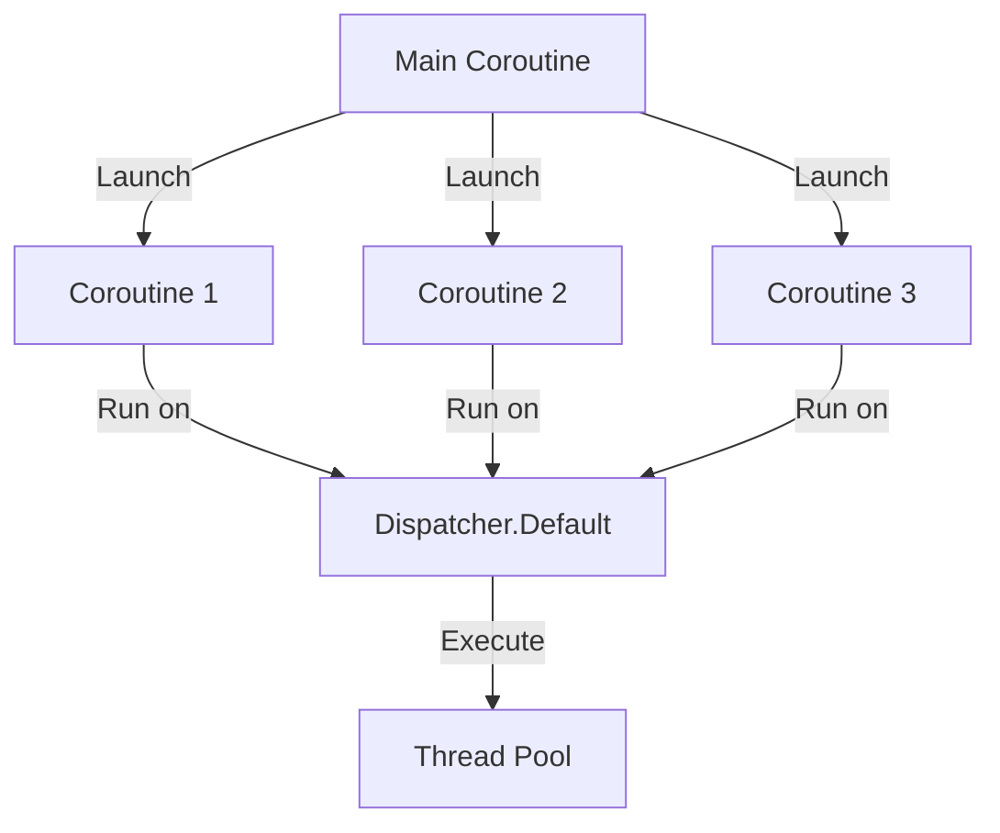

## 8.6 Parallelism with Coroutine Contexts

Parallelism is a fundamental concept in modern software engineering, allowing programs to perform multiple tasks simultaneously, thereby improving performance and resource utilization. In Kotlin, coroutines provide a powerful and flexible way to achieve parallelism through coroutine contexts. In this section, we will explore how to leverage coroutine contexts, dispatchers, and thread pools to run tasks in parallel effectively.

### Understanding Coroutine Contexts

A coroutine context is a set of elements that define the behavior of a coroutine. It includes information such as the coroutine's job, dispatcher, and any other context-specific data. The context is crucial for controlling how coroutines are executed, particularly in terms of concurrency and parallelism.

#### Key Components of Coroutine Contexts

1. **Job**: Represents the lifecycle of a coroutine. It allows you to manage the coroutine's execution, including cancellation and completion.

2. **Dispatcher**: Determines the thread or thread pool on which the coroutine will run. Dispatchers are essential for achieving parallelism.

3. **CoroutineName**: Provides a name for debugging purposes, making it easier to identify coroutines in logs.

4. **CoroutineExceptionHandler**: Handles uncaught exceptions in coroutines, allowing for graceful error handling.

### Dispatchers and Their Role in Parallelism

Dispatchers are a critical component of coroutine contexts, as they define the thread or thread pool where the coroutine will execute. Kotlin provides several built-in dispatchers, each suited for different types of tasks:

- **Dispatchers.Default**: Optimized for CPU-intensive tasks. It uses a shared pool of threads and is suitable for tasks that require significant computation.

- **Dispatchers.IO**: Designed for I/O-bound tasks, such as reading from or writing to files and network operations. It uses a larger pool of threads to handle blocking I/O operations efficiently.

- **Dispatchers.Main**: Used for tasks that need to run on the main thread, typically in Android applications for UI updates.

- **Dispatchers.Unconfined**: Starts the coroutine in the caller thread but can resume it in a different thread. It's generally not recommended for production use due to its unpredictable nature.

#### Custom Dispatchers

In addition to the built-in dispatchers, you can create custom dispatchers using `Executors` from the Java standard library. This allows you to define specific thread pools tailored to your application's needs.

```kotlin
import kotlinx.coroutines.*
import java.util.concurrent.Executors

fun main() = runBlocking {
    val customDispatcher = Executors.newFixedThreadPool(4).asCoroutineDispatcher()

    launch(customDispatcher) {
        println("Running on custom dispatcher: ${Thread.currentThread().name}")
    }

    customDispatcher.close() // Remember to close the dispatcher to free resources
}
```

### Running Tasks in Parallel

Parallelism involves executing multiple tasks simultaneously, which can significantly improve performance for certain types of applications. In Kotlin, you can achieve parallelism by launching multiple coroutines on different dispatchers.

#### Example: Parallel Computation

Let's consider a scenario where we need to perform several CPU-intensive calculations in parallel. We can use `Dispatchers.Default` to achieve this:

```kotlin
import kotlinx.coroutines.*

suspend fun performComputation(id: Int): Int {
    println("Starting computation $id on ${Thread.currentThread().name}")
    delay(1000) // Simulate a long-running computation
    println("Completed computation $id")
    return id * id
}

fun main() = runBlocking {
    val results = (1..5).map { id ->
        async(Dispatchers.Default) {
            performComputation(id)
        }
    }.awaitAll()

    println("Results: $results")
}
```

In this example, we launch multiple coroutines using `async` on `Dispatchers.Default`. Each coroutine performs a computation, and the results are collected using `awaitAll()`, which waits for all coroutines to complete.

### Thread Pools and Resource Management

Thread pools are a crucial aspect of managing resources efficiently in parallel programming. They allow you to control the number of threads used by your application, preventing excessive resource consumption and ensuring optimal performance.

#### Configuring Thread Pools

Kotlin's coroutine library provides a convenient way to configure thread pools using `Executors`. You can create fixed thread pools, cached thread pools, or custom configurations based on your requirements.

```kotlin
val fixedThreadPool = Executors.newFixedThreadPool(4).asCoroutineDispatcher()
val cachedThreadPool = Executors.newCachedThreadPool().asCoroutineDispatcher()
```

#### Managing Thread Pool Lifecycle

It's important to manage the lifecycle of thread pools to avoid resource leaks. Always close the dispatcher when it's no longer needed:

```kotlin
fixedThreadPool.close()
cachedThreadPool.close()
```

### Design Considerations

When implementing parallelism with coroutine contexts, consider the following:

- **Task Granularity**: Ensure tasks are sufficiently large to justify the overhead of parallel execution. Too fine-grained tasks may lead to inefficiencies.

- **Resource Contention**: Be mindful of shared resources and potential contention issues. Use synchronization mechanisms if necessary.

- **Error Handling**: Implement robust error handling strategies to manage exceptions in parallel tasks.

- **Performance Monitoring**: Regularly monitor performance to identify bottlenecks and optimize thread pool configurations.

### Visualizing Coroutine Contexts and Parallelism

To better understand how coroutine contexts and parallelism work, let's visualize the process using a Mermaid.js diagram.



**Diagram Description**: This diagram illustrates how the main coroutine launches multiple coroutines, each running on `Dispatcher.Default`, which utilizes a shared thread pool for execution.

### Try It Yourself

Experiment with the code examples provided in this section. Try modifying the number of coroutines, the dispatcher used, or the complexity of the computations to observe how it affects performance and resource utilization.

### Further Reading

For more information on Kotlin coroutines and parallelism, consider exploring the following resources:

- [Kotlin Coroutines Guide](https://kotlinlang.org/docs/coroutines-guide.html)
- [Kotlin Coroutines on Android](https://developer.android.com/kotlin/coroutines)
- [Java Executors](https://docs.oracle.com/javase/8/docs/api/java/util/concurrent/Executors.html)

### Knowledge Check

- What are the key components of a coroutine context?
- How do dispatchers influence parallelism in Kotlin?
- Why is it important to manage the lifecycle of thread pools?

### Summary

In this section, we explored how to achieve parallelism in Kotlin using coroutine contexts. We discussed the role of dispatchers, thread pools, and provided practical examples of running tasks in parallel. By understanding these concepts, you can effectively leverage Kotlin's coroutine framework to build efficient and scalable applications.

## Quiz Time!



### What is a coroutine context?

- [x] A set of elements that define the behavior of a coroutine
- [ ] A function that suspends the execution of a coroutine
- [ ] A library for managing threads
- [ ] A tool for debugging coroutines

> **Explanation:** A coroutine context is a collection of elements that define the behavior and execution environment of a coroutine, including its dispatcher, job, and other context-specific data.

### Which dispatcher is optimized for CPU-intensive tasks?

- [x] Dispatchers.Default
- [ ] Dispatchers.IO
- [ ] Dispatchers.Main
- [ ] Dispatchers.Unconfined

> **Explanation:** `Dispatchers.Default` is optimized for CPU-intensive tasks and uses a shared pool of threads for efficient execution.

### What is the purpose of a dispatcher in Kotlin coroutines?

- [x] To determine the thread or thread pool on which a coroutine will run
- [ ] To handle exceptions in coroutines
- [ ] To provide a name for debugging purposes
- [ ] To manage the lifecycle of a coroutine

> **Explanation:** A dispatcher determines the thread or thread pool on which a coroutine will execute, influencing concurrency and parallelism.

### How can you create a custom dispatcher in Kotlin?

- [x] By using Executors from the Java standard library
- [ ] By extending the CoroutineScope class
- [ ] By implementing the CoroutineDispatcher interface
- [ ] By using the `launch` function

> **Explanation:** You can create a custom dispatcher by using `Executors` from the Java standard library and converting it to a coroutine dispatcher with `asCoroutineDispatcher()`.

### What is the role of a thread pool in parallel programming?

- [x] To control the number of threads used by an application
- [ ] To manage the lifecycle of coroutines
- [ ] To provide a name for debugging purposes
- [ ] To handle exceptions in parallel tasks

> **Explanation:** A thread pool controls the number of threads used by an application, helping manage resources efficiently in parallel programming.

### Why is it important to close a custom dispatcher?

- [x] To free resources and avoid resource leaks
- [ ] To improve the performance of coroutines
- [ ] To handle exceptions in coroutines
- [ ] To provide a name for debugging purposes

> **Explanation:** Closing a custom dispatcher is important to free resources and avoid resource leaks, ensuring efficient resource management.

### Which dispatcher is typically used for UI updates in Android applications?

- [x] Dispatchers.Main
- [ ] Dispatchers.Default
- [ ] Dispatchers.IO
- [ ] Dispatchers.Unconfined

> **Explanation:** `Dispatchers.Main` is typically used for tasks that need to run on the main thread, such as UI updates in Android applications.

### What is the main advantage of using coroutines for parallelism?

- [x] They provide a lightweight and flexible way to achieve parallelism
- [ ] They eliminate the need for thread pools
- [ ] They automatically handle exceptions
- [ ] They provide a name for debugging purposes

> **Explanation:** Coroutines provide a lightweight and flexible way to achieve parallelism, allowing for efficient task execution without the overhead of traditional threading.

### What is the effect of using `Dispatchers.Unconfined`?

- [x] It starts the coroutine in the caller thread but can resume it in a different thread
- [ ] It always runs the coroutine on the main thread
- [ ] It uses a fixed thread pool for execution
- [ ] It handles exceptions automatically

> **Explanation:** `Dispatchers.Unconfined` starts the coroutine in the caller thread but can resume it in a different thread, making its behavior less predictable.

### True or False: `Dispatchers.IO` is suitable for CPU-intensive tasks.

- [ ] True
- [x] False

> **Explanation:** `Dispatchers.IO` is designed for I/O-bound tasks, not CPU-intensive tasks. For CPU-intensive tasks, `Dispatchers.Default` is more appropriate.



Remember, mastering parallelism with coroutine contexts is just one step in your journey to becoming an expert in Kotlin. Keep experimenting, stay curious, and enjoy the process of learning and building with Kotlin!
