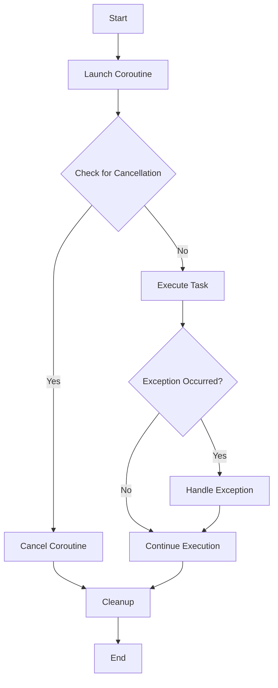

## 8.7 Cancellation and Exception Handling

In the realm of Kotlin coroutines, managing cancellation and exceptions effectively is crucial for building robust and responsive applications. This section delves into the intricacies of cooperative cancellation, exception handling, and the role of supervisor jobs in exception supervision. By the end of this guide, you will be equipped with the knowledge to handle these aspects gracefully in your Kotlin applications.

### Understanding Cooperative Cancellation

Cooperative cancellation is a fundamental concept in Kotlin coroutines, allowing tasks to be cancelled in a controlled manner. Unlike traditional thread interruption, cooperative cancellation relies on the coroutine itself to check for cancellation and respond accordingly.

#### How Cancellation Works

In Kotlin, a coroutine can be cancelled by invoking the `cancel()` function on its `Job`. The cancellation is cooperative, meaning the coroutine must periodically check for cancellation and handle it gracefully. This is typically done using the `isActive` property or by calling `yield()` or other suspending functions that check for cancellation.

```kotlin
import kotlinx.coroutines.*

fun main() = runBlocking {
    val job = launch {
        repeat(1000) { i ->
            println("Job: I'm working $i ...")
            delay(500L)
        }
    }
    delay(1300L) // delay a bit
    println("main: I'm tired of waiting!")
    job.cancelAndJoin() // cancels the job and waits for its completion
    println("main: Now I can quit.")
}
```

In this example, the coroutine checks for cancellation during the `delay()` call, which is a suspending function. When `cancelAndJoin()` is called, the coroutine is cancelled gracefully.

#### Cancellation Propagation

Cancellation in coroutines is propagated through the coroutine hierarchy. When a parent coroutine is cancelled, all its children are cancelled as well. This ensures that resources are released and no orphaned coroutines are left running.

```kotlin
import kotlinx.coroutines.*

fun main() = runBlocking {
    val request = launch {
        repeat(3) { i ->
            launch {
                delay((i + 1) * 200L)
                println("Coroutine $i is done")
            }
        }
        println("Request: I'm done and will cancel my children")
    }
    delay(500L)
    request.cancel() // cancels the request and all its children
    delay(1000L) // delay to see if any coroutines are still running
}
```

In this example, cancelling the `request` coroutine also cancels all its child coroutines.

### Handling Exceptions in Asynchronous Code

Exception handling in coroutines is different from traditional try-catch blocks due to the asynchronous nature of coroutines. Understanding how exceptions propagate and how to handle them is crucial for building resilient applications.

#### Exception Propagation

Exceptions in coroutines are propagated up the coroutine hierarchy. If a child coroutine throws an exception, it is propagated to the parent coroutine, which can choose to handle it or let it propagate further.

```kotlin
import kotlinx.coroutines.*

fun main() = runBlocking {
    val job = launch {
        try {
            repeat(1000) { i ->
                println("Job: I'm working $i ...")
                delay(500L)
            }
        } catch (e: CancellationException) {
            println("Job: I'm cancelled due to ${e.message}")
        } finally {
            println("Job: I'm running finally")
        }
    }
    delay(1300L)
    println("main: I'm tired of waiting!")
    job.cancelAndJoin()
    println("main: Now I can quit.")
}
```

In this example, the `CancellationException` is caught, allowing the coroutine to perform cleanup in the `finally` block.

#### Supervisor Jobs and Exception Supervision

Supervisor jobs provide a mechanism to handle exceptions in a more controlled manner. Unlike regular jobs, a supervisor job does not cancel its children when one of them fails. This allows other children to continue executing even if one fails.

```kotlin
import kotlinx.coroutines.*

fun main() = runBlocking {
    val supervisor = SupervisorJob()

    with(CoroutineScope(coroutineContext + supervisor)) {
        val child = launch {
            try {
                println("Child is sleeping")
                delay(Long.MAX_VALUE)
            } finally {
                println("Child is cancelled")
            }
        }

        yield()
        println("Cancelling supervisor")
        supervisor.cancel()
        child.join()
    }
}
```

In this example, cancelling the supervisor does not automatically cancel the child coroutine. The child coroutine continues running until it is explicitly cancelled.

#### Exception Handling Strategies

1. **Try-Catch Blocks**: Use try-catch blocks within coroutines to handle exceptions locally. This is useful for handling exceptions that are specific to a particular coroutine.

2. **CoroutineExceptionHandler**: Use `CoroutineExceptionHandler` to handle exceptions at the coroutine scope level. This is useful for handling exceptions that occur in multiple coroutines.

```kotlin
import kotlinx.coroutines.*

fun main() = runBlocking {
    val handler = CoroutineExceptionHandler { _, exception ->
        println("Caught $exception")
    }

    val job = GlobalScope.launch(handler) {
        throw AssertionError()
    }
    job.join()
}
```

In this example, the `CoroutineExceptionHandler` catches the `AssertionError` thrown by the coroutine.

3. **SupervisorScope**: Use `supervisorScope` to create a scope where child coroutines can fail independently. This is useful for isolating failures and preventing them from affecting other coroutines.

```kotlin
import kotlinx.coroutines.*

fun main() = runBlocking {
    supervisorScope {
        val child = launch {
            println("Child throws an exception")
            throw AssertionError()
        }
        println("Scope is completing")
    }
    println("Scope is completed")
}
```

In this example, the failure of the child coroutine does not affect the supervisor scope.

### Visualizing Cancellation and Exception Handling

To better understand the flow of cancellation and exception handling in coroutines, let's visualize the process using a Mermaid.js diagram.



This diagram illustrates the flow of a coroutine from start to end, highlighting the points where cancellation and exception handling occur.

### Try It Yourself

To deepen your understanding, try modifying the code examples provided. Experiment with different cancellation scenarios, such as cancelling a coroutine from within another coroutine, or handling exceptions using different strategies. Observe how the behavior changes and consider the implications for your own applications.

### Key Takeaways

- **Cooperative Cancellation**: Coroutines must check for cancellation and handle it gracefully.
- **Exception Propagation**: Exceptions propagate up the coroutine hierarchy and can be handled at different levels.
- **Supervisor Jobs**: Allow child coroutines to fail independently, providing more control over exception handling.
- **Exception Handling Strategies**: Use try-catch blocks, `CoroutineExceptionHandler`, and `supervisorScope` to manage exceptions effectively.

### References and Further Reading

- [Kotlin Coroutines Guide](https://kotlinlang.org/docs/coroutines-guide.html)
- [Kotlin Coroutine Cancellation and Timeouts](https://kotlinlang.org/docs/cancellation-and-timeouts.html)
- [Kotlin Coroutine Exception Handling](https://kotlinlang.org/docs/exception-handling.html)

## Quiz Time!



### What is cooperative cancellation in Kotlin coroutines?

- [x] A mechanism where coroutines check for cancellation and handle it gracefully.
- [ ] A mechanism where coroutines are forcibly terminated by the system.
- [ ] A mechanism where coroutines ignore cancellation requests.
- [ ] A mechanism where coroutines are paused indefinitely.

> **Explanation:** Cooperative cancellation requires coroutines to periodically check for cancellation and respond appropriately, ensuring a controlled shutdown.

### How does cancellation propagate in a coroutine hierarchy?

- [x] When a parent coroutine is cancelled, all its children are also cancelled.
- [ ] Cancellation does not propagate in a coroutine hierarchy.
- [ ] Only the immediate children of a cancelled coroutine are affected.
- [ ] Cancellation propagates only if explicitly specified.

> **Explanation:** Cancellation in coroutines is hierarchical, meaning that cancelling a parent coroutine will also cancel all its child coroutines.

### What is the role of a `CoroutineExceptionHandler`?

- [x] To handle exceptions at the coroutine scope level.
- [ ] To prevent exceptions from occurring in coroutines.
- [ ] To cancel coroutines when an exception occurs.
- [ ] To log exceptions without handling them.

> **Explanation:** `CoroutineExceptionHandler` is used to handle exceptions that occur within a coroutine scope, allowing for centralized exception management.

### What is the purpose of a supervisor job?

- [x] To allow child coroutines to fail independently without affecting others.
- [ ] To ensure all child coroutines are cancelled when one fails.
- [ ] To prevent exceptions from propagating in the coroutine hierarchy.
- [ ] To manage coroutine lifecycles automatically.

> **Explanation:** Supervisor jobs allow child coroutines to fail independently, meaning that the failure of one child does not cancel the others.

### Which of the following is NOT a strategy for handling exceptions in coroutines?

- [ ] Try-catch blocks
- [ ] CoroutineExceptionHandler
- [ ] SupervisorScope
- [x] CoroutineSupervisor

> **Explanation:** `CoroutineSupervisor` is not a valid strategy for handling exceptions in coroutines. The correct strategies include try-catch blocks, `CoroutineExceptionHandler`, and `supervisorScope`.

### What happens when a `CancellationException` is thrown in a coroutine?

- [x] The coroutine is cancelled gracefully, allowing for cleanup.
- [ ] The coroutine is forcibly terminated without cleanup.
- [ ] The coroutine continues executing without interruption.
- [ ] The coroutine ignores the exception and retries the operation.

> **Explanation:** A `CancellationException` allows a coroutine to be cancelled gracefully, providing an opportunity for cleanup in a `finally` block.

### How can you create a scope where child coroutines can fail independently?

- [x] Use `supervisorScope`
- [ ] Use `GlobalScope`
- [ ] Use `runBlocking`
- [ ] Use `launch`

> **Explanation:** `supervisorScope` creates a scope where child coroutines can fail independently, isolating failures from affecting other coroutines.

### What is the difference between a regular job and a supervisor job?

- [x] A regular job cancels all children when one fails, while a supervisor job allows children to fail independently.
- [ ] A supervisor job cancels all children when one fails, while a regular job allows children to fail independently.
- [ ] A regular job handles exceptions automatically, while a supervisor job does not.
- [ ] There is no difference between a regular job and a supervisor job.

> **Explanation:** A regular job cancels all its children when one fails, whereas a supervisor job allows children to fail independently, preventing a single failure from affecting others.

### True or False: A coroutine must explicitly check for cancellation to be cancelled.

- [x] True
- [ ] False

> **Explanation:** Coroutines must explicitly check for cancellation using functions like `isActive` or suspending functions that check for cancellation, such as `delay()`.

### What is the primary benefit of using `supervisorScope`?

- [x] It allows child coroutines to fail independently without affecting the parent scope.
- [ ] It automatically retries failed coroutines.
- [ ] It prevents exceptions from propagating in the coroutine hierarchy.
- [ ] It ensures all child coroutines are cancelled when one fails.

> **Explanation:** `supervisorScope` allows child coroutines to fail independently, meaning that a failure in one child does not affect the parent scope or other children.



Remember, mastering cancellation and exception handling in Kotlin coroutines is a journey. As you continue to explore and experiment, you'll gain a deeper understanding of these concepts and how they can be applied to create robust and resilient applications. Keep experimenting, stay curious, and enjoy the journey!
