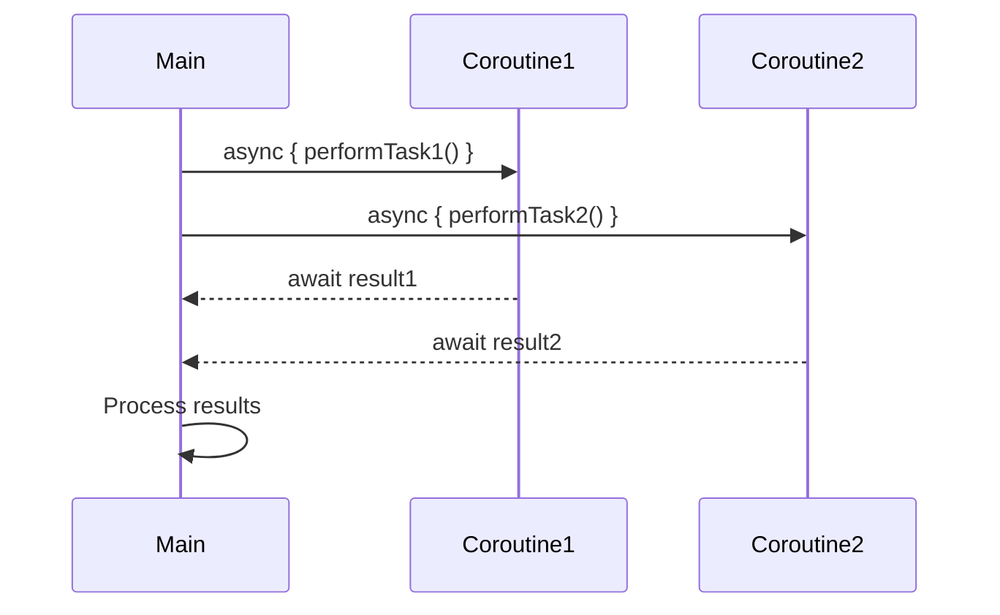

## 8.8 Async and Await Patterns in Kotlin

In the realm of modern software development, handling asynchronous operations efficiently is crucial for building responsive and scalable applications. Kotlin, with its coroutines, provides a powerful and elegant way to manage concurrency. In this section, we will delve into the **Async and Await Patterns** in Kotlin, exploring how they translate asynchronous code into coroutines, and how to leverage `async` and `await` for effective concurrency management.

### Understanding Asynchronous Programming

Before we dive into Kotlin's specific patterns, let's briefly revisit the concept of asynchronous programming. Asynchronous programming allows a program to perform tasks without blocking the main execution thread. This is particularly useful for I/O operations, network requests, or any task that might take an unpredictable amount of time to complete.

In traditional programming, handling such tasks often involves callbacks or promises, which can lead to complex and hard-to-maintain code. Kotlin's coroutines offer a more straightforward and readable approach to asynchronous programming.

### Introduction to Kotlin Coroutines

Kotlin coroutines are a design pattern for asynchronous programming that enables you to write non-blocking code in a sequential style. Coroutines are lightweight threads that can be suspended and resumed, allowing you to perform asynchronous operations without blocking the main thread.

#### Key Features of Coroutines

- **Lightweight**: Coroutines are much lighter than traditional threads, allowing you to run thousands of them simultaneously without significant overhead.
- **Structured Concurrency**: Coroutines provide a structured way to manage concurrency, making it easier to reason about your code.
- **Cancellation Support**: Coroutines can be cancelled, allowing you to stop long-running operations when they are no longer needed.

### Async and Await in Kotlin

The `async` and `await` patterns in Kotlin are built on top of coroutines and provide a simple way to perform concurrent operations. These patterns allow you to write asynchronous code in a synchronous style, improving readability and maintainability.

#### The `async` Function

The `async` function is used to start a new coroutine that performs a task concurrently. It returns a `Deferred` object, which represents a future result of the computation. You can think of `async` as a way to launch a coroutine that will compute a value asynchronously.

```kotlin
import kotlinx.coroutines.*

fun main() = runBlocking {
    val deferred = async {
        // Simulate a long-running computation
        delay(1000L)
        "Hello, Kotlin Coroutines!"
    }

    println("Waiting for the result...")
    val result = deferred.await()
    println("Result: $result")
}
```

In this example, the `async` function is used to start a coroutine that performs a computation. The `await` function is then used to wait for the result, suspending the current coroutine until the computation is complete.

#### The `await` Function

The `await` function is used to retrieve the result of a `Deferred` object. It suspends the current coroutine until the result is available. This allows you to write asynchronous code in a sequential style, without blocking the main thread.

### Combining `async` and `await` for Concurrency

One of the key benefits of using `async` and `await` is the ability to perform multiple tasks concurrently. By launching multiple coroutines with `async`, you can perform several operations in parallel and wait for their results using `await`.

```kotlin
import kotlinx.coroutines.*

fun main() = runBlocking {
    val deferred1 = async { performTask1() }
    val deferred2 = async { performTask2() }

    // Wait for both tasks to complete
    val result1 = deferred1.await()
    val result2 = deferred2.await()

    println("Results: $result1, $result2")
}

suspend fun performTask1(): String {
    delay(1000L) // Simulate a long-running task
    return "Task 1 Complete"
}

suspend fun performTask2(): String {
    delay(1500L) // Simulate a longer-running task
    return "Task 2 Complete"
}
```

In this example, two tasks are performed concurrently using `async`. The `await` function is then used to wait for both tasks to complete before printing the results.

### Design Considerations

When using `async` and `await`, it's important to consider the following:

- **Error Handling**: Exceptions thrown in an `async` block are propagated to the caller when `await` is called. Ensure that you handle exceptions appropriately to prevent crashes.
- **Cancellation**: Coroutines can be cancelled, and it's important to handle cancellation in your code to avoid resource leaks.
- **Context Switching**: While coroutines are lightweight, excessive context switching can still impact performance. Use coroutines judiciously to avoid unnecessary overhead.

### Visualizing Async and Await Patterns

To better understand how `async` and `await` work, let's visualize the flow of execution using a sequence diagram.



This diagram illustrates how the main thread launches two coroutines concurrently using `async`. Each coroutine performs its task and returns a result to the main thread using `await`.

### Try It Yourself

To deepen your understanding, try modifying the code examples to:

- Add a third task and perform it concurrently with the other two.
- Introduce error handling to manage exceptions thrown by any of the tasks.
- Experiment with coroutine cancellation to see how it affects the execution flow.

### Differences and Similarities with Other Patterns

The `async` and `await` patterns in Kotlin are similar to the `Promise` and `async/await` patterns in JavaScript. Both provide a way to handle asynchronous operations in a more readable and maintainable way. However, Kotlin's coroutines offer additional features like structured concurrency and cancellation support, making them more powerful for complex applications.

### Knowledge Check

- Explain how `async` and `await` improve code readability and maintainability.
- Describe how exceptions are handled in `async` blocks.
- Discuss the importance of cancellation support in coroutines.

### Conclusion

The `async` and `await` patterns in Kotlin provide a powerful way to manage concurrency, allowing you to write asynchronous code in a synchronous style. By leveraging these patterns, you can build responsive and scalable applications that handle complex asynchronous operations with ease. Remember, this is just the beginning. As you progress, you'll build more complex and interactive applications. Keep experimenting, stay curious, and enjoy the journey!

## Quiz Time!



### What is the primary purpose of the `async` function in Kotlin?

- [x] To start a new coroutine that performs a task concurrently
- [ ] To block the main thread until a task is complete
- [ ] To handle exceptions in asynchronous code
- [ ] To cancel a running coroutine

> **Explanation:** The `async` function is used to start a new coroutine that performs a task concurrently, returning a `Deferred` object representing the future result.

### How does the `await` function work in Kotlin?

- [x] It suspends the current coroutine until the result of a `Deferred` object is available
- [ ] It blocks the main thread until a task is complete
- [ ] It cancels a running coroutine
- [ ] It handles exceptions in asynchronous code

> **Explanation:** The `await` function suspends the current coroutine until the result of a `Deferred` object is available, allowing you to write asynchronous code in a sequential style.

### What happens if an exception is thrown in an `async` block?

- [x] The exception is propagated to the caller when `await` is called
- [ ] The exception is ignored
- [ ] The coroutine is cancelled
- [ ] The main thread is blocked

> **Explanation:** Exceptions thrown in an `async` block are propagated to the caller when `await` is called, so it's important to handle exceptions appropriately.

### What is a key benefit of using coroutines over traditional threads?

- [x] Coroutines are lightweight and allow for thousands to run simultaneously without significant overhead
- [ ] Coroutines block the main thread
- [ ] Coroutines do not support cancellation
- [ ] Coroutines are heavier than traditional threads

> **Explanation:** Coroutines are lightweight and allow for thousands to run simultaneously without significant overhead, making them more efficient than traditional threads.

### Which of the following is a design consideration when using `async` and `await`?

- [x] Error handling and cancellation support
- [ ] Blocking the main thread
- [ ] Ignoring exceptions
- [ ] Avoiding context switching

> **Explanation:** When using `async` and `await`, it's important to consider error handling and cancellation support to prevent crashes and resource leaks.

### How can you perform multiple tasks concurrently using `async` and `await`?

- [x] Launch multiple coroutines with `async` and wait for their results using `await`
- [ ] Use `await` to block the main thread
- [ ] Use `async` to handle exceptions
- [ ] Launch a single coroutine with `async`

> **Explanation:** By launching multiple coroutines with `async`, you can perform several operations in parallel and wait for their results using `await`.

### What is the role of `Deferred` in Kotlin's `async` pattern?

- [x] It represents a future result of a computation
- [ ] It cancels a running coroutine
- [ ] It blocks the main thread
- [ ] It handles exceptions

> **Explanation:** `Deferred` is an object returned by `async` that represents a future result of a computation, which can be retrieved using `await`.

### What is the advantage of structured concurrency in Kotlin?

- [x] It provides a structured way to manage concurrency, making it easier to reason about your code
- [ ] It blocks the main thread
- [ ] It ignores exceptions
- [ ] It cancels all running coroutines

> **Explanation:** Structured concurrency provides a structured way to manage concurrency, making it easier to reason about your code and ensuring that coroutines are properly managed.

### How does Kotlin's `async` and `await` pattern compare to JavaScript's `Promise` and `async/await`?

- [x] Both provide a way to handle asynchronous operations in a more readable and maintainable way
- [ ] Kotlin's pattern blocks the main thread
- [ ] JavaScript's pattern supports cancellation
- [ ] Kotlin's pattern is less powerful

> **Explanation:** Both Kotlin's `async` and `await` and JavaScript's `Promise` and `async/await` provide a way to handle asynchronous operations in a more readable and maintainable way, but Kotlin's coroutines offer additional features like structured concurrency and cancellation support.

### True or False: Coroutines in Kotlin can be cancelled to stop long-running operations when they are no longer needed.

- [x] True
- [ ] False

> **Explanation:** True. Coroutines in Kotlin support cancellation, allowing you to stop long-running operations when they are no longer needed, preventing resource leaks.


