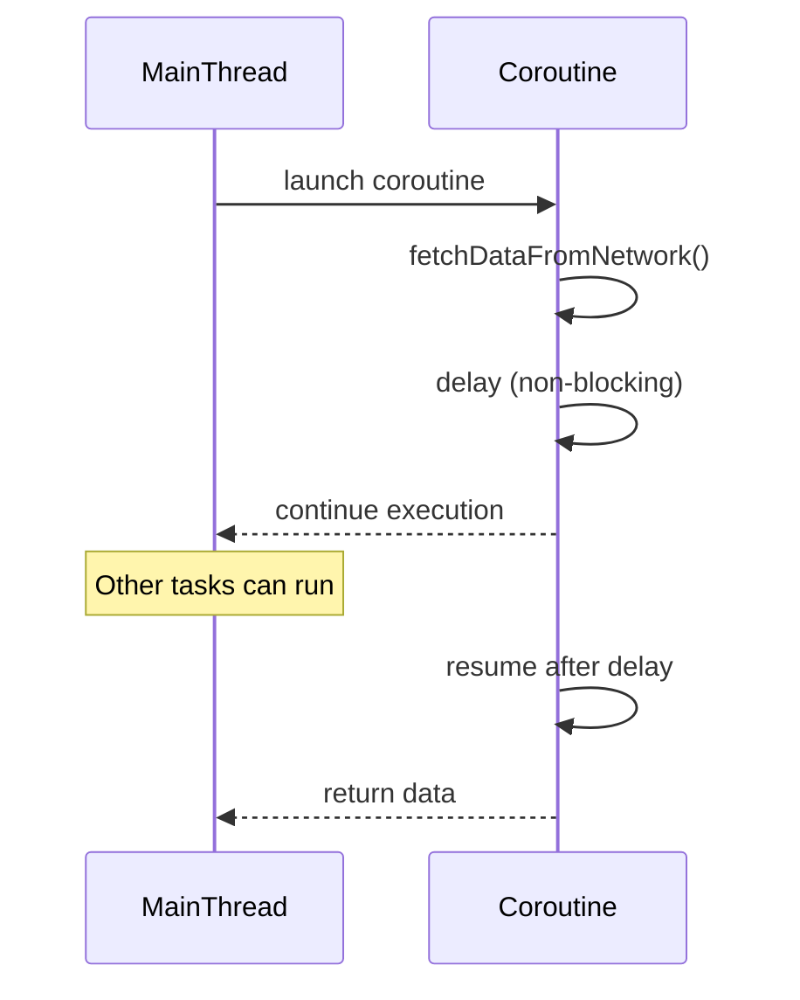

## 8.9 Non-blocking I/O

As software engineers, we strive to build applications that are not only functional but also efficient and responsive. In the realm of I/O operations, blocking calls can become a bottleneck, leading to performance issues and unresponsive applications. This is where non-blocking I/O comes into play, offering a way to handle I/O operations without halting the execution of your program.

### Understanding Non-blocking I/O

Non-blocking I/O allows a program to initiate an I/O operation and continue executing other tasks while waiting for the operation to complete. This is in contrast to blocking I/O, where the program halts execution until the I/O operation finishes. Non-blocking I/O is crucial for building scalable applications, especially in environments where multiple I/O operations occur simultaneously, such as web servers and real-time applications.

#### Key Concepts

- **Asynchronous Execution**: The ability to perform tasks without waiting for previous tasks to complete.
- **Event-driven Architecture**: A programming paradigm where the flow of the program is determined by events such as user actions, sensor outputs, or messages from other programs.
- **Concurrency**: The execution of multiple instruction sequences at the same time.

### Kotlin's Approach to Non-blocking I/O

Kotlin provides a powerful mechanism for non-blocking I/O through coroutines and suspending functions. Coroutines are a feature of Kotlin that allows you to write asynchronous code in a sequential manner, making it easier to read and maintain.

#### Suspending Functions

A suspending function is a function that can be paused and resumed later. It is defined with the `suspend` keyword and can be used to perform long-running operations without blocking the thread.

```kotlin
suspend fun fetchDataFromNetwork(): String {
    // Simulate network call
    delay(1000)
    return "Data from network"
}
```

In the above example, `fetchDataFromNetwork` is a suspending function that simulates a network call using `delay`, which is a suspending function that pauses the coroutine without blocking the thread.

### Implementing Non-blocking I/O

To implement non-blocking I/O in Kotlin, we use suspending functions in conjunction with coroutines. Let's explore how to set up and use these features effectively.

#### Setting Up Coroutines

First, ensure you have the Kotlin coroutines library included in your project. Add the following dependency to your `build.gradle.kts` file:

```kotlin
dependencies {
    implementation("org.jetbrains.kotlinx:kotlinx-coroutines-core:1.6.0")
}
```

#### Using Coroutines for Non-blocking I/O

Let's look at a practical example of using coroutines for non-blocking I/O operations.

```kotlin
import kotlinx.coroutines.*

fun main() = runBlocking {
    launch {
        val data = fetchDataFromNetwork()
        println("Received: $data")
    }
    println("Fetching data...")
}

suspend fun fetchDataFromNetwork(): String {
    delay(1000) // Simulate network delay
    return "Data from network"
}
```

In this example, `launch` is used to start a new coroutine. The `fetchDataFromNetwork` function is called within the coroutine, allowing the program to continue executing while waiting for the network call to complete.

### Visualizing Non-blocking I/O with Coroutines

To better understand how coroutines manage non-blocking I/O, let's visualize the process.



In this sequence diagram, the `MainThread` launches a coroutine, which then calls a suspending function. During the delay, the main thread can continue executing other tasks. Once the delay is over, the coroutine resumes and returns the data.

### Best Practices for Non-blocking I/O in Kotlin

- **Use Suspending Functions Wisely**: Only use suspending functions for operations that may take a long time to complete, such as network calls or file I/O.
- **Avoid Blocking Calls**: Ensure that your suspending functions do not contain blocking calls, as this can negate the benefits of non-blocking I/O.
- **Leverage Coroutine Scopes**: Use appropriate coroutine scopes (`GlobalScope`, `runBlocking`, `CoroutineScope`) to manage the lifecycle of your coroutines effectively.
- **Handle Exceptions**: Use structured concurrency to handle exceptions in coroutines, ensuring that errors are propagated correctly.

### Advanced Non-blocking I/O Techniques

Kotlin's coroutine library provides advanced features for handling non-blocking I/O, such as channels and flow.

#### Channels

Channels provide a way to communicate between coroutines. They can be used to send and receive data asynchronously.

```kotlin
import kotlinx.coroutines.*
import kotlinx.coroutines.channels.Channel

fun main() = runBlocking {
    val channel = Channel<Int>()
    launch {
        for (x in 1..5) channel.send(x * x)
        channel.close()
    }
    for (y in channel) println(y)
}
```

In this example, a channel is used to send data from one coroutine to another. The `for` loop reads data from the channel until it is closed.

#### Flow

Flow is a cold asynchronous data stream that sequentially emits values and completes normally or with an exception.

```kotlin
import kotlinx.coroutines.*
import kotlinx.coroutines.flow.*

fun main() = runBlocking {
    val flow = (1..5).asFlow()
    flow.collect { value -> println(value) }
}
```

In this example, `asFlow` converts a range into a flow, which is then collected and printed.

### Design Considerations

When implementing non-blocking I/O in Kotlin, consider the following:

- **Performance**: Non-blocking I/O can improve performance by allowing multiple operations to occur simultaneously. However, it requires careful management of resources to avoid contention.
- **Complexity**: While coroutines simplify asynchronous programming, they introduce complexity in terms of managing coroutine scopes and handling exceptions.
- **Resource Management**: Ensure that resources such as network connections and file handles are managed efficiently to prevent leaks.

### Differences and Similarities with Other Patterns

Non-blocking I/O is often compared with other concurrency patterns such as reactive programming. While both aim to handle asynchronous operations efficiently, they differ in their approaches:

- **Coroutines vs. Reactive Streams**: Coroutines provide a more straightforward, sequential style of programming, while reactive streams offer a more declarative approach.
- **Resource Management**: Coroutines manage resources through structured concurrency, whereas reactive streams use backpressure to handle resource contention.

### Try It Yourself

To solidify your understanding of non-blocking I/O in Kotlin, try modifying the examples provided:

- **Experiment with Different Delays**: Change the delay times in the `fetchDataFromNetwork` function and observe how it affects the program's execution.
- **Implement a Channel**: Create a channel that sends and receives different types of data, such as strings or custom objects.
- **Use Flow for Data Streams**: Convert a list of strings into a flow and collect the data, printing each value.

### Conclusion

Non-blocking I/O is a powerful tool for building efficient, responsive applications. By leveraging Kotlin's coroutines and suspending functions, you can perform I/O operations without blocking your program's execution. Remember to manage resources carefully and handle exceptions appropriately to ensure your applications remain robust and performant.

## Quiz Time!



### What is non-blocking I/O?

- [x] A method that allows a program to perform other tasks while waiting for I/O operations to complete.
- [ ] A method that blocks the program until I/O operations are complete.
- [ ] A method that only works with network operations.
- [ ] A method that is used exclusively in Kotlin.

> **Explanation:** Non-blocking I/O allows a program to continue executing other tasks while waiting for I/O operations to complete, enhancing performance and responsiveness.

### What keyword is used to define a suspending function in Kotlin?

- [x] suspend
- [ ] async
- [ ] await
- [ ] launch

> **Explanation:** The `suspend` keyword is used to define a suspending function in Kotlin, allowing it to be paused and resumed.

### Which Kotlin feature allows you to write asynchronous code in a sequential manner?

- [x] Coroutines
- [ ] Threads
- [ ] Reactive Streams
- [ ] Callbacks

> **Explanation:** Coroutines in Kotlin allow you to write asynchronous code in a sequential manner, making it easier to read and maintain.

### What is the purpose of the `delay` function in Kotlin coroutines?

- [x] To simulate a non-blocking delay in a coroutine.
- [ ] To block the thread for a specified time.
- [ ] To stop a coroutine permanently.
- [ ] To execute a coroutine immediately.

> **Explanation:** The `delay` function in Kotlin coroutines simulates a non-blocking delay, allowing the coroutine to pause without blocking the thread.

### How can you manage communication between coroutines in Kotlin?

- [x] Using Channels
- [ ] Using Threads
- [ ] Using Callbacks
- [ ] Using Promises

> **Explanation:** Channels in Kotlin provide a way to communicate between coroutines, allowing data to be sent and received asynchronously.

### What is a Flow in Kotlin?

- [x] A cold asynchronous data stream that emits values sequentially.
- [ ] A hot data stream that emits values continuously.
- [ ] A synchronous data stream that blocks until completion.
- [ ] A data stream that only works with network operations.

> **Explanation:** A Flow in Kotlin is a cold asynchronous data stream that emits values sequentially and completes normally or with an exception.

### Which of the following is a best practice for non-blocking I/O in Kotlin?

- [x] Avoid blocking calls in suspending functions.
- [ ] Use blocking calls for all I/O operations.
- [ ] Ignore exceptions in coroutines.
- [ ] Use GlobalScope for all coroutines.

> **Explanation:** A best practice for non-blocking I/O in Kotlin is to avoid blocking calls in suspending functions to maintain the benefits of non-blocking execution.

### What is the role of coroutine scopes in Kotlin?

- [x] To manage the lifecycle of coroutines.
- [ ] To execute coroutines immediately.
- [ ] To block coroutines until completion.
- [ ] To handle exceptions in coroutines.

> **Explanation:** Coroutine scopes in Kotlin manage the lifecycle of coroutines, ensuring they are started and completed within a defined context.

### What is the main difference between coroutines and reactive streams?

- [x] Coroutines provide a sequential style of programming, while reactive streams offer a declarative approach.
- [ ] Coroutines are used for blocking I/O, while reactive streams are for non-blocking I/O.
- [ ] Coroutines are only used in Kotlin, while reactive streams are used in Java.
- [ ] Coroutines require more resources than reactive streams.

> **Explanation:** The main difference is that coroutines provide a more straightforward, sequential style of programming, while reactive streams offer a more declarative approach.

### True or False: Non-blocking I/O can improve application performance by allowing multiple operations to occur simultaneously.

- [x] True
- [ ] False

> **Explanation:** True. Non-blocking I/O can improve application performance by allowing multiple operations to occur simultaneously, reducing wait times and enhancing responsiveness.


