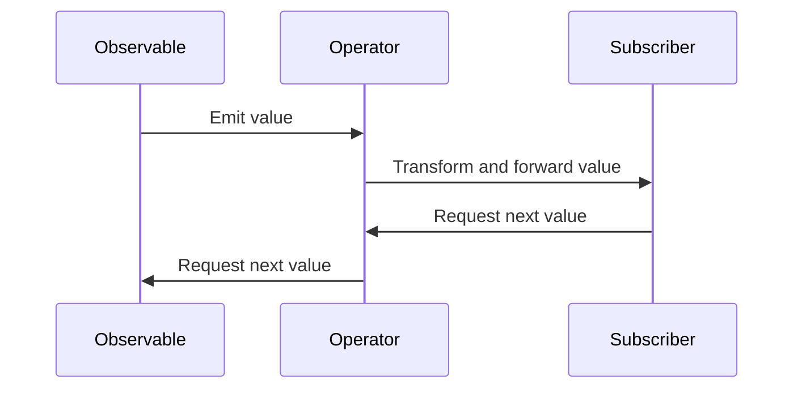

## 9.1 Functional Reactive Programming (FRP)

Functional Reactive Programming (FRP) is a paradigm that combines functional programming with reactive programming to handle asynchronous data streams and the propagation of change. In this section, we will explore the core concepts of FRP, its implementation in Kotlin, and practical examples to illustrate its application.

### Introduction to FRP Concepts

Functional Reactive Programming is a powerful paradigm that allows developers to work with asynchronous data flows and event-driven systems in a declarative manner. It abstracts away the complexities of managing state and side effects, enabling a more concise and expressive way to handle dynamic data.

#### Key Concepts of FRP

1. **Streams**: In FRP, data is represented as streams, which are sequences of values over time. Streams can be finite or infinite and can represent anything from user inputs to network requests.

2. **Observables**: Observables are the core abstraction in FRP, representing a stream of data that can be observed and reacted to. Observables emit items to subscribers, who can then process these items.

3. **Operators**: Operators are functions that allow you to transform, filter, and combine streams. They provide a way to manipulate data as it flows through the system.

4. **Schedulers**: Schedulers control the execution context of observables, allowing you to specify where and when operations should occur (e.g., on the main thread, background thread).

5. **Backpressure**: Backpressure is a mechanism to handle situations where data is produced faster than it can be consumed, ensuring that systems remain responsive and efficient.

#### Benefits of FRP

- **Declarative Code**: FRP allows you to express complex data flows in a clear and concise manner, reducing boilerplate code and improving readability.
- **Composability**: FRP promotes the composition of small, reusable components, making it easier to build and maintain complex systems.
- **Asynchronous Handling**: FRP provides a robust framework for handling asynchronous events and data streams, simplifying the management of concurrency and state.

### Implementing FRP in Kotlin

Kotlin provides excellent support for FRP through libraries like RxJava and Kotlin Flows. These libraries offer a rich set of tools and operators to work with reactive streams and implement FRP patterns.

#### Using RxJava with Kotlin

RxJava is a popular library for reactive programming in the Java ecosystem, and it integrates seamlessly with Kotlin. It provides a comprehensive set of operators and tools for working with observables and handling asynchronous data flows.

```kotlin
import io.reactivex.Observable
import io.reactivex.schedulers.Schedulers

fun main() {
    // Create an observable that emits a sequence of integers
    val observable = Observable.range(1, 10)
        .subscribeOn(Schedulers.io())
        .map { it * 2 } // Double each emitted value
        .filter { it % 3 == 0 } // Filter values divisible by 3

    // Subscribe to the observable and print each emitted item
    observable.subscribe { println("Received: $it") }
}
```

In this example, we create an observable that emits a sequence of integers, applies a map operator to double each value, and filters the values to only include those divisible by 3. The `subscribeOn` operator specifies that the observable should run on a background thread.

#### Using Kotlin Flows

Kotlin Flows are a part of the Kotlin Coroutines library and provide a more idiomatic way to work with reactive streams in Kotlin. Flows are cold streams, meaning they only start emitting values when they are collected.

```kotlin
import kotlinx.coroutines.flow.*
import kotlinx.coroutines.runBlocking

fun main() = runBlocking {
    // Create a flow that emits a sequence of integers
    val flow = (1..10).asFlow()
        .map { it * 2 } // Double each emitted value
        .filter { it % 3 == 0 } // Filter values divisible by 3

    // Collect the flow and print each emitted item
    flow.collect { println("Received: $it") }
}
```

This example demonstrates how to create a flow that emits a sequence of integers, applies a map transformation, and filters the values. The `collect` function is used to start the flow and process each emitted item.

### Visualizing FRP with Diagrams

To better understand the flow of data in FRP, let's visualize the process using a sequence diagram.



This diagram illustrates the interaction between an observable, an operator, and a subscriber. The observable emits values, which are transformed by the operator and then forwarded to the subscriber. The subscriber can request more values, creating a feedback loop.

### Practical Examples of FRP in Kotlin

Let's explore some practical examples of using FRP in Kotlin to solve real-world problems.

#### Example 1: Reactive UI Updates

In a typical Android application, you might want to update the UI in response to user inputs or network changes. FRP allows you to express these updates declaratively.

```kotlin
import io.reactivex.subjects.PublishSubject

fun main() {
    val userInput = PublishSubject.create<String>()

    // Simulate user input
    userInput.onNext("Hello")
    userInput.onNext("World")

    // Subscribe to user input and update UI
    userInput.subscribe { input ->
        println("Updating UI with: $input")
    }
}
```

In this example, we use a `PublishSubject` to simulate user input. The subject emits values that are then used to update the UI. This approach allows you to decouple the UI logic from the data source, making the code more maintainable.

#### Example 2: Combining Data Streams

FRP makes it easy to combine multiple data streams and react to changes in any of them.

```kotlin
import io.reactivex.Observable
import io.reactivex.functions.BiFunction

fun main() {
    val stream1 = Observable.just(1, 2, 3)
    val stream2 = Observable.just(4, 5, 6)

    // Combine two streams using a zip operator
    Observable.zip(stream1, stream2, BiFunction<Int, Int, Int> { a, b -> a + b })
        .subscribe { result ->
            println("Combined result: $result")
        }
}
```

Here, we use the `zip` operator to combine two streams of integers. The operator applies a function to each pair of emitted items, producing a new stream of combined results.

#### Example 3: Handling Network Requests

FRP can simplify the handling of network requests by providing a declarative way to manage asynchronous operations.

```kotlin
import io.reactivex.Observable
import io.reactivex.schedulers.Schedulers
import java.net.URL

fun fetchUrl(url: String): Observable<String> {
    return Observable.fromCallable {
        URL(url).readText()
    }.subscribeOn(Schedulers.io())
}

fun main() {
    val url = "https://example.com"

    fetchUrl(url).subscribe { content ->
        println("Received content: $content")
    }
}
```

In this example, we define a function `fetchUrl` that returns an observable representing the content of a URL. The observable is created using `fromCallable`, which allows us to perform the network request on a background thread.

### Design Considerations for FRP in Kotlin

When implementing FRP in Kotlin, there are several design considerations to keep in mind:

- **Threading**: Ensure that operations are performed on the appropriate threads, especially when updating the UI in Android applications.
- **Error Handling**: Use operators like `onErrorResumeNext` and `retry` to handle errors gracefully and provide fallback mechanisms.
- **Resource Management**: Manage subscriptions carefully to avoid memory leaks, especially in long-running applications.
- **Backpressure**: Consider using backpressure strategies to handle situations where data is produced faster than it can be consumed.

### Differences and Similarities with Other Patterns

FRP shares similarities with other reactive programming patterns, such as the Observer pattern. However, FRP provides a more declarative and composable approach, allowing for more complex data flows and transformations.

- **Observer Pattern**: Both FRP and the Observer pattern involve observing changes in data. However, FRP offers a richer set of operators and transformations.
- **Event-Driven Programming**: FRP can be seen as an evolution of event-driven programming, providing a more structured and declarative way to handle events.

### Try It Yourself

To deepen your understanding of FRP, try modifying the code examples provided. For instance, experiment with different operators, combine multiple streams, or handle errors in different ways. By doing so, you'll gain a better grasp of how FRP can be applied to solve complex problems.

### References and Further Reading

- [ReactiveX Documentation](http://reactivex.io/documentation/observable.html)
- [Kotlin Coroutines and Flow](https://kotlinlang.org/docs/flow.html)
- [RxJava GitHub Repository](https://github.com/ReactiveX/RxJava)

### Knowledge Check

1. What is the primary abstraction in FRP?
2. How do operators enhance the functionality of streams in FRP?
3. What is the role of schedulers in FRP?
4. How does backpressure help in managing data flow in FRP?
5. What are some design considerations when implementing FRP in Kotlin?

### Embrace the Journey

Remember, mastering FRP is a journey. As you continue to explore and experiment with FRP in Kotlin, you'll discover new ways to simplify complex data flows and build more responsive applications. Stay curious, keep learning, and enjoy the process!

## Quiz Time!



### What is the primary abstraction in FRP?

- [x] Observables
- [ ] Streams
- [ ] Operators
- [ ] Schedulers

> **Explanation:** Observables are the core abstraction in FRP, representing a stream of data that can be observed and reacted to.

### How do operators enhance the functionality of streams in FRP?

- [x] By transforming, filtering, and combining streams
- [ ] By scheduling tasks
- [ ] By managing backpressure
- [ ] By handling errors

> **Explanation:** Operators provide a way to manipulate data as it flows through the system, allowing for transformations, filtering, and combination of streams.

### What is the role of schedulers in FRP?

- [x] To control the execution context of observables
- [ ] To transform data streams
- [ ] To handle errors
- [ ] To manage backpressure

> **Explanation:** Schedulers determine where and when operations should occur, such as on the main thread or a background thread.

### How does backpressure help in managing data flow in FRP?

- [x] By ensuring systems remain responsive and efficient
- [ ] By transforming data streams
- [ ] By scheduling tasks
- [ ] By handling errors

> **Explanation:** Backpressure is a mechanism to handle situations where data is produced faster than it can be consumed, ensuring that systems remain responsive and efficient.

### What are some design considerations when implementing FRP in Kotlin?

- [x] Threading, error handling, resource management, backpressure
- [ ] Only threading and error handling
- [ ] Only resource management and backpressure
- [ ] Only error handling and backpressure

> **Explanation:** When implementing FRP in Kotlin, it's important to consider threading, error handling, resource management, and backpressure to ensure efficient and responsive systems.

### Which library provides support for FRP in Kotlin?

- [x] RxJava
- [ ] Retrofit
- [ ] Gson
- [ ] OkHttp

> **Explanation:** RxJava is a popular library for reactive programming in the Java ecosystem, and it integrates seamlessly with Kotlin.

### What is a key benefit of using FRP?

- [x] Declarative code
- [ ] Increased complexity
- [ ] Reduced readability
- [ ] More boilerplate code

> **Explanation:** FRP allows you to express complex data flows in a clear and concise manner, reducing boilerplate code and improving readability.

### How can you handle errors in FRP?

- [x] Using operators like `onErrorResumeNext` and `retry`
- [ ] By ignoring them
- [ ] By logging them only
- [ ] By stopping the application

> **Explanation:** Operators like `onErrorResumeNext` and `retry` allow you to handle errors gracefully and provide fallback mechanisms.

### What is the difference between FRP and the Observer pattern?

- [x] FRP provides a more declarative and composable approach
- [ ] FRP is less flexible
- [ ] FRP is more complex
- [ ] FRP is less efficient

> **Explanation:** FRP offers a richer set of operators and transformations, allowing for more complex data flows and transformations compared to the Observer pattern.

### True or False: Kotlin Flows are cold streams.

- [x] True
- [ ] False

> **Explanation:** Kotlin Flows are cold streams, meaning they only start emitting values when they are collected.


