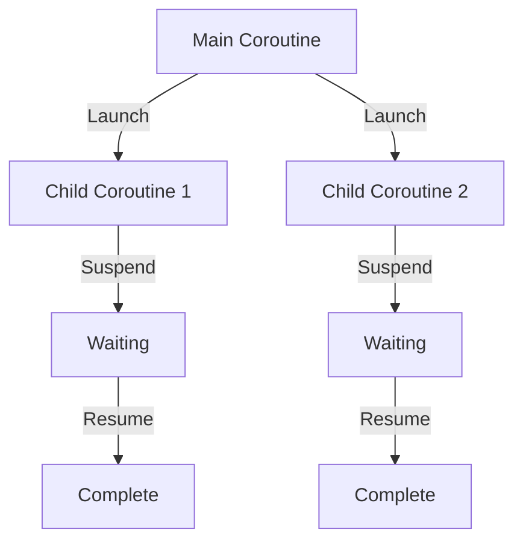
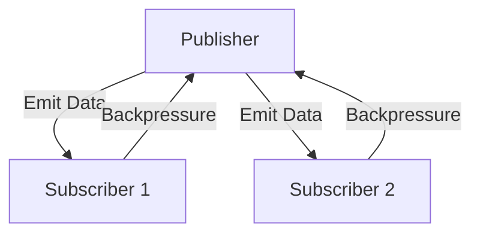

## 9.10 Comparing Coroutines and Reactive Streams

In the realm of asynchronous programming, Kotlin Coroutines and Reactive Streams are two powerful paradigms that offer distinct approaches to handling concurrency and data flow. Understanding when to use each can significantly impact the performance and scalability of your applications. In this section, we will explore the core concepts, differences, and use cases for Kotlin Coroutines and Reactive Streams, providing you with the knowledge to make informed decisions in your software architecture.

### Introduction to Asynchronous Programming

Asynchronous programming is essential for building responsive applications that can handle multiple tasks concurrently without blocking the main execution thread. It allows applications to perform I/O operations, network requests, and other time-consuming tasks in the background, improving overall efficiency and user experience.

### Kotlin Coroutines

Kotlin Coroutines provide a simple and efficient way to write asynchronous code. They are built on top of suspending functions and offer a structured concurrency model that is both easy to understand and use.

#### Key Features of Kotlin Coroutines

- **Lightweight Threads**: Coroutines are lightweight and can be launched in large numbers without incurring the overhead of traditional threads.
- **Structured Concurrency**: Coroutines provide a structured approach to concurrency, ensuring that resources are properly managed and exceptions are handled gracefully.
- **Suspend Functions**: These are functions that can be paused and resumed, allowing for non-blocking asynchronous code.
- **Coroutine Scopes**: Scopes define the lifecycle of coroutines, ensuring that they are cancelled when no longer needed.

#### Sample Code Snippet

```kotlin
import kotlinx.coroutines.*

fun main() = runBlocking {
    launch {
        delay(1000L)
        println("World!")
    }
    println("Hello,")
}
```

In this example, the `launch` function creates a new coroutine that runs concurrently with the main coroutine. The `delay` function is a suspending function that pauses the coroutine without blocking the thread.

### Reactive Streams

Reactive Streams, on the other hand, are a specification for asynchronous stream processing with non-blocking backpressure. They are designed to handle potentially infinite data streams and provide a robust model for data flow and transformation.

#### Key Features of Reactive Streams

- **Backpressure Handling**: Reactive Streams provide mechanisms to handle backpressure, ensuring that producers do not overwhelm consumers with data.
- **Composability**: They allow for the composition of complex data processing pipelines using operators like `map`, `filter`, and `reduce`.
- **Publisher-Subscriber Model**: Reactive Streams follow a publisher-subscriber model where data is emitted by publishers and consumed by subscribers.

#### Sample Code Snippet

```kotlin
import io.reactivex.rxjava3.core.Observable

fun main() {
    val observable = Observable.just("Hello", "World")
    observable.subscribe { println(it) }
}
```

In this example, an `Observable` is created that emits two strings. The `subscribe` method is used to consume and print each emitted item.

### Differences Between Coroutines and Reactive Streams

While both Kotlin Coroutines and Reactive Streams aim to simplify asynchronous programming, they differ in their approach and use cases.

#### Programming Model

- **Coroutines**: Use a sequential programming model that closely resembles synchronous code, making it easier to read and maintain.
- **Reactive Streams**: Use a declarative programming model that focuses on data flow and transformation, which can be more complex but powerful for certain use cases.

#### Handling Backpressure

- **Coroutines**: Do not have built-in backpressure handling. Developers need to manage flow control manually.
- **Reactive Streams**: Provide built-in backpressure mechanisms, making them suitable for handling large or infinite data streams.

#### Error Handling

- **Coroutines**: Use structured concurrency to propagate exceptions and ensure that resources are released properly.
- **Reactive Streams**: Use operators like `onErrorResumeNext` and `onErrorReturn` to handle errors gracefully.

#### Performance and Scalability

- **Coroutines**: Are lightweight and can be used for a large number of concurrent tasks without significant overhead.
- **Reactive Streams**: Are optimized for high-throughput data processing and can efficiently handle large volumes of data.

### When to Use Coroutines vs. Reactive Streams

Choosing between Kotlin Coroutines and Reactive Streams depends on the specific requirements of your application.

#### Use Coroutines When:

- You need a simple and intuitive way to write asynchronous code that resembles synchronous code.
- Your application involves a large number of concurrent tasks that do not require complex data flow or backpressure handling.
- You prefer structured concurrency for managing resources and handling exceptions.

#### Use Reactive Streams When:

- Your application processes large or infinite data streams and requires robust backpressure handling.
- You need to compose complex data processing pipelines with operators like `map`, `filter`, and `reduce`.
- You are building applications that require high throughput and efficient data flow management.

### Performance and Scalability Considerations

Both Kotlin Coroutines and Reactive Streams offer excellent performance and scalability, but their strengths lie in different areas.

#### Coroutines

- **Lightweight**: Coroutines are lightweight and can be launched in large numbers without incurring the overhead of traditional threads.
- **Efficient Resource Management**: Structured concurrency ensures that resources are managed efficiently and exceptions are handled gracefully.
- **Low Latency**: Coroutines provide low-latency asynchronous operations, making them suitable for real-time applications.

#### Reactive Streams

- **High Throughput**: Reactive Streams are optimized for high-throughput data processing and can efficiently handle large volumes of data.
- **Backpressure Handling**: Built-in backpressure mechanisms ensure that producers do not overwhelm consumers with data.
- **Scalability**: Reactive Streams can scale to handle large or infinite data streams, making them suitable for applications that require efficient data flow management.

### Visualizing Coroutines and Reactive Streams

To better understand the differences between Kotlin Coroutines and Reactive Streams, let's visualize their architectures and data flow.

#### Coroutines Architecture



**Description**: This diagram illustrates the coroutine architecture, where the main coroutine launches child coroutines. Each child coroutine can suspend and resume independently, allowing for non-blocking asynchronous operations.

#### Reactive Streams Architecture



**Description**: This diagram represents the Reactive Streams architecture, where a publisher emits data to multiple subscribers. Subscribers can apply backpressure to control the flow of data, ensuring that they are not overwhelmed.

### Code Examples and Exercises

Let's explore some practical examples to solidify our understanding of Kotlin Coroutines and Reactive Streams.

#### Example 1: Fetching Data with Coroutines

```kotlin
import kotlinx.coroutines.*

fun main() = runBlocking {
    val data = fetchData()
    println("Data: $data")
}

suspend fun fetchData(): String {
    delay(1000L) // Simulate network delay
    return "Hello, World!"
}
```

**Try It Yourself**: Modify the `fetchData` function to fetch data from a real API using `kotlinx.coroutines` and `kotlinx.coroutines.retrofit`.

#### Example 2: Processing Data with Reactive Streams

```kotlin
import io.reactivex.rxjava3.core.Observable

fun main() {
    val observable = Observable.just(1, 2, 3, 4, 5)
    observable
        .map { it * 2 }
        .filter { it > 5 }
        .subscribe { println(it) }
}
```

**Try It Yourself**: Experiment with different operators like `flatMap` and `reduce` to transform and aggregate data.

### Knowledge Check

- **Question**: What are the key differences between Kotlin Coroutines and Reactive Streams?
- **Exercise**: Implement a simple chat application using both Kotlin Coroutines and Reactive Streams. Compare the performance and scalability of each implementation.

### Conclusion

Kotlin Coroutines and Reactive Streams are powerful tools for asynchronous programming, each with its own strengths and use cases. By understanding their differences and knowing when to use each, you can build efficient and scalable applications that meet the demands of modern software development. Remember, this is just the beginning. As you progress, you'll build more complex and interactive applications. Keep experimenting, stay curious, and enjoy the journey!

## Quiz Time!



### What is a key feature of Kotlin Coroutines?

- [x] Lightweight threads
- [ ] Built-in backpressure handling
- [ ] Publisher-subscriber model
- [ ] Declarative programming model

> **Explanation:** Kotlin Coroutines are known for being lightweight, allowing for a large number of concurrent tasks without significant overhead.

### Which of the following is a characteristic of Reactive Streams?

- [ ] Structured concurrency
- [x] Backpressure handling
- [ ] Sequential programming model
- [ ] Suspend functions

> **Explanation:** Reactive Streams provide built-in backpressure handling, which is essential for managing data flow in large or infinite streams.

### When should you prefer using Kotlin Coroutines over Reactive Streams?

- [x] When you need a simple and intuitive way to write asynchronous code
- [ ] When handling large or infinite data streams
- [ ] When composing complex data processing pipelines
- [ ] When requiring high throughput data processing

> **Explanation:** Kotlin Coroutines are preferred for simpler asynchronous code that resembles synchronous code, without the need for complex data flow management.

### Which operator is commonly used in Reactive Streams for data transformation?

- [ ] delay
- [ ] launch
- [x] map
- [ ] runBlocking

> **Explanation:** The `map` operator is commonly used in Reactive Streams to transform data as it flows through the stream.

### What is the main advantage of using structured concurrency in Kotlin Coroutines?

- [x] Efficient resource management and exception handling
- [ ] High throughput data processing
- [ ] Built-in backpressure mechanisms
- [ ] Declarative programming model

> **Explanation:** Structured concurrency in Kotlin Coroutines ensures efficient resource management and proper exception handling, making it easier to manage concurrent tasks.

### Which of the following is NOT a feature of Reactive Streams?

- [ ] Composability
- [ ] Backpressure handling
- [x] Suspend functions
- [ ] Publisher-subscriber model

> **Explanation:** Reactive Streams do not use suspend functions; they rely on a publisher-subscriber model and provide backpressure handling.

### What is the purpose of the `runBlocking` function in Kotlin Coroutines?

- [x] To block the current thread until all coroutines are complete
- [ ] To create a new coroutine
- [ ] To handle backpressure
- [ ] To transform data in a stream

> **Explanation:** The `runBlocking` function blocks the current thread until all coroutines within its scope are complete, allowing for synchronous-like behavior.

### Which of the following is a benefit of using Reactive Streams for data processing?

- [ ] Low latency asynchronous operations
- [x] High throughput and efficient data flow management
- [ ] Simple and intuitive asynchronous code
- [ ] Lightweight threads

> **Explanation:** Reactive Streams are optimized for high throughput and efficient data flow management, making them suitable for processing large volumes of data.

### What is a common use case for Kotlin Coroutines?

- [x] Performing I/O operations without blocking the main thread
- [ ] Handling infinite data streams with backpressure
- [ ] Composing complex data processing pipelines
- [ ] Implementing a publisher-subscriber model

> **Explanation:** Kotlin Coroutines are commonly used for performing I/O operations and other asynchronous tasks without blocking the main thread.

### True or False: Reactive Streams are designed to handle potentially infinite data streams.

- [x] True
- [ ] False

> **Explanation:** Reactive Streams are specifically designed to handle potentially infinite data streams with mechanisms like backpressure to manage data flow.


